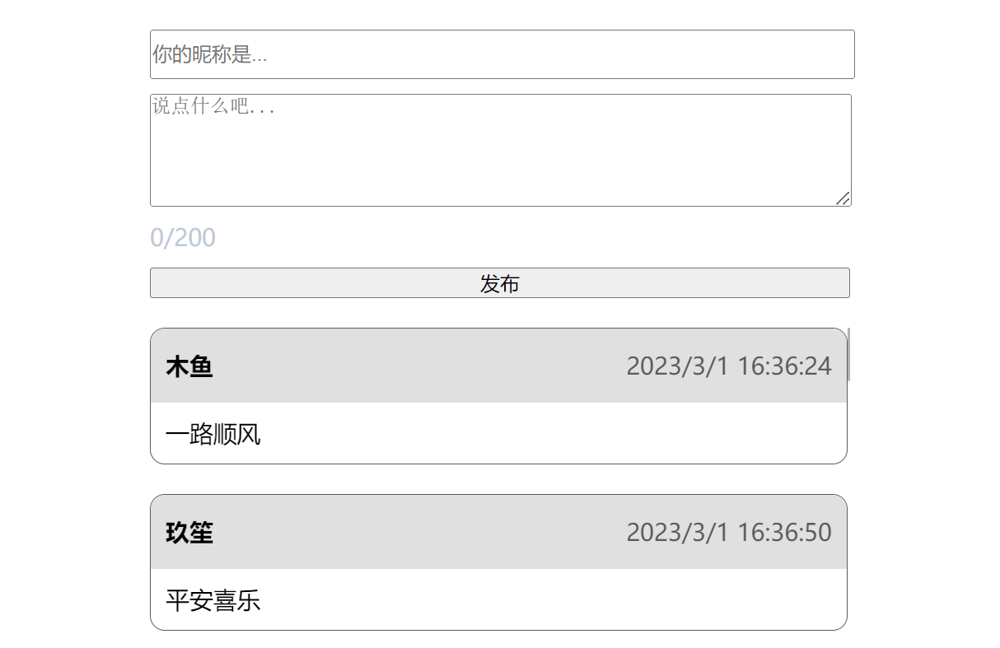

# 使用node中http搭建服务器以及自己写接口发送请求

如果搭建服务器的话，可以通过http模块（也可以通过第三方模块express搭建服务器，express模块对http模块进行了封装）；

## 步骤：

1. 引入http模块
2. 创建服务器
3. 设置端口，开启服务
4. 监听浏览器请求事件（设置request事件）

### 实例

```js
const http = require('http');
const server = http.createServer();
server.listen(3000, () => console.log("服务器开启了"));
server.on('request', (request, response) => {
    response.writeHead(200, { "Content-Type": "text/html;charset=utf-8" });   //设置状态码和响应头
    response.end('你好，服务器已经搭建完成，不在转圈圈了:http://localhost:3000/');   //响应结果（也叫响应体），最后必须设置end做出响应
})
```

### `server.on('request', (request, response) => { })`中参数response的方法：

```js
response.statusCode = 200;  // 设置状态码
response.setHeader();       // 设置响应头
response.write();           // 设置响应体
response.writeHead();       // 同时设置响应状态码和响应头
response.end();             // 做出响应（必须设置）-参数是响应的结果（响应体）
```

## 判断文件存在，则读取文件；不存在，页面显示Not Found

> 服务器文件同级目录下存在文件`demo.html`，浏览器输入`http://localhost:3000/demo.html`即可访问。

```js
const fs = require('fs');
const http = require("http");
const server = http.createServer();
server.listen(3000, () => console.log('服务器已开启'));
server.on("request", (req, res) => {
    fs.access('.' + req.url, fs.constants.F_OK, (err) => { // 判断文件是否存在
        if (err) {  // 如果没有文件
            res.writeHead(404, { "Content-Type": "text/html;charset=utf-8" });
            res.end("Not Found 没有此文件");
        } else {    // 如果有文件
            fs.readFile('.' + req.url, 'utf-8', (err, data) => {
                try {
                    if (err) throw err;
                } catch (error) {
                    console.log(error);
                } finally {
                    res.end(data);
                }
            });
        }
    });
});
```

## 实现下图的前后端操作

用户输入用户名和内容后，前端调接口发送请求，后端需要有写好的接口来收集信息，保存前端提交的数据。



node服务器js文件：

```js
const fs = require("fs");
const querystring = require("querystring");
const http = require("http");

const server = http.createServer();
server.listen(3000, () => console.log("服务器启动了"));
server.on("request", (req, res) => {    // 监听请求事件（只要有请求就触发该事件）
    var url = req.url;

    // 页面静态资源
    if (url === '/index') {
        fs.readFile('./index.html', 'utf-8', (err, data) => {
            try {
                if (err) throw err;
            } catch (error) {
                console.log(error);
            } finally {
                res.end(data);
            }
        });
        return; // 记得return否则代码一直往下执行
    }

    // 接口1：获取留言
    if (url === '/getMessage') {
        fs.access('./msg.json', fs.constants.F_OK, (err) => { // 判断文件是否存在
            if (err) {  // 如果没有文件
                fs.writeFile('./msg.json', '[]', { flag: 'a+' },err=>{});
            } else {    // 如果有文件
                fs.readFile('./msg.json', "utf-8", (err, data) => {// 读取json文件，将结果响应给浏览器
                    if (err) throw err;
                    res.writeHead(200, { "Content-Type": "application/json;charset=utf-8" });
                    res.end(data);
                });
            }
        });

        return;
    }

    //接口2：添加留言
    if (url === '/addMessage') {
        var str = '';               // 收集用户信息，保存在json中
        req.on('data', (chunk) => { // 收集的信息是一块一块接收的
            str += chunk;
        })
        req.on('end', () => {
            //接收完毕的结果，存在json中
            let msg = querystring.parse(str);   // 转为对象形式，通过.push将新数据放在原本json中
            //保存数据
            //1、加载json文件   2、将新数据放入json中   3、保存json文件(重新写入json)
            let resjson = require('./msg.json');
            resjson.push(msg);
            fs.writeFile('./msg.json', JSON.stringify(resjson), err => {
                if (err) {
                    res.end(JSON.stringify({ msg: '请求失败' }));
                } else {
                    res.setHeader("Content-Type", "application/json");
                    res.end(JSON.stringify({ code: 200, msg: '添加成功' }));
                }
            });
        })
        return;
    }
});
```

同级目录下，index.html：

```html
<!DOCTYPE html>
<html lang="en">

<head>
    <meta charset="UTF-8">
    <meta http-equiv="X-UA-Compatible" content="IE=edge">
    <meta name="viewport" content="width=device-width, initial-scale=1.0">
    <title>评论功能（node文件写入和读取）</title>
    <style>
        * {
            margin: 0;
            padding: 0;
        }

        ul {
            width: 70%;
            height: 260px;
            overflow-y: scroll;
            overflow-x: hidden;
            list-style: none;
            margin: 0 auto;
        }

        ul::-webkit-scrollbar {
            /* 隐藏默认的滚动条 */
            -webkit-appearance: none;
        }

        ul::-webkit-scrollbar:vertical {
            /* 设置垂直滚动条宽度 */
            width: 2px;
        }

        ul::-webkit-scrollbar-thumb {
            /* 滚动条的其他样式定制，注意，这个一定也要定制，否则就是一个透明的滚动条 */
            border-radius: 8px;
            border: 2px solid rgba(255, 255, 255, .4);
            background-color: rgba(0, 0, 0, .5);
        }

        ul li {
            --commit-padding: 10px;
            margin-bottom: 20px;
            border: #5c5b5b solid 1px;
            border-radius: 10px;
        }

        ul li .info {
            padding: var(--commit-padding);
            height: 30px;
            display: flex;
            justify-content: space-between;
            align-items: center;
            background-color: rgb(224, 224, 224);
            border-radius: 10px 10px 0 0;
        }

        ul li .info .name {
            font-weight: 600;
        }

        ul li .info .time {
            margin-left: 120px;
            color: #5c5b5b;
        }

        ul li .content {
            padding: var(--commit-padding);
        }

        .sub {
            width: 70%;
            margin: 20px auto;
        }

        .sub * {
            width: 100%;
            margin: 10px 0;
            display: block;
        }

        #username {
            height: 30px;
        }
    </style>
</head>

<body>
    <div class="sub">
        <input id="username" type="text" placeholder="你的昵称是...">
        <textarea id="area" maxlength="200" cols="70" rows="5" class="textarea-style" placeholder="说点什么吧..."
            onkeyup="setLength(this,200,'wordsLength');"></textarea>
        <span id="wordsLength" style="color:#BDCADA">0/200</span>
        <input id="send" type="button" value="发布">
    </div>
    <ul></ul>
    <script>
        ; (function loadData() {
            var xhr = new XMLHttpRequest();
            xhr.open('GET', '/getMessage');
            xhr.onload = function () {
                console.log(this.response);
                var data = JSON.parse(this.response);
                var str = '';
                data.forEach(function (item) {
                    str += `
                        <li>
                            <div class="info">
                                <span class="name">${item.name}</span>
                                <span class="time">${item.time}</span>
                            </div>
                            <div class="content">${item.content}</div>
                        </li>
                        `;
                });
                // 把拼接=好的str放到ul中
                document.querySelector('ul').innerHTML = str;
            }
            xhr.send();
        }.call(this));

        //添加留言功能
        var send = document.getElementById("send");
        send.onclick = function () {
            var nickname = document.querySelector("#username").value.trim();
            var content = document.querySelector("#area").value.trim();

            var xhr = new XMLHttpRequest();
            xhr.open("POST", 'addMessage');
            xhr.setRequestHeader("Content-Type", "application/x-www-form-urlencoded");
            xhr.onload = function () {
                var res = this.response;
                if (res.code === 200) {
                    alert(res.msg);
                    loadData();
                }
            }
            xhr.send('name=' + nickname + '&content=' + content + '&time=' + new Date().toLocaleString());  // name=木鱼&content=一路顺丰&&time=2023/3/1 16:33:53
        }
        // 输入字数动态展示
        function setLength(obj, maxlength, id) {
            var num = maxlength - obj.value.length;
            var leng = id;
            if (num < 0) {
                num = 0;
            }
            document.getElementById(leng).innerHTML = num + "/200";
        }
    </script>
</body>

</html>
```

> 启动服务后访问`http://localhost:3000/index`即可查看效果
