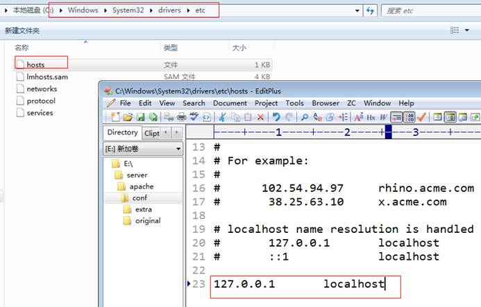
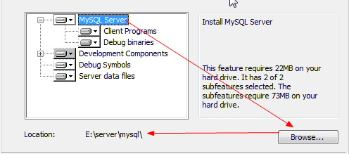

**搭建环境**

# PHP简介

## 什么是PHP

PHP定义：一种服务器端的 HTML 脚本/编程语言，是一种简单的、面向对象的、解释型的、健壮的、安全的、性能非常之高的、独立于架构的、可移植的、动态的脚本语言。是一种广泛用于 Open Source（开放源代码）的尤其适合 Web 开发并可以嵌入 HTML 的多用途脚本语言。它的语法接近 C，Java 和 Perl，而且容易学习。该语言让 Web 开发人员快速的书写动态生成的网页。

 

PHP前身：Personal HomePage，个人主页，使用Perl语言开发的一种写个人主页的语言

PHP：PHP Hypertext Preprosessor，php超文本预处理器，底层使用C语言

 

## PHP发展史

Rasmus Lerdorf ：创建者

 

1994：1.0，个人perl，非常简单（简陋）

1996：2.0，C底层，变的相对比较强大

1998：3.0，zendEngine，联合zend公司共同管理和维护PHP，zendEngine（zend引擎）用户高效的解析php代码

2000：4.0，session+输出缓冲等，session技术（会话技术），

2004：5.0，zend引擎2代，增加新技术（面向对象更新，命名空间，异常）

2015：7.0，新版的ZendEngine引擎，性能提升，新特性（异常）

 

平台支持（window，Linux，UNIX）

数据库支持（Sqlserver，mysql，Oracle，Access）

 

## 静态网站与动态网站的区别

静态网站：web1.0时代

动态网站：web2.0时代

 

### 网站

Website的中文名称是网站，是指在互联网上，根据一定的规则，使用HTML、PHP等代码语言制作的用于展示特定内容的相关网页的集合，有可供管理人员操作的后台及用户使用的前台。简单地说，Website是一种通讯工具，就像布告栏一样，人们可以通过Website来发布自己想要公开的资讯，或者利用Website来提供相关的网络服务。人们可以通过网页浏览器来访问Website，获取自己需要的资讯或者享受网络服务。

 

### 静态网站特点

  1.网页内容一经发布到网站服务器上，无论是否有用户访问，每个静态网页的内容都是保存在网站服务器上的，也就是说，静态网页是实实在在保存在服务器上的文件，每个网页都是一个独立的文件；

  2.静态网页的内容相对稳定，因此容易被搜索引擎检索；

  3.静态网页没有数据库的支持，在网站制作和维护方面工作量较大，因此当网站信息量很大时完全依靠静态网页制作方式比较困难； 

  4.静态网页的交互性较差，在功能方面有较大的限制。

 

### 动态网站特点

  1.交互性：网页会根据用户的要求和选择而动态地改变和响应，浏览器作为客户端，成为一个动态交流的桥梁，动态网页的交互性也是今后Web发展的潮流。

  2.自动更新：即无须手动更新HTML文档，便会自动生成新页面，可以大大节省工作量。

  3.因时因人而变：即当不同时间、不同用户访问同一网址时会出现不同页面。

  此外动态网页是与静态网页相对应的，也就是说，网页URL的后缀不是.htm、.html、.shtml、.xml等静态网页的常见形式，而是以.asp、.jsp、.php、.perl、.cgi等形式为后缀。在动态网页网址中有一个标志性的符号——“?”

# 网站基本概念

## 服务器概念

服务器（server），也称伺服器，是提供计算服务的设备。由于服务器需要响应服务请求，并进行处理，因此一般来说服务器应具备承担服务并且保障服务的能力。

服务器的构成包括处理器、硬盘、内存、系统总线等，和通用的计算机架构类似，但是由于需要提供高可靠的服务，因此在处理能力、稳定性、可靠性、安全性、可扩展性、可管理性等方面要求较高。

在网络环境下，根据服务器提供的服务类型不同，分为文件服务器，数据库服务器，应用程序服务器，WEB服务器等。

 

服务器：能够提供服务的机器，取决于机器上所安装的软件（服务软件）

Web服务器：提供web服务（网站访问），就需要安装web服务软件，Apache，tomcat，iis等

 

## IP的概念

IP：Internet Protocol，网络之间互联协议。网络之间互连的协议也就是为计算机网络相互连接进行通信而设计的协议。在因特网中，它是能使连接到网上的所有计算机网络实现相互通信的一套规则，规定了计算机在因特网上进行通信时应当遵守的规则。任何厂家生产的计算机系统，只要遵守IP协议就可以与因特网互连互通。IP地址具有唯一性。（每台电脑都有一个唯一的IP地址）

## 域名

域名（Domain Name），是由一串用点分隔的名字组成（www.itcast.cn）的Internet上某一台计算机或计算机组的名称，用于在数据传输时标识计算机的电子方位（有时也指地理位置，地理上的域名，指代有行政自主权的一个地方区域）。域名是一个IP地址上有“面具” 。一个域名的目的是便于记忆和沟通的一组服务器的地址（网站，电子邮件，FTP等）。域名作为力所能及难忘的互联网参与者的名称。

 

特殊IP：127.0.0.1，代表本机

特殊域名：localhost

## DNS

DNS（Domain Name System，域名系统），因特网上作为域名和IP地址相互映射的一个分布式数据库，能够使用户更方便的访问互联网，而不用去记住能够被机器直接读取的IP数串。通过主机名，最终得到该主机名对应的IP地址的过程叫做域名解析（或主机名解析）。

 

用户输入域名localhost—》DNS（localhost 127.0.0.1）--》服务器电脑

## 端口

端口（Port），可以认为是设备与外界通讯交流的出口。端口可分为虚拟端口和物理端口，其中虚拟端口指计算机内部或交换机路由器内的端口，不可见。例如计算机中的80端口、21端口、23端口等。物理端口又称为接口，是可见端口，计算机背板的RJ45网口，交换机路由器集线器等RJ45端口。

 

用户输入域名localhost:端口—》DNS（localhost 127.0.0.1）--》服务器电脑—》软件（服务）

# Web程序的访问流程

Web分为两类：静态网站和动态网站

 

浏览器发起访问—》DNS解析域名—》服务器电脑---》服务软件

 

## 静态网站访问


 

## 动态网站访问

动态网站访问流程与静态差不多，但是会多出几个内容：服务器端解析、数据库


# 安装Apache

## 安装Apache软件

1、 获取Apache安装软件


2、 双击安装即可：指定对应的路径：E:server/apache


3、选择安装模式：使用自定义模式


4、 选择安装位置


## Apache的目录结构说明

 


## Httpd.exe的详细应用

 

1、 服务器进程：运行之后才能够工作


2、 用来查看Apache具有哪些功能以及配置文件是否有错：httpd或者httpd.exe（文件所在目录）


2.1  查看使用的模块：httpd -M


2.2  验证配置文件是否有效：`httpd –t`

> 测试，是否有语法问题


# 配置默认站点

> 位置：`E:\server\apache\conf\httpd.conf`

1、 让Apache确定服务器上访问的位置：网站文件夹所在位置

Httpd.conf：DocumentRoot


 

2、 方便用户使用名字访问对应的网站：给文件夹对应的取一个别名

Httpd.conf：ServerName


端口可以单独实现：httpd.conf：listen


3、 凡是涉及到Apache配置文件的修改，那么需要重启Apache才能生效

4、 实现DNS域名解析：通常默认站点都是本地DNS：hosts文件

`C:\Windows\System32\drivers\etc\hosts`



# 安装与配置PHP

## 安装PHP语言

1、 获取PHP安装文件：建议去官网


2、 解压缩


3、 安装：将解压后的文件放到E:/server/，重命名PHP5


 

 

## PHP的目录结构说明


## php.exe的应用

 

PHP.exe就是可以解析PHP代码转变成HTML代码从而让浏览器可以解析的。

 

1、 通过CMD控制器进入到php.exe所在目录


2、 通过php.exe运行命令来指定要解析的PHP脚本就可以：php.exe -f PHP文件所在路径


# 配置Apache加载PHP模块

 ```ini
 # 加载PHP
 LoadModule php5_module 'D:/server/php5/php5apache2_2.dll'
 # 加载PHP配置文件
 PHPIniDir 'D:/server/php5'
 # 分配给PHP
 AddType application/x-httpd-php .php
 ```


1、 Apache加载PHP模块：在Apache的主配置文件（httpd.conf）中加载对应的PHP提供的模块

LoadModule php5_module PHP所提供的模块链接所在路径


2、 Apache分配工作给PHP模块：如果是PHP代码就交给PHP处理：文件后缀判断.php结尾肯定是PHP代码

AddType application/x-httpd-php .php


3、 将PHP的配置文件加载到Apache配置文件中：共同生效

3.1  在Apache中指定PHP配置文件所在路径

PHPIniDir php.ini所在路径


3.2  php.ini文件默认是不存在的，是以development和production格式存在，需要格式化：

> 将`php.ini-development`复制一份重命名为`php.ini`


 

说明：PHP的配置文件已经加入到Apache的配置项中，意味着php.ini的修改需要Apache重启才会生效。

# 安装与配置MySQL

## 安装MySQL软件

1、 获取MySQL安装软件


2、 双击安装即可：没有特殊情况的直接下一步就可以完成


3、 选择custom，自定义安装：选择安装路径

3.1  软件安装目录：server/mysql



3.2  数据安装目录：server/mysql/data


4、 在完成安装之后，要实现配置


5、 选择详细配置（默认的）


6、 选择开发环境：默认的


7、 选择功能：默认


8、 并发设置（建议手动）


9、 配置访问环境


10、     字符集设定：系统字符集


11、     服务安装：将MySQL作为windows下的一个服务启动


12、     输入root（超级管理员）的用户密码


13、     等待配置：4个都是勾表示安装成功


## MySQL的目录结构说明


## Bin目录的常用命令


 

软件设计结构：C/S和B/S

C/S：Client客户端/Server服务端，用户需要安装客户端产品才能访问服务器，而且只能访问一种软件（当前自己）

B/S：Browser浏览器/Server服务端，用户只需要安装浏览器，就可以访问所有的服务器（B/S架构服务）

# MySQL的访问流程

Mysql是一款C/S架构的软件，需要通过客户端来访问服务端（MySQL提示也提供了其他模式的访问：通过一些插件扩展来充当客户端）

 

1、 启用MySQL客户端：mysql.exe，该软件本身可以通过CMD控制台运行

本身客户端：mysql.exe


Mysql.exe通过cmd运行


2、 MySQL客户端访问服务端需要进行寻找匹配：连接认证

连接：IP和端口确认，如果是本地都可以省略

-h主机地址----》-hlocalhost（可以是IP）

-P端口---》-P3306

认证：通过用户名和密码进入服务器

-u用户名---》-uroot，不可以省略（匿名用户除外）

-p密码---》-proot


3、 退出命名：\q


 

注意：通常连接认证的时候密码不建议明文，可以在输入-p之后回车，系统会再次让输入密码，这个时候就是密文


 

# PHP连接MySQL数据库

PHP本身不具备操作MySQL数据库的能力，需要借助PHP操作MySQL的扩展来实现。

 

1、 PHP加载MySQL扩展：php.ini文件中

> `E:\server\php5\php.ini`


2、 PHP中所有的扩展都是在ext文件夹中，需要制定扩展所在路径：extension_dir


3、 php.ini已经被Apache加载，所以需要重启才会生效。

 

 

# 设定PHP的系统时区

通过php.ini中的timezone配置项来实现


# 配置虚拟主机

一台服务器很贵，如果只能部署一个网站，那么非常浪费。所以需要通过其他渠道来实现一台主机上部署多个网站。

 

## 什么是虚拟主机

虚拟主机：Virtual machine，并不存在真实的主机，但是可以提供真实主机所实现的功能。

 

通俗的讲，虚拟主机就是将计算机中不同的文件夹进行不同的命名，然后可以实现让服务器（Apache）根据用户的需求从不同的文件夹（网站）中读取不同的内容。

 

## 虚拟主机的分类

在Apache中，可以将虚拟主机划分成两类：

1、 基于IP的虚拟主机：一台电脑上有多个IP，每个IP对应一个网站

原理：电脑默认只有一个IP，因为通常只配有一个网卡；但是有的电脑（服务器居多）可以配置多个网卡，每个网卡可以绑定一个IP地址。

 

2、 基于域名的虚拟主机：一台电脑上只有一个IP，但是IP下可以制作多个网站，但是需要给每个网站不同的名字（虚拟主机名）

# 搭建基于域名的虚拟主机

> 视频地址：https://www.bilibili.com/video/BV1qg4y1q7DU/

在Apache中，虚拟主机的搭建有两种方式：

1、 在主配置文件中搭建：需要手动开启虚拟主机（基于域名）

NameVirtualHost *:80

2、 在专门的虚拟主机配置文件中配置

2.1  在主配置文件中加载虚拟主机配置文件(httpd.conf)：虚拟主机配置文件已经开启了虚拟主机NameVirtualHost

> `E:\server\apache\conf\httpd.conf`


2.2  虚拟主机从配置文件（extra/httpd-vhosts.conf）中配置虚拟主机

> `E:\server\apache\conf\extra\httpd-vhosts.conf`

①增加一个对应的站点文件夹位置：DocumentRoot

②增加主机名字：文件夹的别名：ServerName


③ 增加域名解析DNS：hosts

> `C:\Windows\System32\drivers\etc\hosts`


④需要给当前设定的站点（目录）访问权限

<Directory ‘站点目录’>

​     Order Deny,Allow      //没有顺序关系：实际顺序有意义

​     Deny from 指定的范围

​     Allow from 指定范围/all

</Directory>


⑤  配置访问列表：当访问是一个目录时候（没有指定具体要访问的文件）

Options Indexes [FollowSymLinks]，如果访问目录，那么列表显示所有文件


⑥ 当用户访问指定目录不指定文件的时候，通常需要系统指定一个默认文件

DirectoryIndex 默认的文件列表，使用空格分离


 

注意：如果说网站中整个网站根目录允许访问，但是其中还有其他文件夹不允许访问：可以增加多个Directory标签，针对不同的文件夹

3、 一旦启用虚拟主机配置文件，那么默认的主机地址localhost就不再生效，如果想要生效：为localhost增加单独的虚拟主机


 