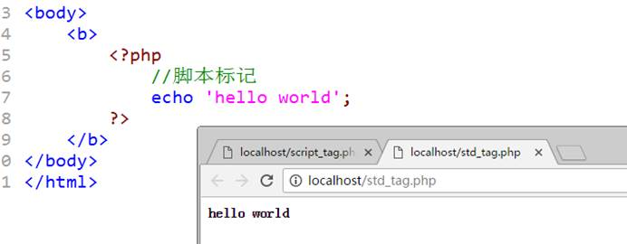
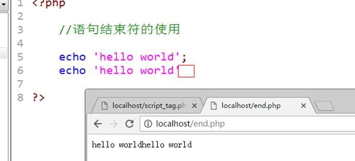
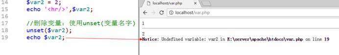
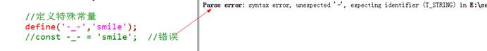

# PHP基础

# PHP语法初步

PHP是一种运行在服务器端的脚本语言，可以嵌入到HTML中。

## PHP代码标记

在PHP历史发展中，可以使用多种标记来区分PHP脚本

ASP标记：`<% php代码 %>`

短标记：`<? Php代码 ?>`，以上两种基本弃用，如果要使用那么需要在配置文件中开启

> 配置文件位置：`E:\server\php5\php.ini`


 

 

脚本标记：`<script language="php">php代码</script>`


 

标准标记（常用）：`<?php php代码?>`

```php+HTML
<html>

<body>
	<b>
		<?php
		//脚本标记
		echo 'hello world';
		?>
	</b>
</body>

</html>
```




## PHP注释

习惯：所有的代码在写的过程中都必须进行注释，对于初学者而言，注释就是个人学习和写代码的一个思路说明

 

PHP中注释分为两种：行注释和块注释

行注释：一次注释一行

​     `//`：后面跟的所有内容都是注释

​     ` #`：与`//`一样

块注释：一次注释多行

​     `/*`：中间直到`*/`出现之前，全部都是注释

​     `*/`


 ```php
 <?php
 
 //在脚本开始前：会对脚本功能进行简单阐述
 #注释的内容会在PHP解析的过程中忽略
 
 //块注释
 /*
  * @功能说明：注释说明
  * @作者：XXX
  * @版本：Version01
 */
 
 echo 'hello world';
 
 ```


## PHP语句分隔符

语句分隔符：在PHP中，代码是以行为单位，系统需要通过判断行的结束，该结束通常都是一个符号：分号“;”（英文状态下的分号）

 

定义

定义内容：

```php
<?php

//语句结束符的使用

echo 'hello world';
echo 'hello world';
```


 

 

### 特殊说明：

1、 PHP中标记结束符`?>`有自带语句结束符的效果，最后一行PHP代码可以没有语句结束符“`;`”



2、 PHP中其实很多代码的书写并不是嵌入到HTML中，而是单独存在，通常书写习惯中就不建议使用标记结束符`?>`，PHP会自动从开始到最后全部认为是PHP代码，从而解析


## 打印函数

1. echo
   echo不是函数，是PHP语句，可以打印多个变量，不需要圆括号括起来，只能打印简单类型的变量

   - echo用于输出一个或者多个字符串, 不换行
   - 如果输出对象非字符串，会尝试将对象转成字符串, 转化失败则抛出异常
   - echo属于语法结构，而非函数

   ```php
   <?php
   class Cls1
   {
   }
   class Cls2
   {
       public function  __toString()
       {
           return 'Cls2';
       }
   }
   
   echo "111"; // '111'
   //数字类型转成string
   echo 111; // '111'
   
   //输出bool类型true被转成'1' , false转成''
   echo true;  // '1'
   echo false; // ''
   
   //输出对象，尝试调用对象__toString方法将对象序列化
   // echo (new Cls1);  // Catchable fatal error: Object of class Cls1 could not be converted to string
   echo (new Cls2); // 'Cls2'
   
   //输出输出多个变量(非字符串类型会被尝试转成字符串)
   echo 22, "11", new Cls2; //  '2211Cls2'
   ```

   

2. print
   print是函数，只能打印一个变量，有返回值，返回值是1，只能打印简单类型的变量

   - print 属于语法结构，而非函数 (同echo)
   - print 一次只能接受一个字符串(区分与echo)
   - 其他效果同echo

   ```php
   <?php
   print 'hello world';
   ```

   

3. print_r()
   print_r函数打印关于变量的易于理解的信息。
   语法：mixed print_r ( mixed $expression [, bool return ] )
   如果变量是string , integer or float , 将会直接输出其值，如果变量是一个数组，则会输出一个格式化后的数组，便于阅读，也就是有key和value对应的那种格式。对于object对象类同。print_r有两个参数，第一个是变量，第二个可设为true，如果设为true，则会返回字符串，否则返回布尔值TRUE。

   - 用于 打印关于变量的易于理解的信息。(不包括变量类型信息)
   - 对于对象, 打印所有属性(public, protected, private)
   - 一次仅允许打印一个变量(区别于echo)

   ```php
   <?php
   class Cls1 {
       public $var1 = 111;
       protected  $var2 = 222;
       private $var3 = 333;
       public function func() {}
   }
    
   $s = "111";
    
   $n = 1;
   $b = false;
   $f = 1.1222;
   $o = new Cls1();
   $arr = ['1' => 1, "3", 5, $o];
    
   print_r($s); // '111'
   print_r($n); // 1
   print_r($b); // ''
   print_r($f); // 1.1222
   print_r($arr);
   /*
   Array
   (
       [1] => 1
       [2] => 3
       [3] => 5
       [4] => Cls1 Object
           (
               [var1] => 111
               [var2:protected] => 222
               [var3:Cls1:private] => 333
           )
   )
   */
    
   print_r($o);
   /*
   Cls1 Object
   (
       [var1] => 111
       [var2:protected] => 222
       [var3:Cls1:private] => 333
   )
   */
   ```

   

4. printf
   printf函数返回一个格式化后的字符串。
   语法：printf(format,arg1,arg2,arg++)
   参数 format 是转换的格式，以百分比符号 (“%”) 开始到转换字符结束。

   - 用于格式化输出的场景

5. sprintf
   是函数，有返回值，该函数把字符串进行格式化输出到一个变量中，和printf类型

   - 用于格式化字符串场景, 较printf()区别在于，前者直接输出到标准输出， 后者字符串以变量形式返回

   ```php
   <?php
   $n = 11;
   $s = "22";
   $f = "22";
    
   printf("%d%s%f", $n, $s, $f); // 112222.000000
    
   $s2 = sprintf("%d%s%f", $n, $s, $f);
   echo $s2; // 112222.000000
   ```

   

6. var_dump
   常用来进行调试，可以打印变量，数组，对象等

   - **一个或多个**表达式的结构信息 (print_r只打印一个表达式）
   - 输出包括 **类型** 与值(print_r() 不显示类型)

   ```php
   <?php
   class Cls1 {
       public $var1 = 111;
       protected  $var2 = 222;
       private $var3 = 333;
       public function func() {}
   }
    
   $s = "111";
    
   $n = 1;
   $b = false;
   $f = 1.1222;
   $o = new Cls1();
   $arr = ['1' => 1, "3", 5, $o];
    
   var_dump($s); // string(3) "111"
    
   var_dump($n); // int(1)
    
   var_dump($b); // bool(false)
    
   var_dump($f); // float(1.1222)
    
   var_dump($arr);
   /*
   array(4) {
     [1]=>
     int(1)
     [2]=>
     string(1) "3"
     [3]=>
     int(5)
     [4]=>
     object(Cls1)#1 (3) {
       ["var1"]=>
       int(111)
       ["var2":protected]=>
       int(222)
       ["var3":"Cls1":private]=>
       int(333)
     }
   }
   */
    
   var_dump($o);
   /*
   object(Cls1)#1 (3) {
     ["var1"]=>
     int(111)
     ["var2":protected]=>
     int(222)
     ["var3":"Cls1":private]=>
     int(333)
   }
   */
    
    
   var_dump($s, $n, $b, $f);
   /*
   string(3) "111"
   int(1)
   bool(false)
   float(1.1222)
   */
   ```

   


### 最佳实践 （服务调试）

1. 不使用print, 可用echo 替代
2. 由于echo只能输出简单的字符串，需要了解变量详细信息不用echo, 建议使用print_r(), var_dump() (个人更偏爱var_dump)
3. 调试信息输出到浏览器， 尝试添加 `echo '<pre>';` 产生更友好的信息显示

##### `pre`的作用

1. `<pre></pre>`是html标签，意思是按原样输出不做更改。
2. php代码中用pre主要是做错误代码输出时候，或者打印数组输出起到保持格式的统一性。

比如：

```php
<?php
 
$cars=array(
    array("aaa",1,20),
    array("bbb",2,30),
    array("ccc",3,40),
);
print_r($cars);
?>
```

 效果是这样：

格式很乱。

然而用pre处理一下： 

```php
<pre>
<?php
 
$cars=array(
    array("aaa",1,20),
    array("bbb",2,30),
    array("ccc",3,40),
);
print_r($cars);
?>
</pre>
```

就是这样：

舒服多了。 

也可以不在php标签外面写pre，只在最后输出：

```php
<?php
 
$cars=array(
    array("aaa",1,20),
    array("bbb",2,30),
    array("ccc",3,40),
);
print("<pre>");
print_r($cars);
print("<pre>");
?>
```

 

# 变量

PHP是一种动态网站开发的脚本语言，动态语言特点是交互性，会有数据的传递，而PHP作为“中间人”，需要进行数据的传递，传递的前提就是PHP能自己存储数据（临时存储）

 

## 变量基本概念

变量来源于数学，是计算机语言中能**储存计算结果**或能表示值抽象概念。**变量可以通过变量名访问**。在指令式语言中，**变量通常是可变的**。

 

1、 变量是用来存储数据的；

2、 变量是存在名字的；

3、 变量是通过名字来访问的：数据；

4、 变量是可以改变的：数据。

## 变量的使用

PHP中的所有变量都必须使用“`$`”符号

1、 定义：在系统中增加对应的变量名字（内存）

2、 赋值：可以将数据赋值给变量名（可以在定义的同时完成）


3、 可以通过变量名访问存储的数据


4、 可以将变量从内存中删除



```php
<?php

	//变量

	//定义变量：在PHP中不需要任何关键字定义变量（赋值）
	$var1;		//定义变量
	$var2 = 1;	//定义同时赋值

	//访问变量
	echo $var2;	//通过var2变量名字找到存储的内容1，然后输出

	//修改变量
	$var2 = 2;
	echo '<hr/>',$var2;

	//删除变量：使用unset(变量名字)
	unset($var2);
	//echo $var2;
```


## 变量命名规则

> 1、 在PHP中变量名字必须以“$”符号开始；
>
> 2、 名字由字母、数字和下划线“_”构成，但是不能以数字开头；
>
> 3、 在PHP中本身还允许中文变量（不建议）。


 ```php
 <?php
 
 	//变量
 
 	//变量命名规则
 	$var_1;$var_var_1;$_var1;	//正确格式
 
 	//$1var;  // 不能以数字开头
 
 	//中文变量
 	$中国 = 'China';
 ```


## 预定义变量

预定义变量：提前定义的变量，系统定义的变量，存储许多需要用到的数据（**预定义变量都是数组**）

**`$_GET`：获取所有表单以get方式提交的数据**

**`$_POST`：POST提交的数据都会保存在此**

**`$_REQUEST`：GET和POST提交的都会保存**

`$GLOBALS`：PHP中所有的全局变量

**`$_SERVER`：服务器信息**

**`$_SESSION`：session会话数据**

**`$_COOKIE`：cookie会话数据**

`$_ENV`：环境信息

`$_FILES`：用户上传的文件信息

## 可变变量

可变变量：如果一个变量保存的值刚好是另外一个变量的名字，那么可以直接通过访问一个变量得到另外一个变量的值：在变量前面再多加一个`$`符号。

 ```php
 <?php
 
 //可变变量
 
 //定义两个变量
 $a = 'b';
 $b = 'bb';
 
 echo $$a;
 ```


 

## 变量传值

将一个变量赋值给另外一个变量：变量传值

 

变量传值一共有两种方式：值传递，引用传递

值传递：将变量保存的值赋值一份，然后将新的值给另外一个变量保存（两个变量没有关系）


引用传递：将变量保存的值所在的内存地址，传递给另外一个变量：两个变量指向同一块内存空间（两个变量是同一个值）

$新变量 = &$老变量;


 

> 在内存中，通常有以下几个分区
>
> 栈区：程序可以操作的内存部分（不存数据，运行程序代码），少但是快
>
> 代码段：存储程序的内存部分（不执行）
>
> 数据段：存储普通数据（全局区和静态区）
>
> 堆区：存储复杂数据，大但是效率低

 

 

代码实现：


```php
<?php

//PHP变量传值

//值传递
$a = 10;
$b = $a;
$b = 5;
echo $a, $b, '<br/>';


//引用传递
$c = 10;
$d = &$c;
$c = 5;
echo $c, $d, '<br/>';
```

# 常量

常量与变量一样，都是用来保存数据的。

## 常量基本概念

常量：const/constant，是一种在程序运行当中，不可改变的量（数据）

 

**常量一旦定义，通常数据不可改变（用户级别）**

 

## 常量定义形式

在PHP中常量有两种定义方式（5.3之后才有两种）

 

1、 使用定义常量的函数：`define(‘常量名’,常量值);`

2、 5.3之后才有的：`const 常量名 = 值;`


 ```php
 <?php
 
 //PHP常量
 
 //使用函数定义常量：define
 define('PI', 3.14);
 
 //使用const关键字定义
 const PII = 3;
 ```


> 常量名字的命名规则
>
> 1、 常量不需要使用“$”符号，一旦使用系统就会认为是变量；
>
> 2、 常量的名字组成由字母、数字和下划线组成，不能以数字开头；
>
> 3、 常量的名字通常是以大写字母为主（与变量以示区别）；
>
> 4、 常量命名的规则比变量要松散，可以使用一些特殊字符，该方式只能使用define定义；



> 注意细节：
>
> 1、 Define和const定义的常量是有区别：在于访问权限区别
>
> 2、 定义常量通常不区分大小写，但是可以区分，可以参照define函数的第三个参数
>
> ### 语法
>
> ```php
> define(name,value,case_insensitive)
> ```
>
> | 参数               | 描述                                                         |
> | :----------------- | :----------------------------------------------------------- |
> | *name*             | 必需。规定常量的名称。                                       |
> | *value*            | 必需。规定常量的值。                                         |
> | *case_insensitive* | 可选。规定常量的名称是否对大小写敏感。若设置为 true，则对大小写不敏感。默认是 false（大小写敏感）。 |

## 常量使用形式

常量的使用与变量一样：不可改变值（**在定义的时候必须赋值**）


 

有的时候还需要使用另外一种形式来访问（针对的是特殊名字的常量），需要用到另外一个访问常量的函数：`constant(‘常量名’)`


 ```php
 <?php
 
 //PHP常量
 
 //使用函数定义常量：define
 define('PI', 3.14);
 
 //使用const关键字定义
 const PII = 3;
 
 //定义特殊常量
 define('-_-', 'smile');
 //const -_- = 'smile';	//错误
 
 //使用常量
 echo PI;
 
 //echo -_-;				//特殊符号不能直接使用
 echo constant('-_-');
 ```


> 说明：常量和变量的使用
>
> 1、 凡是数据会可能变化的，那么肯定是用变量
>
> 2、 数据不一定会变的，可以使用常量或者变量（变量居多，变量可以释放，`unset($var2)`，常量不行）
>
> 3、 数据不允许被修改的，一定用常量

## 系统常量

系统常量：系统帮助用户定义的常量，用户可以直接使用

 

常用的几个系统常量

`PHP_VERSION`：PHP版本号

`PHP_INT_SIZE`：整形大小

`PHP_INT_MAX`：整形能表示的最大值（PHP中整形是允许出现负数：带符号）


 ```php
 //系统常量
 echo '<hr/>', PHP_VERSION, '<br/>', PHP_INT_SIZE, '<br/>', PHP_INT_MAX;
 ```


在PHP中还有一些特殊的常量，他们有`双下划线开始+长两名+双下划线结束`，这种常量称之为系统魔术常量：魔术常量的值通常会跟着环境变化，但是用户改变不了

`__DIR__`：当前被执行的脚本所在电脑的绝对路径

`__FILE__`：当前被执行的脚本所在的电脑的绝对路径（带自己文件的名字）

`__LINE__`：当前所属的行数


```php
//魔术常量
echo '<hr/>';
echo __DIR__, '<br/>', __FILE__, '<br/>', __LINE__, '<br/>';
echo __LINE__;
```


`__NAMESPACE__`：当前所属的命名空间

`__CLASS__`：当前所属的类

`__METHOD__`：当前所属的方法

# 数据类型

数据类型：data type，在PHP中指的是存储的数据本身的类型，而不是变量的类型。PHP是一种弱类型语言，变量本身没有数据类型。

 

## PHP的八种数据类型

在PHP中将数据分为三大类八小类：

 

简单（基本）数据类型：4个小类

- 整型：int/integer，系统分配4个字节存储，表示整数类型（有前提）

- 浮点型：float/double，系统分配8个字节存储，表示小数或者整型存不下的整数

- 字符串型：string，系统根据实际长度分配，表示字符串（引号）

- 布尔类型：bool/boolean，表示布尔类型，只有两个值：`true`和`false`

 

复合数据类型：2个小类

- 对象类型：object，存放对象（面向对象）

- 数组类型：array，存储多个数据（一次性存放多个数据）

 

特殊数据类型：2个小类

- 资源类型：resource，存放资源数据（PHP外部数据，如数据库、文件）

- 空类型：NULL，只有一个值就是`NULL`（不能运算）

## 类型转换

类型转换：在很多的条件下，需要指定的数据类型，需要外部数据（当前PHP取得的数据），转换成目标数据类型

 

> 在PHP中有两种类型转换方式：
>
> 1、 自动转换：系统根据需求自己判定，自己转换（用的比较多，效率偏低）
>
> 2、 强制（手动）转换：认为根据需要的目标类型转换
>
> 强制转换规则：在变量之前增加一个括号`()`，然后在里面写上对应类型：`int/integer…`.其中NULL类型用到`unset()`

 

在转换过程中，用的比较多的就是转布尔类型（判断）和转数值类型（算术运算）

 

其他类型转布尔类型：true或者false，在PHP中比较少类型换变成false


 

> 其他类型转数值的说明
>
> 1、 布尔true为1，false为0；
>
> 2、 字符串转数值有自己的规则
>
> 2.1  以字母开头的字符串，永远为0；
>
> 2.2  以数字开头的字符串，取到碰到字符串为止（不会同时包含两个小数点）


```php
<?php

//数据类型

//创建数据
$a = 'abc1.1.1';
$b = '1.1.1abc';

//自动转换
echo $a + $b;		//算术+运算，系统先转换成数值类型（整型和浮点型），然后运算

//强制转换
echo '<br/>', (float)$a, (float)$b;
```


## 类型判断

通过一组类型判断函数，来判断变量，最终返回这个变量所保存数据的数据类型（相同结果为true，失败为false）：是一组以is_开头后面跟类型名字的函数：`is_XXX(变量名)`

Bool类型不能用echo来查看，可以使用var_dump结构查看

`var_dump(变量1,变量2…)`


 

还有一组函数可以用来获取以及设定数据（变量）的类型

`gettype(变量名)`：获取类型，得到的是该类型对应的字符串


`settype(变量名,类型)`：设定数据类型：与强制转换不同：

1、 强制转换(类型)变量名，是对数据值复制的内容进行处理（不会处理实际存储的内容）

2、 settype会直接改变数据本身


```php
<?php

//数据类型

//创建数据
$a = 'abc1.1.1';
$b = '1.1.1abc';

//自动转换
echo $a + $b;		//算术+运算，系统先转换成数值类型（整型和浮点型），然后运算

//强制转换
echo '<br/>', (float)$a, (float)$b;


//判断数据类型
echo '<hr/>';
var_dump(is_int($a));				//false
var_dump(is_string($a));			//true

echo '<hr/>';
echo gettype($a), '<br/>';

//设置类型
var_dump(settype($b, 'int'));
echo gettype($b), $b;
```


# 整数类型

整数类型：保存整数数值（范围限制），4个字节存储数据，最大就是32位：42亿多。但是在PHP中默认是有符号类型（区分正负数，最大为21亿多）

 

在PHP中提供了四种整型的定义方式：十进制定义，二进制定义，八进制定义和十六进制定义

```php
<?php

//简单数据类型：整型、浮点型和布尔型

//定义4种整型数据

$a1 = 110;		// 10进制
$a2 = 0b110;	// 2进制
$a3 = 0110;		// 8进制
$a4 = 0x110;	// 16进制

echo $a1, '~', $a2, '~', $a3, '~', $a4, '<hr/>';	//默认的PHP输出数值都会自动转换成10进制输出
```


 

十进制：逢10进1，能够出现的数字是0-9

二进制：逢2进1，能够出现的数字是0-1

八进制：逢8进1，能够出现的数字是0-7

十六进制：逢16进1，能够出现的数字是0-9以及a-f，a表示10，依次类推

 ### 进制转换

进制转换：手动转换

10进制转二进制：除2倒取余法


不管得到的结果如何，需要补足32位：前面补0：00000000 00000000 00000000 00001010

 

10进制转二进制：取出最大的2的N次方，直到结果为0


>   十进制转二进制
>
>   10 ---》8 + 2 ---》2^3 + 2^1 ---》从二进制右侧开始，按照对应的指数次位置补1，没有的补0
>
> 
>
> 
>
>   从最后侧开始：00000000 00000000 00000000 00001010  


二进制到十进制之间的转换：从右侧开始，将对应的第几位作为2的指数，然后将所有的结果相加


>   二进制转十进制
>
>   01101011 ==>从右侧开始 1*2^0 + 1*2^1 + 0*2^2 + 1*2^3 + 0*2^4 + 1*2^5 + 1*2^6 + 0*2^7
>
>   == 1 + 2 + 0 + 8 + 0 + 32 + 64 + 0 == 107

 

PHP中不需要用户这么复杂的去计算，提供了很多的函数进行转换

`decbin()`：十进制转二进制

`decoct()`：十进制转八进制

`dechex()`：十进制转十六进制

`bindec()`：二进制转十进制


```php
//利用进制函数运算
var_dump(decbin(107));
```


# 浮点类型

浮点型：小数类型以及超过整型所能存储范围的整数（不保证精度），精度范围大概在15个有效数字左右

 

浮点型定义有两种方式：

```php
//浮点数
$f1 = 1.23;
$f2 = 1.23e10;	// 科学计数法，其中e表示底10
$f3 = PHP_INT_MAX + 1;		// 整型超过自身存储的大小之后会用浮点型存储

var_dump($f1, $f2, $f3);	// float(1.23) float(12300000000) float(2147483648)
```


 

> 简单说明浮点数为什么同样的字节数存储数据，但是却能表示更大的数据呢？
>
> 00000000 00000000 00000000 00000000 -> 11111111 11111111 11111111 1111111 （整形最大值：所有位都是有效数据）
>
>  
>
> 浮点数：红色7位算的结果是10的指数，后面三个字节存储表示具体数值
>
> 00000000 00000000 00000000 00000000 -> 1<span style="color: red">1111111</span>  11111111 11111111 1111111

 

尽量不用用浮点数做精确判断：浮点数保存的数据不够精确，而且在计算机中凡是小数基本上存的都不准确


 ```php
 //浮点数判断
 $f4 = 0.7;
 $f5 = 2.1;
 $f6 = $f5 / 3;
 
 var_dump($f4 == $f6); // false
 ```


# 布尔类型

布尔类型：两个值true和false，通常是用于判断比较


 ```php
 //布尔类型
 $b1 = true;
 $b2 = FALSE;
 
 var_dump($b1, $b2);
 ```


在进行某些数据判断的时候，需要特别注意类型转换

`empty()`：判断数据的值是否为“空”，不是NULL，如果为空返回true，不为空返回false

`isset()`：判断数据存储的变量本身是否存在，存在变量返回true，不存在返回false


 