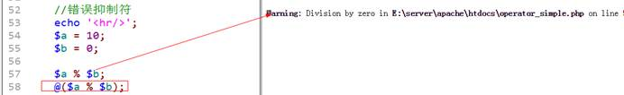

# 运算符

运算符：operator，是一种将数据进行运算的特殊符号，在PHP中一共有十种运算符之多。

## 赋值运算符

赋值运算：符号是“`=`”，表示将右边的结果（可以是变量、数据、常量和其它运算出来的结果），保存到内存的某个位置，然后将位置的内存地址赋值给左侧的变量（常量）。

## 算术运算符

算术运算：基本算术操作

`+`：执行数据累加

`-`：数据相减

`*`：键盘上没有乘法符号，使用*代替，两个数相乘

`/`：正斜杠代替，表示两个数相除

`%`：取余（模）运算，两个数（整数）相除，保留余数

 

> 在进行除法运算或者取余运算的时候，对应的除数（第二个数）不能为0


```php
<?php

//运算符

//算术运算符
$a = $b = 10;		//连贯赋值运算：两个不同变量
$c = 0;

//var_dump($a / 0);	//错误：被除数不能为0
```


## 比较运算符

比较运算：比较两个数据的大小，或者两个内容是否相同，返回的结果都是布尔类型：满足返回true，不满足返回false

`>`：左边大于右边，返回结果true

`>=`：左边大于等于右边

`<`：左边小于右边

`<=`：左边小于或者等于右边

`==`：左边的与右边的相同（大小相同）


`!=`：左边的与右边的不同（大小不同）

`===`：全等于，左边与右边相同：大小以及数据的类型都要相同


`!==`：不全等于，只有大小或者类型不同

 ```php
 //比较运算符
 $a = '123';	//字符串
 $b = 123;	//整型
 
 //判断相等
 var_dump($a == $b);		// true
 
 //全等判断
 var_dump($a === $b);	// false
 ```


## 逻辑运算符

逻辑运算：针对不同的结果进行匹配。满足条件返回true，不满足返回false

`&&`：逻辑与，左边的条件与右边的条件同时成立（两边结果都为true）

`||`：逻辑或，左边的条件或者右边的条件只要有一个满足即可

`!`：逻辑非，对已有条件进行取反，本身为true，取反结果就是false


 ```php
 $a = 'weekend';
 $b = 'goods';
 
 //逻辑与
 var_dump($a == 'weekend' && $b == 'good');
 
 //逻辑或
 var_dump($a == 'weekend' || $b == 'good');
 
 //逻辑非
 var_dump($b == 'good');
 var_dump(!($b == 'good'));
 ```


> 逻辑与和逻辑或又称之为短路运算：如果第一个表达式结果已经满足条件了，那么就不会运行逻辑运算符后面的表达式。
>
> 在书写代码的时候，尽量将出现概率最高的（能够直接判断出结果）的表达式放到第一位。

## 连接运算符

连接运算：是PHP中将多个字符串拼接的一种符号

`.` ：将两个字符串连接到一起

`.=` ： 复合运算，将左边的内容与右边的内容连接起来，然后重新赋值给左边变量

A .= b ===== A = A . b


```php
//连接运算符
$a = 'hello ';
$b = 123;

echo $a . $b;	//将a变量和b变量连接起来

$a .= $b; //$a = $a . $b;
echo $a;
```


## 错误抑制符

在PHP中有一些错误可以提前预知，但是这些错误可能无法避免，但是又比希望报错给用户看，可以使用错误抑制符处理。

 

`@`：在可能出错的表达式前面使用@符号即可



 ```php
 //错误抑制符
 $a = 10;
 $b = 0;
 
 //$a % $b;
 @($a % $b);
 ```


> 错误抑制符通常在生产环境（上线）会用到，在开发的时候不会用：系统本身最好没有任何错误。

## 三目运算符

三目运算：有三个表达式参与的运算（简单的的分支结构缩写）

语法格式：

`表达式1 ? 表达式2 : 表达式3;`

运算：如果表达式1成立，那么执行表达式2，否则执行表达式3；

 

注意：如果表达式本身比较复杂，建议使用括号包起来。


```php
//三木运算符
$a = 10;

$b = $a > 10 ? 100 : 0;
echo $b;
```


三目运算可以进行复合三目运算：三目运算中的表达式2和3都是可以是另外一个三目运算。

`表达式1 ？ (表达式2 ? 表达式4 : 表达式5) : (表达式3 ? 表达式5 : 表达式6);`

## 自操作运算符

自操作：自己操作自己的运算符

`++`：在原来的值上+1

`--`：在原来的值上-1

```php
$a = 1;

$a++; // $a = $a + 1;
```

在PHP中自操作符是可以放到变量前或者后：前置自操作和后置自操作

$a = 1;

$a++;

++$a;    //前置或者后置如果本身只有自操作，不参与其他运算（自操作同时），那么效果是一样的。但是如果自操作同时还参与别的运算，那么效果就不一样


`$a = 1;`

`$b = $a++;    //$a++会导致$a = $a + 1; $a = 2;，上面的$b = 1`

后置自操作：先把自己所保存的值留下来，然后改变自己，自己给别人的值是原来的值；


`$c =++$a;     //++$a会导致$a = $a + 1; $a = 2;，$c = 2;`

前置自操作：先把自己改变，然后把改变后的值给别人。


 ```php
 //自操作符
 $a = $b = 1;
 
 $a++;
 ++$b;				//独立操作，不参与其他运算
 echo $a, $b;
 
 echo '<br/>';
 echo $a++, ++$b;	//2 3；$a和$b不只是独立运算，还参与了输出操作
 
 echo $a, $b;		// 33
 ```


衍生符号：类似自操作

`+=`：左边的结果与右边结果相加，然后赋值给左边

`-=`：左边的减去右边的结果，然后复制给左边

`*=`：乘法操作

`/=`：除法操作

`%=`：模操作

 

注意：右边是一个整体 `$a += $b;` -> `$a = $a + ($b);`


 ```php
 $a = 10;
 $b = 5;
 
 $a += $b;			//$a = $a + $b = 15;
 $a -= $b - 1;		//$a = $a - ($b - 1);		//15 - 5 + 1 = 11
 echo '<br/>', $a, $b;
 ```


> 如果进行除法或者取余运算，那么要考虑右边表达式的结果是否为0（为0出错）

 

## 计算机码

计算机码：计算机在实际存储数据的时候，采用的编码规则（二进制规则）

 

计算机码：**原码、反码和补码**，数值本身最左边一位是用来充当符号位：正数为0，负数为1

原码：数据本身从十进制转换成二进制得到的结果

​     正数：左边符号位为0（**正数的原码、反码和补码就是原码本身**）

​     负数：左边符号位为1

反码：针对负数，符号位不变，其他位取反

补码：针对负数，反码+1

 

系统中存在两个0：+0和-0

+0： 00000000

-0： 10000000    原码

取反 11111111 （符号为不变，其他取反）

补码 00000000 （+1后，溢出）


 ```php
 //计算机码
 $a = 5;
 $b = -5;
 
 /*
 5原码： 00000101
 
 -5原码：10000101
 取反：  11111010	//反码：符号位不变，其他位取反
 求补：	11111011	//补码：反码+1
 */
 ```


## 位运算符

> 视频教学：https://www.bilibili.com/video/BV18x411H7qD/?p=33
>
> 计算机码，位运算符，运算符优先级

位运算：取出计算机中最小的单位（位bit）进行运算

`&`：按位与，两个位都为1，结果为1，否则为0

`|`：按位或，两个有一个为1，结果为1


```php
//按位与
$a = 5;
$b = -5;
var_dump($a & $b);
/*
	//取出系统存储的结果进行与操作
	5	00000101
	-5  11111011
	&	00000001	//最终结果
	转换：判断符号位，0表示正数（原码），1表示负数（补码）
	这里的符号位是0，结果为原码
	若符号位是1，负数，需要转码（-1，取反，得到源码）
*/
```


> 注意：
>
> 1、 系统进行任何位运算的时候都是使用的补码
>
> 2、 运算结束之后都必须转换成原码才是最终要显示的数据

 

`~`：按位非，一个位如果为1则变成0，否则反之


```php
//按位非
$b = -5;
var_dump(~$b);
/*
	-5  11111011	补码
取反    00000100    按位非取反，所有位都取反 
原码    00000100	
*/
```


`^`：按位异或，两个相同则为0，不同则为1

`<<`：按位左移，整个位（32位），向左移动一位，右边补0

`>>`：按位右移，整个位向右移动一位，左边补符号位对应内容（正数补0，负数补1）


 ```php
 //按位右移
 $b = -5;
 var_dump($b >> 1);
 var_dump($b >> 2);
 /*
 	-5	11111011
 	>>1 11111110	//运算结果：补码
 	-1  11111101	//反码
   取反  10000010	//原码：-2
 */
 ```


按位左移：乘以2的操作

按位右移：除以2的操作（不完全正确）：整数除2会出现小数

## 运算符优先级

运算符优先级：在多种运算符同时存在的时候，如何结合运算


# 流程控制

流程控制：代码执行的方向

## 控制分类

顺序结构：代码从上往下，顺序执行。（代码执行的最基本结构）

分支结构：给定一个条件，同时有多种可执行代码（块），然后会根据条件执行某一段代码

循环结构：在某个条件控制范围内，指定的代码（块）可以重复执行

 

## 顺序结构

顺序结构：最基本结构，所有代码默认都是从上往下依次执行

## 分支结构

在PHP中，分支结构主要有两种：`if`分支和`switch`分支

### If分支

`if`：如果的意思，给定一个条件，同时为该条件设置多种（两种）情况，然后通过条件判断来实现具体的执行段

 

基本语法：`if`分支PHP也提供多种方式来实现

 

最简`if`：只有一段代码，但是可以选择是否执行

```php
if(条件表达式){
	//满足条件所要执行的内容; //顺序结构
}
```


```php
//最简if
$day = 'weekenday';

//如果是星期天就出去玩
if ($day == 'sunday') {
	echo 'go out';
}
```


 

基础`if`：有两面性，满足条件或者不满足条件都有对应的执行代码

```php
If(条件表达式){
 	//满足条件后执行的代码段;
}else{
	//不满足条件执行的代码段;
}
```


```php
//基本if判断
//如果是星期天就出去玩，否则上班
if ($day == 'sunday') {
	echo 'go out play';
} else {
	//不满足条件
	echo 'work';
}
```


 

 

复杂`if`结构：在判断条件之后，通常就有两种结果：满足或者不满足，在不满足之后还可以再次进行条件判断

```php
if(条件表达式1){
	//满足条件表达式1的代码段;
}elseif(条件表达式2){
	//不满足表达式1条件，但是满足表达式2的代码;
}…  //可以使用多个elseif来进行再次条件筛选
else{
    //全部不满足要执行的代码;
}
```


```php
//复合if结构
//如果是星期天就出去玩，否则不能，但是如果是周六，那么可以在家玩
echo '<hr/>';
$day = 'satday';
if ($day == 'sunday') {
	echo 'go out';
} else {
	//包含全部不满足情况
	//重新进行判断
	if ($day == 'satday') {
		echo 'play at home';
	} else {
		echo 'work';
	}
}

echo '<hr/>';
if ($day == 'sunday') {
	echo 'go out';
} elseif ($day == 'satday') {
	echo 'play at home';
} else {
	echo 'work';
}
```

> 注意：如果条件特别多才会采用复合if形式
>
> 1、 如果条件比较单一（同一个条件），会采用elseif复合方式
>
> 2、 如果判断条件不一致，建议使用嵌套语法（不宜有太多层嵌套：影响代码美观）


> if分支，适用于所有的条件判断（分支结构）

### [elseif/else if](https://www.php.net/manual/zh/control-structures.elseif.php) 

`elseif`，和此名称暗示的一样，是 `if` 和 `else` 的组合。和 `else` 一样，它延伸了 `if` 语句，可以在原来的 `if` 表达式值为 **`false`** 时执行不同语句。但是和 `else` 不一样的是，它仅在 `elseif` 的条件表达式值为 **`true`** 时执行语句。例如以下代码将根据条件分别显示 a is bigger than b，a equal to b 或者 a is smaller than b：

```php
<?php
if ($a > $b) {
    echo "a is bigger than b";
} elseif ($a == $b) {
    echo "a is equal to b";
} else {
    echo "a is smaller than b";
}
?>
```

在一个 `if` 语句中可以有多个 `elseif`，其中将会执行第一个表达式值为 **`true`**（如果有的话）的 `elseif`。在 PHP 中，也可以写成 `else if`（两个单词），它和 `elseif`（一个单词）的行为完全一样。句法分析的含义有少许区别（行为与 C 相同），但是底线是两者会产生完全一样的行为。

`elseif` 的语句仅在之前的 `if` 和所有之前 `elseif` 的表达式值为 **`false`**，并且当前的 `elseif` 表达式值为 **`true`** 时执行。

> **注意**: 必须要注意的是 `elseif` 与 `else if` 只有在类似上例中使用花括号的情况下才认为是完全相同。如果用冒号来定义 `if`/`elseif` 条件，必须在一个单词中使用 `elseif`。如果 `else if` 分割为两个单词，则 PHP 会产生解析错误。


```php
<?php

/* 不正确的使用方法： */
if ($a > $b):
    echo $a." is greater than ".$b;
else if ($a == $b): // 将无法编译******
    echo "The above line causes a parse error.";
endif;


/* 正确的使用方法： */
if ($a > $b):
    echo $a." is greater than ".$b;
elseif ($a == $b): // 注意使用了一个单词的 elseif
    echo $a." equals ".$b;
else:
    echo $a." is neither greater than or equal to ".$b;
endif;

?>
```

### Switch分支

`switch`分支：有一组情形存在，同过一条件，通常有多个值，但是每一个值都会有对应不同的代码要执行。

 

`switch`判断方式：是将条件放到分支结构内部判断

 

switch基本语法：

```php
switch(条件表达式){
	//所有条件判断：逐个进行
	case 值1:                     //当前条件表达式的结果与值1相等（==）

		// 要执行的代码段;
		break;                     //在switch中，如果条件匹配成功，那么系统就不会再次匹配条件，会自动顺序执行向下的所有代码（case代码除外），需要中断执行：break表示中断switch（结束）。
	case 值2:
		要执行的代码段;
        break;
        // …
	//可以使用类似else的语法：都不匹配
	default:
        //匹配失败的代码;
        break;
}
```


```php
<?php

//分支结构：switch分支

//根据日期做不同的事情
$day = 1;

//从1到5做不同的事情
switch ($day) {
		//$day条件一定是个具体的值
	case 1:	//$day == 1
		echo '1';
		//break;
	case 2:
		echo '2';
		break;
	case 3:
		echo '3';
		break;
	case 4:
		echo '4';
		break;
	case 5:
		echo '5';
		break;
	default:
		echo 'error';
		break;
}
```

> `if`和`switch`的选择
>
> 1、 `if`能做所有的分支结构事情
>
> 2、 `switch`处理的是条件比较多，同时比较单一，而且是固定值匹配的分支结构

# 循环结构

循环结构：代码段在一定的控制下，可以多次执行

 

在PHP中循环结构有以下几种：

`for`循环：通过条件、起始和终止判断执行

`while`循环：通过判断条件终止

`do-while`循环：跟while差不多

`foreach`循环：专门针对数组

## For循环

for循环基本语法：

```php
for(条件表达式1; 条件表达式2; 条件表达式3){
    //条件表达式1：定义初始化条件，可以有多种赋值语句存在，使用逗号分隔即可
    //条件表达式2：边界判定，限定循环执行的次数
    //条件表达式3：用来执行条件变化（自操作）
    //循环体
}
```


 ```php
 //循环结构：for循环
 
 //从1到10输出：初始为1，结果为10
 for ($i = 1; $i <= 10; $i++) {
 	//输出
 	echo $i, '<br/>';
 }
 
 //最后：$i == 11
 echo $i;
 ```


> For循环执行原理：
>
> 1、 执行条件表达式1：定义初始化条件（执行一次）
>
> 2、 执行条件表达式2：判断条件（N次）
>
> ​     2.1  满足条件：执行循环体
>
> ​     2.2  不满足条件：循环结束
>
> 3、 执行循环体：（N次）
>
> 4、 执行条件表达式3：循环变量变化（N次）
>
> 5、 执行条件表达式2：判断条件（N次）
>
> 6、 重复执行3-4-2步骤：直到第2步不满足条件结束循环


for循环中条件表达式1的多变量定义


 ```php
 //从1到10输出（10通常是动态得到）
 for ($i = 1, $end = 10; $i <= $end; $i++) { // $end的值可能是动态计算的，这样使得该值只计算一次
 	echo $i, '<br/>';
 }
 ```


for循环特殊使用：for循环中对应的括号（条件）可以一个都没有（死循环）：**一定要避免出现**

```php
for(;;){
    //循环体
}
```


```php
//无条件for循环
for (;;) {
	echo 'hello world<br/>';
}
```

## while循环

`while`循环基本语法：

 ```php
 条件初始化;
 
 while(条件表达式){
     //条件表达式就是判断边界条件
     循环体;      //循环条件的变化
 }
 ```


 ```php
 //while循环
 
 //定义条件
 $i = 1;
 
 //循环判定执行
 while ($i <= 10) {
 	//循环体
 	echo $i++, '<br/>'; // 先输出，再自加1
 
 	// 循环条件变更
 	// $i++;
 }
 ```

> for与while的选择
>
> 1、 如果是基于固定已知条件（数值而且是有规律的变化），使用for循环
>
> 2、 while可以做灵活的条件判定（while使用的比较多）

## do-while循环

 

`while`：首先进行条件判定然后执行循环体，有可能出现第一次就条件不满足，那么就会直接失败（循环体一次都不执行）。

`do-while`：先干了再说（执行循环体），后判断条件。（至少会执行一次循环体）

 

do-while基本语法：

```php
定义基础条件
do{
    //循环体
}while(条件表达式);
```


```php
//do-while循环结构

//输出1-10之间的偶数（条件判定加入）

//定义基础条件
$i = 1;

//循环判定
do {
	//执行输出
	if ($i % 2 != 1) {
		//是偶数
		echo $i, '<br/>';
	}
	//条件变更
	$i++;
} while ($i <= 10);
```


## 循环控制

循环控制：在循环内部对循环本身进行控制

 

中断控制：重新开始循环，循环体中还有其他内容，也再执行

```php
continue [层级];    // 默认是1（循环可以多层嵌套）
```


终止控制：循环直接结束

```php
break [层级];       // 默认是1
```


 ```php
 //循环控制
 //需求：输出1到100之间的5的倍数
 
 $i = 1;
 while ($i <= 100) {
 	//判断：是否是5的倍数
 	if ($i % 5 != 0) {
 		//说明当前$i不是5的倍数
 
 		$i++;
 		//重新循环
 		continue;			//系统重新跳到循环开始处
 		// break; // 终止循环
 	}
 	//输出数值
 	echo $i++, '<br/>';
 }
 echo $i;
 ```


因为循环经常性会碰到嵌套（循环中间包含循环），如果在循环内部有些条件下，明确可以知道当前循环（或者说外部循环）不需要继续执行了，那么就是可以使用循环控制来实现：

其中内部循环也可以控制到外部，就是通过使用层级参数：

```php
continue 2;	// 当前自己循环后面内容不再执行，同时外部循环如果还有循环体也不再执行，重新来过；

break 2;	// 当前自己循环结束，同时外部也结束（如果还有外部不受影响，继续执行）
```


# 流程控制替代语法

流程控制替代语法：分支和循环结构的替代语法

PHP本身是嵌入到HTML中的脚本语言，需要在HTML中书写一些关于判断或者循环的结构语法，必须符合PHP标签规范，需要HTML与PHP进行混搭，如果使用原始的PHP代码那么会非常不美观。

 

需求：打印一个九九乘法表，使用表格来展示


```php+HTML
<table border=1>
	<?php for ($i = 1; $i < 10; $i++) { ?>
		<tr>
			<?php for ($j = 1; $j <= $i; $j++) { ?>
				<td>
					<?php echo $i . ' * ' . $j . ' = ' . $i * $j; ?>
				</td>
			<?php } ?>
		</tr>
	<?php } ?>
</table>
```


 

在PHP书写到HTML中的这些大括号{}非常不美观，所以PHP提供了一种替代机制，让其可以不用书写大括号：

`for(;;){` -> `for(;;):`

`}`                ->`endfor;`


```php
<table border=1>
	<?php for ($i = 1; $i < 10; $i++) : ?>
		<tr>
			<?php for ($j = 1; $j <= $i; $j++) : ?>
				<td>
					<?php echo $i . ' * ' . $j . ' = ' . $i * $j; ?>
				</td>
			<?php endfor; ?>
		</tr>
	<?php endfor; ?>
</table>
```


PHP中具体有哪些替代语法呢？

PHP应该在HTML中只做数据输出，输出通常伴有条件判断和循环操作，因此PHP提供了对应分支结构和循环结构的替代语法：全部都是对应的一个模式：

左大括号`{`使用`冒号`替代：

右大括号`}`使用`end+对应的起始标记`替代

 

`if`：`if():  endif;`

`switch`：`switch():  endswitch;`

`for`

`while`

`foreach`

 