# 文件包含

> 视频地址：https://www.bilibili.com/video/BV1gt4y1h7LM

文件包含：在一个PHP脚本中，去将另外一个文件（PHP）包含进来，去合作完成一件事情。

## 文件包含的作用

文件包含的意义：

1、 要么使用被包含文件中的内容，实现代码的共享（重用）：向上包含（索要）

向上包含：在当前脚本要用某个代码之前包含别的文件

 

2、 要么自己有东西可以给别的文件使用，实现代码的共享（重用）：向下包含（给予）

向下包含：在自己有某个东西的时候，需要别的脚本来显示（自己代码写完之后包含其他文件）

 

最大的作用：分工协作，每个脚本做的事情不一样，因此可以使用协作方式，让多个脚本共同完成一件事情。

## 文件包含四种形式

在PHP中文件的包含有四种形式（两种大形式）

`include`：包含文件

`include_once`：系统会自动判断文件包含过程中，是否已经包含过（一个文件最多被包含一次）

`require`：与`include`相同

`require_once`：与`include_once`相同

 

包含基本语法：

```php
include ‘文件名字’;

include(‘文件名字’);    //文件名字：路径问题，系统能找到
```

### 向上包含：先包含文件，后使用文件中的内容

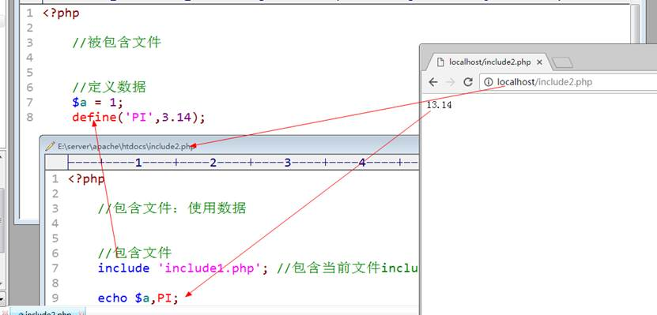

 `20include1.php`：

```php
<?php

//被包含文件

//定义数据
$a = 1;
define('PI', 3.14);
```

`21include2.php`：（**要运行的脚本**）

```php
<?php

//包含文件：使用数据

//包含文件
include '20include1.php';	//包含当前文件include2.php所在文件夹下的include1.php

echo $a, PI;
```


### 向下包含：先准备内容，然后包含另外的文件，在另外的文件中，使用当前的内容

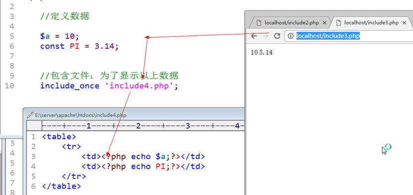

`22include3.php`：（**要运行的脚本**）

```php
<?php

//定义数据

$a = 10;
const PI = 3.14;


//包含文件：为了显示以上数据
include_once '23include4.php';
```

`23include4.php`：

```php
<table>
	<tr>
		<td><?php echo $a; ?></td>
		<td><?php echo PI; ?></td>
	</tr>
</table>
```


## 文件加载原理

> PHP代码的执行流程
>
> 1、 读取代码文件（PHP程序）
>
> 2、 编译：将PHP代码转换成字节码（生成opcode，php能解析的代码）
>
> 3、zendengine来解析opcode，按照字节码去进行逻辑运算
>
> 4、 转换成对应的HTML代码

 

文件加载原理：

1、 在文件加载（`include`或者`require`）的时候，系统会自动的将被包含文件中的代码相当于嵌入到当前文件中

2、 加载位置：在哪加载，对应的文件中的代码嵌入的位置就是对应的`include`位置

> 3、 在PHP中被包含的文件是单独进行编译的
>
> 体现：PHP文件在编译的过程中如果出现了语法错误，那么会失败（不会执行）；但是如果被包含文件有错误的时候，系统会在执行到包含include这条语句的时候才会报错。
>

 

## `include`和`require`区别

### `include`和`include_once`的区别：

`include`系统会碰到一次，执行一次；如果对统一个文件进行多次加载，那么系统会执行多次；

> 这里被包含文件中定义了常量`PI`，在脚本中引入两次，报错原因：同名常量只能定义一次

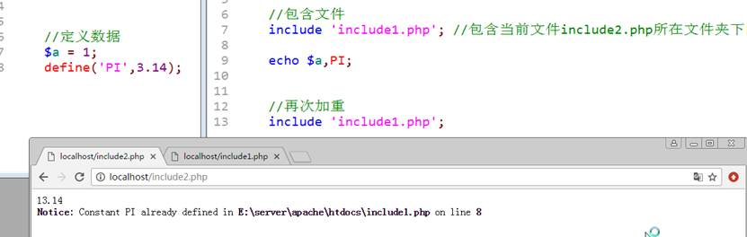

`include_once`：系统碰到多次，也只会执行一次。

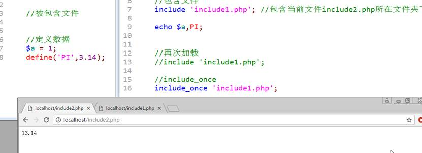

 

### `require`和`include`的区别：

本质都是包含文件，唯一的区别在于包含不到文件的时候，报错的形式不一样

`include`的错误级别比较轻（Warning）：不会阻止代码执行

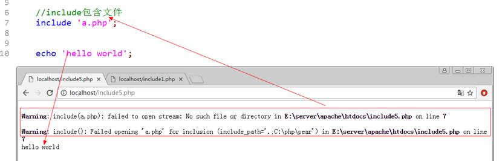

`require`要求较高（Fatal error）：如果包含出错代码不再执行`require`后面的代码

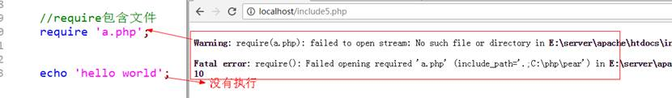

```php
<?php

//require和include的区别

//include包含文件
//include 'a.php';

//require包含文件
require 'a.php';

echo 'hello world';
```


# 文件加载路径

文件在加载的时候需要指定文件路径才能保证PHP正确的找到对应的文件。


文件的加载路径包含两大类：

### 1、 绝对路径：

- 从磁盘的根目录开始（本地绝对路径）
  - Windows：盘符`C:/路径/PHP文件`
  - Linux：`/路径/PHP文件`

- 从网站根目录开始（网络绝对路径）

  - `/`：相对于网站主机名字对应的路径

    `localhost/index.php` -> `E:/server/apache/htdocs/index.php`


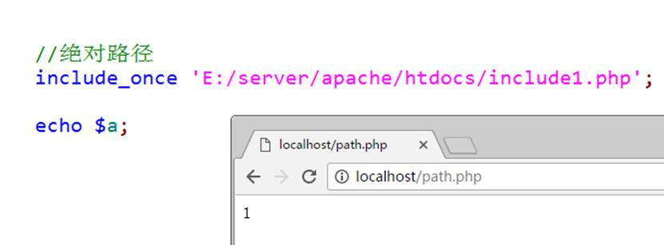

### 2、相对路径：

从当前文件所在目录开始的路径

- `.`|`./`：表示当前文件夹
- `../`：上级目录（当前文件夹的上一层文件夹）


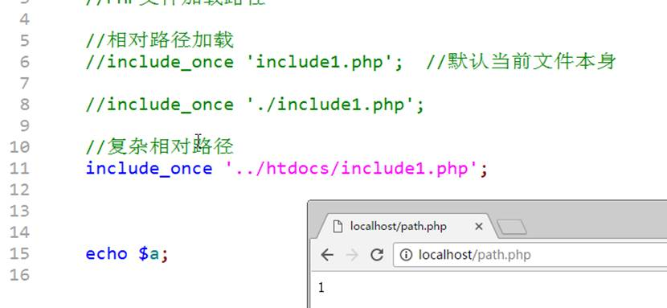

 

### 绝对路径 和 相对路径的加载区别

1. 绝对路径相对效率偏低，但是相对安全（路径不会出问题）

2. 相对路径相对效率高些，但是容易出错（相对路径会发生改变）

 

 ```php
 <?php
 
 //PHP文件加载路径
 
 //相对路径加载
 // include_once '20include1.php';	//默认当前文件本身
 
 // include_once './20include1.php';// 相对路径加载
 
 //复杂相对路径
 // include_once '../code/20include1.php';
 
 
 //绝对路径
 include_once 'D:/server/apache/htdocs/code/20include1.php';
 
 echo $a;
 
 ```


# 文件嵌套包含

文件嵌套包含：一个文件包含另外一个文件，同时被包含的文件又包含了另外一个文件。


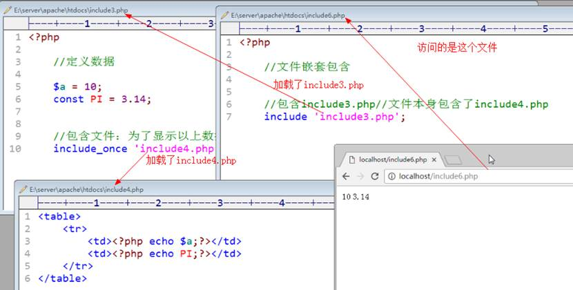

 

嵌套包含的时候就很容易出现相对路径出错的问题：相对路径会因为文件的包含而改变（`./`和`../`）：windows下面，每一个文件夹下都有`.`和`..`的文件夹。

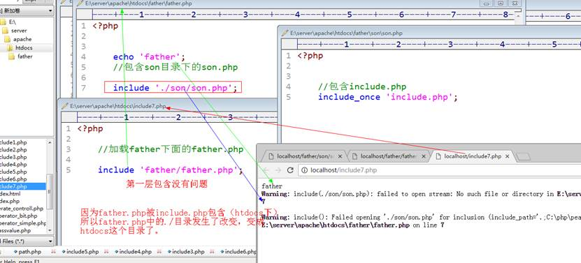

 

张三 左边是 李四，李四左边是王五

张三把李四叫到自己的位置：李四与王五之间有两个位置，李四如果还按照左边伸手找王五就找不到

# 函数

## 函数的基本概念

函数：function，是一种语法结构，将实现某一个功能的代码块（多行代码）封装到一个结构中，从而实现代码的重复利用（复用）。

## 函数定义语法

函数有几个对应的关键点：**function关键字、函数名、参数（形参和实参）、函数体和返回值**

 

基本语法如下：

 ```php
 function 函数名([参数]){
     //函数体
     //返回值：return 结果;
 }
 ```


定义函数的目的：是为了实现代码的重复利用，一个功能一个函数（简单明了）

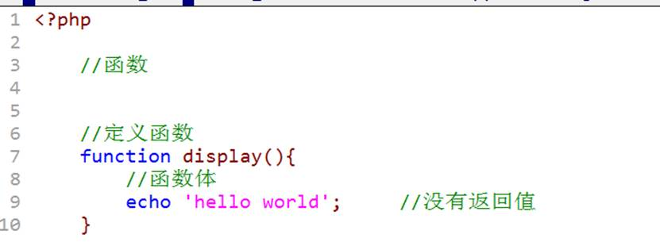

 

函数的使用：

通过访问`函数的名字+();`

如果函数在定义的过程中有参数，那么在调用的时候就必须传入对应的参数

函数是一种结构不会自动运行，必须通过调用才会执行

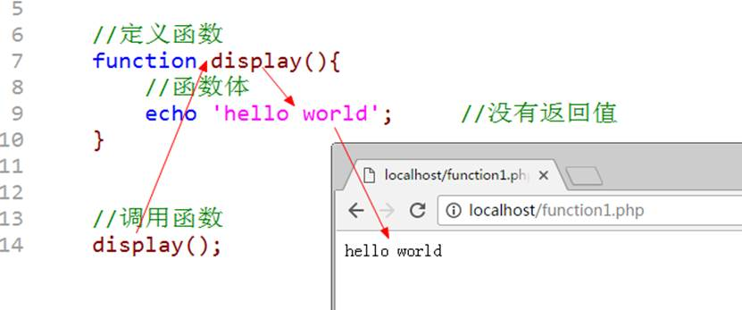

 

函数是在代码执行阶段，碰到函数名字的时候才会调用，不是在编译阶段。

函数的调用特点：只要系统在内存中能够找到对应的函数，就可以执行（**函数的调用可以在函数定义之前**）

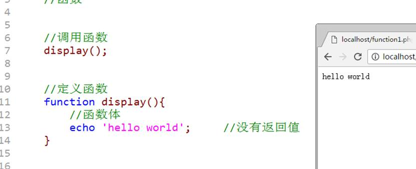

 

函数执行的内存分析：

1. 读取代码进入到代码段（编译：将代码变成字节码存储到内存）

2. 根据代码逐行执行


以上原因：编译和执行是分开的（先编译后执行）

```php
<?php

//函数

//调用函数
display();

//定义函数
function display()
{
	//函数体
	echo 'hello world';		//没有返回值
}

//调用函数
//display();
```

 

## 函数命名规范

命名规范：由字母、数字和下划线组成，但是不能以数字开头

 

函数作为一种常用的结构，一般遵循以下规则：

函数通常名字代表着函数的功能，而有些功能会比较复杂，可能一个单词不足以表达，需要多个组合。

1. 驼峰法：除了左边第一个单词外，后面所有的单词首字母都大写：showParentInfo()

2. 下划线法：单词之间通过下划线连接，单词都是小写：show_parent_info()

 

函数名字：在一个脚本周期中，不允许出现同名函数（通常在一个系统开发中都不会使用同名函数）

# 参数详解

函数的参数分为两种：形参和实参

## 形参

形参：形式参数，不具有实际意义的参数，是在函数定义时使用的参数

## 实参

实参：实际参数，具有实际数据意义的参数，是在函数调用时使用的参数

 

形参是实参的载体：实参在调用时通常是需要传入到函数内部参与计算（运算），那么需要在函数内部去找到实际数据所在的位置才能找到数据本身：需要实际调用的时候，将数据以实参的形式传递给形参：给形参赋值，从而使得函数内部可以用到外部数据。

 

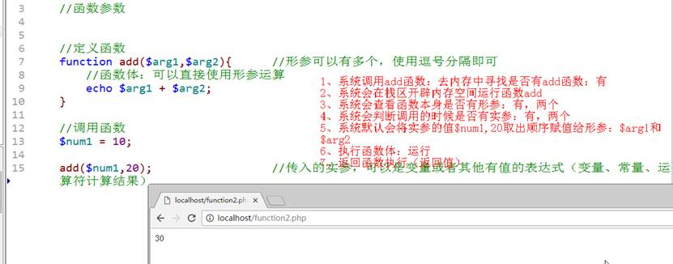

 ```php
 //函数参数
 
 //定义函数
 function add($arg1, $arg2)	//形参可以有多个，使用逗号分隔即可
 {
 	//函数体：可以直接使用形参运算
 	echo $arg1 + $arg2;
 }
 
 //调用函数
 $num1 = 10;
 add($num1, 20);	//传入的实参，可以是变量或者其他有值的表达式（变量、常量、运算符计算结果）
 ```


注意：

1、 在PHP中允许实参多余形参（个数）：函数内部不用而已

2、 在PHP中理论上形参个数没有限制（实际开发不会太多）

3、 实参不能少于形参个数

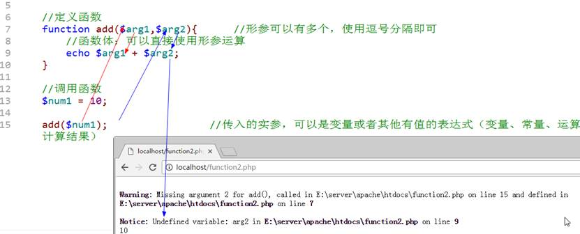

## 默认值

默认值：default value，指的是形参的默认值，在函数定义的时候，就给形参进行一个初始赋值：如果实际调用传入的参数（实参）没有提供，那么形参就会使用定义时的值来进入函数内部参与运算。

 

通常默认值是用在一些，一定会有某个数据参与，但是可能通常是某个我们知道的值。

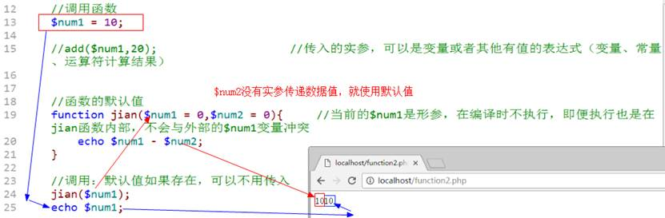

```php
$num1 = 10;
//函数的默认值
function jian($num1 = 0, $num2 = 0)	
//当前的$num1是形参，在编译时不执行，即便执行也是在jian函数内部，不会与外部的$num1变量冲突
{
	echo $num1 - $num2;
}

//调用：默认值如果存在，可以不用传入
jian($num1);
echo $num1;
```


注意事项：

1、 默认值的定义是放在最右边的（多个），不能左边形参有默认值，但是右边没有


函数外部定义的变量名字与函数定义的形参名字冲突（同名）是没有任何关联关系的；如果多个函数使用同样的形参名字也不冲突。

## 引用传递

实参在调用时会将值赋值给形参，那么实际上使用的方式就是一种简单的值传递：将实参（如果是变量或者常量或者其他表达式）的结果（值）取出来赋值给形参：形参与外部实际传入的参数本身没有任何关联关系：只是结果一样。

 

有的时候，希望在函数内部拿到的外部数据，能够在函数内部改变，那么就需要明确告知函数（定义时 `&`），函数才会在调用的时候去主动获取外部数据的内存地址。以上这种定义形式参数的方式叫作引用传值。

基本定义语法：

```php
function 函数名(形参1, &形参2){
    //函数体
}
```

在调用的时候，必须给引用传值的参数位置传入实际参数，而且参数本身必须是变量。（变量才有指向的数据的内存地址）

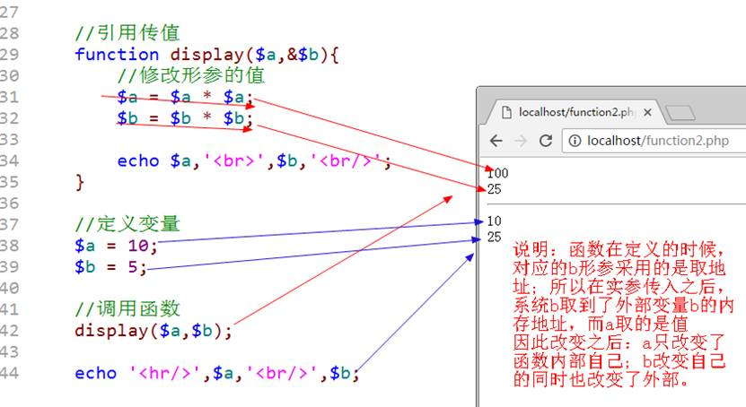

 ```php
 //引用传值
 function display($a, &$b)
 { 	//修改形参的值
 	$a = $a * $a;
 	$b = $b * $b;
 
 	echo $a, '<br>', $b, '<br/>'; // 100 25
 }
 
 //定义变量
 $a = 10;
 $b = 5;
 
 //调用函数
 display($a, $b);
 echo '<hr/>', $a, '<br/>', $b; // 10 25
 ```


引用传值注意事项：在传入实参的时候，必须传入变量

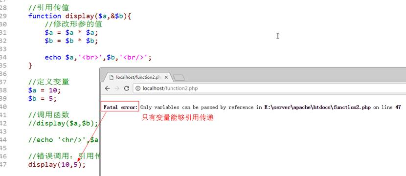

# 函数体

函数体：函数内部（大括号`{}`里面）的所有代码都称之为函数体


函数体，基本上所有的代码都可以实现：

1、 定义变量

2、 定义常量

3、 使用流程控制（分支、循环）

4、 可以调用函数

 

# 函数返回值

返回值：return，指的是将函数实现的结果，通过`return`关键字，返回给函数外部（函数调用处）：在PHP中所有的函数都有返回值。（如果没有明确`return`使用，那么系统默认返回`NULL`）

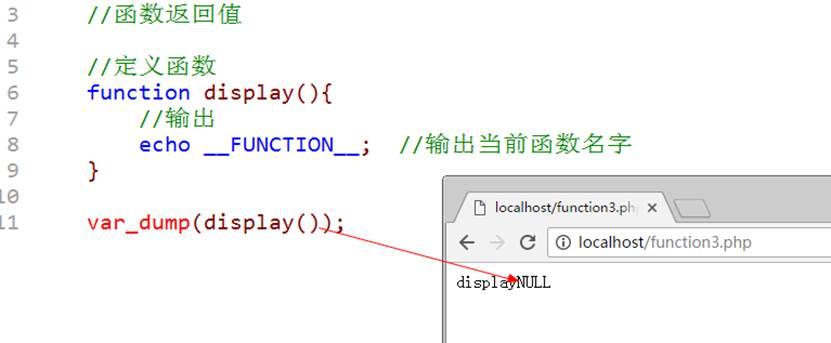

 ```php
 //函数返回值
 
 //定义函数
 function display()
 {	//输出
 	echo __FUNCTION__;	//输出当前函数名字
 }
 
 var_dump(display());
 ```


返回值作用：将计算结果返回给调用处

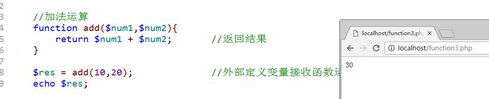

```php
//加法运算
function add($num1, $num2)
{
	return $num1 + $num2;	//返回结果
}

$res = add(10, 20);			//外部定义变量接收函数运行结果
```

注意：函数的返回值可以是任意数据类型

 

`return`关键字：

1. `return`在函数内部存在的价值：返回当前函数的结果（**当前函数运行结束**）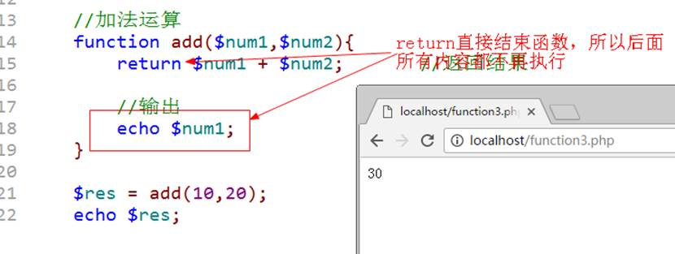

2. `return`还可以在文件中直接使用（不在函数里面）：代表文件将结果`return`后面跟的内容，转交给包含当前文件的位置。（通常在系统配置文件中使用较多），在文件中也代表中终止文件后面的代码：`return`之后的内容不会执行。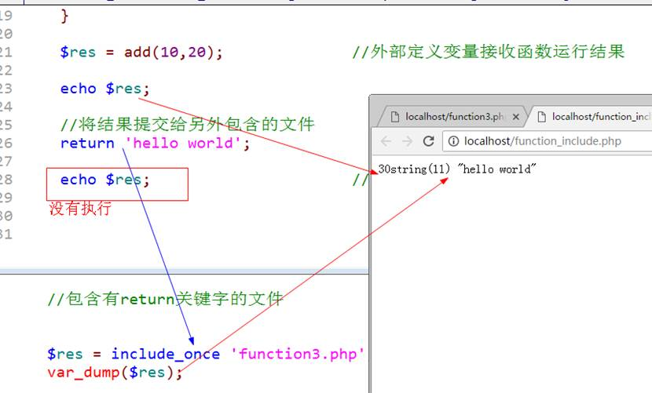

 

# 作用域

作用域：变量（常量）能够被访问的区域

1、 变量可以在普通代码中定义

2、 变量也可以在函数内部定义


在PHP中作用域严格来说分为两种：但是PHP内部还定义一些在严格意义之外的一种，所以总共算三种：

1. 全局变量：就是用户普通定义的变量（函数外部定义）

   所属全局空间：在PHP中只允许在全局空间使用：理论上<span style="font-weight: bold;color: red">函数内部不可访问</span> 

   脚本周期：直到脚本运行结束（最后一行代码执行完）

2. 局部变量：就是在函数内部定义的变量

   所属当前函数空间：在PHP中**只允许在当前函数自己内部使用**

   函数周期：函数执行结束（函数是在栈区中开辟独立内存空间运行）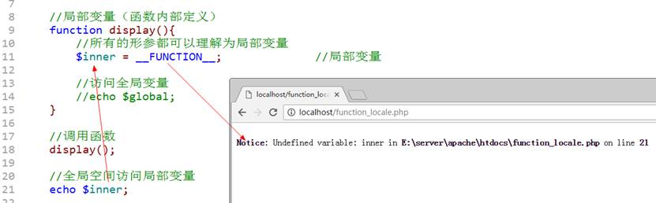

3. 超全局变量：系统定义的变量（预定义变量：`$_SERVER`、`$_POST`等）

   所属超全局空间：没有访问限制（函数内外都可以访问）

   超全局变量会将全局变量自动纳入到`$GLOBALS`里面，而`$GLOBALS`没有作用域限制，所以能够帮助局部去访问全局变量：但是必须使用数组方式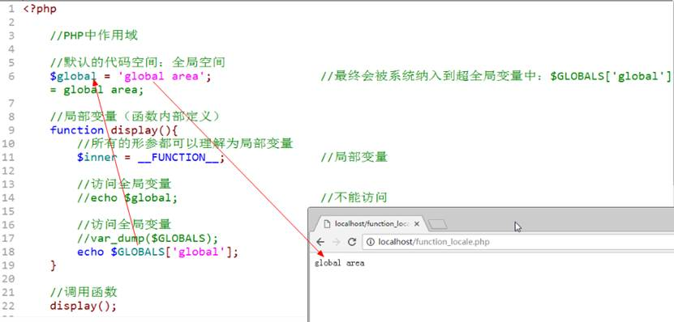

 

如果想函数内部使用外部变量：除了`$GLOBALS`之外，通过参数传值（如果要统一战线还可以使用引用传值`&`）。


在PHP中，其实还有一种方式，能够实现全局访问局部，同时局部也可以访问全局：`global`关键字

`global`关键字：是一种<span style="font-weight: bold;color: red">在函数里面定义变量</span>的一种方式

1. 如果使用`global`定义的变量名在外部存在（全局变量），那么系统在函数内部定义的变量直接指向外部全局变量所指向的内存空间（同一个变量）；

2. 如果使用`global`定义的变量名在外部不存在（全局变量），系统会自动在全局空间（外部）定义一个与局部变量同名的全局变量

 

本质的形式：在函数的内部和外部，对一个同名变量（全局和局部）使用同一块内存地址保存数据，从而实现共同拥有。


基本语法：

```php
global 变量名;	//不能赋值

变量名 = 值;	//修改
```


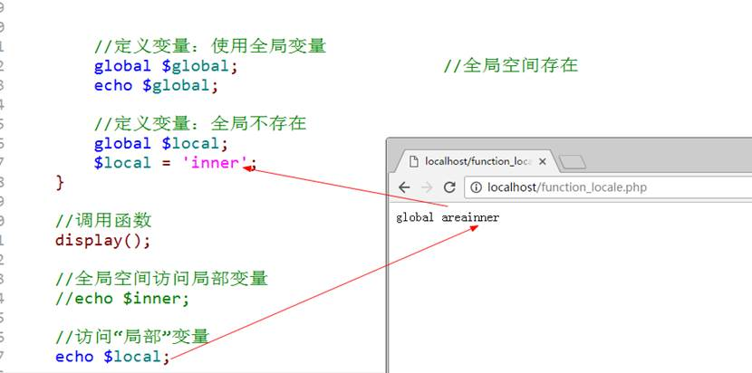

 ```php
 <?php
 
 //PHP中作用域
 
 //默认的代码空间：全局空间
 $global = 'global area'; //最终会被系统纳入到超全局变量中：$GLOBALS['global'] = global area;
 
 //局部变量（函数内部定义）
 function display()
 {	//所有的形参都可以理解为局部变量
 	$inner = __FUNCTION__;			//局部变量
 
 	//访问全局变量
 	//echo $global;					//不能访问
 
 	//访问全局变量
 	//var_dump($GLOBALS);
 	//echo $GLOBALS['global'];		//这样可以访问到全局变量，但通常不这样做
 
 
 	//定义变量：使用全局变量
 	global $global;					//全局空间存在
 	echo $global;
 
 	//定义变量：全局不存在
 	global $local;
 	$local = 'inner';
 }
 
 //调用函数
 display();
 
 //全局空间访问局部变量
 //echo $inner;						//不能访问
 
 //访问“局部”变量
 echo $local;
 ```


虽然以上方式可以实现局部与全局的互访，但是通常不会这么用。一般如果会存在特殊使用，也会使用<span style="font-weight: bold;color: red">参数</span>的形式来访问。（还可以使用常量：`define`定义的，<span style="font-weight: bold;color: red">常量没有作用域的限制</span>）


# 静态变量

静态变量：static，是在函数内部定义的变量，使用`static`关键字修饰，用来实现**跨函数共享数据**的变量：函数运行结束所有局部变量都会清空，如果重新运行一下函数，所有的局部变量又会重新初始化。


基本语法：

```php
function 函数名(){
    //定义变量
    Static $变量名 = 值;	//通常会在定义的时候就直接赋值
}
```


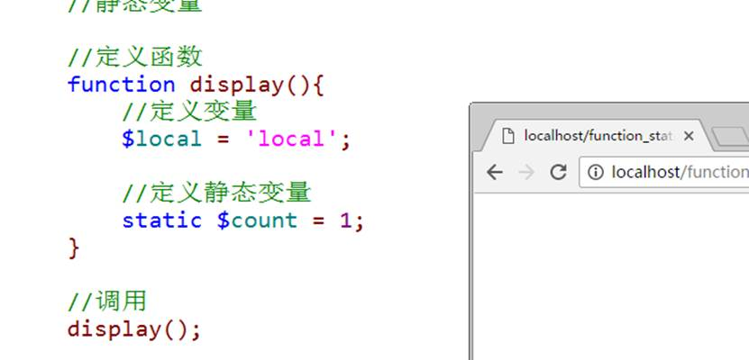

 

静态变量的作用是为了跨函数共享数据（同一个函数被多次调用）

**函数的：局部变量保存在栈里，静态变量保存在堆里**

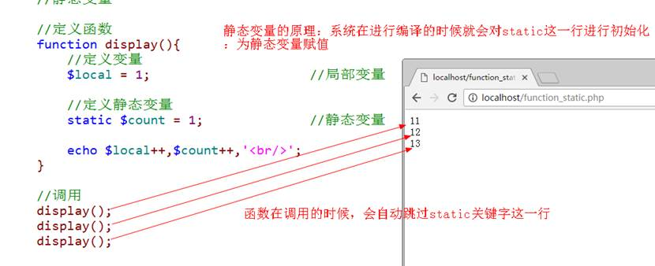

 

静态变量的使用：

1、 为了统计：当前函数被调用的次数（有没有替代方法？）

2、 为了统筹函数多次调用得到的不同结果（递归思想）

# 可变函数

可变函数：当前有一个变量所保存到值，刚好是一个函数的名字，那么就可以使用变量+()来充当函数名使用。

```php
$变量 = ‘display’;

function display(){
}
//可变函数
$变量();
```


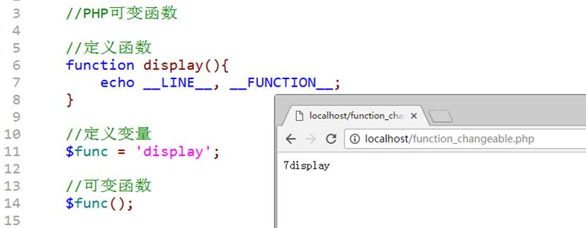

```php
<?php

//PHP可变函数

//定义函数
function display()
{
	echo __LINE__, __FUNCTION__;
}

//定义变量
$func = 'display';

//可变函数
$func();
```


可变函数在系统使用的过程中还是比较多的，尤其是使用很多系统函数的时候：需要用户在外部定义一个自定义函数，但是是需要传入到系统函数内部使用。

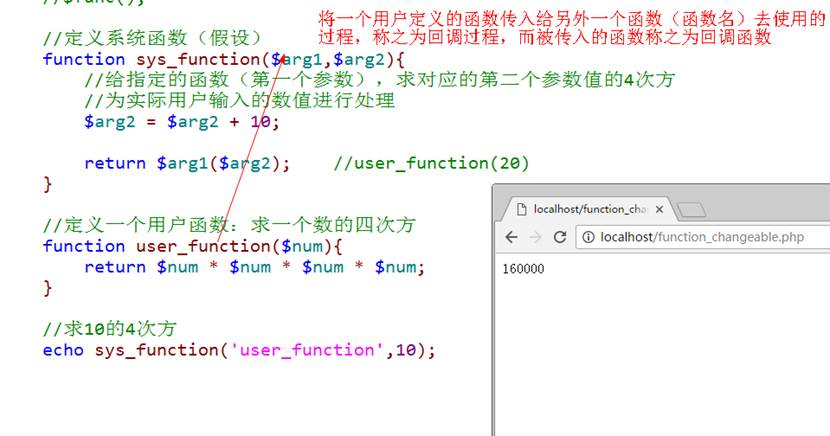

**回调函数**

```php
//定义系统函数（假设）没有人定义的才是系统函数，人为定义的永远是定义函数
function sys_function($arg1, $arg2)
{
	//给指定的函数（第一个参数），求对应的第二个参数值的4次方
	//为实际用户输入的数值进行处理
	$arg2 = $arg2 + 10;
	return $arg1($arg2);	//user_function(20)
}

//定义一个用户函数：求一个数的四次方
function user_function($num)
{
	return $num * $num * $num * $num;
}

//求10的4次方
echo sys_function('user_function', 10);
```

`'user_function'`不加引号的话会有提示，但正常打印`160000`

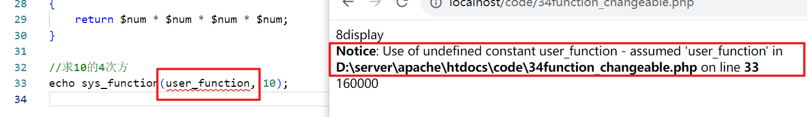

# 匿名函数

## 基本概念

匿名函数：没有名字的函数


基本语法：

```php
变量名 = function() {
	// 函数体
};
```


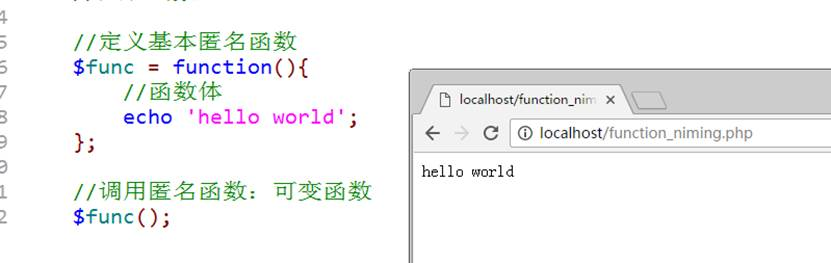


变量保存匿名函数，本质得到的是一个对象（Closure）

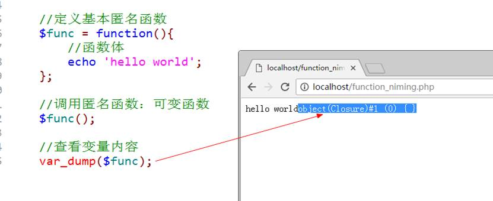

 ```php
 <?php
 
 //匿名函数
 
 //定义基本匿名函数
 $func = function () {
 	//函数体
 	echo 'hello world';
 };
 
 //调用匿名函数：可变函数
 $func();
 
 //查看变量内容
 var_dump($func);
 ```

## 闭包

闭包：closure， 一词来源于以下两者的结合：要执行的代码块（由于自由变量被包含在代码块中，这些自由变量以及它们引用的对象没有被释放）和为自由变量提供绑定的计算环境（作用域）


简单理解：函数内部有一些局部变量（要执行的代码块）在函数执行之后没有被释放，是因为在函数内部还有对应的函数在引用（函数的内部函数：匿名函数）

 

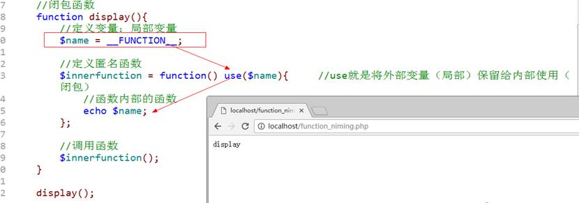

 

证明：函数的局部变量在函数使用完之后没有被释放？

1. 使用内部匿名函数；

2. 匿名函数使用句变量：`use`；

3. 匿名函数被返回给外部使用；

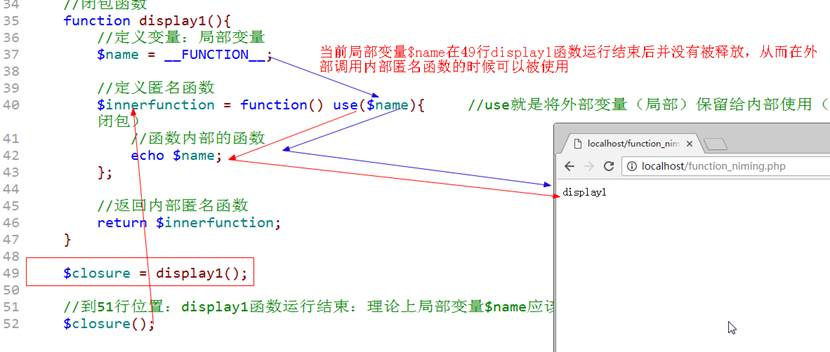

```php
//闭包函数
function display1()
{	//定义变量：局部变量
	$name = __FUNCTION__;

	//定义匿名函数
	$innerfunction = function () use ($name) {		//use就是将外部变量（局部）保留给内部使用（闭包）
		//函数内部的函数
		echo $name;
	};
	//返回内部匿名函数
	return $innerfunction;
}

$closure = display1();

//到此行位置：display1函数运行结束：理论上局部变量$name应该已经被释放
$closure();		// display1
```


# 伪类型

伪类型：假类型，实际上在PHP中不存在的类型。但是通过伪类型可以帮助程序员去更好的查看操作手册从而更方便学习。


伪类型主要有两种：在三大类八小类之外


`mixed`：混合的，可以是多种PHP中的数据类型

`number`：数值的，可以是任意数值类型（整形和浮点型）

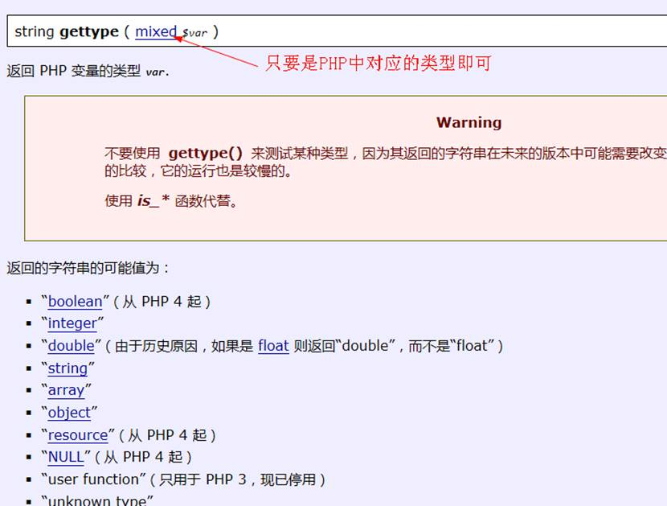

