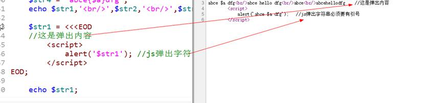
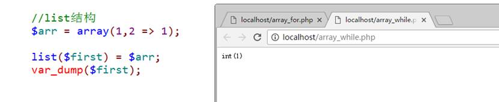

# 常用系统函

## 1）有关输出的函数

`print()`：类似于`echo`输出提供的内容，本质是一种结构（不是函数），返回`1`，可以不需要使用括号

`print_r()`：类似于`var_dump`，但是比`var_dump`简单，不会输出数据的类型，只会输出值（数组打印使用比较多）


```php
<?php

//系统函数

//输出相关
echo print('hello world<br/>');
print 'hello world<br/>';

$a = 'hello world<br/>';
print_r($a);
```


## 2）有关时间的函数

`date()`：按照指定格式对对应的时间戳（从1970年格林威治时间开始计算的秒数），如果没有指定特定的时间戳，那么就是默认解释当前时间戳


`time()`：获取当前时间对应的时间戳


`microtime()`：获取微秒级别的时间


`strtotime()`：按照规定格式的字符串转换成时间戳


```php
//处理脚本让浏览器按照指定字符集解析的方法
header('Content-type:text/html;charset=utf-8');
//时间函数
echo date('Y 年 m 月 d 日 H:i:s', 12345678), '<br/>';
echo time(), '<br/>';
echo microtime(), '<br/>';

echo strtotime('tomorrow 10 hours');
```


## 3）有关数学的函数

`max()`：指定参数中最大的值

`min()`：比较两个数中较小的值

`rand()`：得到一个随机数，指定区间的随机整数

`mt_rand()`：与rand一样，只是底层结构不一样，效率比rand高（建议使用）

`round()`：四舍五入

`ceil()`：向上取整

`floor()`：向下取整

`pow()`：求指定数字的指定指数次结果：`pow(2,8) == 2^8 == 256`

`abs()`：绝对值

`sqrt()`：求平方根

## 4）有关函数的函数

`function_exists()`：判断指定的函数名字是否在内存中存在（帮助用户不去使用一个不存在的函数，让代码安全性更高）

`func_get_arg()`：在自定义函数中去获取指定数值对应的参数（第几个）

`func_get_args()`：在自定义函数中获取所有的参数（数组）（对应实参数量）

`func_num_args()`：获取当前自定义函数的参数数量（对应实参数量）


```php
echo '<hr/><pre>';
//函数相关函数
function test($a, $b)
{
	//获取指定参数
	var_dump(func_get_arg(1)); // 获取第一个参数

	//获取所有参数
	var_dump(func_get_args());

	//获取参数数量
	var_dump(func_num_args());
}

//调用函数
function_exists('test') && test(1, '2', 3, 4);
```


# 错误处理

错误处理：指的是系统（或者用户）在对某些代码进行执行的时候，发现有错误，就会通过错误处理的形式告知程序员。

## 错误分类

1）语法错误：用户书写的代码不符合PHP的语法规范，语法错误会导致代码在编译过程中不通过，所以代码不会执行（`Parse error`）

2）运行时错误：代码编译通过，但是代码在执行的过程中会出现一些条件不满足导致的错误（`runtime error`）

3）逻辑错误：程序员在写代码的时候不够规范，出现了一些逻辑性的错误，导致代码正常执行，但是得不到想要的结果

```php
$a = 10;
If($a = 1){     //最常见把比较符号写成赋值符号
    //执行代码   
}
```


## 错误代号

所有看到的错误代号在PHP中都被定义成了系统常量（可以直接使用）

1）系统错误：

`E_PARSE`：编译错误，代码不会执行

`E_ERROR`：`fatal error`，致命错误，会导致代码不能正确继续执行（出错的位置断掉）

`E_WARNING`：`warning`，警告错误，不会影响代码执行，但是可能得到意想不到的结果

`E_NOTICE`：`notice`，通知错误，不会影响代码执行

2）用户错误：`E_USER_ERROR`,` E_USER_WARNING`, `E_USER_NOTICE`

用户在使用自定义错误触发的时候，会使用到的错误代号（系统不会用到）

3）其他：`E_ALL`，代表着所有从错误（通常在进行错误控制的时候使用比较多），建议在开发过程中（开发环境）使用

 

所有以E开头的错误常量（代号）其实都是由一个字节存储，然后每一种错误占据一个对应的位，如果想进行一些错误的控制，可以使用位运算进行操作

排除通知级别notice：`E_ALL & ~ E_NOTICE`

只要警告和通知：`E_WARNING | E_NOTICE`


## 错误触发

程序运行时触发：系统自动根据错误发生后，对比对应的错误信息，输出给用户：主要针对**代码的语法错误和运行时错误**。


人为触发：知道某些逻辑可能会出错，从而使用对应的判断代码来触发响应的错误提示

`trigger_error(错误提示);`：


 

可以通过第二个参数进行严格性控制


```php
//处理脚本让浏览器按照指定字符集解析的方法
header('Content-type:text/html;charset=utf-8');

//除法运算
$a = 100;
$b = 0;
if ($b == 0) {
	//人为触发错误
	trigger_error('除数不能为0！');				//默认notice，会继续执行
	trigger_error('除数不能为0！', E_USER_ERROR); //默认error，代码不会执行
}
echo $a / $b;
echo 'hello ';
```


# 错误显示设置

错误显示设置：哪些错误该显示，以及该如何显示


在PHP中，其实有两种方式来设置当前脚本的错误处理


1、 PHP的配置文件：全局配置：`php.ini`文件

`display_errors`：是否显示错误

`error_reporting`：显示什么级别的错误


```ini
; Default Value: E_ALL & ~E_NOTICE & ~E_STRICT & ~E_DEPRECATED
; Development Value: E_ALL 开发环境，显示所有错误
; Production Value: E_ALL & ~E_DEPRECATED & ~E_STRICT 生产环境，显示部分错误
; http://php.net/error-reporting
error_reporting = E_ALL

; Default Value: On
; Development Value: On 显示错误
; Production Value: Off 不显示错误
; http://php.net/display-errors
display_errors = On
```


2、 可以在运行的PHP脚本中去设置：**在脚本中定义的配置项级别比配置文件高**（通常在开发当中都会在代码中去进行控制和配置）

`error_reporting()`：设置对应的错误显示级别（写值是设置，不写值表示获取当前系统设定的错误信息）

`ini_set(‘配置文件中的配置项’,配置值)`

```php
ini_set(‘error_reporting’,E_ALL);
ini_set(‘display_errors’,1); // On / Off 写 1 也可以
```


# 错误日志设置

>  在实际生产环境中，不会直接让错误赤裸裸的展示给用户：
>
> 1、 不友好
>
> 2、 不安全：错误会暴露网站很多信息（路径、文件名）

所以在生产环境中，一般不显示错误（错误也比较少），但是不可能避免会出现错误（测试的时候不会发现所有的问题），这个时候不希望看到，但是又希望捕捉到可以让后台程序员去修改：需要保存到日志文件中，需要在PHP配置文件中或者代码中（`ini_set`）设置对应`error_log`配置项

> 文件位置：`D:/server/php5/php.ini`

1、 开启日志功能


 

2、指定路径


```ini
;error_log = php_errors.log 指定文件路径，低级错误放到日志文件中，方便后端维护
; Log errors to syslog (Event Log on NT, not valid in Windows 95).
;error_log = syslog
error_log = 'D:/server/php5/php_errors.log'
```


# 自定义错误处理

最简单的错误处理：`trigger_errors()`函数，但是该函数不会阻止系统报错


PHP系统提供了一种用户处理错误的机制：用户自定义错误处理函数，然后将该函数增加操系统错误处理的句柄中，然后系统会在碰到错误之后，使用用户定义的错误函数。


1. 如何将用户自定义的函数放到系统中？`set_error_handler()`

   参数1：回调函数，用户自定义的函数

   参数2：错误级别

2. 自定义错误处理函数，系统有要求


代码实现：

1、 自定义错误处理函数：注意参数


 

2、 注册自定义函数：修改错误处理机制


 

当前属于简单自定义模式，如果要复杂，可以在某些影响代码功能的错误发生后，让用户跳转到某个指定界面。

```php
<?php
// 自定义错误处理机制
// 设置响应头，确保以 UTF-8 编码输出。 
header('Content-type:text/html;charset=utf-8');

/**
 * @name 自定义的错误处理函数
 * @param $errno	错误代码：E_ALL，E_NOTICE..
 * @param $errstr	错误信息
 * @param $errfile	发生错误的文件
 * @param $errline	发生错误的行号
 */
function my_error($errno, $errstr, $errfile, $errline)
{	// 通过判断当前错误代码是否在错误报告级别中，来确定是否处理该错误。如果错误代码不在错误报告级别中，表示该错误不需要处理，直接返回  false 
	//判断：当前会碰到错误有哪些（排除当前本身系统就要排除的错误）
	// error_reporting相当于获得了当前所有error类型的列表，然后用error_number和他比较
	if (!(error_reporting() & $errno)) { // `&`：按位与，两个位都为1，结果为1，否则为0
		return false; // 当前所有error类型的列表中，没有系统提供的错误代码，直接return
		//error_reporting没有参数代表获取当前系统错误处理对应的级别
	}

	//开始判断错误类型（错误匹配）
	// 根据不同的错误类型，执行相应的错误处理操作。根据错误代码的不同，输出相应的错误信息
	switch ($errno) {
		case E_ERROR:
		case E_USER_ERROR:
			echo 'fatal error in file ' . $errfile . ' on line ' . $errline . '<br/>';
			echo 'error info ：' . $errstr;
			break;
		case E_WARNING:
		case E_USER_WARNING:
			echo 'Warning in file ' . $errfile . ' on line ' . $errline . '<br/>';
			echo 'error info ：' . $errstr;
			break;
		case E_NOTICE:
		case E_USER_NOTICE:
			echo 'Notice in file ' . $errfile . ' on line ' . $errline . '<br/>';
			echo 'error info ：' . $errstr;
			break;
	}
	return true;
}

//报错
echo $a;

// 修改错误机制
// 将自定义的错误处理函数设置为全局错误处理函数。这意味着在后续发生错误时，会调用  my_error  函数来处理错误
set_error_handler('my_error');

// 故意引发错误的语句，因为变量  $a  未定义，会触发一个  E_NOTICE  错误
// 前面设置了自定义错误处理函数，所以这里的错误会被传递给  my_error  函数进行处理
echo $a;
```

> # 解惑
>
> ## 详细解释 `!(error_reporting() & $errno)` 是怎么处理的
>
> 在这段代码中， `!(error_reporting() & $errno)`  是一个条件判断语句，用于确定是否处理特定的错误。
>
> 首先，让我们了解一下  `error_reporting()`  函数。它用于获取当前的错误报告级别，即当前设置的错误处理模式。错误报告级别是一个位掩码，由不同的错误常量组成，每个常量代表一种错误级别。
>
> 接下来，我们看到  `&`  运算符，它是按位与运算符。当两个位都为 1 时，结果为 1，否则为 0。
>
> 在这个条件判断语句中， `error_reporting() & $errno`  的含义是将当前的错误报告级别与给定的错误代码  `$errno`  进行按位与运算。如果结果为 0，则表示当前的错误报告级别中不包含给定的错误代码。
>
> 最后，我们看到  `!`  运算符，它是逻辑非运算符。它会将结果取反，即如果  `error_reporting() & $errno`  的结果为 0，则  `!(error_reporting() & $errno)`  的结果为 true，表示当前的错误报告级别中不包含给定的错误代码，因此不需要处理该错误。
>
> 总结起来， `!(error_reporting() & $errno)`  的作用是判断当前的错误报告级别中是否包含给定的错误代码  `$errno` 。如果不包含，则表示该错误不需要处理，返回 true；否则，需要处理该错误，返回 false。
>
> ## 32767 怎么和 8 进行按位与运算
>
> 要将整数 32767 和整数 8 进行按位与运算，可以使用位运算符  `&` 。按位与运算符会对两个操作数的每个对应位执行逻辑与操作，只有当两个位都为 1 时，结果位才为 1，否则为 0。
>
> 在这个例子中，将整数 32767 和整数 8 进行按位与运算的代码如下：
> $result = 32767 & 8;
> echo $result;
> 在上述代码中， `&`  运算符将整数 32767 和整数 8 进行按位与运算，并将结果存储在变量  `$result`  中。然后，通过  `echo`  语句输出结果。
>
> 按位与运算的结果将是 8，因为 32767 的二进制表示为  `0111111111111111` ，而 8 的二进制表示为  `0000000000001000` 。按位与运算后，只有第四位是 1，其他位都是 0，因此结果为 8。
>
> 请注意，这是一个通用的按位与运算示例，不限于特定的编程语言。在大多数编程语言中，按位与运算符的使用方式和结果都是相似的。
>
> > 函数被触发后，代码中的：
> >
> > `error_reporting()`为 `32767` ，二进制表示为 `0111111111111111` （`0`：符号位，为正数），意为系统要处理所有错误类型。
> >
> > `$errno` 为 `8`，二进制表示为 `0000000000001000`，表示该种错误类型。
> >
> > `&`：按位与，两个位都为1，结果为1，否则为0，所以与运算后，结果就是`8`
> >
> > `!`：逻辑非，结果为`false`；

# 字符串类型

# 字符串定义语法

1）单引号字符串：使用单引号包裹

2）双引号字符串：使用双引号包裹


```php
<?php

//PHP字符串：定义
header('Content-type:text/html;charset=utf-8');

//引号定义
$str1 = 'hello';
$str2 = "hello";
var_dump($str1, $str2);
```


引号方式：比较适合定义那些比较短（不超过一行）或者没有结构要求的字符串

如果有结构要求，或者内容超过一行，可以使用以下两种结构定义

3）`nowdoc`字符串：没有单引号的单引号字符串

```php
$str = <<<'边界符'
  字符串内容
边界符;
```


4）`heredoc`字符串：没有双引号的双引号字符串

```php
$str = <<<边界符
  字符串内容
边界符;
```


`heredoc和nowdoc`比`引号`还是要区别多一点


```php
//结构化定义
//heredoc结构
$str3 = <<<EOD
		hello
			world
EOD;

//nowdoc结构
$str4 = <<<'EOD'
		hello
			world
EOD;

var_dump($str3, $str4);
```


# 字符串转义

转义的含义：在计算机通用协议中，有一些特定的方式定义的字母，系统会特定处理：通常这种方式都是使用`反斜杠+字母（单词）`的特性：

`\r\n`：回车换行

 

PHP在识别转义字符的时候也是使用同样的模式：`反斜杠+字母`

 

在PHP中系统常用的转义符号：

`\'`：在单引号字符串中显示单引号

`\"`：在双引号字符串中显示双引号

`\r`：代表回车（理论上是回到当前行的首位置）

`\n`：代表新一行

`\t`：类似tab键，输出4个空格

`\$`：在PHP中使用$符号作为变量符号，因此需要特定识别


### 单引号和双引号的区别

1. 单引号中能够识别`\'`，而双引号中就不能识别`\'`（下图浏览器查看的是页面源代码）

   

   ```php
   echo '<hr/><pre>';
   
   //定义字符串识别转义符号
   $str1 = 'abc\r\ndef\t\'\"\$fg';
   $str2 = "abc\r\ndef\t\'\"\$fg";
   
   echo $str1,'<br/>',$str2;
   ```

   

2. 双引号中因为能够识别 `$` 符号，所以**双引号中可以解析变量**，而单引号不可以双引号中变量识别的规则

   - 变量本身系统能够与后面的内容区分：应该保证变量的独立性，不要让系统难以区分

     

   - 使用变量专业标识符（区分），给变量加上一组大括号`{}`

     

   ```php
   $a = 'hello';
   // //变量识别
   $str1 = 'abce $a dfg';	// 单引号不能解析变量
   $str2 = "abce $a dfg";	// 双引号能解析变量（使用空格区分，不推荐）
   $str3 = "abce$adfg";	// 不区分，解析变量adfg
   $str4 = "abce{$a}dfg";	// 使用专业标识符 {} 区分，推荐
   echo $str1, '<br/>', $str2, '<br/>', $str3, '<br/>', $str4;
   ```

   ```php
   // 两种写法等效
   $str4 = "abce{$a}dfg";
   $str5 = "abce${a}dfg";
   ```

   

### 结构化定义字符串变量的规则

1. 结构化定义字符串对应的边界符有条件：

   - 上边界符后面不能跟任何内容（包括注释、空格）；
   - 下边界符必须顶格：最左边；
   - 下边界同样后面只能跟分号，不能跟任何内容；

2. 结构化定义字符串的内部（边界符之间）的所有内容都是字符串本身

   ```php
   // 提示框弹出：hello
   // 页面打印:	//这是弹出内容
   header('Content-type:text/html;charset=utf-8');
   $str2 = 'hello';
   $str1 = <<<EOD
   	//这是弹出内容
   	<script>
   		alert('$str2');	// js弹出字符串必须要有引号
   	</script>
   EOD;
   
   echo $str1;
   ```

   

# 字符串长度问题

1. 基本函数`strlen()`：得到字符串的长度（字节为单位）

   ```php
   <?php
   
   //字符串长度
   header('Content-type:text/html;charset=utf-8');
   
   //定义字符串
   $str1 = 'abcefjdoifaoi';
   $str2 = '你好中国123';		// 中文在utf8字符集中占3个字节
   
   echo strlen($str1), '<br/>', strlen($str2);
   ```

2. 多字节字符串的长度问题：包含中文的长度

   - 多字节字符串扩展模块：`mbstring`扩展（mb：Multi Bytes）

     首先需要加载PHP的mbstring扩展（位置：`D:/server/php5/php.ini`）

     

     **重启阿帕奇**

     可以使用mb扩展带来很多函数`mbstring`扩展针对的是一些关于字符统计：`strlen`只是针对标准交换码`ASCII`(阿斯克码)，`mbstring`会针对不同的字符集（默认是阿斯克码)

     用途：统计字符个数，一篇很长的文章，获取简讯（截取其中的一部分），必须要通过这种方式，不然截取出来很有可能是乱码（虽然可以通过计算去做，但有了这个方法后，会方便很多）。

     

     ```php
     <?php
     
     //字符串长度
     header('Content-type:text/html;charset=utf-8');
     
     //定义字符串
     $str1 = 'abcefjdoifaoi';
     $str2 = '你好中国123';		// 中文在utf8字符集中占3个字节
     
     echo strlen($str1), '<br/>', strlen($str2);
     
     echo '<hr/>';
     //使用mbstring扩展
     echo mb_strlen($str1), '<br/>', mb_strlen($str2), '<br/>', mb_strlen($str2, 'utf-8');
     ```

     

     

 

# 字符串相关函数

1. 转换函数：`implode()`, `explode()`, `str_split()`

   `implode([连接方式,] 数组)`：将数组中的元素按照某个规则连接成一个字符串

   `explode(分割字符, 目标字符串)`：将字符串按照某个格式进行分割，变成数组

   `'中国|北京|顺义'` ==》 `array(‘中国’,‘北京’,’顺义’);`

   `str_split(字符串,字符长度)`：按照指定长度拆分字符串得到数组

2. 截取函数：`trim()`, `ltrim()`, `rtrim()`

   `trim(字符串[,指定字符])`：本身默认是用来去除字符串两边的空格（中间不行），但是也可以指定要去除的内容，是按照指定的内容循环去除两边有的内容：直到碰到一个不是目标字符为止

   `ltrim()`：去除左边的

   `rtrim()`：去除右边的

   

3. 截取函数：`substr()` `strstr()`

   `substr(字符串, 起始位置从0开始[, 长度])`：指定位置开始截取字符串，可以截取指定长度（不指定到最后）

   `strstr(字符串,匹配字符)`：从指定位置开始，截取到最后（可以用来去文件后缀名）

   `strrchr()` — 查找指定字符在字符串中的最后一次出现

   

4. 大小转换函数：`strtolower()`, `strtoupper()`, `ucfirst()`

   `strtolower`：全部小写

   `strtoupper`：全部大写

   `ucfirst`：首字母大写

   
   
   ```php
   //字符串函数
   $str = ' abcd e f ';
   
   //字符串大小写
   echo strtoupper($str),'<br/>';
   echo ucfirst($str);
   
   //字符串截取
   echo substr($str,1,3),'<br/>';
   echo strstr($str,'c');
   
   var_dump(trim($str));
   ```
   
   

5. 查找函数：`strpos()`, `strrpos()`

   `strpos(字符串，匹配字符)`：判断字符在目标字符串中出现的位置（首次）

   `strrpos(字符串，匹配字符)`：判断字符在目标字符串中最后出现的位置

   

 

6. 替换函数：`str_replace()`

   `str_replace(匹配目标,替换的内容,字符串本身)`：将目标字符串中部分字符串进行替换

   
   
   ```php
   $str = '123a234a3b2a';
   //字符串替换
   echo str_replace('a', 'b', $str);
   
   //查找位置
   echo strpos($str, 'a'), '<br/>';
   echo strrpos($str, 'a');
   ```
   
   

7. 格式化函数：`printf()`, `sprintf()`

   `printf/sprintf(输出字符串有占位符,顺序占位内容..)`：格式化输出数据

   

   ```php
   $age = 50;
   $name = 'TOM';
   
   //格式化输出
   echo sprintf("你好，今年我%d岁,我叫%s", $age, $name);
   ```

   

   

8. 其他：`str_repeat()`, `str_shuffle()`

   `str_repeat()`：重复某个字符串N次

   `str_shuffle()`：随机打乱字符串（可以做简单的验证码，打乱之后取前几个）

   
   
   ```php
   //其他字符串函数
   $str = 'abcdefg';
   
   echo str_repeat($str, 5), '<br/>';
   echo str_shuffle($str);
   ```
   
   

# 数组详解

# 数组的概念

数组：array，数据的组合，指将一组数据（多个）存储到一个指定的容器中，用变量指向该容器，然后可以通过变量一次性得到该容器中的所有数据。

# 数组定义语法

在PHP中系统提供多种定义数组的方式：

1. 使用array关键字：最常用的

   `$变量 = array(元素1, 元素2, 元素3..);`

   

2. 可以使用中括号来包裹数据：

   `$变量 = [元素1, 元素2…];`

3. 隐形定义数组：给变量增加一个中括号，系统自动变成数组

   ```php
   $变量[] = 值1;`   //如果不提供下标也可以，系统自动生成（数字：从0开始）
   
   $变量[下标] = 值; //中括号里面的内容称之为下标key，
   //该下标可以是字母（单词）或者数字，与变量命名的规则相似
   ```

   

```php
<?php

//PHP数组

//定义数组：array
$arr1 = array('1', 2, 'hello');
var_dump($arr1);

//定义数组：[]
$arr2 = ['1', 2, 'hello'];
var_dump($arr2);

//隐形数组：
$arr3[] = 1;
$arr3[10] = 100;
$arr3[] = '1';	// 默认下标是从当前前面最大的开始（自动，所以这里是11）
$arr3['key'] = 'key';
$arr3[1] = 'value';
var_dump($arr3);
```


# PHP数组特点

1. 可以是**整数**下标或者**字符串**下标

   如果数组下标都为整数：索引数组

   如果数组下标都为字符串：关联数组

2. 不同下标可以混合存在：混合数组

3. 数组元素的顺序以放入顺序为准，跟下标无关

   

4. 数字下标的自增长特性：从0开始自动增长，如果中间手动出现较大的，那么后面的自增长元素从最大的值+1开始

5. 特殊值下标的自动转换

   布尔值：`true`和`false`

   空：`NULL`

   

   ```php
   //特殊下标转换
   $arr4[false] = false;
   $arr4[true] = true;
   $arr4[NULL] = NULL;
   var_dump($arr4);
   ```

   > 告诉我们，php数组中，不要用一些特殊的数据/值来做下标，要用正确的数字、字母、字符串。

6. PHP中数组元素没有类型限制

7. PHP中数组元素没有长度限制

 

> 补充：PHP中的数组是很大的数据，所以存储位置是**堆区**，为当前数组分配一块连续的内存。

# 多维数组

多维数组：数组里面的元素又是数组

## 二维数组

二维数组：数组中所有的元素都是一维数组


```php
<?php

//多维数组

//定义二维数组
$info = array(
	array('name' => 'Jim', 'age' => 30),
	array('name' => 'Tom', 'age' => 28),
	array('name' => 'Lily', 'age' => 20)
	//最后一个元素，后面可以跟逗号不影响（不建议）
);

echo '<pre>';
print_r($info);
```


## 多维数组

在第二维的数组元素中可以继续是数组，在PHP中没有维度限制（PHP本质并没有二维数组）

 

但是：不建议使用超过三维以上的数组，会增加访问的复杂度，降低访问效率。

## 异形数组（不规则数组）

异形数组：数组中的元素不规则，有普通基本变量也有数组。

在实际开发中，并不常用，尽量让数组元素规则化（便于进行访问）

# 数组遍历

## 遍历的基本含义

数组遍历：普通数组数据的访问都是通过数组元素的下标来实现访问，如果说数组中所有的数据都需要依次输出出来，就需要我们使用到一些简化的规则来实现自动获取下标以及输出数组元素。

```php
$arr = array(0=>array(‘name’ => ‘Tom’),1=>array(‘name’ => ‘Jim’));   //二维数组

//访问一维元素：$arr[一维下标]
$arr[0];  //结果：array(‘name’ => ‘Tom’);

//访问二维元素：$arr[一维下标][二维下标]
$arr[1][‘name’];    //Jim
```


## `foreach`遍历语法

基本语法如下：

```php
foreach($数组变量 as [$下标 =>] $值) {
    //通过$下标访问元素的下标；通过$值访问元素的值
}
```


通常：如果是关联数组（字母下标），就需要下标，如果是数字下标就直接访问值


获取下标


```php
<?php

//PHP数组遍历：foreach

//定义数组
$arr = array(1, 2, 3, 4, 5, 6, 7, 8, 9, 10);

//foreach循环
foreach ($arr as $v) {
	//$v随意命名
	echo $v, '<br/>';
}

//foreach循环
foreach ($arr as $k => $v) {
	//$v随意命名
	echo 'key:', $k, ' == value:', $v, '<br/>';
}
```


在进行数据存储定义的时候，通常二维数组不会两个维度的key下标都为数字，一般是一维为数字（无意义），二维为字符串（数据库表字段），所以在进行遍历的时候，通常是只需要针对一维进行遍历，取得二维数组元素，然后二维数组元素通过下标去访问。


```php
$arr = array(
	0 => array('name' => 'Tom', 'age' => 30),
	1 => array('name' => 'Jim', 'age' => 28)
);

//通过foreach遍历一维元素
foreach ($arr as $value) {
	//1、可以继续遍历：增加foreach遍历$value
	//2、可以使用下标访问
	echo 'name is : ', $value['name'], ' and age is : ', $value['age'], '<br/>';
}
```


## `foreach`遍历原理

 `foreach`遍历的原理：本质是数组的内部有一颗指针，默认是指向数组元素的第一个元素，`foreach`就是利用指针去获取数据，同时移动指针。


```php
foreach($arr as $k => $v) {
    //循环体
}
```

1. foreach会重置指针：让指针指向第一个元素；

2. 进入foreach循环：通过指针取得当前第一个元素，然后将下标取出放到对应的下标变量`$k`中（如果存在），将值取出来放到对应的值变量`$v`中；（指针下移）

3. 进入到循环内部（循环体），开始执行；

4. 重复2和3，直到在2的时候遇到指针取不到内容（指针指向数组最后，【最后一个元素的后面】）

# 数组遍历

## `for`循环遍历数组

`for`循环：基于已知边界条件（起始和结束）然后有条件的变化（规律）

因此：for循环遍历数组有对应条件

1. 获取数组长度：`count(数组)`得到数组元素的长度

2. 要求数组元素的下标是规律的数字


```php
<?php

//for循环遍历数组
//数组特点：索引数组，下标规律
$arr = array(1, 2, 3, 4, 5, 6, 7, 10);

for ($i = 0, $len = count($arr); $i < $len; $i++) {
	echo 'key is : ', $i, ' and value is : ', $arr[$i], '<br/>';
}
```


## `while`配合`each`和`list`遍历数组

> `each`：PHP 7.2.0  起被*废弃*，并自 PHP 8.0.0 起被*移除*。

`while`是在外部定义边界条件，如果要实现可以和for循环一样。

 

`each`函数使用：each能够从一个数组中获取当前数组指针所指向的元素的下标和值，拿到之后将数组指针下移，同时将拿到的元素下标和值以一个四个元素的数组返回：

0下标 – 》 取得元素的下标值

1下标 - 》 取得元素的值

Key下标 – 》取得元素的下标值

Value下标 – 》取得元素的值


 

如果each取不到结果（数组指针移动到最后），返回false


 

`list`函数使用：list是一种结构，不是一种函数（没有返回值），是list提供一堆变量去从一个数组中取得元素值，然后依次存放到对应的变量当中（批量为变量赋值：值来源于数组）：`list`必须从索引数组中去获取数据，而且必须从0开始。

正确操作：



 

错误操作：变量多于数组元素，没有指定从0到指定变量的下标的数组元素。因为$second变量对应的下标是1，但是数组中没有下标是1


```php
//list结构
$arr = array(1, 2 => 1); // 下标0：1，下标2：1

list($first) = $arr;
//list($first,$second) = $arr;	//错误：second变量对应的下标为元素下标1的，但是数组没有
//var_dump($first,$second);
```


List与each配合特别好：each一定有两个元素就是0和1下标元素

List(变量1,变量2) = each(数组);      //是一种赋值运算，但是可以得到false结果（each取不到正确的结果），整个表达式为false


 

 