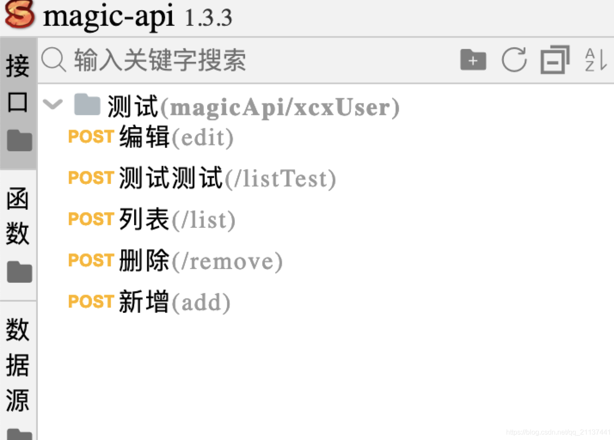
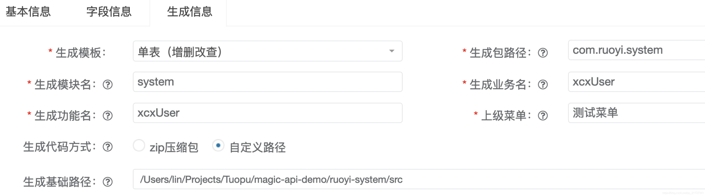
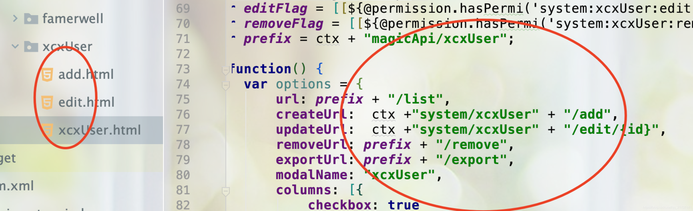
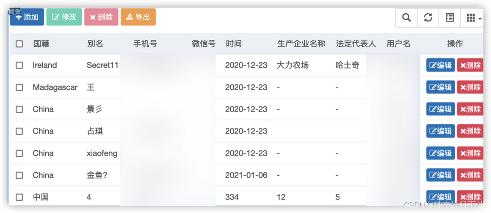
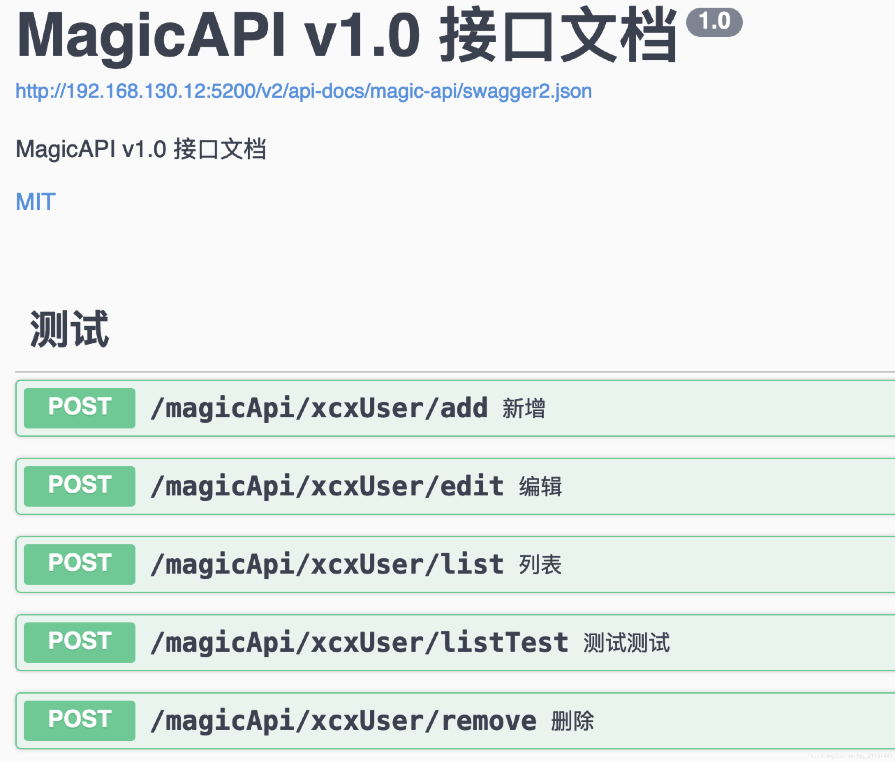

# 框架整合magic-api增删改查Demo

## 1.目录结构


## 2.创建分页Bean

```java
package com.ruoyi.web.controller.common;

import org.ssssssss.magicapi.model.JsonCode;

/**
 * @ClassName JsonBackBean
 * @Author Lin
 * @Date 2021/7/16 10:55 AM
 * @Version V1.0
 * @Description
 **/
    public class PageJsonBackBean<T> {
    private int code;
    private long total;
    private String msg;
    private T rows;
    private long timestamp;
    private Integer executeTime;

    public PageJsonBackBean(int code, String msg) {
        this.code = 1;
        this.msg = "success";
        this.timestamp = System.currentTimeMillis();
        this.code = code;
        this.msg = msg;
    }

    public PageJsonBackBean(int code, String msg, T rows, Integer executeTime) {
        this(code, msg, rows);
        this.executeTime = executeTime;
    }

    public PageJsonBackBean(long total,int code, String msg, T rows, Integer executeTime) {
        this.total=total;
        this.code = 1;
        this.msg = "success";
        this.timestamp = System.currentTimeMillis();
        this.code = code;
        this.msg = msg;
        this.rows = rows;
        this.executeTime = executeTime;

    }
    public PageJsonBackBean(int code, String msg, T rows) {
        this.code = 1;
        this.msg = "success";
        this.timestamp = System.currentTimeMillis();
        this.code = code;
        this.msg = msg;
        this.rows = rows;
    }

    public PageJsonBackBean() {
        this.code = 1;
        this.msg = "success";
        this.timestamp = System.currentTimeMillis();
    }

    public PageJsonBackBean(JsonCode jsonCode) {
        this(jsonCode, (T) null);
    }

    public PageJsonBackBean(JsonCode jsonCode, T rows) {
        this(jsonCode.getCode(), jsonCode.getMessage(), rows);
    }

    public PageJsonBackBean(T rows) {
        this.code = 1;
        this.msg = "success";
        this.timestamp = System.currentTimeMillis();
        this.rows = rows;
    }


    public long getTotal() {
        return total;
    }
     
    public void setTotal(long total) {
        this.total = total;
    }
     
    public int getCode() {
        return this.code;
    }
     
    public void setCode(int code) {
        this.code = code;
    }
     
    public String getMsg() {
        return this.msg;
    }
     
    public void setMsg(String msg) {
        this.msg = msg;
    }
     
    public T getrows() {
        return this.rows;
    }
     
    public void setrows(T rows) {
        this.rows = rows;
    }
     
    public long getTimestamp() {
        return this.timestamp;
    }
     
    public void setTimestamp(long timestamp) {
        this.timestamp = timestamp;
    }
     
    public Integer getExecuteTime() {
        return this.executeTime;
    }
     
    public void setExecuteTime(Integer executeTime) {
        this.executeTime = executeTime;
    }
}
```
## 3.自定义json返回结果

```java
package com.ruoyi.web.controller.provider;

import com.ruoyi.web.controller.common.JsonBackBean;
import com.ruoyi.web.controller.common.PageJsonBackBean;
import org.springframework.stereotype.Component;
import org.ssssssss.magicapi.model.JsonBean;
import org.ssssssss.magicapi.model.JsonCodeConstants;
import org.ssssssss.magicapi.model.PageResult;
import org.ssssssss.magicapi.model.RequestEntity;
import org.ssssssss.magicapi.provider.ResultProvider;

/**
* @Author Lin
* @Description  自定义返回结果
* @Date 2021/7/16 4:16 PM
* @Param 
* @return 
**/
@Component
public class CustomJsonValueProvider implements ResultProvider {


	/**
	 * 构建请求结果
	 * @param requestEntity 请求相关信息
	 * @param code          状态码
	 * @param message       状态说明
	 * @param data          数据内容，可以通过data的类型判断是否是分页结果进行区分普通结果集和分页结果集
	 * @return
	 */
	@Override
	public Object buildResult(RequestEntity requestEntity, int code, String message, Object data) {
		// 分页结果
		if (data instanceof PageResult) {
			PageResult<?> pageResult = (PageResult<?>) data;
			long total = pageResult.getTotal();
			return new PageJsonBackBean(total,0,message, pageResult.getList(),1);
		}
//		if (code == JsonCodeConstants.SUCCESS.getCode()) {
//			return new JsonBackBean<>(0, message, data);
//		}
		return new JsonBean<>(code, message, data);
	}
}
```

## 4.自定义分页
```java
package com.ruoyi.web.controller.provider;
 
/**
 * @ClassName MyPageProvider
 * @Author Lin
 * @Date 2021/7/16 11:07 AM
 * @Version V1.0
 * @Description 
 **/
 
import org.springframework.stereotype.Component;
import org.ssssssss.magicapi.model.Page;
import org.ssssssss.magicapi.provider.PageProvider;
import org.ssssssss.script.MagicScriptContext;
 
/**
 * 分页对象默认提取接口
 */
@Component
public class MyPageProvider implements PageProvider {
 
    /**
     *   此方法需要根据实际情况替换
     */
    @Override
    public Page getPage(MagicScriptContext context) {
        long page = Long.valueOf(context.get("pageNum").toString());
        long pageSize = Long.valueOf(context.get("pageSize").toString());
        // 计算limit以及offset
        return new Page(pageSize, (page - 1) * pageSize);
 
    }
}
```
## 5.增加magic-api swagger配置
```yaml
# Swagger配置
swagger:
  # 是否开启swagger
  enabled: true

 

magic-api:
  web: /magic/web
  resource:
    type: database  # 配置接口存储方式，这里选择存在数据库中
    table-name: magic_api_file  # 数据库中的表名
    prefix: /magic-api  # 前缀

  swagger-config:
    # 资源名称
    name: MagicAPI
    # 资源描述
    description: MagicAPI v1.0 接口文档
    # 资源位置
    location: /v2/api-docs/magic-api/swagger2.json
    # 文档版本
    version: 1.0
    # 文档标题
    title: MagicAPI v1.0 接口文档
```
## 6.magic-api接口增删改查demo



### 新增:

```js
var sql = "INSERT INTO cgx_xcx_user( country, province, city, gender, nick_name, phone, wx_num, type, time, scqymc, tyshxydm, fadbr, idstatus, user_name) VALUES (#{country},#{province},#{city},#{gender},#{nickName},#{phone},#{wxNum},#{type},#{time},#{scqymc},#{tyshxydm},#{fadbr},#{idstatus},#{userName})"

var i = db.update(sql) 
return response.json({
    code : 0,
    msg : '新增成功',
    result : i
});
```
### 删除:

```js
//#{id}表示从请求参数或PathVariable中获取参数

var sql = "delete from cgx_xcx_user where id in (${ids})";    
var i = db.update(sql) 
return response.json({
    code : 0,
    msg : '删除成功',
    result : i
});
```
### 编辑:

```js
var sql = "UPDATE cgx_xcx_user SET  country = #{country}, province = #{province}, city = #{city}, gender = #{gender}, nick_name = #{nickName}, phone = #{phone}, wx_num = #{wxNum}, type = #{type}, time = #{time}, scqymc = #{scqymc}, tyshxydm = #{tyshxydm}, fadbr = #{fadbr}, idstatus = #{idstatus}, user_name = #{userName} WHERE id = #{id}"

var i = db.update(sql) 
return response.json({
    code : 0,
    msg : '更新成功',
    result : i
});
```
### 分页查询: 分页用db.page(sql) 不分页用db.sql(sql),传参:pageNum当前页面,pageSize 显示条数

```js
var sql = "select * from cgx_xcx_user";    
var list = db.page(sql);  //返回List

return list
```
## 7.打开若依项目生成代码菜单按如下配置生成代码,zip可生成数据库菜单sql




## 8.修改生成的前端页面保证和后台magic-api接口访问路径统一



## 

##  9.测试功能正常,数据库表字段推荐驼峰命名法



 

##  10.查看接口生成文档

http://127.0.0.1:5200/swagger-ui/index.html


