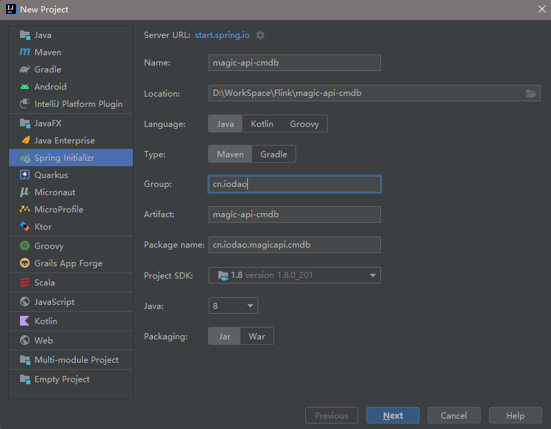
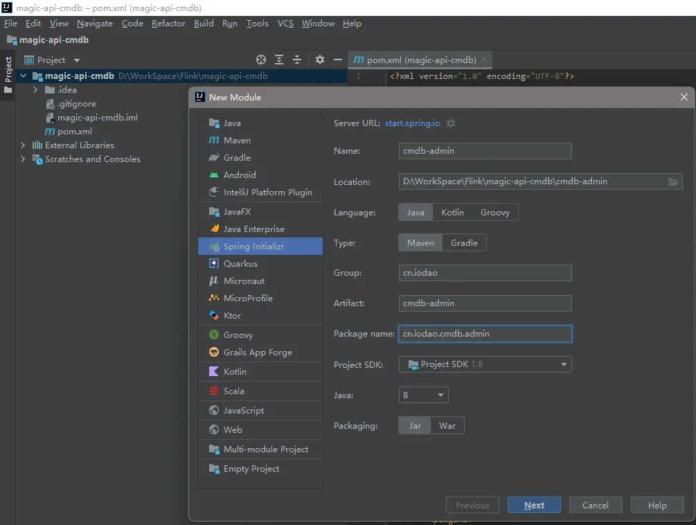
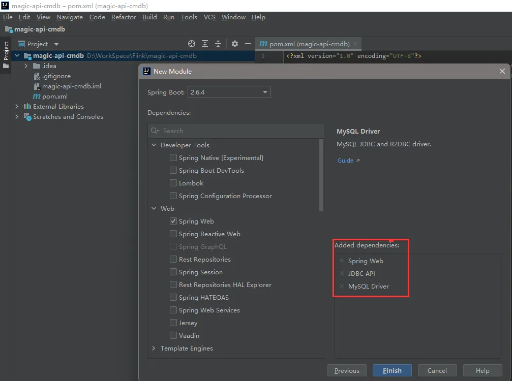
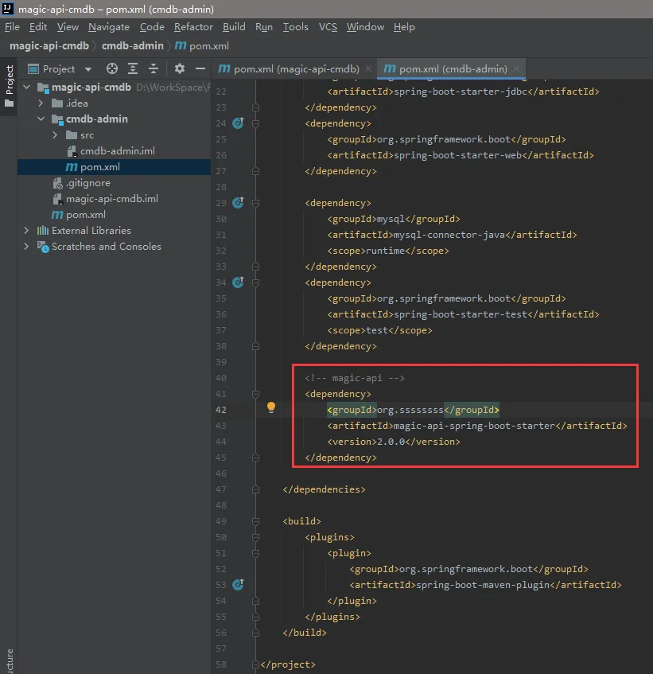
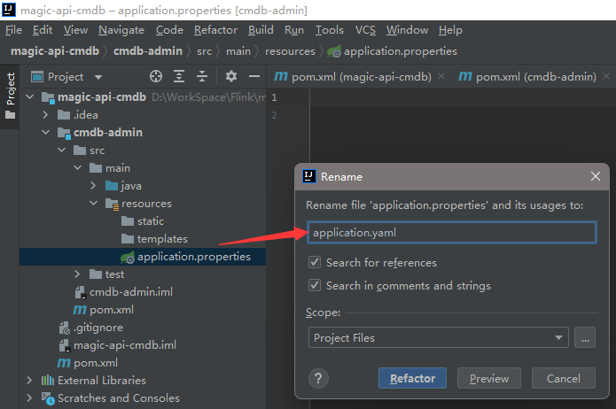
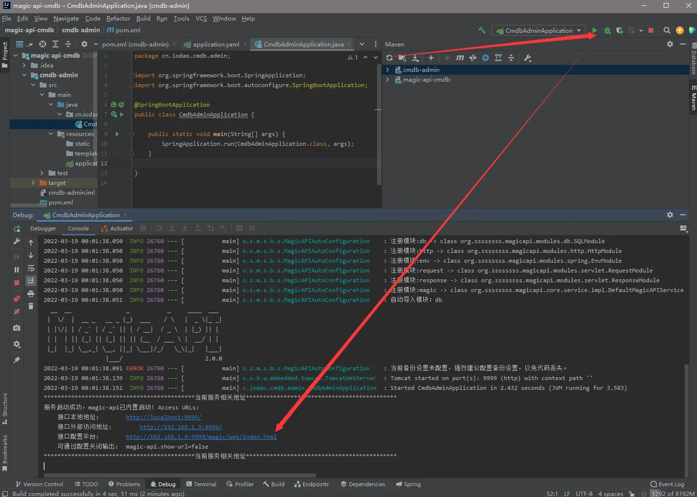
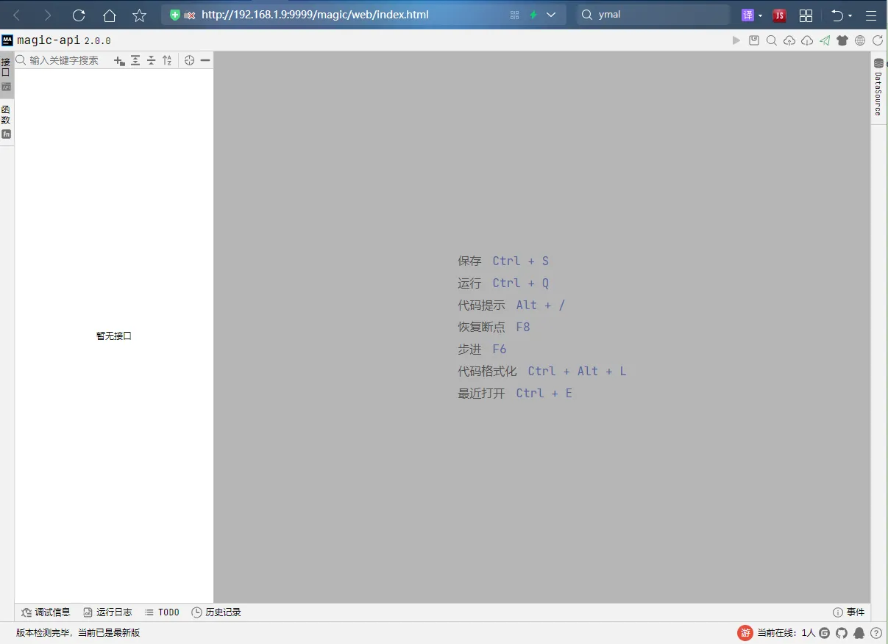
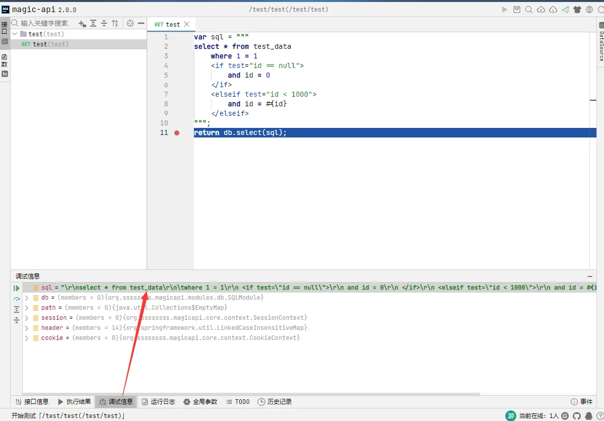

# magic-api初体验

## 简介

`magic-api`是一个基于Java的接口快速开发框架，编写接口将通过`magic-api`提供的`UI`界面完成，自动映射为`HTTP`接口。 无需定义`Controller`、`Service`、`Dao`、`Mapper`、`XML`、`VO`等Java对象即可完成常见的`HTTP API`接口开发。

[简介 |magi-api](https://www.ssssssss.org/magic-api/pages/quick/intro/)

## 1.打开IDEA,先建个空的父项目,next按钮之后直接finish



创建完成之后里面的内容都清空,留一个pom.xml和idea自身的项目文件就好,下一步我们创建一个web子模块,先将magic-api项目run起来

## 2.创建子web模块,选择web,jdbc,mysql驱动模块即可






## 3.在web子项目中添加magic-api-spring-boot-starter依赖

使其拥有魔法接口的能力,这里我们可以看出,作者是打算让magic-api可以方便的嵌入任意spring-boot-web项目中,可以尽可能小的减少原有项目的依赖影响,添加完依赖要记得reload一下maven项目,加载一下jar包

```xml
        <!-- magic-api -->
        <dependency>
            <groupId>org.ssssssss</groupId>
            <artifactId>magic-api-spring-boot-starter</artifactId>
            <version>2.0.0</version>
        </dependency>
```




再根据官网文档添加一下spirngboot配置文件,这里我们改成.yaml后缀的配置方便cv大法



```yaml
server:
  port: 9999
magic-api:
  #配置web页面入口
  web: /magic/web
  resource:
    #配置文件存储位置。当以classpath开头时，为只读模式
    #mac用户请改为可读写的目录
    #如果不想存到文件中，可以参考配置将接口信息存到数据库、Redis中（或自定义）
    location: D:/data/magic-api

spring:
  datasource:
    driver-class-name: com.mysql.jdbc.Driver
    url: jdbc:mysql://localhost:3306/magic-api-cmdb?allowMultiQueries=true&useUnicode=true&characterEncoding=UTF-8
    username: root
    password: root
```

好吧,忘记建数据库了,不建数据库起不来,建完之后,使用官放文档建表语句,建个小表

```sql
create table test_data
(
    id   bigint       not null
        primary key,
    name varchar(100) null
);
INSERT INTO test_data (id, name) VALUES (1, 'magicApi');
INSERT INTO test_data (id, name) VALUES (2, 'xiaoDong');
```

大功告成,我们启动一下瞅瞅,点击url进入web页面





都到这里了,那就抄一段脚本试试吧,....好吧,这段脚本又点儿小复杂,...额...也不复杂,跟mybatis差不多,这个<elseif>标签要好很多,都2022了,mybaits官方也不舍得支持一下,自己动手丰衣足食,作者大大,给我们实现了...

```js
var sql = """
select * from test_data
	where 1 = 1
    <if test="id == null">
        and id = 0
    </if>
    <elseif test="id < 1000">
        and id = #{id}
    </elseif>
""";
return db.select(sql);
```




"看到这里,大家知道magic-api是个什么东东了吧?"

"嗯~~~知道了~~"

"不!你不知道!!!magic-api的强大才冰山一脚,'月读'一下官文档吧,更多好用,好玩的东西等着你去体验~~"

"额~~~,我不想看文档,我想知道我刚才辛苦'写'的代码放到哪里了?"

其实前面的application.yaml配置里有写就是那段"location: D:/data/magic-api"

我们去这里找就可以了,这里默认是放在文件里的,其实也配置到数据库中,并且每次保存都是有历史记录的,至此magic-api初体验告一段落,

下一节我们会出于探访作者内心的心路历程目的,模仿官方提供的定时任务的插件的开发,来深入了解magic-api核心.