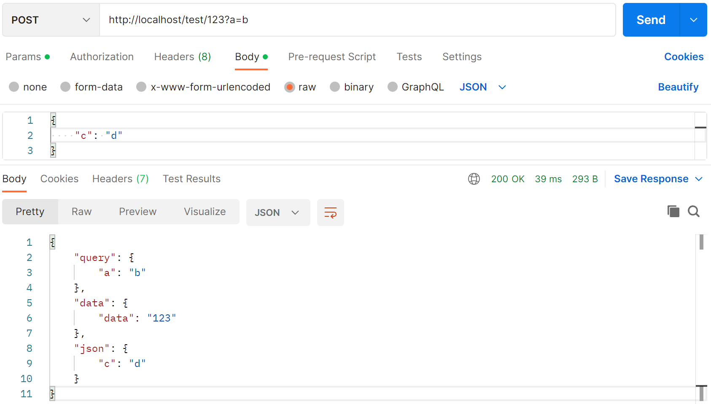
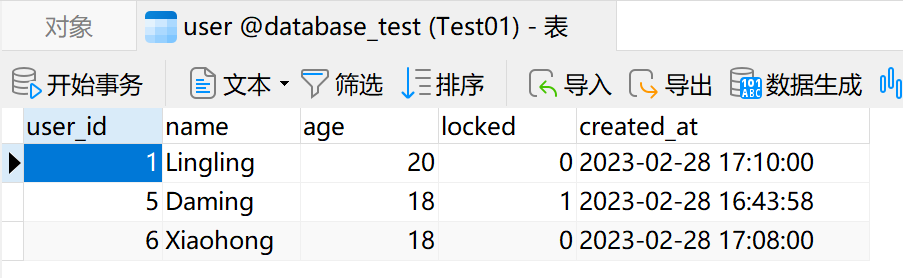
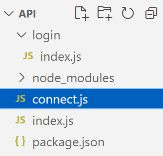
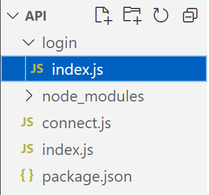
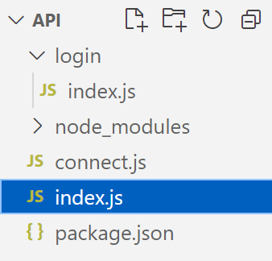

# 前端的小激动：Nodejs写简单接口教程

**Code is never die !**

这里演示的是`nodejs`+`mysql`，别的数据库也类似。

首先需要做两件事，下载`nodejs`和`mysql`安装，这些基本知识略过。

接着新建一个文件夹`api`，在此文件夹下打开`cmd`,或者`vscode`的终端，输入`node init`初始化一个项目，输入一些基本信息（`node init -y`：使用默认信息直接初始化）。

然后我们还需要安装以下js插件包到`–save`下
```json
{
  "dependencies": {
    "body-parser": "^1.20.2",
    "cookie-parser": "^1.4.6",
    "cors": "^2.8.5",
    "express": "^4.18.2",
    "multer": "^1.4.5-lts.1",
    "mysql": "^2.18.1"
  }
}
```

> `express`和`mysql`这两个包是最主要的。

## 服务器启动

在文件夹下新建一个`index.js`文件，当然别的名字也可以，这个文件是你整个程序的入口。

键入以下代码：

```js
const express = require('express');
const app = express();
app.listen(80, () => console.log('服务器启动：80'));
```

80代表的是你的端口号，然后在终端或者`cmd`输入`node index.js`，在浏览器里打开`localhost`就可以看到了，或者`127.0.0.1`也行，如果是别的端口号需要加上端口号，当然现在是什么也没有，因为我们还没有写接口。

## get接口

接下来我们写一个`get`接口，返回一个`'Hello World'`字符串

```js
const express = require('express');
const app = express();
app.listen(80, () => console.log('服务器启动：80'));

app.get('/', (req, res) => {
    res.json('Hello World');
});
```

- `res.json`这个方法是以json对象的形式返回去，还有以下方法
- `res.send`以页面的方式返回去
- `res.download`以文件的方式返回去，前端请求会下载此文件

> 别的方法这里就不在一一阐明了，可以打出res.然后使用vscode的语法提醒查看下面的方法即可，或者查看文档看解释。

接下来我们返回一个页面：

```js
const express = require('express');
const app = express();
app.listen(80, () => console.log('服务器启动：80'));

app.get('/', (req, res) => {
    res.send('<div style="color: red;">Hello World</div>');
});
```

可以看到`localhost`页面上出现了我们预期的结果

## nodejs热部署

每次改动一下都要重新跑程序，这不符合人体工程学。解决如下： 

全局安装插件： `npm install -g nodemon`，启动服务器：`nodemon index.js`

`package.json`中：(`"start": "nodemon index.js"`)

```json
{
  "name": "api",
  "version": "1.0.0",
  "description": "",
  "main": "index.js",
  "scripts": {
    "start": "nodemon index.js",
    "test": "echo \"Error: no test specified\" && exit 1"
  },
  "keywords": [],
  "author": "",
  "license": "ISC",
  "dependencies": {
    "body-parser": "^1.20.2",
    "cookie-parser": "^1.4.6",
    "cors": "^2.8.5",
    "express": "^4.18.2",
    "multer": "^1.4.5-lts.1",
    "mysql": "^2.18.1"
  }
}
```

> `scripts`的作用就是自己定义脚本命令，在这下面定义的所有命令都可以使用`npm run xxx`来运行，可以省略`run`。

然后我们就可以`npm start`运行我们的程序了，所有基于`node`的程序跑起来都是两步，`npm install`，安装所有插件，`npm start`运行程序。

## post接口

```js
const express = require('express');
const app = express();
app.listen(80, () => console.log('服务器启动：80'));

app.post('/', (req, res) => {
    res.json('Hello World');
});
```

`post`不支持浏览器直接访问，这个时候要用`postman`软件，向url地址`http://localhost/`发送`post`请求，依然符合预期。

可以把路径改为/login，/test进行尝试，这里就不再演示了。

## 全局拦截

`app.all`方法，这个方法**支持所有请求方式**，不必每个请求都写好几遍了。适合做登录拦截，接口的第一个参数可以用正则表达，我们这么写：

```js
const express = require('express');
const app = express();
app.listen(80, () => console.log('服务器启动：80'));

app.all('*', (req, res) => {
    res.json('***');
});
app.post('/test', (req, res) => {
    res.json('test');
});
```

我们使用`*`来匹配所有路径，这个时候请求`test`,会先经过`*`，被`*`拦截返回了`***`，

我们可以在内部判断来进行操作：

```js
const express = require('express');
const app = express();
app.listen(80, () => console.log('服务器启动：80'));

let login = false;

app.all('*', (req, res, next) => {
    if (!login) return res.json('未登录');
    next();
});

app.post('/test', (req, res) => {
    res.json('test');
});
```

> 如果未登录，返回`未登录`，否则，继续向下匹配，回调函数接收三个参数，最后一个是`next`，继续向下执行，`*`路径一定要写在最上面，不然会先被`test`捕捉到，`test`没有执行`next`，`*`就会捕捉不到请求。

这时候就可以设置`login`的值来看路径`localhost/test`下的返回值了。

## 传递参数

那么有参数的情况呢，我们先引入一下中间件，如果没有安装可以先npm安装：

```js
const express = require('express');
const bodyParser = require('body-parser'); // 解析参数
const app = express();
app.use(bodyParser.json()); // json请求
app.use(bodyParser.urlencoded({ extended: false })); // 表单请求
app.listen(80, () => console.log('服务器启动：80'));

let login = true;

app.all('*', (req, res, next) => {
    if (!login) return res.json('未登录');
    next();
});

app.post('/test/:data', (req, res) => {
    res.json({ query: req.query, data: req.params, json: req.body });
});
```



> 向url地址`http://localhost/test/123?a=b`发送`post`请求，`body`传参：`{ "c": "d" }`，返回数据：
>
> ```json
> {
>     "query": {
>         "a": "b"
>     },
>     "data": {
>         "data": "123"
>     },
>     "json": {
>         "c": "d"
>     }
> }
> ```
> `?`后面的表单参数会放到`req.query`里，路径上的参数会放到`req.params`里，`json`参数会放到`req.body`里，可以任意选择一种参数传递即可，路径以`:`开头表示此路径作为参数的意思。

## 跨域解决

前后端联调的时候经常碰到跨域的问题，我们可以使用`cors`插件解决。

```js
const cors = require('cors');
app.use(cors()); // 解决跨域
```

```js
const express = require('express');
const bodyParser = require('body-parser'); // 解析参数
const cors = require('cors');
const app = express();
app.use(bodyParser.json()); // json请求
app.use(bodyParser.urlencoded({ extended: false })); // 表单请求
app.use(cors()); // 解决跨域
app.listen(80, () => console.log('服务器启动：80'));

let login = true;

app.all('*', (req, res, next) => {
    if (!login) return res.json('未登录');
    next();
});

app.post('/test/:data', (req, res) => {
    res.json({ query: req.query, data: req.params, json: req.body });
});
```

以上提到的跨域和参数都可以自己进行处理，利用路径自己提取参数，在*路径的请求的请求体req里自己加上跨域允许的header，但我希望你们可以使用插件，保证代码的简洁性。

## 数据库连接

接下来我们开始连接数据库，从数据库里拿一条数据出来返回给前端。

引入`mysql`插件，我们先在`mysql`里新建一个表`user`，存入以下数据：

然后使用`mysql`插件连接数据库：

```js
const express = require('express');
const bodyParser = require('body-parser'); // 解析参数
const cors = require('cors');
const mysql = require('mysql');
const app = express();
app.use(bodyParser.json()); // json请求
app.use(bodyParser.urlencoded({ extended: false })); // 表单请求
app.use(cors()); // 解决跨域
app.listen(80, () => console.log('服务器启动：80'));

const option = {
    host: 'localhost',
    user: 'root',
    password: '123456',         // 密码
    port: '3306',               // 数据库的端口
    database: 'database_test',  // 数据库名
    connectTimeout: 5000,       // 连接超时
    multipleStatements: false   // 是否允许一个query中包含多条sql语句
}

const conn = mysql.createConnection(option);

app.get('/login', (req, res) => {
    conn.query('SELECT * FROM `user`', (e, r) => res.json(new Result({ data: r })));
});

function Result({ code = 1, msg = '', data = {} }) {
    this.code = code;
    this.msg = msg;
    this.data = data;
}
```

> `option`里都是连接数据库的基本配置，更多参数可以查看文档，我们请求一下`localhost/login`看看
> 
> `conn.query`就是执行一条sql语句，在回调函数里返回结果。
> 
> 结果可以用构造函数封装，这样就不用每次都写一推没用的字段了：
> 
> ```js
> function Result({ code = 1, msg = '', data = {} }) {
>     this.code = code;
>     this.msg = msg;
>     this.data = data;
> }
> ```

### 数据库断连

```js
app.get('/login', (req, res) => {
    conn.connect();
    conn.query('SELECT * FROM `user`', (e, r) => res.json(new Result({ data: r })));
    conn.end();
});
```

若在此处这样写，是不妥的，第一次没有问题，第二次不行了，说是关闭了数据库无法继续查询，因为`connect()`并不能重连数据库，你需要重新建立一条新连接，所以不建议使用`conn.end()`断开数据库。

如果莫名其妙断了呢，我们就需要就重连机制，断了数据库会触发error事件，我们这样处理：

```js
const express = require('express');
const bodyParser = require('body-parser'); // 解析参数
const cors = require('cors');
const mysql = require('mysql');
const app = express();
app.use(bodyParser.json()); // json请求
app.use(bodyParser.urlencoded({ extended: false })); // 表单请求
app.use(cors()); // 解决跨域
app.listen(80, () => console.log('服务器启动：80'));

const option = {
    host: 'localhost',
    user: 'root',
    password: '123456',         // 密码
    port: '3306',               // 数据库的端口
    database: 'database_test',  // 数据库名
    connectTimeout: 5000,       // 连接超时
    multipleStatements: false   // 是否允许一个query中包含多条sql语句
}

let conn;
reconn();

app.get('/login', (req, res) => {
    conn.connect();
    conn.query('SELECT * FROM `user`', (e, r) => res.json(new Result({ data: r })));
    conn.end();
});

function Result({ code = 1, msg = '', data = {} }) {
    this.code = code;
    this.msg = msg;
    this.data = data;
}

function reconn() { // 断线重连机制
    conn = mysql.createConnection(option);
    conn.on('error', err => err.code === 'PROTOCOL_ENQUEUE_AFTER_QUIT' && setTimeout(reconn, 2000));
}
```

监听`error`事件，如果`err.code`返回了以上字符，那么我们就重新发起连接，直到连接成功。

### 连接池

做到这里，想必大家已经想到了，这是单线程的，并发量高的时候会不会顶不住，会的，所以我们要上**连接池**。

连接池与连接相似，做以下处理：

```js
const express = require('express');
const bodyParser = require('body-parser'); // 解析参数
const cors = require('cors');
const mysql = require('mysql');
const app = express();
app.use(bodyParser.json()); // json请求
app.use(bodyParser.urlencoded({ extended: false })); // 表单请求
app.use(cors()); // 解决跨域
app.listen(80, () => console.log('服务器启动：80'));

const option = {
    host: 'localhost',
    user: 'root',
    password: '123456',         // 密码
    port: '3306',               // 数据库的端口
    database: 'database_test',  // 数据库名
    connectTimeout: 5000,       // 连接超时
    multipleStatements: false   // 是否允许一个query中包含多条sql语句
}

let pool;
repool();

app.get('/login', (req, res) => {
    // pool.query('SELECT * FROM `user`', (e, r) => res.json(new Result({ data: r }))); // 可以直接使用
    pool.getConnection((err, conn) => { // 也可以从连接池中拿一个连接
        conn.query('SELECT * FROM `user`', (e, r) => res.json(new Result({ data: r })));
        conn.release(); // 释放连接池，等待别的连接使用
    });
});

function Result({ code = 1, msg = '', data = {} }) {
    this.code = code;
    this.msg = msg;
    this.data = data;
}

function repool() {
    pool = mysql
}

function repool() {                 // 断线重连机制
    pool = mysql.createPool({       // 创立连接池
        ...option,
        waitForConnections: true,   // 当无连接池可用时，等待（true）还是报错（false）
        connectionLimit: 100,       // 连接数限制
        queueLimit: 0,              // 最大连接等待数（0为不限制）
    });
    pool.on('error', err => err.code === 'PROTOCOL_ENQUEUE_AFTER_QUIT' && setTimeout(reconn, 2000));
}
```

建立连接池比连接多了几个参数，这里罗列了常用的三个，其它参数可以查看文档。这个时候我们使用连接池处理请求。

`conn.release()`的意思是释放连接池的意思，用完就要释放给别的请求使用。也可以直接使用连接池，具体区别我还不知道，我猜应该是直接使用连接池就是这个线程专门为这个请求服务，不用别的也不释放，可以用于常用接口，可以减少取连接池的操作。

## 模块拆分

做到这里我们大部分工作已经做完了，想必大家一定又想到了什么，我如果有一千个接口，难道要在一个文件里写一千个吗。

这当然是不妥的，比较难维护，所以我们要拆分模块，使用`express.Router()`这个api。

我们将连接数据库的文件单独抽离：

```js
const express = require('express');
const bodyParser = require('body-parser'); // 解析参数
const cors = require('cors');
const mysql = require('mysql');
const app = express();
const router = express.Router();
app.use(bodyParser.json()); // json请求
app.use(bodyParser.urlencoded({ extended: false })); // 表单请求
app.use(cors()); // 解决跨域

const option = {
    host: 'localhost',
    user: 'root',
    password: '123456',         // 密码
    port: '3306',               // 数据库的端口
    database: 'database_test',  // 数据库名
    connectTimeout: 5000,       // 连接超时
    multipleStatements: false   // 是否允许一个query中包含多条sql语句
}

let pool;
repool();

function Result({ code = 1, msg = '', data = {} }) {
    this.code = code;
    this.msg = msg;
    this.data = data;
}

function repool() {
    pool = mysql
}

function repool() {                 // 断线重连机制
    pool = mysql.createPool({       // 创立连接池
        ...option,
        waitForConnections: true,   // 当无连接池可用时，等待（true）还是报错（false）
        connectionLimit: 100,       // 连接数限制
        queueLimit: 0,              // 最大连接等待数（0为不限制）
    });
    pool.on('error', err => err.code === 'PROTOCOL_ENQUEUE_AFTER_QUIT' && setTimeout(reconn, 2000));
}

module.exports = { pool, Result, router, app };
```

导出常用的`pool,Result,router,app`模块，然后在子模块：

```js
const { pool, router, Result } = require('../connect');

router.get('/', (req, res) => {
    pool.getConnection((err, conn) => {
        conn.query('SELECT * FROM `user`', (e, r) => res.json(new Result({ data: r })));
        conn.release();
    })
})

module.exports = router;
```

然后在入口：

```js
const { app, pool, Result } = require('./connect');
const login = require('./login/index');


app.all('*', (req, res, next) => {
    // 这里处理全局拦截，一定要写在最上面，不然会被别的接口匹配到而没有执行next导致捕捉不到

    next();
})

app.get('/', (req, res) => {
    pool.getConnection((err,conn)=>{
        res.json({a:'b'})
        conn.release(); // 释放连接池，等待别的连接使用
    })
});

app.use('/login', login);

app.listen(80, () => console.log('服务器启动：80'));
```

> 引入的子模块要放到全局监听`*`的下面，不然又会无法匹配到`*`，`app.use`的第一个参数代表下发到那个目录，内部子模块的`/`相当于`app.use`的第一个参数，接下来请求一下`/`和`/login`试试吧。
