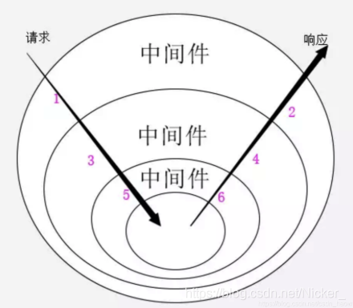

# [一些基于nodejs的服务端框架对比。express、koa、egg、nest、midway](https://blog.csdn.net/Nicker_/article/details/110881857)

express、koa、egg、nest、midway都是常见的nodejs开源框架。
其关系，基本如下：

```js
Midway.js ---|> Egg.js ---|> Koa.js,
               Nest.js ---|> Express.js
```

而koa实际上是express团队用新理念重写的，从架构上讲，更加先进一些。
midway.js和egg.js背后都是阿里的团队，其架构基于koa。
nest.js背后是国外的Trilon团队，其架构基于express。

## Express

Express 是一个保持最小规模的灵活的 Node.js Web 应用程序开发框架，为 Web 和移动应用程序提供一组强大的功能。

github:https://github.com/expressjs/express

中文官网：https://www.expressjs.com.cn/

## Koa

koa 是由 Express 原班人马打造的，致力于成为一个更小、更富有表现力、更健壮的 Web 框架。使用 koa 编写 web 应用，通过组合不同的 generator，可以免除重复繁琐的回调函数嵌套，并极大地提升错误处理的效率。koa 不在内核方法中绑定任何中间件，它仅仅提供了一个轻量优雅的函数库，使得编写 Web 应用变得得心应手。



koa是一个拥有**洋葱模型**中间件的http处理库，一个请求，经过一系列的中间件，最后生成响应。Koa的大致实现原理：context上下文的保存和传递，中间件的管理和next方法的实现。

所以koa的开发过程中，往往要引用他人开发的中间件，或是自己开发中间件，然后再开发业务逻辑。

中文官网：https://koa.bootcss.com/

## nest.js

nest是一个封装了node的有规范的框架，什么是有规范？意思是必须按照它制定的一套规则来写代码，否则程序就会无法运行。上手成本稍高一点，但是后期维护与扩展会很方便。

nest属于前端ts大趋势下深度使用注解特性并提供各种增强开发体验的框架，它提供了一套完整的解决方案，包含了认证、数据库、路由、http状态码、安全、配置、请求等开箱即用的技术。

官网：https://nestjs.com/

中文文档：https://nestjs.bootcss.com/

## Egg.js

为企业级框架和应用而生。
基于nodejs和koa.js。
相对而言，如果要做nodejs的服务，建议学习Egg，比起直接用Express或者koa，可以少造很多轮子。在此基础上，根据实际需要，可以去学习midway。

**特点**：

Egg 的插件机制有很高的可扩展性，一个插件只做一件事（比如 Nunjucks 模板封装成了 egg-view-nunjucks、MySQL 数据库封装成了 egg-mysql）。Egg 通过框架聚合这些插件，并根据自己的业务场景定制配置，这样应用的开发成本就变得很低。
Egg 奉行『约定优于配置』，按照一套统一的约定进行应用开发，团队内部采用这种方式可以减少开发人员的学习成本，开发人员不再是『钉子』，可以流动起来。没有约定的团队，沟通成本是非常高的，比如有人会按目录分栈而其他人按目录分功能，开发者认知不一致很容易犯错。但约定不等于扩展性差，相反 Egg 有很高的扩展性，可以按照团队的约定定制框架。使用 Loader 可以让框架根据不同环境定义默认配置，还可以覆盖 Egg 的默认约定。

**对比**：

`Express` 是 Node.js 社区广泛使用的框架，简单且扩展性强，非常适合做个人项目。但框架本身缺少约定，标准的 MVC 模型会有各种千奇百怪的写法。Egg 按照约定进行开发，奉行『约定优于配置』，团队协作成本低。
`Sails` 是和 Egg 一样奉行『约定优于配置』的框架，扩展性也非常好。但是相比 Egg，Sails 支持 Blueprint REST API、WaterLine 这样可扩展的 ORM、前端集成、WebSocket 等，但这些功能都是由 Sails 提供的。而 Egg 不直接提供功能，只是集成各种功能插件，比如实现 egg-blueprint，egg-waterline 等这样的插件，再使用 sails-egg 框架整合这些插件就可以替代 Sails 了。

官网：https://www.eggjs.org/zh-CN

文档：https://www.eggjs.org/zh-CN/intro

github：https://github.com/eggjs/egg

## Midway.js

`midwayjs`一个面向未来的云端一体 Node.js 框架。
**Midway** 是一个适用于构建 Serverless 服务，传统应用、微服务，小程序后端的 Node.js 框架。

使用`TypeScript`开发
Midway (中途岛) 是淘系架构团队（前淘宝UED）研发的一款面向未来的的 Node.js 框架。在大规模编程和 Serverless 等多种场景中，Midway 通过 TypeScript 和完全自研的依赖注入能力，将用户体验打造到极致。

Midway 2.0 集成了 Serverless 能力，同时扩展了 RPC、Socket、微服务等场景，并在其中提供和前端一体化研发的能力，不同的场景之间可以组合、协作，给用户提供相对灵活又可靠的使用体验。

**Midway给人一种框架的框架的感觉**。
Midway可以结合其他框架使用，把Egg.js或者是Koa或者是Express作为其上层Web框架。

官网：https://www.midwayjs.org/

文档：https://midwayjs.org/docs/intro

github：https://github.com/midwayjs/midway

## 参考资料

[nest.js和阿里的midway将来谁会更胜一筹呢？](https://www.zhihu.com/question/329910651)
[nest.js、egg.js、midway，express、koa的区别](https://blog.csdn.net/csdn_haow/article/details/101512411)
[Nest.js 和 koa 有什么不一样？](https://www.zhihu.com/question/323525252)
[EggJS 上层框架有福啦 - Midway 11 月月报](https://zhuanlan.zhihu.com/p/333363008)
[揭秘：让阿里前端提效 50% 是如何计算的 ？](https://zhuanlan.zhihu.com/p/158066098)
[精读 《Nestjs 文档》](https://zhuanlan.zhihu.com/p/28621374)


# [2023年值得使用的 Node.js 框架](https://juejin.cn/post/7101870857467166728#comment) 
