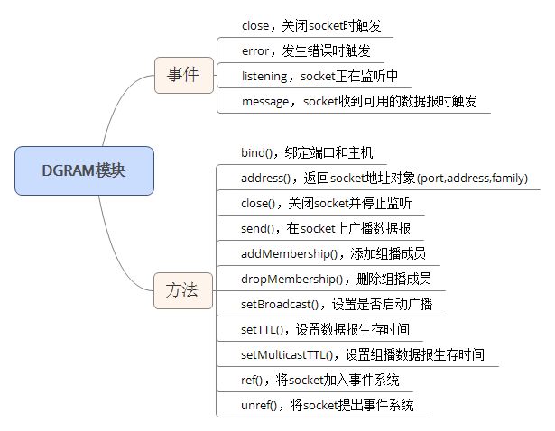

# [Node.js：dgram模块实现UDP通信](https://www.cnblogs.com/zmxmumu/p/6222946.html)

### 1、什么是UDP?

这里简单介绍下，UDP，即用户数据报协议，一种面向无连接的传输层协议，提供不可靠的消息传送服务。UDP协议使用端口号为不同的应用保留其各自的数据传输通道，这一点非常重要。与TCP相比，占用资源更少，传输速度更快。

### 2、了解UDP单播、广播和组播

**单播**：向一个单播地址发送UDP数据报时，数据报只能被指定的IP主机接收，同一子网下的其它主机都不会接收该数据报。单播过程（假设子网地址：192.168.10，该子网下有两台主机：192.168.10.2，192.168.10.3，向192.168.10.2发送数据报）

1. 向主机192.168.10.2的8060端口发送数据报，该IP数据报目标IP在以太网中被ARP解析成MAC地址，然后将此MAC地址设置为目标地址发出去。
2. 该子网下的主机以太网接口看到该数据帧时，对比自己的MAC地址，如果不一样，则忽略该数据帧。
3. 直到192.168.10.2主机看到该数据帧时，发现MAC一致，则读入该数据帧，然后在IP层对比目标IP和本机IP，在UDP层对比端口号是否一致，最后接收该数据帧。

**广播**：向一个广播地址发送UDP数据报，该广播网络下的所有主机都会受到影响，主机根据端口号来判断是否丢弃该数据。广播过程（假设子网地址：192.168.10，则该网络的广播地址为：192.168.10.255，该子网下有两台主机：192.168.10.2，192.168.10.3，向192.168.10.255发送数据报）：

1. 向192.168.10.255主机端口为8060发送数据报，，该IP数据报目标IP在以太网中被ARP解析成MAC地址，然后将此MAC地址设置为目标地址发出去。
2. 192.168.10.2和192.168.10.3的主机接口都会和此广播地址匹配成功，直到该数据报进入传输层时根据端口是否匹配判断是否丢弃该数据,端口为8060的会保留该数据，否则将数据丢弃。

**广播**：向一个组播地址发送UDP数据报，该组网络下的所有主机都会受到影响，主机根据端口号来判断是否丢弃该数据。组播过程原理与广播类似。

### 3、`dgram`模块API介绍

该模块用来创建UDP数据报socket，继承了EventEmitter，该模块的API如下所示：


### 3、UDP单播实现

单播的原理上面已经说了，这里便不再叙述。
服务端：

```javascript
const dgram = require('dgram');
const server = dgram.createSocket('udp4');

server.on('close',()=>{
	console.log('socket已关闭');
});

server.on('error',(err)=>{
	console.log(err);
});

server.on('listening',()=>{
	console.log('socket正在监听中...');
});

server.on('message',(msg,rinfo)=>{
	console.log(`receive message from ${rinfo.address}:${rinfo.port}`);
	server.send('exit',rinfo.port,rinfo.address)
});

server.bind('8060');
```

客户端：

```javascript
const dgram = require('dgram');
const client = dgram.createSocket('udp4');

client.on('close',()=>{
	console.log('socket已关闭');
});

client.on('error',(err)=>{
	console.log(err);
});
client.on('message',(msg,rinfo)=>{
	if(msg=='exit') client.close();
	console.log(`receive message from ${rinfo.address}:${rinfo.port}`);
});
client.send(`hello`,8060,'1.1.1.69');
```

### 3、UDP广播实现

要实现UDP广播，就必须知道广播地址，广播地址如何计算呢？可以利用`ipconfig(windows)`或`ifconfig(*unix)`得到ip地址和mask掩码地址，然后利用ip地址与mask子网掩码做与操作得到网络地址，网络地址中主机位都为1就是广播地址，举个例子：

```html
IP:149.88.160.58
mask:11111111.11111111.11000000.00000000
IP&MASK得到网络地址：149.88.128.0/18
网络号就是主机位全为0,即149.88.10000000.00000000 即149.88.128.0
广播地址就是主机位全为1,即149.88.10111111.11111111即149.88.191.255 
```

接着实现UDP广播，我机子的IP为1.1.1.69，掩码为255.255.255.0，因此广播地址为1.1.1.255，服务端向广播地址的8061端口发送数据报，客户端绑定本机的8061端口，如下所示：
服务端：

```javascript
const dgram = require('dgram');
const server = dgram.createSocket('udp4');

server.on('close',()=>{
	console.log('socket已关闭');
});

server.on('error',(err)=>{
	console.log(err);
});

server.on('listening',()=>{
	console.log('socket正在监听中...');
	server.setBroadcast(!0);//开启广播
	server.setTTL(128);
	server.send('大家好啊，我是服务端.',8061,'1.1.1.255');
});

server.on('message',(msg,rinfo)=>{
	console.log(`receive message from ${rinfo.address}:${rinfo.port}`);
});

server.bind('8060','1.1.1.69');
```

客户端：

```javascript
const dgram = require('dgram');
const client = dgram.createSocket('udp4');

client.on('close',()=>{
	console.log('socket已关闭');
});

client.on('error',(err)=>{
	console.log(err);
});
client.on('listening',()=>{
	console.log('socket正在监听中...');
});
client.on('message',(msg,rinfo)=>{
	console.log(`receive message from ${rinfo.address}:${rinfo.port}：${msg}`);
});
client.bind(8061,'1.1.1.69');
```

### 3、UDP组播实现

组播地址是实现UDP组播的关键，因此了解组播地址是重点。什么是组播地址？IANA将D类地址(224.0.0.0-239.255.255.255)分配给IP组播，用来标识一个IP组播组，由IGMP(组管理协议)协议维护组成员关系，其中：
224.0.0.0～224.0.0.255为永久组地址，地址224.0.0.0保留不做分配，其它地址供路由协议使用；
224.0.1.0～224.0.1.255是公用组播地址，可以用于Internet；
224.0.2.0～238.255.255.255为用户可用的组播地址（临时组地址），全网范围内有效；
239.0.0.0～239.255.255.255为本地管理组播地址，仅在特定的本地范围内有效。
向组播地址发送数据报，只有该组成员才会接收此数据报。
dgram模块的`addMembership()`方法将socket加入组播组中，`dropMembership()`方法退出组播组。下面以组播地址224.100.100.100来实现UDP组播，如下所示：
服务端：

```javascript
const dgram = require('dgram');
const server = dgram.createSocket('udp4');
const multicastAddr = '224.100.100.100';

server.on('close',()=>{
	console.log('socket已关闭');
});

server.on('error',(err)=>{
	console.log(err);
});

server.on('listening',()=>{
	console.log('socket正在监听中...');
	server.addMembership(multicastAddr);
	server.setMulticastTTL(128);
	setInterval(()=>{
		sendMsg();
	},1500);
});

server.on('message',(msg,rinfo)=>{
	console.log(`receive message from ${rinfo.address}:${rinfo.port}`);
});

function sendMsg(){
	server.send('大家好啊，我是服务端.',8061,multicastAddr);
}

server.bind('8060','1.1.1.69');
```

客户端：

```javascript
const dgram = require('dgram');
const client = dgram.createSocket('udp4');
const multicastAddr = '224.100.100.100';

client.on('close',()=>{
	console.log('socket已关闭');
});

client.on('error',(err)=>{
	console.log(err);
});
client.on('listening',()=>{
	console.log('socket正在监听中...');
	client.addMembership(multicastAddr);
});
client.on('message',(msg,rinfo)=>{
	console.log(`receive message from ${rinfo.address}:${rinfo.port}：${msg}`);
});
client.bind(8061,'1.1.1.69');
```

另外UDP内网穿透相关的内容，大家也可自行了解一下。