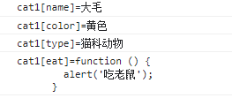
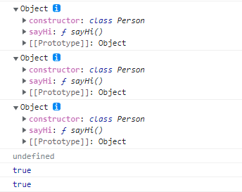
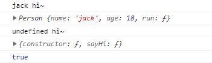

# JavaScript面向对象

面向对象是一种编程思想（oop）。很多个具有相同属性和行为的对象就可以抽象为类，对象是类的一个实例。JavaScript在ECMAScript 6中引入了类的概念。

面向对象有三个基本特征：**封装、继承、多态**

- **封装**：就是将一类事物的**属性和行为抽象成一个类**，使其**属性私有化**，**行为公开化**，隐藏对象属性和实现细节，仅对外提供访问形式,提高安全性和代码复用性。
- **继承**：则是**进一步将一类事物共有的属性和行为抽象成一个父类**，而每个**子类拥有父类的行为和属性，也有自己特有的行为和属性**,扩展了已存在的代码块，进一步提高了代码的复用性。
- **多态**：是指允许不同类的对象对同一消息做出不同响应，从一定角度来 看，封装和继承几乎都是为多态而准备的，类中**多个方法的重载叫多态**，父子类中**方法的覆盖也叫多态**。提高了软件 的可重用性和可扩充性。

## 一. Javascript 面向对象编程：封装

Javascript是一种基于对象(object-based)的语言，你遇到的所有东西几乎都是对象。但是，它又不是一种真正的面向对象编程(OOP)语言，在es6以前因为它的语法中没有class(类)。

那么，es6以前如果我们要把"属性"(property)和"方法"(method)，封装成一个对象，甚至要从原型对象生成一个实例对象，我们应该怎么做呢?

### 1. 生成对象的原始模式

假定我们把猫看成一个对象，它有"名字"和"颜色"两个属性。

```js
var Cat = {
    name : '',
    color : ''
}
```

现在，我们需要根据这个原型对象，生成两个实例对象。

```js
var cat1 = {}; // 创建一个空对象
cat1.name = "大毛"; // 按照原型对象的属性赋值
cat1.color = "黄色";
var cat2 = {};
cat2.name = "二毛";
cat2.color = "黑色";
```

好了，这就是最简单的封装了。但是，这样的写法有两个缺点，一是如果多生成几个实例，写起来就非常麻烦;二是实例与原型之间，没有任何办法，可以看出有什么联系。

### 2. 使用工厂模式来构建对象

我们可以写一个工厂函数，手动初始化一个对象，给这个对象添加属性和方法，将这个对象返回，解决代码重复的问题。

```js
function factory(age){
    //声明一个对象
    var obj = new Object()
    obj.age = age
    return obj
}
```

然后生成实例对象，就等于是在调用函数：

```js
var person1 = factroy(18)
var person2 = factroy(20)
```

这种方法的问题依然是，person1和person2之间没有内在的联系，不能很好的去将细节补充，instanceof 返回的值只能是Object，不能反映出它们是同一个原型对象的实例。

### 3. 构造函数模式

为了解决从原型对象生成实例的问题，Javascript提供了一个构造函数(Constructor)模式。

所谓"构造函数"，其实就是一个普通函数，但是内部使用了this变量。对构造函数使用new运算符，就能生成实例，并且this变量会绑定在实例对象上。

比如，人的原型对象现在可以这样写

```js
function Person(age, name){
    this.age = age
    this.name = name
}
```

我们现在就可以生成实例对象了。

```js
//new关键词来构建
var person1 = new Person(18,'zhangsan')
var person2 = new Person(20,'lisi')
console.log(person1.name) //zhangsan
console.log(person2.name) //lisi
```

这时person1和person2会自动含有一个constructor属性，指向它们的构造函数。

```js
console.log(person1.constructor == Person); //true
console.log(person2.constructor == Person); //true
```

Javascript还提供了一个**instanceof运算符，验证原型对象与实例对象之间的关系**。

```js
console.log(person1 instanceof Person); //true
console.log(person2 instanceof Person); //true
```

### 4. 构造函数模式的问题

构造函数方法很好用，但是存在一个浪费内存的问题。

我们现在为Cat对象添加一个不变的属性"type"(种类)，再添加一个方法eat(吃老鼠)。那么，原型对象Cat就变成了下面这样：

```js
function Cat(name, color) {
    this.name = name;
    this.color = color;
    this.type = "猫科动物";
    this.eat = function () { alert("吃老鼠"); };
}
```

还是采用同样的方法，生成实例：

```js
var cat1 = new Cat("大毛","黄色");
var cat2 = new Cat ("二毛","黑色");
alert(cat1.type); // 猫科动物
cat1.eat(); // 吃老鼠
```

表面上好像没什么问题，但是实际上这样做，有一个很大的弊端。那就是对于每一个实例对象，type属性和eat()方法都是一模一样的内容，每一次生成一个实例，都必须为重复的内容，多占用一些内存，缺乏效率。

```js
alert(cat1.eat == cat2.eat); //false
```

能不能让type属性和eat()方法在内存中只生成一次，然后所有实例都指向那个内存地址呢?

回答：是可以的。

### 5. Prototype模式

JavaScript规定，每一个构造函数都有一个prototype属性，指向另一个对象。这个对象的所有属性和方法，都会被构造函数的实例继承。

这意味着，我们可以把那些不变的属性和方法，直接定义在prototype对象上。

```js
function Cat(name, color) {
    this.name = name;
    this.color = color;
}

Cat.prototype.type = "猫科动物";
Cat.prototype.eat = function () { alert("吃老鼠") };
```

然后，生成实例。

```js
var cat1 = new Cat("大毛","黄色");
var cat2 = new Cat("二毛","黑色");
console.log(cat1.type); // 猫科动物
cat1.eat(); // 吃老鼠
```

这时所有实例的type属性和eat()方法，其实都是同一个内存地址，指向prototype对象，因此就提高了运行效率。

```js
console.log(cat1.name == cat2.name); //false
console.log(cat1.eat == cat2.eat); //true
console.log(cat1.type == cat2.type); //true
```

### 6. Prototype模式的验证方法

#### 6.1 isPrototypeOf()

这个方法用来判断，某个proptotype对象和某个实例之间的关系。

```js
console.log(Cat.prototype.isPrototypeOf(cat1)); //true
console.log(Cat.prototype.isPrototypeOf(cat2)); //true
```

#### 6.2 hasOwnProperty()

每个实例对象都有一个hasOwnProperty()方法，用来判断某一个属性到底是本地属性，还是继承自prototype对象的属性。

```js
console.log(cat1.hasOwnProperty("name")); // true
console.log(cat1.hasOwnProperty("type")); // false
```

#### 6.3 in运算符

in运算符可以用来判断，某个实例是否含有某个属性，不管是不是本地属性。

```js
console.log("name" in cat1); // true
console.log("type" in cat1); // true
```

in运算符还可以用来遍历某个对象的所有属性。

```js
for (var prop in cat1) {
     console.log(`cat1[${prop}]=${cat1[prop]}`);
}
```

结果为： 

### 7.利用类里面的构造器来构建对象，es6的新特性

创建一个基于原型继承的具有给定名称的新类，跟上述 Prototype 模式类似。将私有化的属性和方法放置在 constructor 构造函数中，会随着实例对象的创建重新声明到实例对象身上。可以把那些共有不变的属性和方法，放置在外面，它会被定义在类的 prototype 对象上。

```js
class Person {
　　//constructor 是一个构造函数，其里面的属性和方法会随着实例对象的创建重新声明到实例对象身上
　　//constructor 里面的属性和方法不存在于在 Person类 的原型 prototype 身上
　　constructor(name = 'jack', age = 18) {
　　　　// 这里的this指向Person的实例对象
　　　　this.name = name;
　　　　this.age = age;
　　　　this.run = function () {
　　　　　　console.log('跑');
　　　　};
　　}
　　//里面的方法存在于在 Person类 的原型 prototype 身上 只声明一次
　　sayHi() {
　　　　//这里的this是指向它的调用者
　　　　console.log(this.name + ' hi~');
　　　　console.log(this);
　　}
}
```

每次通过new关键词创建一个实例对象都会开辟一个内存空间存放新的对象

```js
let person1 = new Person();
let person2 = new Person();
console.log(person1); //Person类型的对象 {name: 'jack', age: 18, run: ƒ}
console.log(person2); //Person类型的对象 {name: 'jack', age: 18, run: ƒ}
console.log(person1 === person2); //false
console.log(new Person() === new Person()); //false
```

实例对象person1(person2)的 `__proto__` 指向构造它的类的原型对象 Person.prototype，constructor里面的属性和方法不存在于在 Person类 的原型 prototype 身上

```js
console.log(person1.__proto__); //指向 Person.prototype
console.log(person2.__proto__); //指向 Person.prototype
console.log(Person.prototype);
console.log(Person.prototype.run); //undefined constructor里面的属性和方法不存在于在 Person类 的原型 prototype 身上
console.log(person1.__proto__ === person2.__proto__); //true
console.log(person1.__proto__ === Person.prototype); //true
```

## 

constructor构造函数里面的属性和方法会随着实例对象的创建重新声明到实例对象身上，constructor函数外的方法不会重新声明，始终存在于类的原型对象 prototype 身上

```js
console.log(person1.run === person2.run); //false
console.log(person1.sayHi === person2.sayHi); //true
console.log(person1.sayHi === Person.prototype.sayHi); //true
```

实例对象通过其 `__proto__` 属性可访问到类的原型 prototype 上的方法

```js
person1.sayHi(); //这个函数里的this指向实例对象person1  打印：jack hi~
person1.__proto__.sayHi(); //这个函数里的this指向Person.prototype  打印：undefined hi~
console.log(person1.sayHi === person1.__proto__.sayHi); //true
```



7.static 静态修饰

static修饰的函数 使用 `类名.方法名` 调用

```js
class Person{
    constructor(){

    }
    run(){
        console.log('run');
    }
    static sayHello(){
        console.log('hello');
    }
}
new Person().run() //run
Person.sayHello() //hello
```

如果不写static修饰，不是静态方法，它存在于类的constructor上面，不可以直接通过类去访问，而是要通过实例对象调用，或者通过`Person.prototype.run()`调用


## 二. Javascript 面向对象编程：构造函数的继承

本节主要介绍，如何生成一个"继承"多个对象的实例。

比如，现在有一个"动物"对象的构造函数

```js
function Animal() {
    this.species = "动物";
}
```

还有一个"猫"对象的构造函数，

```js
function Cat(name, color) {
    this.name = name;
    this.color = color;
}
```

怎样才能使"猫"继承"动物"呢?

### 1.对象冒充

直接改this指向，但是这种方法，找不到原型上的内容，无法继承原型

```js
function Cat(name, color) {
    this.name = name;
    this.color = color;
    Animal.call(this); //将Animal里面的this改成Cat里面的this 
} 
let cat = new Cat(); 
console.log(cat.species);
```

### 2. 原型继承

更常见的做法，则是使用prototype属性。

如果"猫"的prototype对象，指向一个Animal的实例，那么所有"猫"的实例，就能继承Animal了。

```js
Cat.prototype = new Animal();
Cat.prototype.constructor = Cat;
var cat1 = new Cat("大毛","黄色");
alert(cat1.species); // 动物
```

代码的第一行，我们将Cat的prototype对象指向一个Animal的实例。

```js
Cat.prototype = new Animal();
```

它相当于完全删除了prototype 对象原先的值，然后赋予一个新值。但是，第二行又是什么意思呢?

```js
Cat.prototype.constructor = Cat;
```

原来，任何一个prototype对象都有一个constructor属性，指向它的构造函数。也就是说，Cat.prototype 这个对象的constructor属性，是指向Cat的。

我们在**前一步已经删除了这个prototype对象原来的值，所以新的prototype对象没有constructor属性，所以我们必须手动加上去，否则后面的"继承链"会出问题。**这就是第二行的意思。

总之，这是很重要的一点，编程时务必要遵守。下文都遵循这一点，即如果替换了prototype对象，

```js
o.prototype = {};
```

那么，下一步必然是为新的prototype对象加上constructor属性，并将这个属性指回原来的构造函数。

```js
o.prototype.constructor = o;
```

### 3. 直接继承prototype

由于Animal对象中，不变的属性都可以直接写入Animal.prototype。所以，我们也可以让Cat()跳过 Animal()，直接继承Animal.prototype。

现在，我们先将Animal对象改写：

```js
function Animal(){ }
Animal.prototype.species = "动物";
```

然后，将Cat的prototype对象，然后指向Animal的prototype对象，这样就完成了继承。

```js
Cat.prototype = Animal.prototype;
CatCat.prototype.constructor = Cat;
var cat1 = new Cat("大毛","黄色");
alert(cat1.species); // 动物
```

与前一种方法相比，这样做的优点是效率比较高(不用执行和建立Animal的实例了)，比较省内存。缺点是 **Cat.prototype和Animal.prototype现在指向了同一个对象，那么任何对Cat.prototype的修改，都会反映到Animal.prototype。**

所以，上面这一段代码其实是有问题的。请看第二行

```js
Cat.prototype.constructor = Cat;
```

这一句实际上把Animal.prototype对象的constructor属性也改掉了!

```js
alert(Animal.prototype.constructor); // Cat
```

### 4. 利用空对象作为中介

由于"直接继承prototype"存在上述的缺点，所以可以利用一个空对象作为中介。

```js
var F = function(){};
F.prototype = Animal.prototype;
Cat.prototype = new F();
Cat.prototype.constructor = Cat;
```

F是空对象，所以几乎不占内存。这时，修改Cat的prototype对象，就不会影响到Animal的prototype对象。

```js
alert(Animal.prototype.constructor); // Animal
```

### 5. prototype模式的封装函数

我们将上面的方法，封装成一个函数，便于使用。

```js
function extend(Child, Parent) {
    var F = function () { };
    F.prototype = Parent.prototype;
    Child.prototype = new F();
    Child.prototype.constructor = Child;
    Child.uber = Parent.prototype;
}
```

使用的时候，方法如下

```js
extend(Cat, Animal);
var cat1 = new Cat("大毛", "黄色");
alert(cat1.species); // 动物
```

这个extend函数，就是**YUI库如何实现继承**的方法。

另外，说明一点。函数体最后一行

```js
Child.uber = Parent.prototype;
```

意思是为子对象设一个uber属性，这个属性直接指向父对象的prototype属性。这等于是在子对象上打开一条通道，可以直接调用父对象的方法。这一行放在这里，只是为了实现继承的完备性，纯属备用性质。

### 6. 拷贝继承

上面是采用prototype对象，实现继承。我们也可以换一种思路，纯粹采用"拷贝"方法实现继承。简单说，如果把父对象的所有属性和方法，拷贝进子对象，不也能够实现继承吗?

首先，还是把Animal的所有不变属性，都放到它的prototype对象上。

```js
function Animal(){}
Animal.prototype.species = "动物";
```

然后，再写一个函数，实现属性拷贝的目的。

```js
function extend2(Child, Parent) {
    var p = Parent.prototype;
    var c = Child.prototype;
    for (var i in p) {
        c[i] = p[i];
    }
    c.uber = p;
}
```

这个函数的作用，就是将父对象的prototype对象中的属性，一一拷贝给Child对象的prototype对象。

使用的时候，这样写：

```js
extend2(Cat, Animal);
var cat1 = new Cat("大毛","黄色");
alert(cat1.species); // 动物
```

### 7.es6中 extends 关键词实现继承

类似于上面prototype模式的封装函数，继承的子类中的constructor如果要用this则一定要写super()

```js
class Person{
    constructor(){
        this.username = 'jack'
    }
}
class Son extends Person{
    constructor(){
         super()
    }
}
console.log(new Son().username) //jack
```

### 8.组合继承 （原型+call改this指向）

```js
//组合继承
function Person() {
    this.password = '123'
}
function Son() {
    Person.call(this) //将person里面的this改成Son里面的this
}
Son.prototype = new Person()
console.log(new Son().password) //123
```

## 三. Javascript面向对象编程：非构造函数的继承

### 1. 什么是"非构造函数"的继承?

比如，现在有一个对象，叫做"中国人"。

```js
var Chinese = {
    nation: '中国'
};
```

还有一个对象，叫做"医生"。

```js
var Doctor = {
    career: '医生'
}
```

请问怎样才能让"医生"去继承"中国人"，也就是说，我怎样才能生成一个"中国医生"的对象?

这里要注意，这两个对象都是普通对象，不是构造函数，无法使用构造函数方法实现"继承"。

### 2. object()方法

json格式的发明人Douglas Crockford，提出了一个object()函数，可以做到这一点。

```js
function object(o) {
    function F() { }
    F.prototype = o;
    return new F();
}
```

这个object()函数，其实只做一件事，就是把子对象的prototype属性，指向父对象，从而使得子对象与父对象连在一起。

使用的时候，第一步先在父对象的基础上，生成子对象：

```js
var Doctor = object(Chinese);
```

然后，再加上子对象本身的属性：

```js
　Doctor.career = '医生';
```

这时，子对象已经继承了父对象的属性了。

```js
　alert(Doctor.nation); //中国
```

### 3. 浅拷贝

除了使用"prototype链"以外，还有另一种思路：把父对象的属性，全部拷贝给子对象，也能实现继承。

下面这个函数，就是在做拷贝：

```js
function extendCopy(p) {
    var c = {};
    for (var i in p) {
        c[i] = p[i];
    }
    c.uber = p;
    return c;
}
```

使用的时候，这样写：

```js
var Doctor = extendCopy(Chinese);
Doctor.career = '医生';
alert(Doctor.nation); // 中国
```

但是，这样的拷贝有一个问题。那就是，如果父对象的属性等于数组或另一个对象，那么实际上，子对象获得的只是一个内存地址，而不是真正拷贝，因此存在父对象被篡改的可能。

请看，现在给Chinese添加一个"出生地"属性，它的值是一个数组。

```js
Chinese.birthPlaces = ['北京','上海','香港'];
```

通过extendCopy()函数，Doctor继承了Chinese。

```js
var Doctor = extendCopy(Chinese);
```

然后，我们为Doctor的"出生地"添加一个城市：

```js
Doctor.birthPlaces.push('厦门');
```

发生了什么事?Chinese的"出生地"也被改掉了!

```js
alert(Doctor.birthPlaces); //北京, 上海, 香港, 厦门
alert(Chinese.birthPlaces); //北京, 上海, 香港, 厦门
```

所以，extendCopy()只是拷贝基本类型的数据，我们把这种拷贝叫做"浅拷贝"。这是早期jQuery实现继承的方式。

### 4. 深拷贝

所谓"深拷贝"，就是能够实现真正意义上的数组和对象的拷贝。它的实现并不难，只要递归调用"浅拷贝"就行了。 

```js
function deepCopy(p, c) {
    var c = c || {};
    for (var i in p) {
        if (typeof p[i] === 'object') {
            c[i] = (p[i].constructor === Array) ? [] : {};
            deepCopy(p[i], c[i]);
        } else {
            c[i] = p[i];
        }
    }
    return c;
}
```


使用的时候这样写：

```js
var Doctor = deepCopy(Chinese);
```

现在，给父对象加一个属性，值为数组。然后，在子对象上修改这个属性：

```js
Chinese.birthPlaces = ['北京','上海','香港'];
Doctor.birthPlaces.push('厦门');
```

这时，父对象就不会受到影响了。

```js
alert(Doctor.birthPlaces); //北京, 上海, 香港, 厦门
alert(Chinese.birthPlaces); //北京, 上海, 香港
```

目前，jQuery库使用的就是这种继承方法。

## 四. Javascript面向对象编程：多态

### 1.重写：子类重写父类的方法

### 2.重载：同一个类里面有多个同名的方法（覆盖 js没有重载）