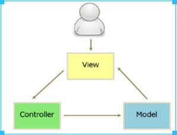
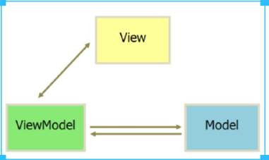
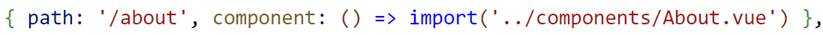
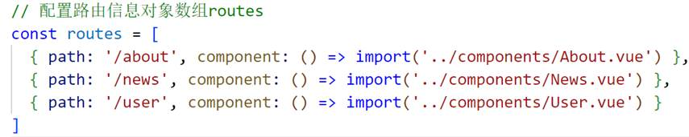
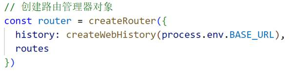
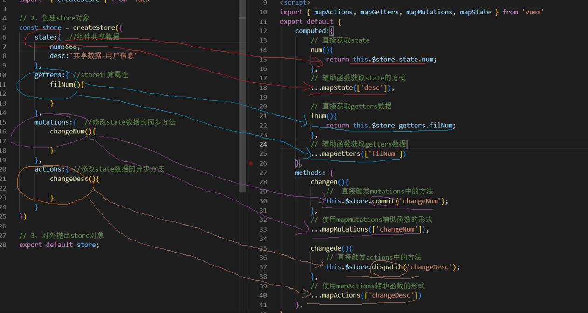
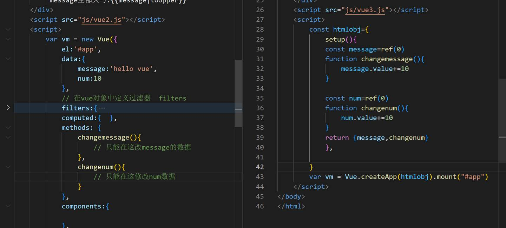

# Vue重点面试题(每题半分钟左右回答时间)

# 1、MVC与MVVM的区别以及特点（框架开发模式）

MVC与MVVM都是一种框架开发模式。

M-V-C指的是：将程序强制分为三部分，模型层（Model）、视图层（View）和控制器（Controller）

特点：数据单向流动 View à Con à Model

 

M-V-VM指的是：将程序强制分为三部分，模型层（Model）、视图层（View）和视图模型层（ViewModel）

特点：数据双向流动，View或Model某一个发生变化，另一个随之更新

备注：Vue属于MVVM模式的代表框架

# 2、Vue中的生命周期函数有哪些？

4组8个：

| Vue对象创建前后                                         | beforeCreate、created    |
| ------------------------------------------------------- | ------------------------ |
| View与Model数据绑定成功前后（Dom与Vue对象绑定成功前后） | beforeMount、mounted     |
| View或Model数据更新前后                                 | beforeUpdate、updated    |
| Vue与Model解绑前后                                      | beforeUnMount、unMounted |

 

# 3、Vue对象的组成部分有哪些？

data：定义了Vue能够使用的数据（数据源）

filters：定义了Vue能够使用的过滤器

computed：定义了Vue能够使用的计算属性

methods：定义了Vue能够使用的自定义函数

components：定义了Vue对象能够使用的自定义组件

# 4、v-for列表渲染，遍历数组、对象、整数？

**遍历数组**：**v-for="(item, index) in arr" :key="index"**

item：数组中每一项数据，index：每一项数据的数字下标，arr：循环渲染的源数组

**遍历对象**：**v-for="(value, key, index) in obj" :key="key"**

value：对象的属性值，key：对象的属性名，index：当前属性的数字下标，obj：循环渲染的源对象

**遍历整数**：**v-for="n in num" :key="n"**

num：要渲染的整数

注意：key? 唯一性索引，确保遍历出来的标签都是唯一不重复的

# 5、Vue模板编译时闪烁问题？

使用v-cloak来进行处理，设置其CSS的display属性为none。

​    [v-cloak] {

​      display: none;

​    }

# 6、条件渲染v-if与v-show的区别？

v-if与v-show都是根据条件来控制某一个元素的显示与隐藏，

v-if根据条件判断是否创建这个元素，

v-show不管条件是否成立，都创建此元素，通过CSS的display: block/none控制显示与隐藏。

# 7、Vue中如何“绑定事件”以及“事件修饰符”的用法？如何调用函数时传参？

Vue中事件绑定使用：‘v-on:事件名’或者‘@事件名’  常用事件：单击事件、双击事件、鼠标移入移出事件、获取焦点、失去焦点事件

事件修饰符：  .stop：阻止冒泡

.prevent：阻止默认行为

.once：只执行一次事件

事件对象**$event**：事件函数的**最后一个实参**

# 8、常见的Vue自定义指令有哪些？它们的作用

**v-for**：列表渲染

**v-if****、v-else****、v-show**：条件渲染

**v-bind**：动态属性

**v-html**：解析含有html的变量

**v-text**：解析纯文本内容

**v-cloak**：解决编译模板闪烁问题

**v-on**：事件绑定

**v-model**：数据双向绑定

# 9、v-model双向绑定的原理？

**v-model****双向绑定是input****框的value****值**（v-bind:value=””）**与** **input****事件或者change****事件**（@input/@change）**的语法糖**（缩写形式）。

# 10、npm（全球最大的包管理器）的常用命令有哪些

npm：全球最大的包管理系统，可以帮助我们下载项目所有的依赖包（扩展）

**npm install** **包名**：下载某一个依赖包（-g全局下载、--save在本项目下载并写入到配置文件）

**npm uninstall** **包名**：卸载某一个依赖包

**npm update** **包名**：更新某一依赖包

**npm -v**：查看当前npm版本号

**npm init****：**初始化一个npm配置文件

**npm i**：根据配置文件package.json下载当前项目需要的所有依赖包

# 11、Vue中快速创建Vue项目的脚手架有哪些，如何使用？

**① Vue-Cli****脚手架** **特点：依赖webpack****服务器进行项目开发，文件越多，依赖越复杂，冗余代码多，性能低**

   **创建Vue****项目命令：vue create objname;/vue ui**：创建项目

​                  **cd objname;**：    切换到项目目录

​                  **npm run serve;**：  运行项目

​                  **npm run build;**：  打包项目

**② Vite** **特点：不需要捆绑服务器，依赖浏览器对ES6Modules****的原生支持，即时的热刷新功能，以及按需编译，性能高**

   **创建Vue****项目命令：npm init vite-app objname;**：创建项目

​                  **cd objname;**：    切换到项目目录

​                  **npm run dev;**：   运行项目

​                  **npm install;**：     根据配置文件package.json下载当前项目需要的所有依赖包

​                  **npm run build;**：  打包项目

# 12、Vue项目如何配置Axios（Vue中Ajax）？

① 在项目中下载Axios扩展：**npm i axios --save;**，并引入：**import axios from “axios”;**

② 在项目中发送Axios请求（辅助函数的形式）：**axios.get();****、axios.post();****、axios.put();…**

# 13、Vue项目中如何配置路由？

① 下载Vue-Router扩展，并在项目中引入：npm i vue-router --save;

② 配置路由信息对象数组routes

③ 创建路由管理器对象router，并对外抛出

④ 在main.js中将路由管理器对象与当前vue对象相关联

⑤ 设置路由导航router-link与路由出口router-view

# 14、路由中route、routes、router它们的区别？

**route****：路由信息对象**

path：触发当前路由的地址，

component：触发路由地址时要加载的组件

**routes****：路由信息对象数组**

**router****：路由管理器对象**

# 15、什么是动态路由，动态路由传参的几种形式？

动态路由：能够接收不同参数的路由，被称为动态路由

**{path: '/about/:id/:name/:age', name: 'about', component: () => import('../views/AboutView.vue')}**,

 

动态路由传参的几种形式：

① props属性传参：支持多种格式：布尔值或者函数

②请求字符串传参：   **params**或者**query**传参

**params**可以通过**$route.params.XXX**接收

**query**可以通过**$route.query.XXX**接收

# 16、组件之间的数据通信？

组件之间的数据通信分为两种：**父子组件之间的数据通信**与**非父子组件之间的数据通信**

\1. 父子组件之间的数据通信：

   父 à 子：通过props传递数据

   子 à 父：通过**$emit()**触发自定义事件的形式传递数据

\2. 非父子组件之间的数据通信（两种方法）

   第一种：通过事件总线Bus的形式

   第二种：通过状态管理库Vuex实现

# 17、状态（组件之间共享的数据）管理库Vuex？

## ① Vue项目如何配置状态管理库Vuex？

   （1）下载Vuex并在项目中引入npm i vuex --save

（2）创建状态管理库对象store const store = createStore({})

（3）对外抛出store对象export default store;

（4）在main.js中引入store对象并与Vue对象关联createApp(App).use(store).mount('#app')

## ② 状态管理库Vuex里面包含哪几个重要组成部分？

   state：定义了组件之间共享的所有数据

   getters：定义了store对象中的计算属性（用于过滤state中的数据）

   mutations：定义了修改state数据的所有同步方法

   actions：定义了修改state数据的所有异步方法

## ③ 各组件如何访问Vuex状态管理库中的内容？

| Vuex的组成部分                     | 各组件获取Vuex数据的方法       |                        |
| ---------------------------------- | ------------------------------ | ---------------------- |
| 1、直接获取/直接调用形式           | 2、辅助函数形式                |                        |
| state：共享数据                    | this.$store.state.xxx          | ...mapState([xxx])     |
| getters：计算属性（过滤state数据） | this.$store.getters.xxx        | ...mapGetters([xxx])   |
| mutations：修改state数据同步方法   | this.$store.commit(‘方法名’)   | ...mapMutations([xxx]) |
| actions：修改state数据异步方法     | this.$store.dispatch(‘方法名’) | ...mapActions([xxx])   |

# 18、vue2与vue3的区别（vue3的新特性）？

| vue2与vue3的区别（vue3的新特性） |                                                              |                                                              |
| -------------------------------- | ------------------------------------------------------------ | ------------------------------------------------------------ |
| 区别列表                         | vue2版本                                                     | vue3版本                                                     |
| 1、创建Vue实例对象时             | new Vue({ })                                                 | vue.createApp().mount(“#app”)                                |
| 2、vue-router以及vuex版本的更新  | new VueRouter() / new  Vuex.Store()                          | createRouter() / createStore({  })                           |
| 3、单文件组件的template模板      | 必须有一个最外层根元素div来包裹                              | 将此要求去除                                                 |
| 4、过滤器filter                  | 存在的                                                       | 去除掉                                                       |
| 5、vue对象data的格式             | 无此要求                                                     | data数据源必须被声明为一个函数，并返回独立对象的形式         |
| 6、生命周期函数                  |                                                              | ① beforeCreate/created  à setup()  ② beforeDestroy à beforeUnMount     Destroyed  à unmounted  备注：setup()结构中使用生命周期函数前面要加on |
| vue3新增的                       | 组合API—setup()    优点：vue2中约定了我们该在哪个位置做什么事，这反倒一定程度上也强制我们进行了代码分割     vue3的setup将某个数据关联的内容都整合成一部分，即使setup内容越来越多，也会围绕大而不乱的形式开发项目    setup()具体用法  ref()：定义一个基础类型的响应式数据  reactive()：定义一个对象类型的响应式数据 |                                                              |

# 拓展面试题：

## （1）什么是单页面应用，优点、缺点？如何实现？

用户访问**一个网页**，并且**无需离开此网页即可完成所有功能**的应用程序即为单页面应用

优点：用户体验良好，程序性能高

缺点： ①不利于搜索引擎的抓取

②首次渲染速度相对较慢

③导航不可用，如果一定要导航需要自行实现前进，后退

如何实现：使用**vue-router****路由**扩展

## （2）什么是单文件组件，它的组成部分？

单文件组件：以.vue结尾的文件是vue中的单文件组件

组成部分：template模板、script、style

## （3）Vue中如何使用插槽？

<slot>标签是vue中的插槽：

作用：**父组件向子组件传递数据**，子组件中使用slot表示默认内容，父组件在使用组件时，其标签内容会自动替换子组件slot标签

分为两种：默认插槽  命名插槽（使用方法？）

# Vue框架的两大核心思想：数据的双向绑定，组件化开发