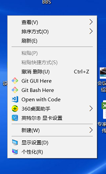
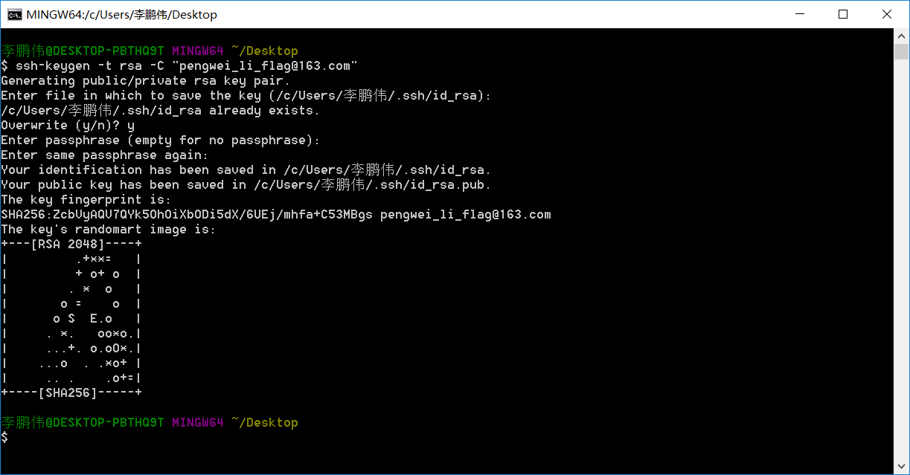
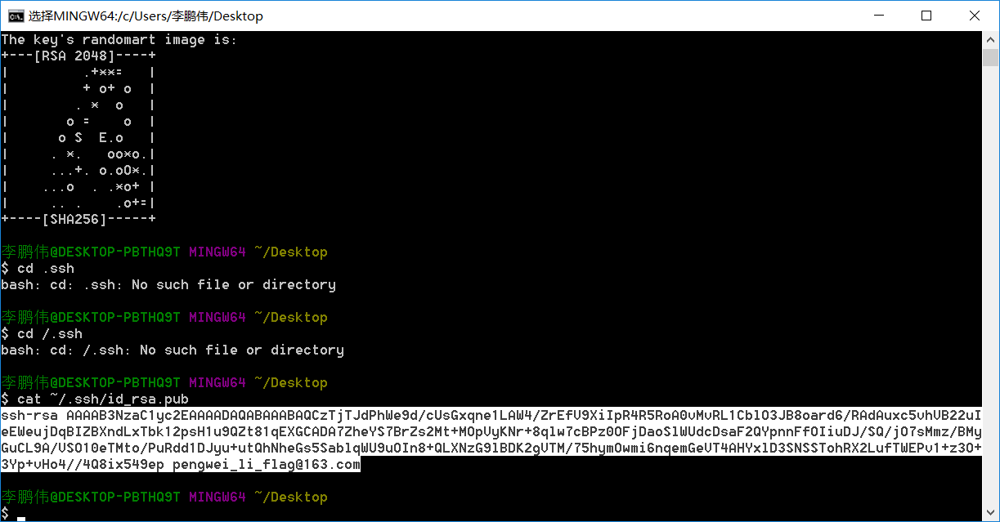
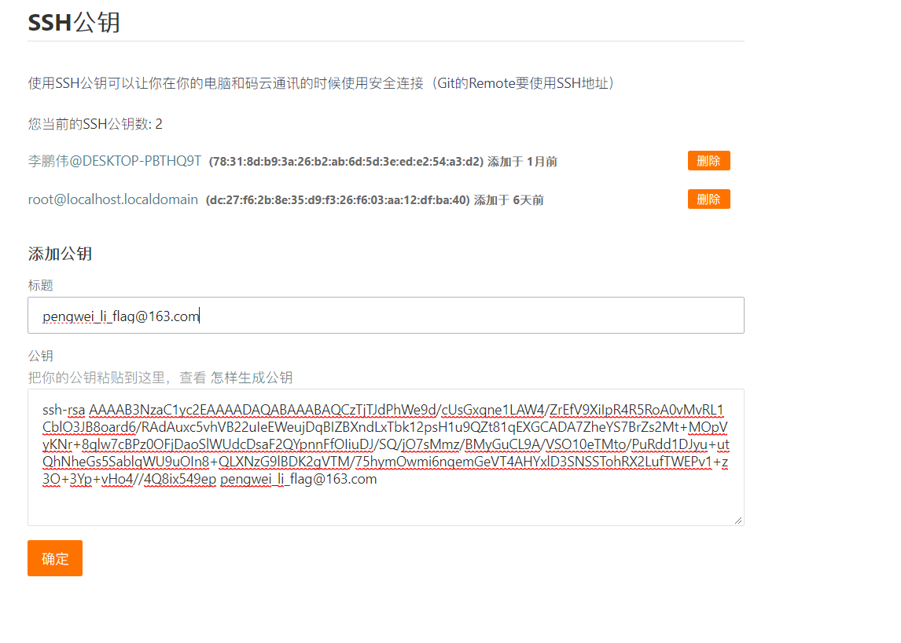
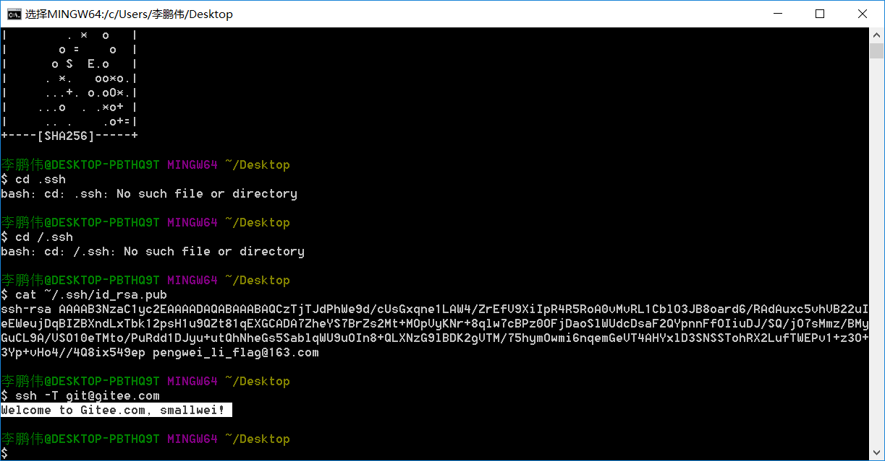

# [gitSSH配置](https://www.kancloud.cn/smallwei/avue/579757) 


#### 步骤 1:桌面右键菜单点击Git Bash Here



#### 步骤 2:生成密钥

```
ssh-keygen -t rsa -C "你的电子邮箱"

例
ssh-keygen -t rsa -C "pengwei_li_flag@163.com"
```

完后一直按Enter就行，出现了一大串字符，证明就成功了



#### 步骤 3:查看密钥

```
cat ~/.ssh/id_rsa.pub
```

白色的部分就是你的密钥



#### 步骤4:已码云为例配置ssh

打开码云ssh 将你的密钥粘贴进去，点击保存



#### 步骤 5:ssh链接测试

```
ssh -T git@gitee.com
```

看到welcome的字样ssh就配置成功了



