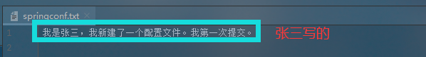
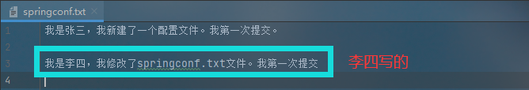
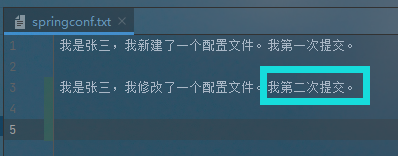
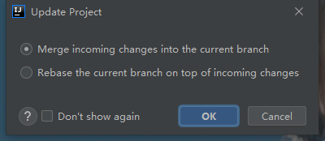
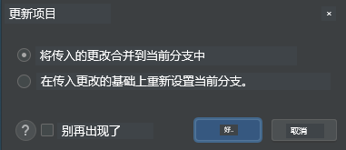
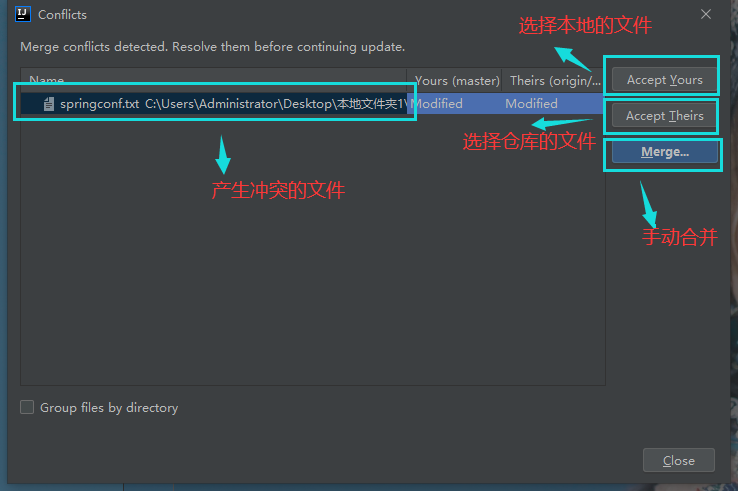
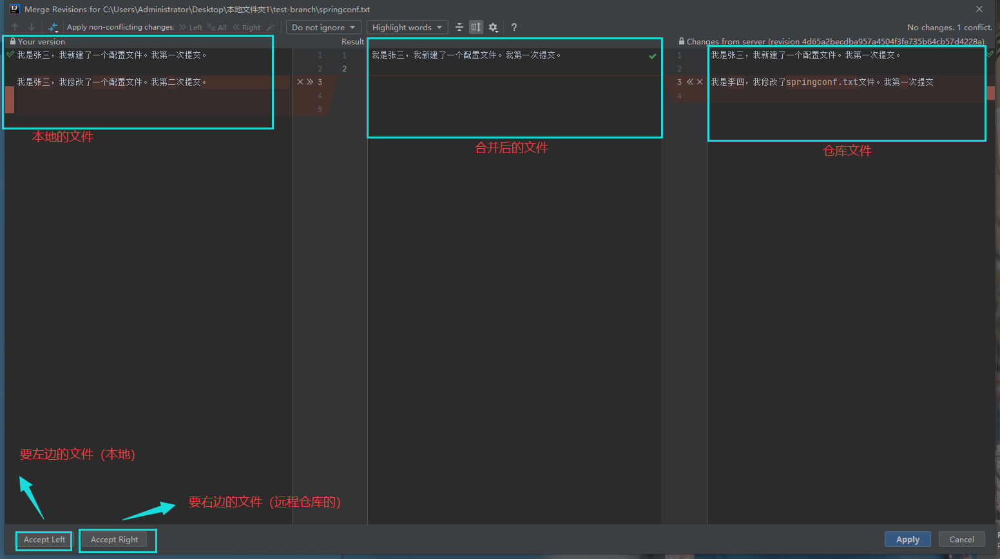
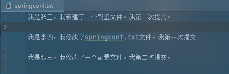

# `Idea`中解决`git`冲突

### 1.什么是冲突？

冲突是指当你在提交或者更新代码时`被合并的文件`与`当前文件不一致`

### 2.冲突的产生场景

  1. `更新`代码
  2. `提交`代码
  3. 分支`合并`

上面各种情况的本质都是，`当前文件与合并文件不一致，因此不论哪种情况其解决冲突的方法是一样的`。

### 3.`Idea`中解决冲突

**模拟场景：**
  假设有两个程序员(张三、李四)`同时开发一个项目，并且同时编写同一个文件`。

#### 3.1程序员张三

  张三新建了springconf.txt配置文件，往配置文件里写了点内容。

上传到代码仓库。

------

#### 3.2程序员李四

  每次工作前先更新项目代码

  李四上班后，更新项目代码，修改springconf.txt 文件，然后提交到代码仓库。

------

#### 3.3张三又修改了springconf.txt文件

  张三把代码写完后，准备提交代码了（`这是时候提交到本地仓库了`），在提交之前，先要拉取仓库的代码。

  这个时候`肯定会出现冲突的`。

  程序员李四修改了`springconf.txt文件`，现在`仓库的springconf.txt文件`和`张三本地的springconf.txt文件`已经不一样了。

------

#### 3.4 解决冲突

  在拉取仓库代码时，出现冲突了。

**出现两个单选框**
1.选择Merge 的话就是合并冲突

2.选择Rebase 的话就是 选择当前修改

选择`Merge 之后`，点击ok

出现以下弹出框：

一般我们选择`手动合并Merge`

点击`Merge`

  将`需要的`内容`点击：">>"`既可以合并内容到result中，`不需要的`内容`点击“x”`即可，合并完成后点击apply即可。

  值得注意的是，最将`所有的“x >>”符号都要处理完`，不需要的点击“x”,需要的点击“>>”

  `手动合并`后的文件内容如下

------

#### 3.5 张三解决冲突后，需要将项目推送到仓库中

------

## 4.总结

1. 多人协作开发的时候,如果出现了你没有`改过的文件跟你冲突了,一定要去找到当事者,说清楚是如何冲突的`；
2. 然后协商解决,千万`不要擅自拉别的分支去试图解决冲突,或找文件覆盖，更或者以自己的文件为准`.
3. 同时记住,解决了之后,要`add`和`commit`最后`push`.为保证万无一失,最后在冲突都解决之后,重启项目；
4. 保证至少不会有立即奔溃的现象发生.然后才去提交,push.
5. 提交的时候,一定要保持清醒,先搞清楚自己要提交的文件之间的关系,然后再提交,这样才不会有文件缺失的问题,造成奔溃.