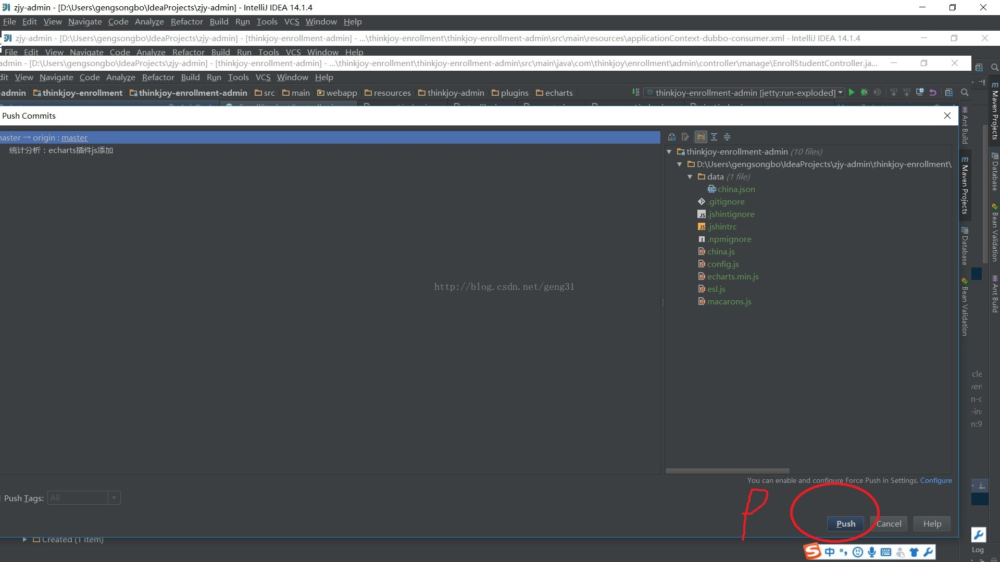

# [IDEA中Git的更新/提交/还原方法](https://www.cnblogs.com/huzixia/p/10392321.html)

记录一下在IDEA上怎样将写的代码提交到GitHub远程库：
下面这个图是基本的提交代码的顺序：

**1. 将代码Add到stage暂存区**
本地修改了代码后，需先将代码add到暂存区，最后才能真正提价到git仓库。
首先，IDEA中，选中要提交的代码——>右键——>Git——>Add。这样代码就add到了暂存区中。如下图：

 

**2. 提交代码到本地Git**
将代码Add到暂存区后，然后再将代码提交到本地Git仓库。选中要提交的代码——>右键——>Git——>Commit File…——>Commit Message中输入提交说明——>点击Commit。如下图：

 

**3. 将提交的代码push到远程GitHub**
之前所有的步骤都完成后，也就是把代码提交到了本地Git仓库中，最后将提交的代码push到远程仓库，这样本地代码提交到远程就完成了。
项目上右键——>Git——>Repository——>push(将本地代码push到远程)，这样远程的代码就和本地同步了。有时候在push的时候会失败，原因之一是本地代码与远程代码不同步，所以在push之前，要在本地将远程代码pull一下：项目上右键——>Git——>Repository——>pull(将远程代码pull到本地)。如图：

 

总结：以上步骤就是将本地代码提交到远程库中。首先将代码add到本地仓库的stage暂存区中，然后再commit到本地Git仓库，最后将本地Git中的代码push到远程。push失败的话先将远程代码pull到本地再push。

### **IDEA中Git的更新、提交、还原方法**

**第一步：提交项目前必须先对项目进行更新**

此项特别重要，如果不进行更新，别人有项目提交到服务器上，那么你的项目将会提交不上去，使用git解决冲突会比较麻烦，即使你解决了冲突，但是有时候不注意会冲掉别人写的代码，不像svn使用那么简单，所以提交自己项目前必须进行更新（特别重要）；如图1：选择pull进行更新代码操作；

**第二步：更新后的结果如图**

其中图2：表示从服务器上更新下来的代码；图3：表示服务器上没有需要更新的代码，当服务器上没有需要更新到本地的代码时，则可以放心的进行提交代码的操作；

 

 

**第三步：进行提交代码的操作**

1.当确定第二步操作完之后，此时可以进行提交代码的操作，图4中表示中红色的项目表示新创建的项目{注：如果是蓝色，表示修改过的项目}（红色和蓝色都表示待提交项目），如果是红色的，则选择图5：add,如果项目是蓝色，则选择图5.1 ：commit file;

 

2.当add操作完成之后项目颜色会变成绿色，如图6，红色表示为进行add操作；

 

3.进行commit Directory操作 如图7：

 

4.当出现如图8的窗口时，绿色和蓝色表示待提交项目，在这里可以进行相应的勾选，下面的commit message区域填写，模块名称或者提交代码的相应信息，下面的下拉菜单选择commit and push,如红色8区域；

 

5.如图9：当出现下面窗口时，选择红色区域9部分的push按钮，进行提交项目操作，至此项目提交所以操作完成，需要等几秒钟会有相应提交成功或者是提交失败的提示，如果提交失败则表示，你本地项目没有进行更新，和服务器上的项目有冲突，需要解决冲突，然后才能提交(注：当pull失败时，说明服务器上的代码和本地代码有冲突，这时则需要把本地有冲突的代码备份，然后还原，再pull，这时pull成功后，再把自己备份的代码部分，拷入相应的代码中，这时候再进行push就可以了)。

 

 

**第四步：进行还原操作**

如图选择10区域按钮：revert进行还原操作；

 

 