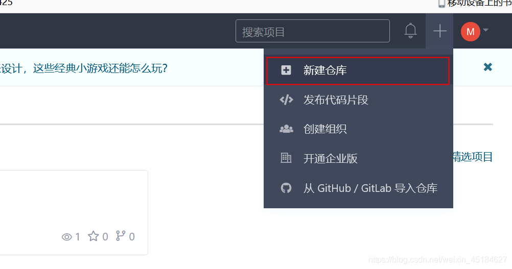
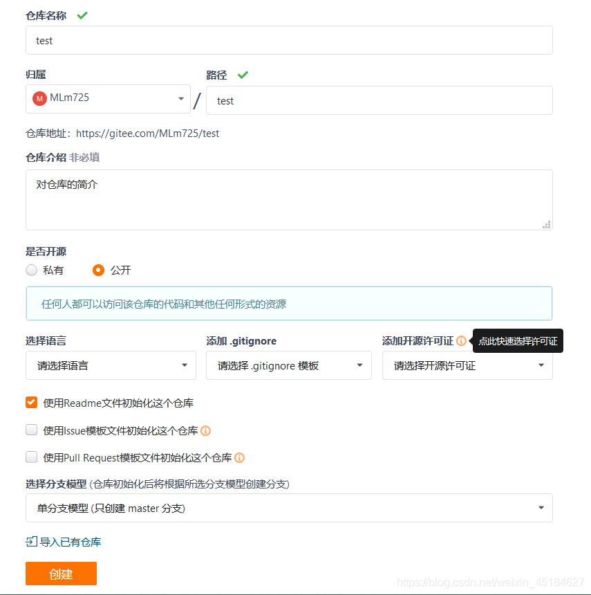
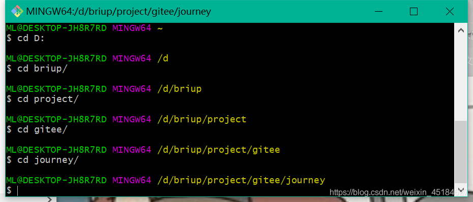
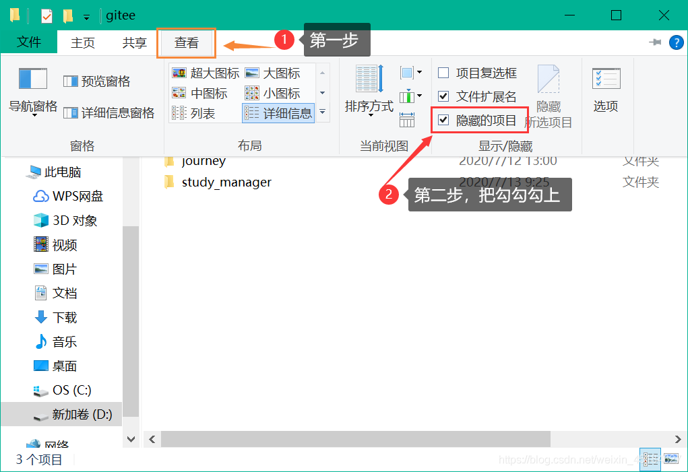
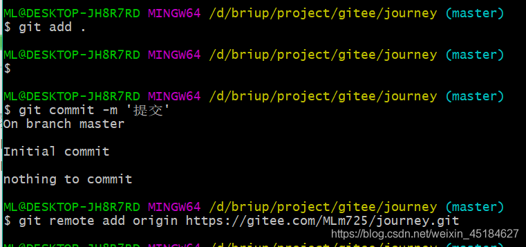
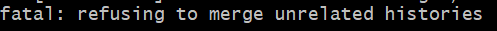
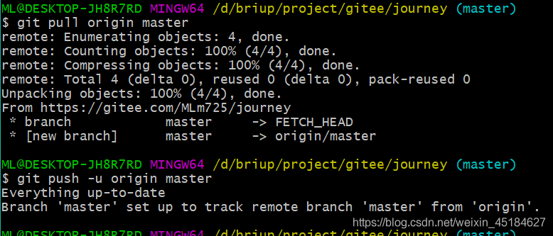

| Git命令                             | 作用                                     | 备注                                                         |
| ----------------------------------- | ---------------------------------------- | :----------------------------------------------------------- |
| git clone  project_url project_name | 将项目从Git仓库克隆到本地                | 克隆命令一般在本地第一次下载项目使用  <br />project_url：项目地址 <br />project_name：自定义项目名 |
| git pull  project_url               | 将项目最新版本从Git仓库拉取下来          | 效果同克隆一样，用于更新本地已克隆项目                       |
| git add .                           | 将所有修改的文件添加到暂存区             |                                                              |
| git commit -m "版本说明"            | 将暂存区文件提交到版本库，并添加版本说明 |                                                              |
| git push                            | 将完成的代码提交到Git项目仓库中          |                                                              |

# git冲突问题warning: LF will be replaced by CRLF in project.config.json

> `warning: LF will be replaced by CRLF in project.config.json. The file will have its original line endings in your working directory`

这是我在`git add .`时遇到的问题
他的意思主要是

> 假如你正在Windows上写程序，又或者你正在和其他人合作，他们在Windows上编程，而你却在其他系统上，在这些情况下，你可能会遇到行尾结束符问题。这是因为Windows使用回车和换行两个字符来结束一行，而Mac和Linux只使用换行一个字符。虽然这是小问题，但它会极大地扰乱跨平台协作。

**如果你只是一个人搞 不考虑队友合作问题 或者都是window系统 那就没问题 关掉它**

```
git config core.autocrlf true
```

如果你是团队协作，那就看看这份文档吧
[GIT 文档](https://git-scm.com/book/en/v2/Customizing-Git-Git-Configuration#Formatting-and-Whitespace)

看不懂也没关系
下面是操作流程

**如果你是window系统**

```
$ git config --global core.autocrlf true
```

**如果你是mac或Linux系统**

```
$ git config --global core.autocrlf input
```

如果您是Windows程序员，并且仅做Windows项目，则可以关闭此功能，通过将config值设置为false来在存储库中记录回车：

```
$ git config --global core.autocrlf false
```

其实就是回车换行在不同系统的不兼容问题

# Gitee常用命令

## git常用命令分享

git checkout -b 名称:创建分支.
git checkout -d 名称:删除分支.
git checkout 分支名称:切换分支
git pull origin master:如果是多人开发的话 需要把远程master上的代码pull下来
git merge dev:切换到master分支后执行，把dev分支合并到master分支.
git clone 远程仓库地址:远程拉取项目.
git starus:查看当前本地仓库状态.
git push origin master:推送到远程仓库.
git branch:查看所有分支.
git push origin -delete test: 删除远程分支test.
git branch -d test:删除本地分支test.
git add .:将修改的文件放入缓存区.
git commit im “完成了…”：将缓存区的代码同步到本地仓库.

## git提交流程

1. 创建本地文件夹.
2. cmd执行git init. 初始化本地仓库
3. 使用git remote add origin https://gitee.com/你的码云用户名/XXXX //添加远程仓库
4. git pull origin master 命令，将码云上的仓库pull到本地文件夹
5. git status //查看项目的状态 可有可无
6. git add . //将修改后的文件放到缓存区
7. git commit -m “完成了登录功能” //将代码同步到本地仓库
8. git push -u origin master //推送到远程仓库
git push -u origin master 上面命令将本地的master分支推送到origin主机，同时指定origin为默认主机，后面就可以不加任何参数使用git push了。(第一次提交需要使用git push -u origin master)

# 如何将本地代码提交到gitee上，完整图文步骤

### 1. 创建远程仓库



按照图中配置然后按创建就好了，仓库就创建好了，如下图所示（图中框出来的就是这个仓库的地址）：


### 2. 在本地创建一个文件夹


### 3.将要上传的代码文件都复制到这个文件夹内

### 4.进到这个文件夹的目录下



### 5.把这个目录变成git可以管理的仓库，使用`git init`命令

在这个本地文件夹下面会出现一个 .git 文件夹，看不到的可以按照下图来设置文件夹隐藏的项目可显示


### 6.把文件添加到缓存区里面去，使用`git add .`命令【注意不能忘记小数点“.”，代表所有文件】

### 7.填写提交信息，使用 `git commit -m '本次提交的备注'` 命令

### 8.将本地仓库与远程仓库绑定，使用 `git remote add origin` 刚刚创的远程仓库地址

例如： `git remote add origin https://gitee.com/MLm725/journey.git`


### 9.远程库与本地同步合并，使用 `git pull origin master` 命令

在这一步如果显示下图错误的话，就使用 `git pull origin master --allow-unrelated-histories` 命令强制合并
`


### 10.把本地库的内容推送到远程，使用 `git push -u origin master` 命令



### 11.最后一条命令执行之后会弹出一个弹出框，要你输入用户名和密码，验证通过之后就上传上去了