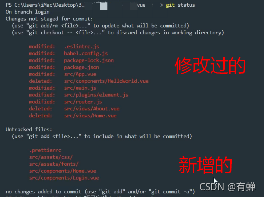
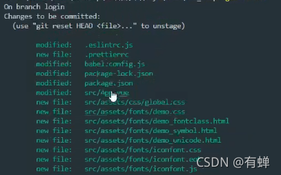

# git创建新分支

> 如果只是单纯的创建新分支，并提交新分支，直接走①和⑧两个步骤 

① 创建新的本地分支 

```bash
//git checkout -b 新分支名称 如下
git checkout -b newB
```

② 在本地分支开发以后，查看操作过的文件

```bash
git status
```



③ 添加这些文件到暂存区

```bash
git add .
```

④ 再次查看状态

```bash
git status
```



⑤ 把暂存区的代码提交到本地仓库

```bash
// git commit -m '描述信息'
git commit -m '这里是描述信息'
```

⑥ 合并到master分支

先切换到master分支

```bash
git checkout master
```

查看分支状态

```bash
git branch
```

合并newB分支上的代码

```bash
git merge newB
```


⑦切换到本地 newB分支

```bash
git checkout newB
```

⑧ 将newB提交到远程仓库  【第一次要用-u 以后不需要】

```bash
git push -u origin newB
```

> `git push -u origin newB` 是  `git push --set-upstream origin newB`的简写，加 `-u` 是因为新建的分支在远程仓库没有上游分支，需要推动当前分支并将远程设置为上游。
