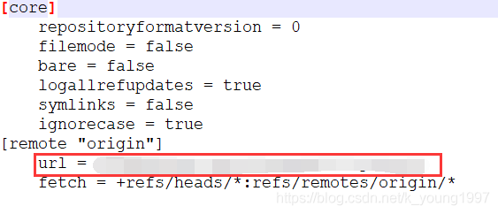

# git更换远程仓库地址

前言：为什么要更换git的远端仓库地址？，公司一开始使用的是`coding.net`。由于人数和费用的关系需要迁移到码云（`gitee`）上。本地项目需要更换仓库地址。


## 方法一

```bash
git remote -v  #查看远端地址
git remote #查看远端仓库名
git remote set-url origin https://gitee.com/xx/xx.git (新地址)
```

## 方法二

```bash
git remote rm origin #删除远程的仓库
git remote add origin https://gitee.com/xx/xx.git(新地址) #重新添加远程仓库
```

## 方法三

修改`.git`文件夹
`.git`文件夹一般在项目文件夹的第一层文件夹
`.git`文件在系统里默认是隐藏的，`windows`需要设置显示，`linux`使用`ls -a`查看


修改config文件内容，将`[remote "origin"]` url 修改成需要替换的 url

