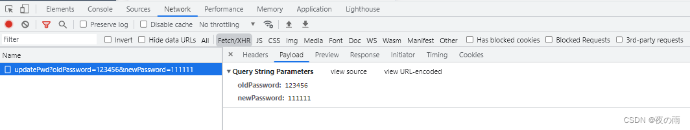

# 若依模板，密码明文传输问题

若依官网提供的解决方案：[**集成jsencrypt实现密码加密传输方式**](https://doc.ruoyi.vip/ruoyi-vue/document/cjjc.html#%E9%9B%86%E6%88%90jsencrypt%E5%AE%9E%E7%8E%B0%E5%AF%86%E7%A0%81%E5%8A%A0%E5%AF%86%E4%BC%A0%E8%BE%93%E6%96%B9%E5%BC%8F)

改进：

## [若依(RuoYi)SpringBoot框架密码加密传输(前后分离板)](https://blog.csdn.net/weixin_56567361/article/details/124961493)

### **运行环境:**

Java 版本 1.8

Spring Boot 版本: 2.2.13.RELEASE

------

目前登录接口密码是明文传输 为了更高安全性 我准备调整为加密方式传输( 这里选择[Rsa加密算法](https://baike.baidu.com/item/RSA算法/263310?fromtitle=RSA加密算法&fromid=9645994&fr=aladdin)) 并分享下编写过程

> 更改前
>
> 
>
> 
>
>  更改后
>
> 
>
>  


### 大概加密流程:

1. 后台生成随机公钥私钥
2. 前台拿到公钥 集成jsencrypt实现密码加密
3. 传输加密后的密码给后台
4. 后台通过私钥对加密后的密码进行解密


[toc]

> [若依官方的加密方法](https://doc.ruoyi.vip/ruoyi-vue/document/cjjc.html#集成jsencrypt实现密码加密传输方式)<<<原本是固定公私秘钥 我改为了随机生成

## 后台改动

### 首先新建RsaUtils类

> 工具类`sign`包下添加`RsaUtils.java`，用于`RSA`加密解密。

```java
package com.ruoyi.common.utils.sign;

import org.apache.commons.codec.binary.Base64;
import org.apache.commons.collections4.MapUtils;
import org.slf4j.Logger;
import org.slf4j.LoggerFactory;
import org.springframework.context.annotation.Bean;
import org.springframework.stereotype.Component;
 
import javax.crypto.Cipher;
import java.security.*;
import java.security.interfaces.RSAPrivateKey;
import java.security.interfaces.RSAPublicKey;
import java.security.spec.PKCS8EncodedKeySpec;
import java.security.spec.X509EncodedKeySpec;
 
@Component
public class RsaUtils {
    // Rsa 私钥 也可固定秘钥对 若依原写法(不安全)
    public static String privateKeys = "";
    private static String publicKeyStr = "";
    private static String privateKeyStr = "";
    private static final RsaKeyPair rsaKeyPair = new RsaKeyPair();
    private static final Logger logger = LoggerFactory.getLogger(MapUtils.class);
 
    /**
     * 私钥解密
     *
     * @param text 待解密的文本
     * @return 解密后的文本
     */
    public static String decryptByPrivateKey(String text) throws Exception {
//        logger.info(rsaKeyPair.getPrivateKey());
        return decryptByPrivateKey(rsaKeyPair.getPrivateKey(), text);
    }
 
    /**
     * 公钥解密
     *
     * @param publicKeyString 公钥
     * @param text            待解密的信息
     * @return 解密后的文本
     */
    public static String decryptByPublicKey(String publicKeyString, String text) throws Exception {
        X509EncodedKeySpec x509EncodedKeySpec = new X509EncodedKeySpec(Base64.decodeBase64(publicKeyString));
        KeyFactory keyFactory = KeyFactory.getInstance("RSA");
        PublicKey publicKey = keyFactory.generatePublic(x509EncodedKeySpec);
        Cipher cipher = Cipher.getInstance("RSA");
        cipher.init(Cipher.DECRYPT_MODE, publicKey);
        byte[] result = cipher.doFinal(Base64.decodeBase64(text));
        return new String(result);
    }
 
    /**
     * 私钥加密
     *
     * @param privateKeyString 私钥
     * @param text             待加密的信息
     * @return 加密后的文本
     */
    public static String encryptByPrivateKey(String privateKeyString, String text) throws Exception {
        PKCS8EncodedKeySpec pkcs8EncodedKeySpec = new PKCS8EncodedKeySpec(Base64.decodeBase64(privateKeyString));
        KeyFactory keyFactory = KeyFactory.getInstance("RSA");
        PrivateKey privateKey = keyFactory.generatePrivate(pkcs8EncodedKeySpec);
        Cipher cipher = Cipher.getInstance("RSA");
        cipher.init(Cipher.ENCRYPT_MODE, privateKey);
        byte[] result = cipher.doFinal(text.getBytes());
        return Base64.encodeBase64String(result);
    }
 
    /**
     * 私钥解密
     *
     * @param privateKeyString 私钥
     * @param text             待解密的文本
     * @return 解密后的文本
     */
    public static String decryptByPrivateKey(String privateKeyString, String text) throws Exception {
        PKCS8EncodedKeySpec pkcs8EncodedKeySpec5 = new PKCS8EncodedKeySpec(Base64.decodeBase64(privateKeyString));
        KeyFactory keyFactory = KeyFactory.getInstance("RSA");
        PrivateKey privateKey = keyFactory.generatePrivate(pkcs8EncodedKeySpec5);
        Cipher cipher = Cipher.getInstance("RSA");
        cipher.init(Cipher.DECRYPT_MODE, privateKey);
        byte[] result = cipher.doFinal(Base64.decodeBase64(text));
        return new String(result);
    }
 
    /**
     * 公钥加密
     *
     * @param publicKeyString 公钥
     * @param text            待加密的文本
     * @return 加密后的文本
     */
    public static String encryptByPublicKey(String publicKeyString, String text) throws Exception {
        X509EncodedKeySpec x509EncodedKeySpec2 = new X509EncodedKeySpec(Base64.decodeBase64(publicKeyString));
        KeyFactory keyFactory = KeyFactory.getInstance("RSA");
        PublicKey publicKey = keyFactory.generatePublic(x509EncodedKeySpec2);
        Cipher cipher = Cipher.getInstance("RSA");
        cipher.init(Cipher.ENCRYPT_MODE, publicKey);
        byte[] result = cipher.doFinal(text.getBytes());
        return Base64.encodeBase64String(result);
    }
 
    /**
     * 构建RSA密钥对
     *
     * @return 生成后的公私钥信息
     */
    @Bean
    public void generateKeyPair() throws NoSuchAlgorithmException, NoSuchProviderException {
        KeyPairGenerator keyPairGenerator = KeyPairGenerator.getInstance("RSA");
        keyPairGenerator.initialize(1024);
        KeyPair keyPair = keyPairGenerator.generateKeyPair();
        RSAPublicKey rsaPublicKey = (RSAPublicKey) keyPair.getPublic();
        RSAPrivateKey rsaPrivateKey = (RSAPrivateKey) keyPair.getPrivate();
        String publicKeyString = Base64.encodeBase64String(rsaPublicKey.getEncoded());
        String privateKeyString = Base64.encodeBase64String(rsaPrivateKey.getEncoded());
        rsaKeyPair.setPrivateKey(privateKeyString);
        rsaKeyPair.setPublicKey(publicKeyString);
        publicKeyStr = publicKeyString;
        privateKeyStr = privateKeyString;
    }
 
 
    public static String getPublicKey() {
        return publicKeyStr;
    }
 
    public static String getPrivateKey() {
        return privateKeyStr;
    }
 
    public static RsaKeyPair rsaKeyPair() {
        return rsaKeyPair;
    }
 
    /**
     * RSA密钥对对象
     */
    public static class RsaKeyPair {
        private String publicKey;
        private String privateKey;
 
        public void setPublicKey(String publicKey) {
            this.publicKey = publicKey;
        }
 
        public void setPrivateKey(String privateKey) {
            this.privateKey = privateKey;
        }
 
        public RsaKeyPair() {
 
        }
 
        public RsaKeyPair(String publicKey, String privateKey) {
            this.publicKey = publicKey;
            this.privateKey = privateKey;
        }
 
        public String getPublicKey() {
            return publicKey;
        }
 
        public String getPrivateKey() {
            return privateKey;
        }
    }
}
```

RsaUtils添加了@Component注解 generateKeyPair()构建密钥对添加了@Bean注解 在项目启动时通过@Bean的方式将普通类事例化到spring容器中 所以在系统启动后 每次调用接口会是一样的公私秘钥 每次重启后公私钥不同


### 在controller层添加获取公钥接口

在 `CaptchaController.java` 文件中与**生成验证码**，写在一起

```java
    /**
     * 获取公钥 前端用来密码加密
     *
     * @return
     */
    @GetMapping("/publicKey")
    public RsaUtils.RsaKeyPair publicKey() {
        //便于测试 公私秘钥都传了 可改为只传公钥
        //RsaUtils.RsaKeyPair rsaKeyPair = new RsaUtils.RsaKeyPair();
        //rsaKeyPair.setPublicKey(RsaUtils.getPublicKey());
        //return rsaKeyPair;
        return RsaUtils.rsaKeyPair();
    }
```

### 登录方法 `SysLoginService` 类修改(重点)

> 登录前置校验解密：
>
> ```java
>         try {
>             // 登录前置校验
>             loginPreCheck(username, RsaUtils.decryptByPrivateKey(password));
>         } catch (Exception e) {
>         }
> ```
>
> 

测试内部会调用 `authenticationManager.authenticate()` 对账号和密码做验证 具体细节推荐看原代码

最终会调用 `UserDetailsServiceImpl.loadUserByUsername()` 方法若依重写了此方法

```java
// 关键代码 RsaUtils.decryptByPrivateKey(password)
UsernamePasswordAuthenticationToken authenticationToken = new UsernamePasswordAuthenticationToken(username, RsaUtils.decryptByPrivateKey(password));
AuthenticationContextHolder.setContext(authenticationToken);
// 该方法会去调用UserDetailsServiceImpl.loadUserByUsername
authentication = authenticationManager.authenticate(authenticationToken);
```

### 重置密码接口要也需要更改!!不要忘记啦

```java
   /**
     * 重置密码
     */
    @Log(title = "个人信息", businessType = BusinessType.UPDATE)
    @PutMapping("/updatePwd")
    public AjaxResult updatePwd(String oldPassword, String newPassword) throws Exception {
        LoginUser loginUser = tokenService.getLoginUser(ServletUtils.getRequest());
        String userName = loginUser.getUsername();
        //加密后的
        String password = loginUser.getPassword();
        //解密
        oldPassword = RsaUtils.decryptByPrivateKey(oldPassword);
        newPassword = RsaUtils.decryptByPrivateKey(newPassword);
        //拿原密码和加密后的解密
        if (!SecurityUtils.matchesPassword(oldPassword, password)) {
            return AjaxResult.error("修改密码失败，旧密码错误");
        }
        if (SecurityUtils.matchesPassword(newPassword, password)) {
            return AjaxResult.error("新密码不能与旧密码相同");
        }
        if (userService.resetUserPwd(userName, SecurityUtils.encryptPassword(newPassword)) > 0) {
            // 更新缓存用户密码
            loginUser.getUser().setPassword(SecurityUtils.encryptPassword(newPassword));
            tokenService.setLoginUser(loginUser);
            return AjaxResult.success();
        }
        return AjaxResult.error("修改密码异常，请联系管理员");
    }
```

### 最后在SecurityConfig类里添加白名单

```java
/**
  * anonymous() 允许匿名用户访问,不允许已登入用户访问
  * permitAll() 不管登入,不登入 都能访问
  */
  .antMatchers("/publicKey").permitAll()
```

anonymous()和permitAll()权限是个坑 大家注意

至此后台工作已完成 挪步前端

## 前端改动

### login.js添加获取公钥接口路径

```js
// 获取key
export function getPublicKey() {
  return request({
    url: '/publicKey',
    method: 'get',
  })
}
```

### user.js更改登陆方法

```js
import { login, logout, getInfo, getPublicKey } from '@/api/login'
import { encrypt } from '@/utils/jsencrypt'
```


```js
actions: {
    getPublicKey() {
      return new Promise((resolve, reject) => {
        getPublicKey()
          .then(res => {
            resolve(res)
          })
          .catch(error => {
            reject(error)
          })
      })
    },
    // 登录
    Login({ commit, dispatch }, userInfo) {
      return new Promise((resolve, reject) => {
        dispatch('getPublicKey').then(res => {
          let publicKey = res.publicKey
          const username = userInfo.username.trim()
          //调用加密方法(传密码和公钥)
          const password = encrypt(userInfo.password, publicKey)
          const code = userInfo.code
          const uuid = userInfo.uuid
          login(username, password, code, uuid)
            .then(res => {
              setToken(res.token)
              commit('SET_TOKEN', res.token)
              resolve()
            })
            .catch(error => {
              reject(error)
            })
          })
      })
    },
```

> 上面是vue2的写法，还可用 `async ... await ...` 这种写法：
>
> ```js
>          // 登录（处理了密码明文传输问题）
>          async login(userInfo) {
>            /**
>          * publicKey : 公钥
>          * privateKey : 私钥
>          */
>         const {publicKey, privateKey} = await getPublicKey();
>         const username = userInfo.username.trim()
>         // 调用加密方法(传密码和公钥)
>         const password = encrypt(userInfo.password, publicKey)
>         const code = userInfo.code
>         const uuid = userInfo.uuid
>         return new Promise((resolve, reject) => {
>           login(username, password, code, uuid).then(res => {
>             setToken(res.token)
>             this.token = res.token
>             resolve()
>           }).catch(error => {
>             reject(error)
>           })
>         })
>       },
> ```
>
> 

### resetPwd.vue更改修改密码的页面

```js
import { getPublicKey } from '@/api/login'
import { encrypt } from '@/utils/jsencrypt'
```


```js
methods: {
    getPublicKey() {
      return new Promise((resolve, reject) => {
        getPublicKey()
          .then(res => {
            resolve(res)
          })
          .catch(error => {
            reject(error)
          })
      })
    },
      submit() {
      this.$refs["form"].validate(valid => {
        if (valid) {
          this.getPublicKey().then(res=>{
            let publicKey = res.publicKey
            console.log("res.publicKey",res.publicKey)
            const oldPassword = encrypt(this.user.oldPassword, publicKey)
            const newPassword = encrypt(this.user.newPassword, publicKey)
            updateUserPwd(oldPassword, newPassword).then(
              response => {
                this.msgSuccess("修改成功");
              }
            );
          })
 
        }
      });
    },
    close() {
      this.$store.dispatch("tagsView/delView", this.$route);
      this.$router.push({ path: "/index" });
    }
  }
```

### jsencrypt.js更改加解密方法

```js
import JSEncrypt from 'jsencrypt/bin/jsencrypt.min'
 
// 密钥对生成 http://web.chacuo.net/netrsakeypair
 
//这里注掉了原来固定的公私钥
//const publicKey = ''
//const privateKey = ''
 
// 加密
export function encrypt(txt, publicKey) {
  const encryptor = new JSEncrypt()
  encryptor.setPublicKey(publicKey) // 设置公钥
  return encryptor.encrypt(txt) // 对数据
}

// 解密(暂无使用)
export function decrypt(txt) {
  const encryptor = new JSEncrypt()
  encryptor.setPrivateKey(privateKey) // 设置私钥
  return encryptor.decrypt(txt) // 对数据进行解密
}
```

登陆验证下吧~
