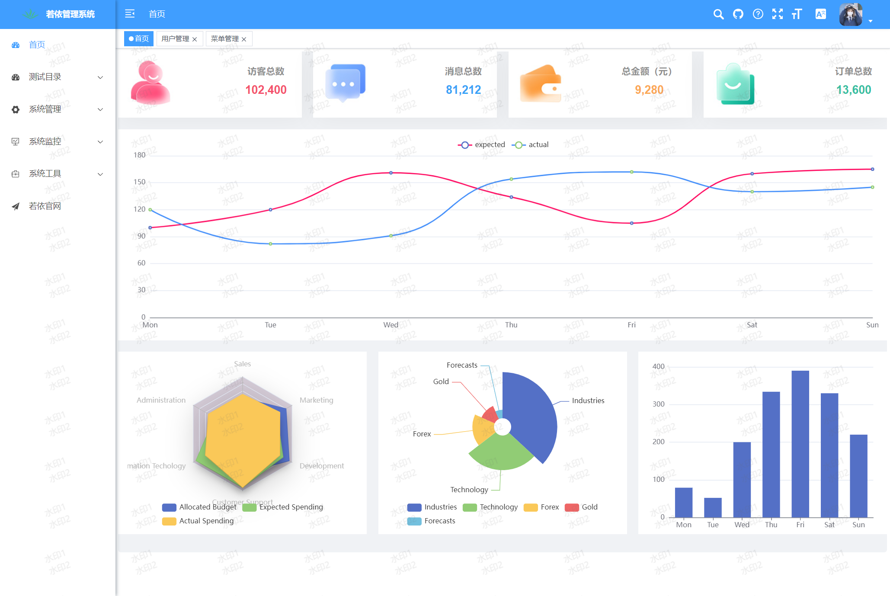

# 自定义主题+炫彩主题

[toc]

## 若依框架新增自定义主题风格

### 实现结果



### 实现步骤

 #### 默认主题的设置

文件位置：`src/settings.js`

```js
export default {
  // ...
  /**
   * 侧边栏主题 深色主题theme-dark，浅色主题theme-light，蓝色主题theme-blue，炫彩主题theme-shine
   */
  sideTheme: 'theme-blue',
  // ...
}
```

#### 布局设置


##### 图标文件

文件位置：`src/assets/images/blue.svg`

> 复制同级的 `light.svg` 修改名称即可，将两个颜色替换为：#409eff

```svg
<g id="配置面板" width="48" height="40" stroke="none" stroke-width="1" fill="none" fill-rule="evenodd">
    <g id="setting-copy-2" width="48" height="40" transform="translate(-1190.000000, -136.000000)">
        <g id="Group-8" width="48" height="40" transform="translate(1167.000000, 0.000000)">
            <g id="Group-5-Copy-5" filter="url(#filter-1)" transform="translate(25.000000, 137.000000)">
                <mask id="mask-3" fill="#409eff">
                    <use xlink:href="#path-2"></use>
                </mask>
                <g id="Rectangle-18">
                    <use fill="black" fill-opacity="1" filter="url(#filter-4)" xlink:href="#path-2"></use>
                    <use fill="#F0F2F5" fill-rule="evenodd" xlink:href="#path-2"></use>
                </g>
                <rect id="Rectangle-11" fill="#409eff" mask="url(#mask-3)" x="0" y="0" width="48" height="10"></rect>
                <rect id="Rectangle-18" fill="#FFFFFF" mask="url(#mask-3)" x="0" y="0" width="16" height="40"></rect>
            </g>
        </g>
    </g>
</g>
```

##### 布局组件

文件位置：`src/layout/components/Settings/index.vue`

> template模板中添加控件如下
>
> 新增一个主题风格选项，主要注意的是handleTheme里面的传参（后面会用到）和img的src图片，例如实例中的blue.svg

```html
<div class="setting-drawer-block-checbox-item" @click="handleTheme('theme-blue')">
  
  <div v-if="sideTheme === 'theme-blue'" class="setting-drawer-block-checbox-selectIcon" style="display: block;">
    <i aria-label="图标: check" class="anticon anticon-check">
      <svg viewBox="64 64 896 896" data-icon="check" width="1em" height="1em" :fill="theme" aria-hidden="true"
        focusable="false" class>
        <path
          d="M912 190h-69.9c-9.8 0-19.1 4.5-25.1 12.2L404.7 724.5 207 474a32 32 0 0 0-25.1-12.2H112c-6.7 0-10.4 7.7-6.3 12.9l273.9 347c12.8 16.2 37.4 16.2 50.3 0l488.4-618.9c4.1-5.1.4-12.8-6.3-12.8z" />
      </svg>
    </i>
  </div>
</div>
```

#### 准备CSS变量

文件位置：`src/assets/styles/variables.module.scss`

```scss
// 默认菜单主题风格
$base-menu-blue-color: rgba(0, 0, 0, 0.7);
$base-menu-blue-background: #ffffff;
$base-logo-blue-title-color: #ffffff;

$base-menu-shine-color: #ffffff;
$base-menu-shine-background: rgba(0, 0, 0, 0);
$base-logo-shine-title-color: #ffffff;

// ...

// 顶部菜单主题风格
$base-navbar-color: #999093;
$base-navbar-icon-color: #5a5e66;
$base-navbar-background: #ffffff;

$base-navbar-blue-color: #ffffff;
$base-navbar-blue-background: #409eff;

$base-navbar-shine-color: #ffffff;
$base-navbar-shine-background: rgba(0, 0, 0, 0);

// ...

:export {
	menuBlueColor: $base-menu-blue-color;
	menuBlueBackground: $base-menu-blue-background;
	logoBlueTitleColor: $base-logo-blue-title-color;
	menuShineColor: $base-menu-shine-color;
	menuShineBackground: $base-menu-shine-background;
	logoShineTitleColor: $base-logo-shine-title-color;
	navbarColor: $base-navbar-color;
	navbarIconColor: $base-navbar-icon-color;
	navbarBlueColor: $base-navbar-blue-color;
	navbarShineColor: $base-navbar-shine-color;
	navbarBackground: $base-navbar-background;
	navbarBlueBackground: $base-navbar-blue-background;
	navbarShineBackground: $base-navbar-shine-background;
    // ...
}
```

同级文件：`sidebar.scss` 

> 左侧menu菜单的背景色和悬停样式

```scss
//新增样式，大概在112行
& .theme-blue .nest-menu .el-sub-menu > .el-sub-menu__title,
& .theme-blue .el-sub-menu .el-menu-item {
  background-color: $base-menu-blue-background !important;
  &:hover {
    color: $base-navbar-blue-color;
    background-color: $base-navbar-blue-background !important;
  }
}
```


#### 对状态管理库中的主题名称进行匹配

> JS核心内容如下，若没有需手动添加。

```js
import variables from '@/assets/styles/variables.module.scss'
import useSettingsStore from '@/store/modules/settings'

const settingsStore = useSettingsStore();
const sideTheme = computed(() => settingsStore.sideTheme);
```

##### logo图标组件

文件位置：`src/layout/components/Sidebar/Logo.vue`

> 主要修改几个动态的style

```html
<template>
  <div class="sidebar-logo-container" :class="{ 'collapse': collapse }"
    :style="{ backgroundColor: sideTheme === 'theme-dark' ? variables.menuBackground : sideTheme === 'theme-blue' ? variables.navbarBlueBackground : variables.menuLightBackground }">
    <transition name="sidebarLogoFade">
      <router-link v-if="collapse" key="collapse" class="sidebar-logo-link" to="/">
        
        <h1 v-else class="sidebar-title"
          :style="{ color: sideTheme === 'theme-dark' ? variables.logoTitleColor : sideTheme === 'theme-blue' ? variables.logoBlueTitleColor : variables.logoLightTitleColor }">
          {{ title }}</h1>
      </router-link>
      <router-link v-else key="expand" class="sidebar-logo-link" to="/">
        
        <h1 class="sidebar-title"
          :style="{ color: sideTheme === 'theme-dark' ? variables.logoTitleColor : sideTheme === 'theme-blue' ? variables.logoBlueTitleColor : variables.logoLightTitleColor }">
          {{ title }}</h1>
      </router-link>
    </transition>
  </div>
</template>
```

##### 左侧导航栏菜单组件

文件位置：`src/layout/components/Sidebar/index.vue`

```html
<template>
  <div :class="{ 'has-logo': showLogo }"
    :style="{ backgroundColor: sideTheme === 'theme-dark' ? variables.menuBackground : sideTheme === 'theme-blue' ? variables.menuBlueBackground : variables.menuLightBackground }">
    <logo v-if="showLogo" :collapse="isCollapse" />
    <el-scrollbar :class="sideTheme" wrap-class="scrollbar-wrapper">
      <el-menu :default-active="activeMenu" :collapse="isCollapse"
        :background-color="sideTheme === 'theme-dark' ? variables.menuBackground : sideTheme === 'theme-blue' ? variables.menuBlueBackground : variables.menuLightBackground"
        :text-color="sideTheme === 'theme-dark' ? variables.menuColor : sideTheme === 'theme-blue' ? variables.menuBlueColor : variables.menuLightColor"
        :unique-opened="true" :active-text-color="theme" :collapse-transition="false" mode="vertical">
        <sidebar-item v-for="(route, index) in sidebarRouters" :key="route.path + index" :item="route"
          :base-path="route.path" />
      </el-menu>
    </el-scrollbar>
  </div>
</template>
```

> 样式文件专门对该组件进行了修改：`src/assets/styles/sidebar.scss`，若对侧边栏进行修改实现不了时，可查看是否是这里的问题，里面用了好多`!important`定义样式。

##### 顶部导航栏组件

文件位置：`src/layout/components/Navbar.vue`

> 添加了一个动态style，
>
> 头像右边的el-icon组件，添加了color属性

```html
<template>
  <div class="navbar"
    :style="{ backgroundColor: sideTheme === 'theme-dark' || sideTheme === 'theme-light' ? variables.navbarBackground : variables.navbarBlueBackground }">
	<!-- ... -->
        <div class="avatar-container">
        <el-dropdown @command="handleCommand" class="right-menu-item hover-effect" trigger="click">
          <div class="avatar-wrapper">
            
            <el-icon
              :color="sideTheme === 'theme-dark' || sideTheme === 'theme-light' ? variables.navbarIconColor : variables.navbarBlueColor"><caret-bottom /></el-icon>
          </div>
          <!-- ... -->
        </el-dropdown>
      </div>
  </div>
</template>
```

> 该文件下没有使用过主题名称匹配，需手动引入

该组件还引用了一些子组件，都需要对主题名称进行匹配

---

针对组件中使用到的svg-icon图标组件，修改如下：

> 组件都在`src/components`目录下，以文档地址图标为例，其他类似。

```html
<template>
  <div>
    <svg-icon icon-class="question" @click="goto"
      :color="sideTheme === 'theme-dark' || sideTheme === 'theme-light' ? variables.navbarIconColor : variables.navbarBlueColor" />
  </div>
</template>

<script setup>
import variables from '@/assets/styles/variables.module.scss'
import useSettingsStore from '@/store/modules/settings'

const settingsStore = useSettingsStore();
const sideTheme = computed(() => settingsStore.sideTheme);
// ...
</script>
```

---

控制左侧菜单栏收起展开的icon图标

文件位置：`src/components/Hamburger/index.vue`

> 给 svg 图标添加 `fill` 属性。

```html
<template>
  <div style="padding: 0 15px;" @click="toggleClick">
    <svg
      :class="{'is-active':isActive}"
      :fill="sideTheme === 'theme-dark' || sideTheme === 'theme-light' ? variables.navbarIconColor : variables.navbarBlueColor"
      class="hamburger"
      viewBox="0 0 1024 1024"
      xmlns="http://www.w3.org/2000/svg"
      width="64"
      height="64"
    >
      <path d="M408 442h480c4.4 0 8-3.6 8-8v-56c0-4.4-3.6-8-8-8H408c-4.4 0-8 3.6-8 8v56c0 4.4 3.6 8 8 8zm-8 204c0 4.4 3.6 8 8 8h480c4.4 0 8-3.6 8-8v-56c0-4.4-3.6-8-8-8H408c-4.4 0-8 3.6-8 8v56zm504-486H120c-4.4 0-8 3.6-8 8v56c0 4.4 3.6 8 8 8h784c4.4 0 8-3.6 8-8v-56c0-4.4-3.6-8-8-8zm0 632H120c-4.4 0-8 3.6-8 8v56c0 4.4 3.6 8 8 8h784c4.4 0 8-3.6 8-8v-56c0-4.4-3.6-8-8-8zM142.4 642.1L298.7 519a8.84 8.84 0 0 0 0-13.9L142.4 381.9c-5.8-4.6-14.4-.5-14.4 6.9v246.3a8.9 8.9 0 0 0 14.4 7z" />
    </svg>
  </div>
</template>

<script setup>
import variables from '@/assets/styles/variables.module.scss'
import useSettingsStore from '@/store/modules/settings'

const settingsStore = useSettingsStore();
const sideTheme = computed(() => settingsStore.sideTheme);
// ...
</script>
```

---

最后，是对面包屑导航的处理

> 对span标签 a标签，添加动态style

```html
<template>
  <el-breadcrumb class="app-breadcrumb" separator="/">
    <transition-group name="breadcrumb">
      <el-breadcrumb-item v-for="(item, index) in levelList" :key="item.path">
        <span
          :style="{ color: sideTheme === 'theme-dark' || sideTheme === 'theme-light' ? variables.navbarColor : variables.navbarBlueColor }"
          v-if="item.redirect === 'noRedirect' || index == levelList.length - 1" class="no-redirect">
          {{ item.meta.title }}</span>
        <a :style="{ color: sideTheme === 'theme-dark' || sideTheme === 'theme-light' ? variables.navbarColor : variables.navbarBlueColor }"
          v-else @click.prevent="handleLink(item)">{{ item.meta.title }}</a>
      </el-breadcrumb-item>
    </transition-group>
  </el-breadcrumb>
</template>
<script setup>
import variables from '@/assets/styles/variables.module.scss'
import useSettingsStore from '@/store/modules/settings'

const settingsStore = useSettingsStore();
const sideTheme = computed(() => settingsStore.sideTheme);
// ...
</script>
```

## 炫彩主题

炫彩主题与自定义主题方法类似。只是将他们的背景色去掉。

这里提供一种添加炫彩主题的思路


### 实现结果


### 实现步骤

#### 布局设置

找一张图片，放入位置：`src/assets/images/theme-bg.jpg`

##### 布局组件

文件位置：`src/layout/components/Settings/index.vue`

> 为了样式美观，给img标签添加了style属性，svg图标填充颜色设为白色：`fill='#ffffff'`

```html
<div class="setting-drawer-block-checbox-item" @click="handleTheme('theme-shine')">
  
  <div v-if="sideTheme === 'theme-shine'" class="setting-drawer-block-checbox-selectIcon" style="display: block;">
    <i aria-label="图标: check" class="anticon anticon-check">
      <svg viewBox="64 64 896 896" data-icon="check" width="1em" height="1em" fill="#ffffff" aria-hidden="true"
        focusable="false" class>
        <path
          d="M912 190h-69.9c-9.8 0-19.1 4.5-25.1 12.2L404.7 724.5 207 474a32 32 0 0 0-25.1-12.2H112c-6.7 0-10.4 7.7-6.3 12.9l273.9 347c12.8 16.2 37.4 16.2 50.3 0l488.4-618.9c4.1-5.1.4-12.8-6.3-12.8z" />
      </svg>
    </i>
  </div>
</div>
```

> 炫彩主题需要背景色透明，不能实现固定header

```html
<div class="drawer-item">
  <span>固定 Header</span>
  <span class="comp-style">
    <!-- 炫彩主题需要背景色透明，不能实现固定header -->
    <el-switch v-model="fixedHeader" class="drawer-switch" :disabled="sideTheme === 'theme-shine'" />
  </span>
</div>
```

> 核心代码：
>
> 页面加载时向body元素中插入一个img元素，切换主题时控制img元素的显示/隐藏。
>
> `handleTheme()`是主题切换时触发的函数。

```js
import exampleImg from '@/assets/images/theme-bg.jpg'

// ...
// 在body下插入一个img元素，作为炫彩主题的背景
const body = document.querySelector('body');
const img = document.createElement('img');
img.setAttribute('src', exampleImg);
img.style.minWidth = '100%';
img.style.minHeight = '100%';
img.style.position = 'fixed';
img.style.left = '0';
img.style.top = '0';
img.style.zIndex = '-1';
// 获取当前主题名称，若当不是炫彩主题，将其隐藏
if (settingsStore.sideTheme !== 'theme-shine') {
  img.style.display = 'none';
}
body.appendChild(img);
function handleTheme(val) {
  // 选中炫彩主题，并且背景图为隐藏状态
  if (val == 'theme-shine' && img.style.display == 'none') {
    img.style.display = 'inline-block';
    // 炫彩主题需要背景色透明，不能实现固定header
    fixedHeader.value = false;
  } else {
    img.style.display = 'none';
  }
  settingsStore.changeSetting({ key: 'sideTheme', value: val })
  sideTheme.value = val;
}
// ...
```

#### 其他

剩下的修改的地方与上面类似。

下面是炫彩主题特有的：

##### 展示内容的路由出口

文件位置：`src/layout/components/AppMain.vue`

> 添加动态style属性
>
> 样式修改如下：主要是让.app-main控件看着更舒服

```html
<template>
  <section class="app-main" :style="{ opacity: sideTheme === 'theme-shine' ? 0.9 : 1 }">
    <!-- ... -->
  </section>
</template>

<script setup>
import useSettingsStore from '@/store/modules/settings'

const settingsStore = useSettingsStore();
const sideTheme = computed(() => settingsStore.sideTheme);
</script>

<style lang="scss" scoped>
.app-main {
  border-radius: 5px;
  margin: 5px;
  background-color: rgba(255, 255, 255, 1);
  /* 50= navbar  50  */
  // min-height: calc(100vh - 50px);
  // width: 100%;
  position: relative;
  overflow: hidden;
}

.fixed-header+.app-main {
  padding-top: 50px;
}

.hasTagsView {
  .app-main {
    /* 84 = navbar + tags-view = 50 + 34 */
    // min-height: calc(100vh - 84px);
  }

  .fixed-header+.app-main {
    padding-top: 84px;
  }
}
</style>
```

##### 布局设置-开启topNav后，顶部展示的组件

组件位置：`src/components/TopNav/index.vue`

> 添加两个动态`:background-color`属性
>
> （这里改的比较粗糙，用到的时候再详细修改）

```html
<template>
  <el-menu
    :background-color="sideTheme === 'theme-shine' ? ' variables.navbarShineBackground' : variables.navbarBackground"
    :default-active="activeMenu" mode="horizontal" @select="handleSelect" :ellipsis="false">
    <!-- ... -->

    <!-- 顶部菜单超出数量折叠 -->
    <el-sub-menu
      :background-color="sideTheme === 'theme-shine' ? ' variables.navbarShineBackground' : variables.navbarBackground"
      :style="{ '--theme': theme }" index="more" v-if="topMenus.length > visibleNumber">
      <template #title>更多菜单</template>
      <!-- ... -->
    </el-sub-menu>
  </el-menu>
</template>
```

##### 打开页面切换的TagesViews

文件位置：`src/layout/components/TagsView/index.vue`

> 添加动态style属性。

```html
<template>
  <div :style="{ background: sideTheme === 'theme-shine' ? variables.navbarShineBackground : variables.navbarBackground }"
    id="tags-view-container" class="tags-view-container">
    <!-- ... -->
  </div>
</template>
```

> 补充非显示页面的标签样式

```js
// ...
import variables from '@/assets/styles/variables.module.scss'

const settingsStore = useSettingsStore();
const sideTheme = computed(() => settingsStore.sideTheme);


// ...

function activeStyle(tag) {
  if (!isActive(tag)) return {
    'color': sideTheme.value === 'theme-shine' ? variables.navbarShineColor : '',
    'background-color': sideTheme.value === 'theme-shine' ? variables.navbarShineBackground : ''
  };
  return {
    "background-color": theme.value,
    "border-color": theme.value
  };
}
```

好了，圆满结束。
