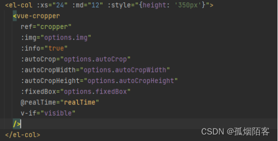
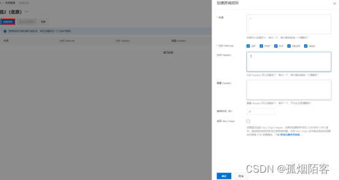
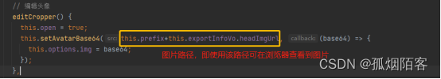

# [裁剪区域头像回显的跨域问题](https://blog.csdn.net/m0_65410121/article/details/124496068) 

使用若依的小伙伴都知道，若依的头像上传默认是创建文件夹保存图片，但我们在实际开发中常常需要把图片保存在oss上，当我们修改头像后，再次修改头像就会出现跨域问题，裁剪区域无法显示图片，下面我将分享一下我的解决办法：

**1.出现跨域，是使用了vue-cropper组件**

 

**2.配置oss存放图片的bucket跨域规则，可设\*，视为不作限制**



3.将图片转为base64格式展现



 

```java
// 设置头像base64
setAvatarBase64(src, callback) {
  let _this = this;
  let image = new Image();
  // 处理缓存
  image.src = src + '?v=' + Math.random();
  // 支持跨域图片
  image.crossOrigin = "*";
  image.onload = function () {
    let base64 = _this.transBase64FromImage(image);
    callback && callback(base64);
  }
},
// 将网络图片转换成base64格式
transBase64FromImage(image) {
  let canvas = document.createElement("canvas");
  canvas.width = image.width;
  canvas.height = image.height;
  let ctx = canvas.getContext("2d");
  ctx.drawImage(image, 0, 0, image.width, image.height);
  // 可选其余值 image/jpeg
  return canvas.toDataURL("image/png");
}
```

------

 这样就可以正常显示啦，当然眼尖小伙伴会注意到 `_this = this` 这一步，或许有的小伙伴会疑惑，为什么不直接使用 `this`？其实 `this` 的指向是会改变，当在`mage.onload = function (){}`里面 `this` 便指向了 `image`，于是我们提前把 `this` 赋给 `_this` 指向Vue实例，才能调用 `transBase64FromImage` 方法。

推荐参考：

[vue-cropper组件跨域解决](https://blog.csdn.net/weixin_42408648/article/details/112158015)

[this作用域](https://blog.csdn.net/love_pgme/article/details/86064871)

[this指向](https://blog.csdn.net/grand_brol/article/details/107284996)