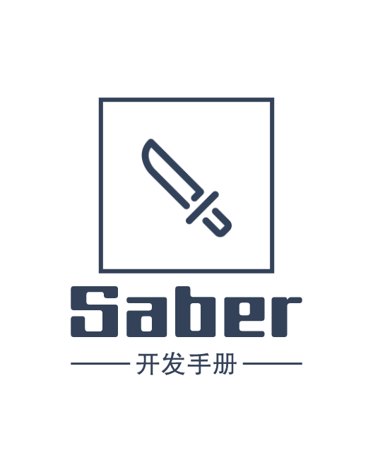

# 简介

*   BladeX 是一个基于 Spring Boot 2 & Spring Cloud Greenwich & Mybatis 等核心技术，用于快速构建中大型系统的基础框架。
*   已稳定生产近一年，经历了从Camden->Greenwich的技术架构，也经历了从FatJar->Docker->K8S+Jenkins的部署架构。
*   采用前后端分离的模式，前端开发两个框架：Sword(基于React、Ant Design)、Saber(基于Vue、ElementUI)。
*   后端采用SpringCloud系列，对其基础组件做了高度的封装，单独出一个后端核心框架：BladeX-Tool。
*   BladeX-Tool已推送至Maven私有库，直接引入减少工程的模块与依赖，可更注重于业务开发。
*   集成Sentinel从流量控制、熔断降级、系统负载保护等多个维度保护服务的稳定性。
*   注册中心、配置中心选型Nacos，为工程瘦身的同时加强了各模块之间的联动。
*   封装集成了基于注解+Web可视化的数据权限，灵活配置，无需重启直接生效。
*   定制了基于Nacos的轻量级、高拓展性的动态网关，完美支持多团队开发。
*   精心设计集成了minio，完美支持多租户模式下的oss对象存储需求。
*   Traefik反向代理，监听后台变化自动化应用新的配置文件。
*   集成Oauth2协议，完美支持多终端的接入与认证授权。
*   项目分包明确，规范微服务的开发模式。

# 商业授权说明

## 版权声明
* BladeX是一个商业化软件，系列产品知识产权归**上海布雷德网络科技**独立所有
* 您一旦开始复制、下载、安装或者使用本产品，即被视为完全理解并接受本协议的各项条款
* 更多详情请看：[商业协议](第0章 序/0.7商用协议.md)

## 答疑流程
>1. 遇到问题或Bug
>2. 业务型问题打断点调试尝试找出问题所在
>3. 系统型问题通过百度、谷歌、社区查找解决方案
>4. 未解决问题则进入技术社区进行发帖提问：[https://sns.bladex.vip/](https://sns.bladex.vip/)
>5. 将帖子地址发至商业群，特别简单三言两语就能描述清楚的也可在答疑时间内发至商业群提问
>6. 发帖的时候一定要描述清楚，详细描述遇到问题的**重现步骤**、**报错详细信息**、**相关代码与逻辑**、**使用软件版本**以及**操作系统版本**，否则随意发帖提问将会提高我们的答疑难度。

## 答疑时间
* 工作日：9:00 ~ 17:00 提供答疑，周末、节假日休息，暂停答疑
* 请勿**私聊提问**，以免被其他用户的消息覆盖从而无法获得答疑
* 答疑时间外遇到问题可以将问题发帖至[技术社区](https://sns.bladex.vip/)，我们后续会逐个回复

## 授权范围
* 专业版：只可用于**个人学习**及**个人私活**项目，不可用于公司或团队，不可泄露给任何第三方
* 企业版：可用于**企业名下**的任何项目，企业版员工在**未购买**专业版授权前，只授权开发**所在授权企业名下**的项目，**不得将BladeX用于个人私活**
* 共同遵守：若甲方需要您提供项目源码，则需代为甲方购买BladeX企业授权，甲方购买后续的所有项目都无需再次购买授权

## 商用权益
* ✔️ 遵守[商业协议](第0章 序/0.7商用协议.md)的前提下，将BladeX系列产品用于授权范围内的商用项目，并上线运营
* ✔️ 遵守[商业协议](第0章 序/0.7商用协议.md)的前提下，不限制项目数，不限制服务器数
* ✔️ 遵守[商业协议](第0章 序/0.7商用协议.md)的前提下，将自行编写的业务代码申请软件著作权

## 何为侵权
* ❌ 不遵守商业协议，私自销售商业源码
* ❌ 以任何理由将BladeX源码用于申请软件著作权
* ❌ 将商业源码以任何途径任何理由泄露给未授权的单位或个人
* ❌ 开发完毕项目，没有为甲方购买企业授权，向甲方提供了BladeX代码
* ❌ 基于BladeX拓展研发与BladeX有竞争关系的衍生框架，并将其开源或销售

## 侵权后果
* 情节较轻：第一次发现警告处理
* 情节较重：封禁账号，踢出商业群，并保留追究法律责任的权利
* 情节严重：与本地律师事务所合作，以公司名义起诉侵犯计算机软件著作权

## 举报有奖
* 向官方提供有用线索并成功捣毁盗版个人或窝点，将会看成果给予 500～10000 不等的现金奖励
* 官方唯一指定QQ：1272154962
