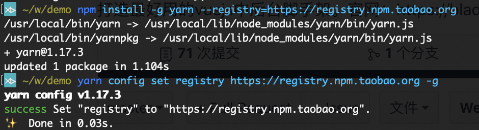
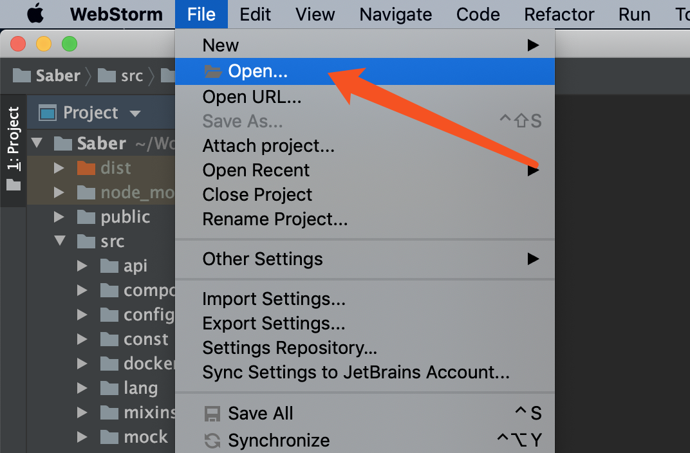
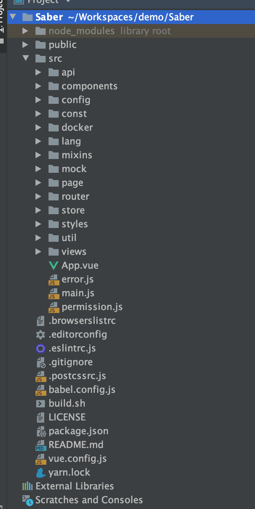

# 前端安装
## 复制git地址
1.  进入`Saber`项目首页：
* 商业版：[https://git.bladex.vip/blade/Saber](https://git.bladex.vip/blade/Saber)
* 商业版购买地址：[https://bladex.vip/#/vip](https://bladex.vip/#/vip)
2.  复制`Saber`的`git`地址: https://git.bladex.vip/blade/Saber.git
3. 进入对应目录后克隆代码(windows可以用git bash客户端)

## 安装工程
1. 安装yarn并配置淘宝源

~~~cpp
> npm install -g yarn --registry=https://registry.npm.taobao.org
~~~
~~~cpp
> yarn config set registry https://registry.npm.taobao.org -g
~~~

2. 进入Saber根目录进行安装
~~~
> cd Saber
~~~
~~~
> yarn install
~~~

## 导入工程
1. 打开WebStorm，点击File选择Open

2. 找到对应目录的工程，并打开

3. 看到如下界面则说明导入成功

