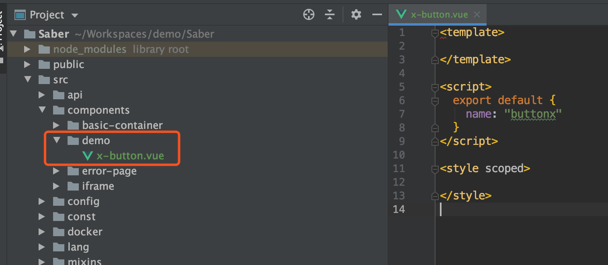
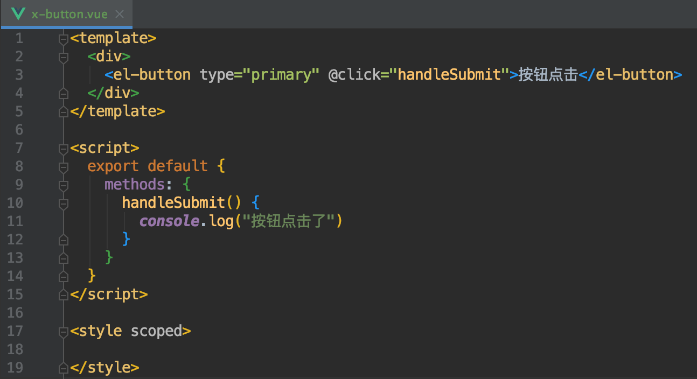
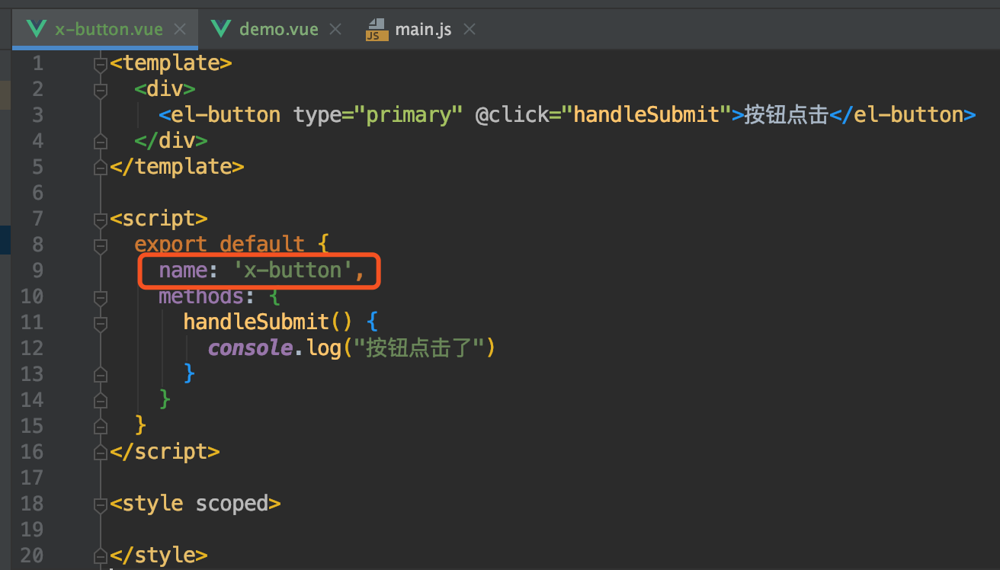
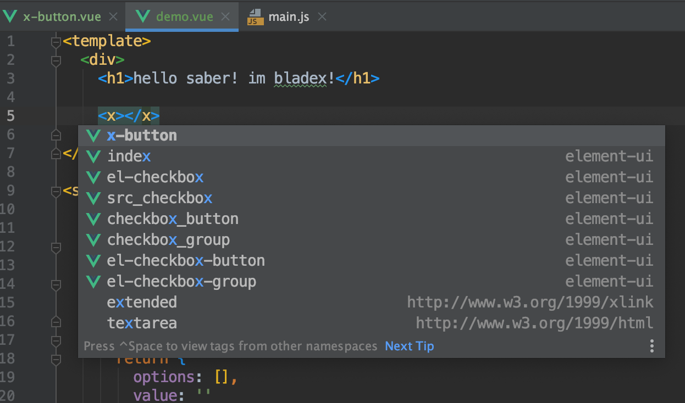
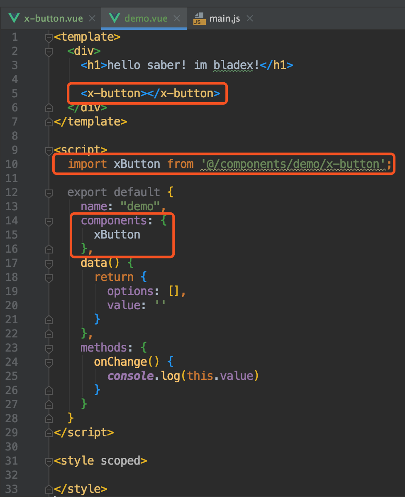
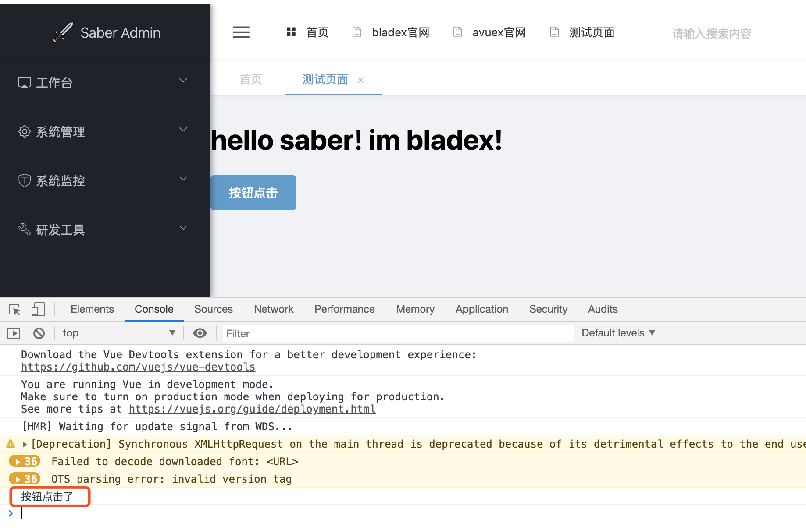
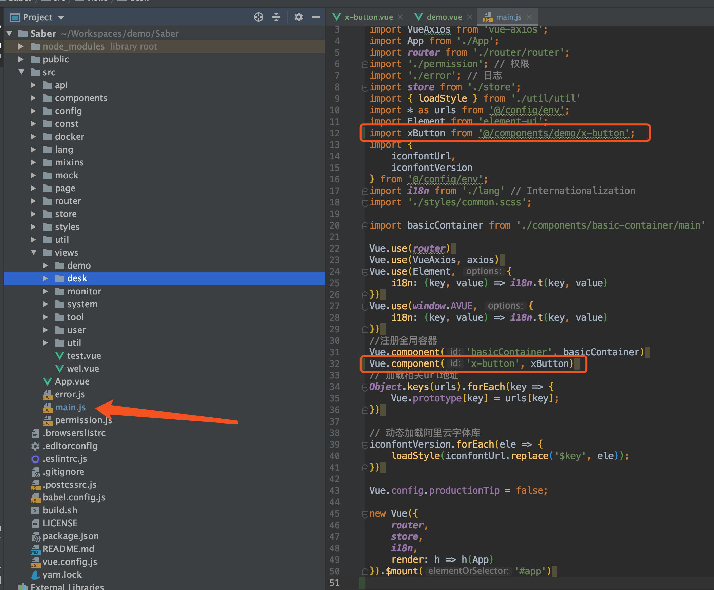
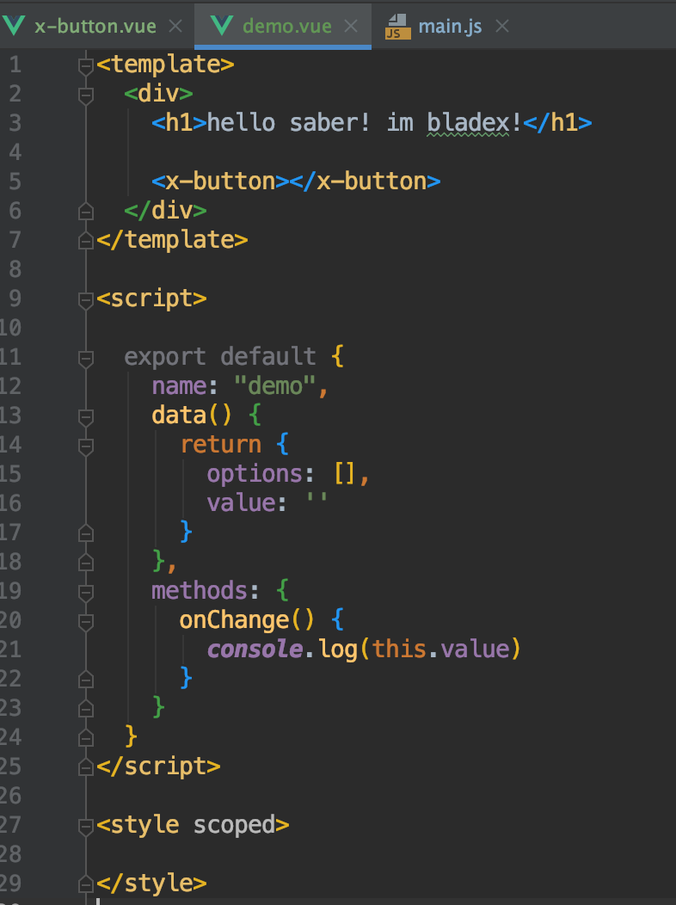
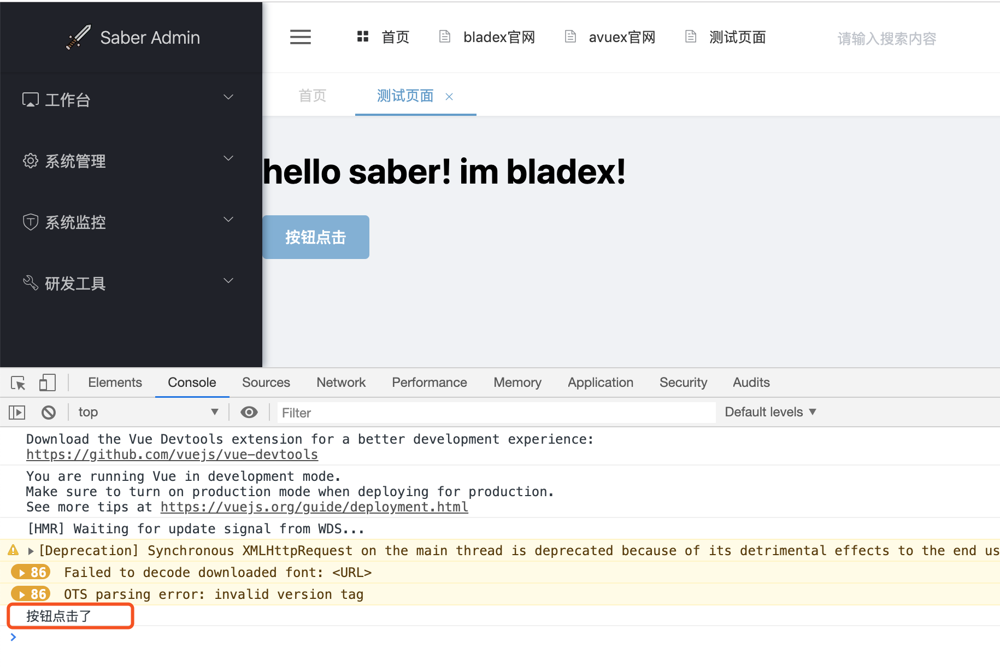

## 前言
一般来说，ElementUI提供的都是基础组件，而在我们进行业务开发的时候，会经常有多个组件组合在一起并且会被高频调用的情况，所以这时候就用到自定义组件，那么下面我们来看下如何制作一个最简单的自定义组件。

## 自定义组件制作
1. 一般自定义组件都放在components文件夹中，找到后打开目录，新建一个demo文件夹和一个x-button的vue文件

2. 我们加上最简单逻辑的代码，封装一个组件`x-button`，使之加载后自带点击事件

3. 我们再到一开始的Demo页面引入这个自定义组件，查看是否生效
4. 这里有两种方式引入自定义组件，一种是局部引入，一种是全局引入，下面我们来看一下两种方式分别如何操作
* 局部引入

这里可以看到，x-button.vue文件name设定为`x-button`，在demo.vue引入的时候为驼峰的xButton，挂载在components属性下，这样一来便可以使用x-button组件直接引入了。
打开页面，点击按钮发现方法执行成功

* 全局引入

打开页面，发现效果与局部加载一致

## 结尾语
看到这，相信大家已经知道如何自定义一个最简单而又功能兼备的组件，掌握其中主要知识点，再在这基础上自行拓展，相信大家都可以写出很棒的定制型组件！
