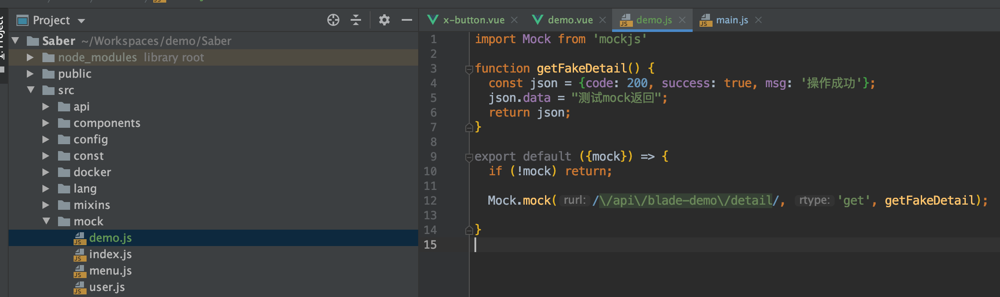
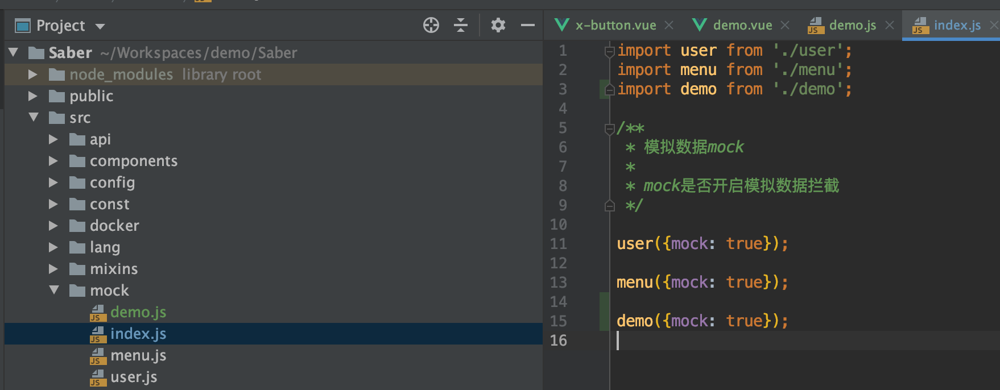

## Mock简介
* Mock是模拟对象的意思，用于进行被测组件对外依赖的模拟。
* Mock 是测试驱动开发必备之利器, 只要有状态, 有依赖, 做单元测试就不能没有 Mock  
* 在 API 或 集成测试的时候, 如果依赖于第三方的 API, 也时常使用 mock server 或 mock proxy

## 如何使用
Saber已经完美集成了Mock，可以很方便地模拟动静态数据，达到对接服务端的真实性与准确性。下面我们来看下如何在Saber中使用Mock
1. 我们到mock文件夹下创建demo.js

2. 在mock文件夹下的index.js配置加载

3. 这样一来，一个简单的mockAPI就配置好了
4. 更多Mock详细教程请看：[https://segmentfault.com/a/1190000014844604](https://segmentfault.com/a/1190000014844604)
