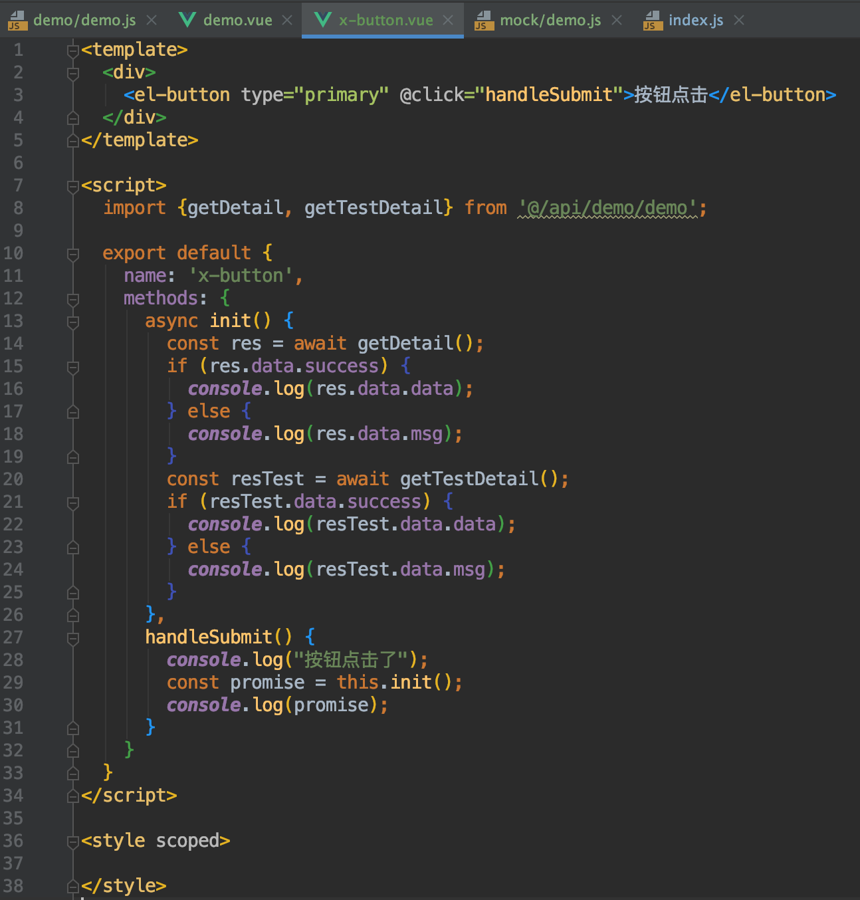
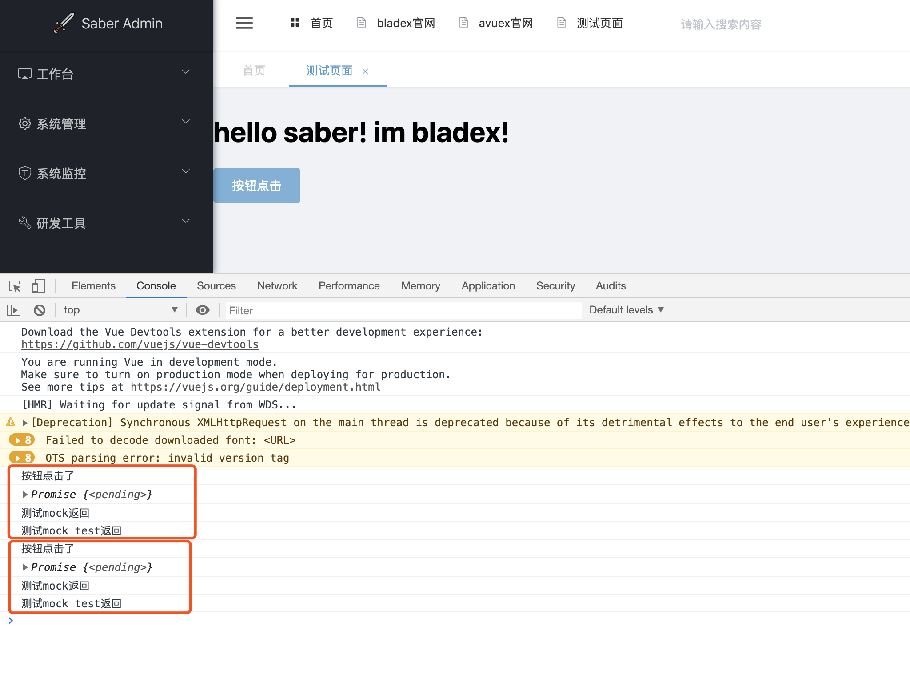

## 前言
* 现在我们结合之前所学，将自定义组件、mock数据、api调用整合在一起。
* 拓展x-button组件，在外部传入参数，组件内部点击后调用api后将返回打印至控制台

## 开始集成
1. 我们将Demo模块中的部分代码拷贝至x-button组件中

2. 可以看到，现在是每次点击按钮后，进行调用接口，并且将返回打印在控制台中
3. 打开系统点击按钮查看控制台，点击两次按钮发现调用成功

## 放上相关代码
* 希望大家都能把代码都手动敲出来，而不是直接复制粘贴
* `/views/demo/demo.vue` ：
~~~
<template>
  

    <h1>hello saber! im bladex!</h1>

    <x-button></x-button>
  

</template>

~~~

* `/components/demo/x-button.vue` ：
~~~
<template>
  

    <el-button type="primary" @click="handleSubmit">按钮点击</el-button>
  

</template>

~~~
