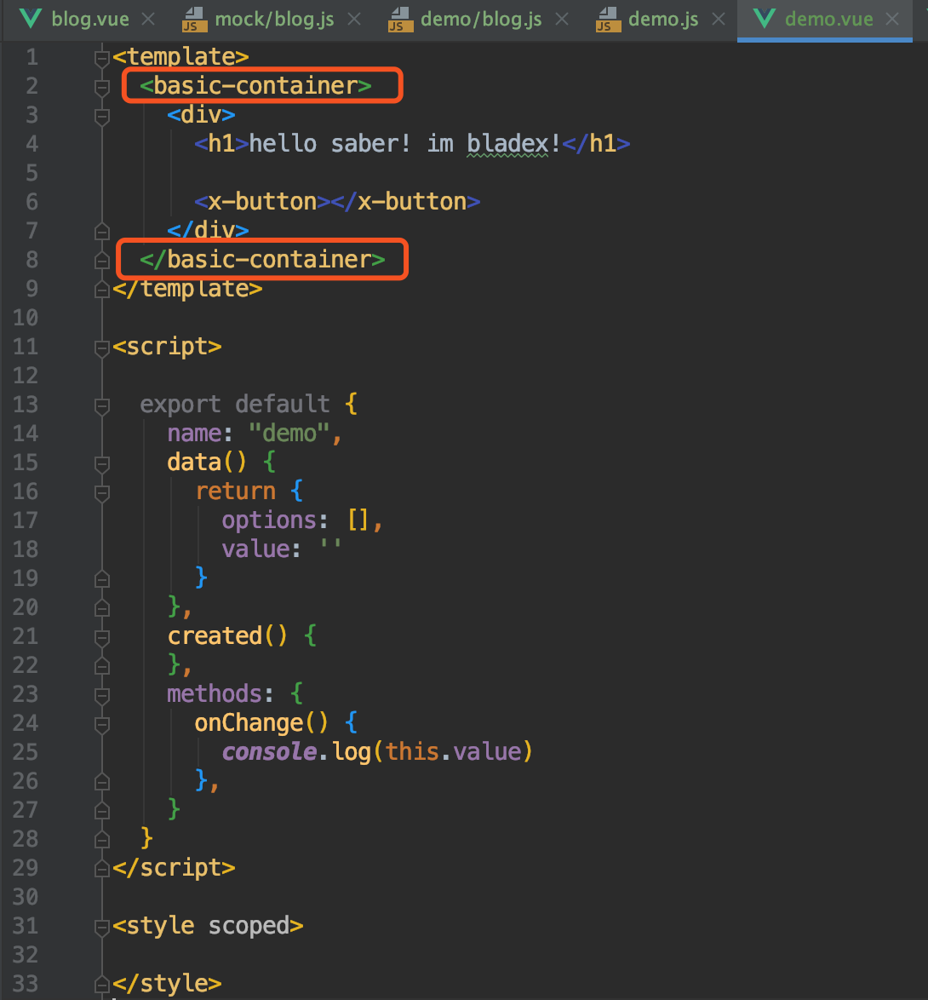
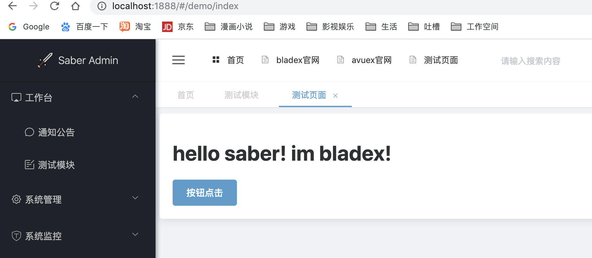
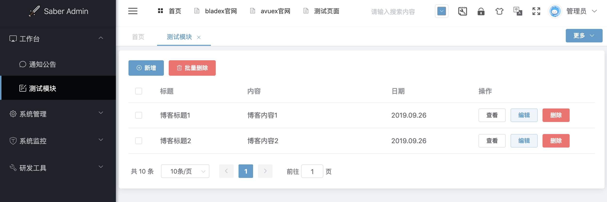

## 新建列表页面
1. 我们先做一个最简单的列表页面
2. 列表页面完整代码如下：
~~~
<template>
  <basic-container>
    <el-row>
      <el-col :span="24">
        

          <el-button type="primary" icon="el-icon-circle-plus-outline" size="small" @click="handleAdd">新增</el-button>
          <el-button type="danger" icon="el-icon-delete" size="small" @click="handleMultiDelete">批量删除</el-button>
        

      </el-col>
    </el-row>
    <el-row>
      <el-table
        :data="data"
        @selection-change="selectChange"
        style="width: 100%">
        <el-table-column
          prop="id"
          type="selection"
          width="55">
        </el-table-column>
        <el-table-column
          prop="title"
          label="标题"
          width="180">
        </el-table-column>
        <el-table-column
          prop="content"
          label="内容">
        </el-table-column>
        <el-table-column
          prop="time"
          label="日期"
          width="180">
        </el-table-column>
        <el-table-column label="操作" fixed="right" width="250">
          <template slot-scope="scope">
            <el-button
              size="mini"
              type=""
              plain
              @click="handleView(scope.$index, scope.row)">查看
            </el-button>
            <el-button
              size="mini"
              type="primary"
              plain
              @click="handleEdit(scope.$index, scope.row)">编辑
            </el-button>
            <el-button
              size="mini"
              type="danger"
              @click="handleDelete(scope.$index, scope.row)">删除
            </el-button>
          </template>
        </el-table-column>
      </el-table>
    </el-row>
    <el-row>
      <el-pagination
        background
        :page-sizes="[10, 20, 30, 50]"
        :page-size="10"
        layout="total, sizes, prev, pager, next, jumper"
        @size-change="sizeChange"
        @current-change="currentChange"
        :total="page.total">
      </el-pagination>
    </el-row>
  </basic-container>
</template>

~~~
3. 我们来详细分析每一个代码块的作用及目的
* `<basic-container>` 标签将整个页面包裹在定义好样式的容器内，另布局界面更美观
* 我们改造下demo.vue文件便能看到比之前更好的效果

* 如下代码代表在页面新建一行，定义两个按钮，并用`@click`指定了对应的点击事件
~~~
<el-row>
  <el-col :span="24">
    

      <el-button type="primary" icon="el-icon-circle-plus-outline" size="small" @click="handleAdd">新增</el-button>
      <el-button type="danger" icon="el-icon-delete" size="small" @click="handleMultiDelete">批量删除</el-button>
    

  </el-col>
</el-row>
~~~
* 如下代码代表在页面定义表格控件，用`:data`绑定指定的数据，以及用`@selection-change`绑定选中后的事件
~~~
<el-table
  :data="data"
  @selection-change="selectChange"
  style="width: 100%">
~~~
* 如下代码代表在`el-table`组件内定义了`选项框`、`标题`、`内容`、`日期`的字段
~~~
<el-table-column
  prop="id"
  type="selection"
  width="55">
</el-table-column>
<el-table-column
  prop="title"
  label="标题"
  width="180">
</el-table-column>
<el-table-column
  prop="content"
  label="内容">
</el-table-column>
<el-table-column
  prop="time"
  label="日期"
  width="180">
</el-table-column>
~~~
* 如下代码代表定加入操作栏，并且定义了`查看`、`编辑`、`删除`三个按钮以及他们对应的点击事件
~~~
<el-table-column label="操作" fixed="right" width="250">
  <template slot-scope="scope">
    <el-button
      size="mini"
      type=""
      plain
      @click="handleView(scope.$index, scope.row)">查看
    </el-button>
    <el-button
      size="mini"
      type="primary"
      plain
      @click="handleEdit(scope.$index, scope.row)">编辑
    </el-button>
    <el-button
      size="mini"
      type="danger"
      @click="handleDelete(scope.$index, scope.row)">删除
    </el-button>
  </template>
</el-table-column>
~~~
* 如下代码定义了分页组件，并绑定了`size-change`与`current-change`两个事件
~~~
<el-pagination
  background
  :page-sizes="[10, 20, 30, 50]"
  :page-size="10"
  layout="total, sizes, prev, pager, next, jumper"
  @size-change="sizeChange"
  @current-change="currentChange"
  :total="page.total">
</el-pagination>
~~~
* 如下代码则是定义了vue的各种事件，与table组件相互绑定
~~~

~~~

4.  下面我们刷新页面，查看下具体效果

5. 我们发现分页距离表格太靠近了，这样不美观，需要做一下样式处理，在最下方加入如下样式
~~~

~~~
6. 再次刷新页面，发现样式调整恰到好处

7. 最简单的列表页已经完成，下面几章我们来分别处理增改查三个对应的操作
