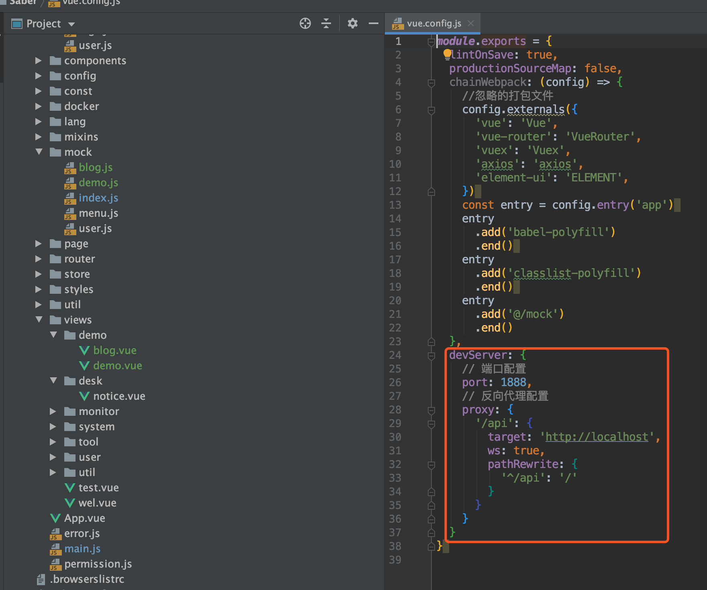

## 什么是反向代理
反向代理是指以代理服务器来接受internet上的连接请求，然后将请求转发给内部网络上的服务器，并将从服务器上得到的结果返回给internet上请求连接的客户端，此时代理服务器对外就表现为一个反向代理服务器。

## 为什么要用反向代理
前端与后端接口对接的时候，若只使用完整的api链接，或者后端api不做处理的话，会造成跨域。从而无法正常调用到接口。这时候就需要将接口代理到本地以此来消除跨域生成的条件，这样一来就可以顺利调用api了。
## 如何使用反向代理
* 找到vue.config.js，大家可以自行定义相关配置
* port为saber启动后占用的端口（若已经被使用，则会自动+1）
* target则代表需要反向代理的地址
* 若原先的接口地址为`http://localhost/token`，经过反向代理后，则会变成`http://localhost:1888/api/token`
* 这样一来，将外部的接口代理到前端本地，这样就不会存在跨域的情况了
* 同理部署在生产服务器上时，使用nginx进行反向代理的配置，同样能轻松解决跨域带来的问题

