## 表格组件
* 组件文档：[https://avuejs.com/doc/crud/crud-doc](https://avuejs.com/doc/crud/crud-doc)
* 可以看到，官网的组件文档非常全，查看对应例子
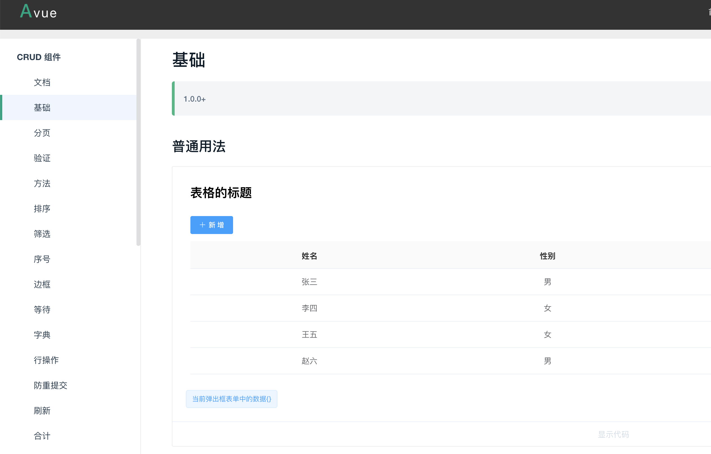
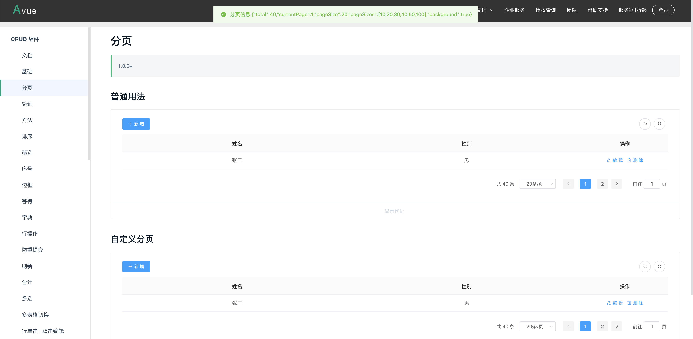
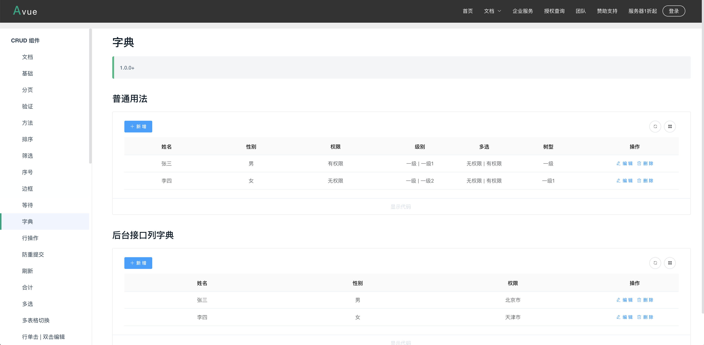
* 找一个基础的demo，进行集成
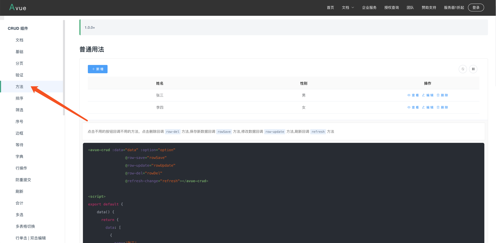
* 将代码拷贝至最开始的demo.vue文件
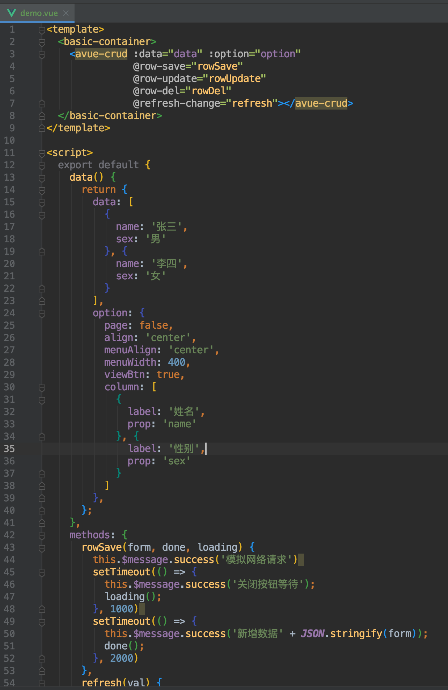
* 刷新页面查看效果，发现已经完整展现了crud功能
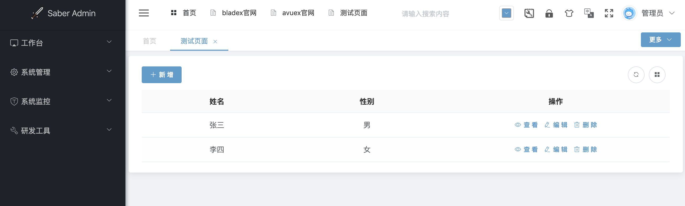
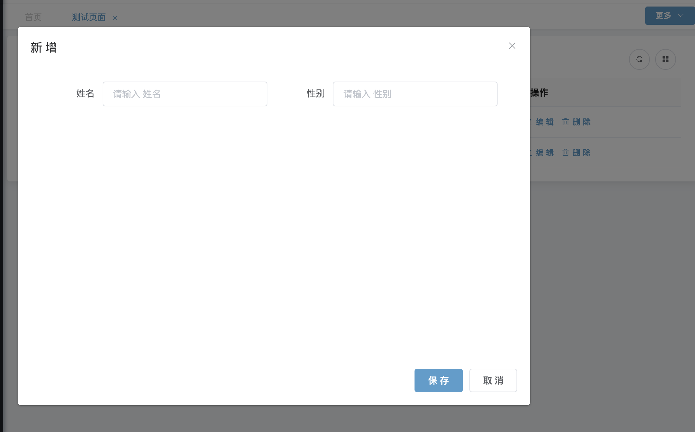
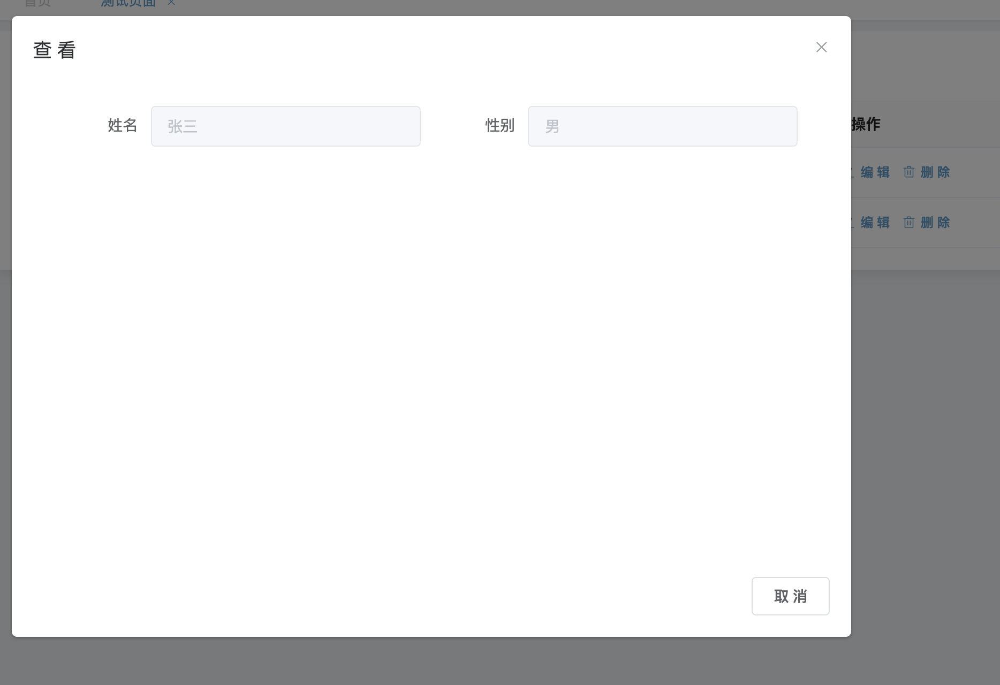

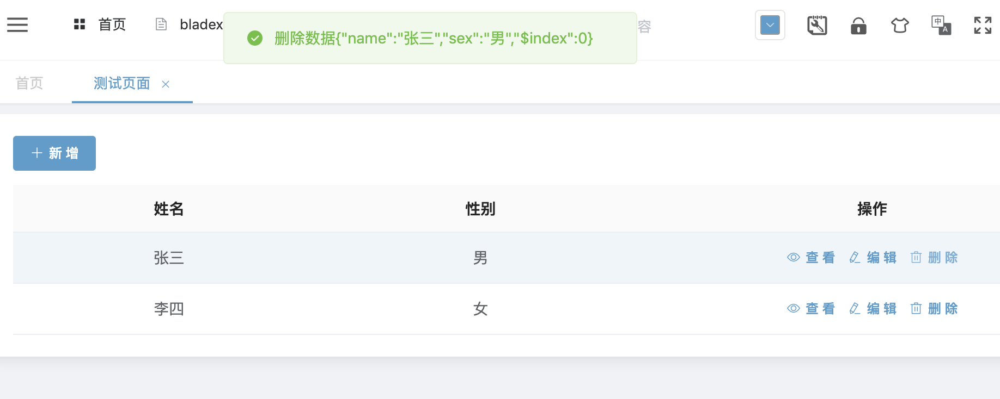
* 有些情况，默认的配置无法满足我们的要求，比需要给字典项加上背景来突出显示，这时候我们可以通过卡槽来定义
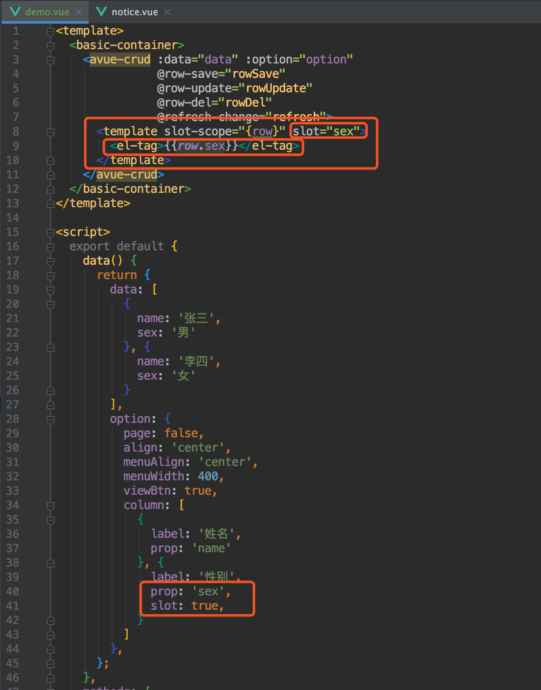
* 再次刷新页面，发现表格的自定义卡槽生效（表单的自定义卡槽将在下一章介绍）
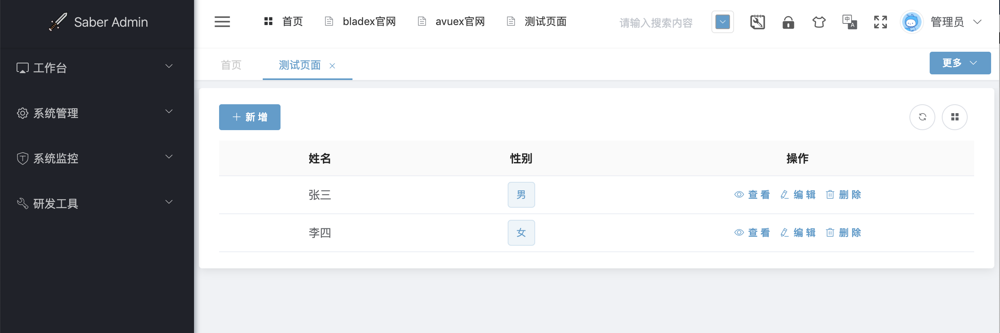
* 与之前的ElementUI原生写法相对比，avue的方式为我们省了很多精力。几乎所有的操作都使用json驱动配置就能实现我们想要的效果
* 具体的配置，我们可以查看文档与例子进行拓展：[https://avuejs.com/doc/crud/crud-doc](https://avuejs.com/doc/crud/crud-doc)

