## 优化前端效果
1. 点击新增，发现都为text类型，时间不是组件，内容也不是文本域，还多处了主键字段。
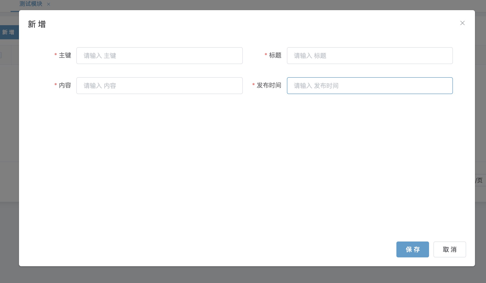
2. 因为代码生成默认的表单控件属性为text，所以针对一些组件，我们需要进行手动配置，就这个模块而言，我们需要删掉id和配置content字段和time字段的组件属性
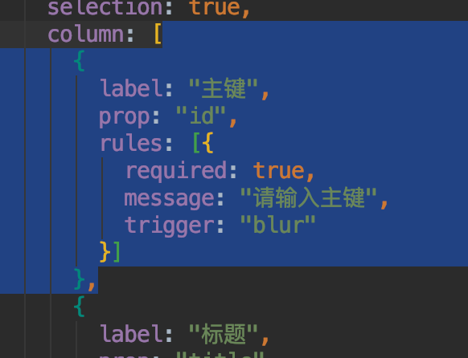
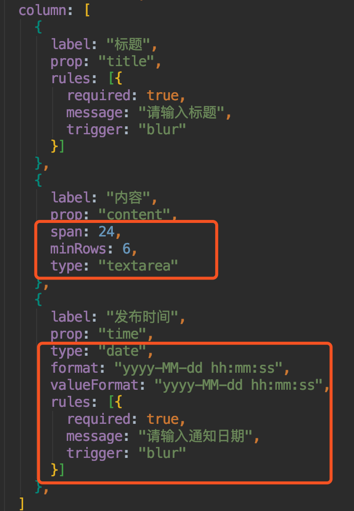
3. 刷新页面再次打开新增，发现组件类型正确，但是布局并不是很好看

4. 我们把时间挪上去，发现排列美观了

5. 如果想每个控件占用一行，我们可以如此配置
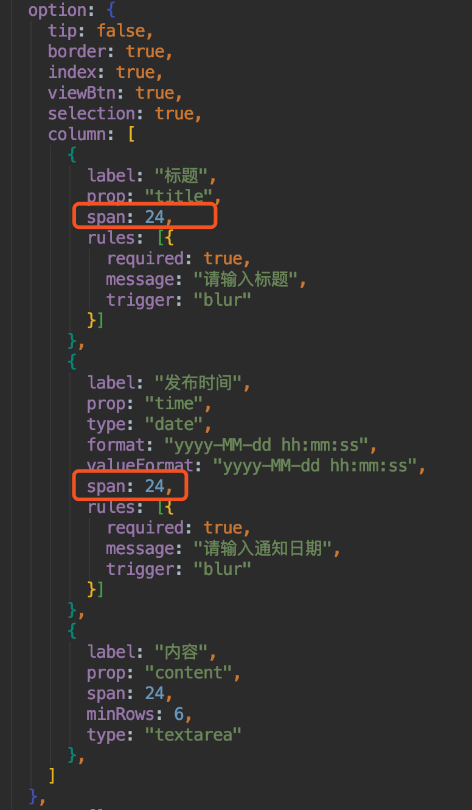
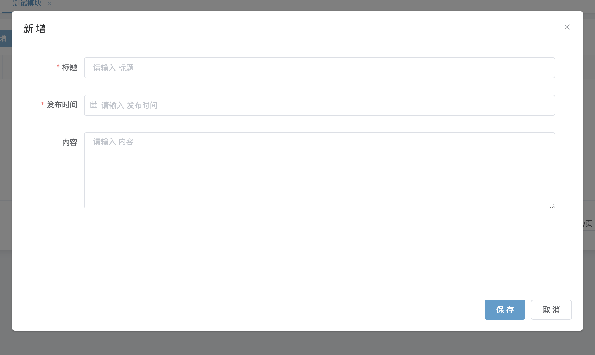
6. 如果觉得弹框太高，我们可以进行高度设置
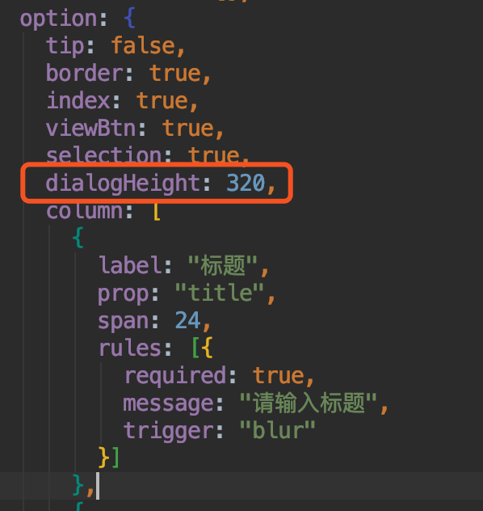

7. 这样一来，界面就美观多了

## 新增测试
* 输入相应的值，点击保存，提示成功
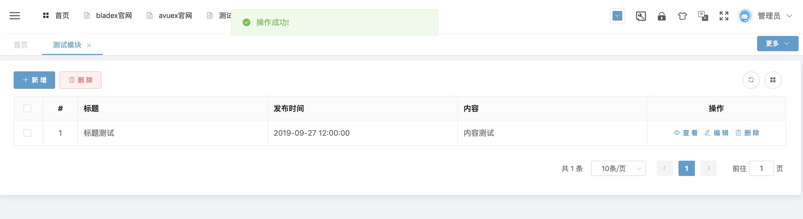

## 查看测试
* 点击查看，数据加载无误
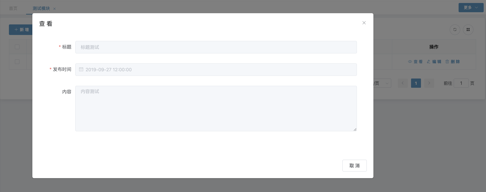

## 编辑测试
* 点击编辑，并修改一条数据，修改也成功

## 删除测试
* 将刚刚新增的数据删除，提示成功
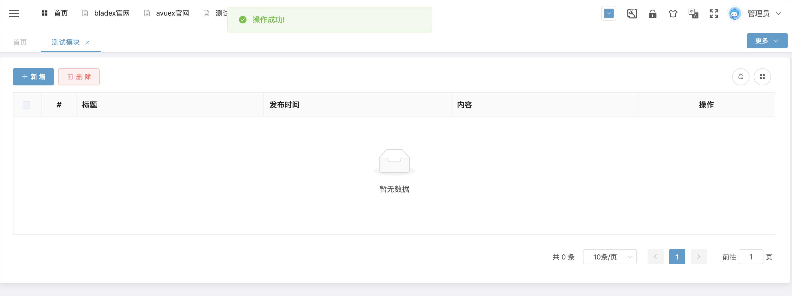

## 分页测试
* 手动新增11条数据，发现分页成功
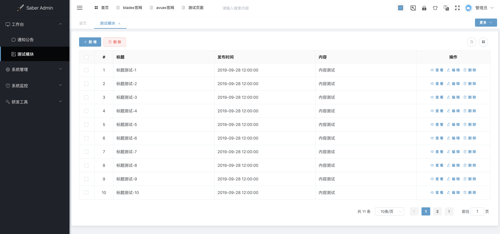

## 查询测试
* 在标题的字段上增加属性
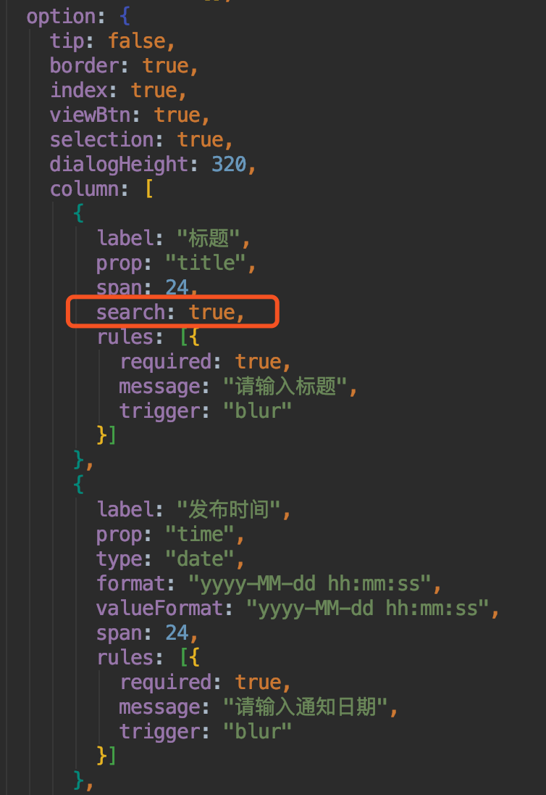
* 刷新页面，可以看到出现了对应的搜索框

* 随意输入一个标题，点击查询，发现查询成功

## 后记
* 由此可见，我们通过一个简单的配置，便迅速生成了前后端分离模式下的完整增删改查功能
* 文档讲解只是小部分知识点，更多的操作有待大家去发掘
* 相信大家看完SpringBlade+Saber两套框架后，会享受到更加极速的开发体验～

