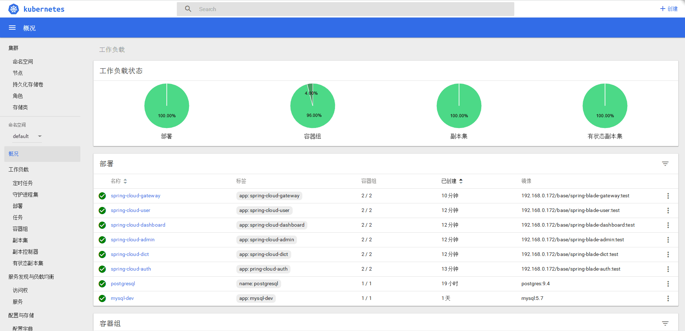
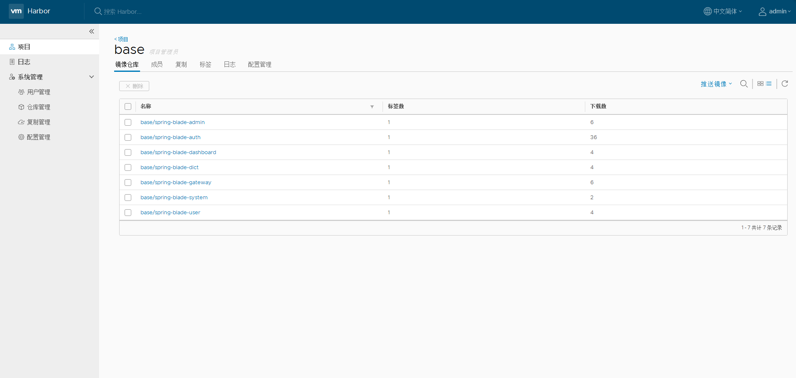
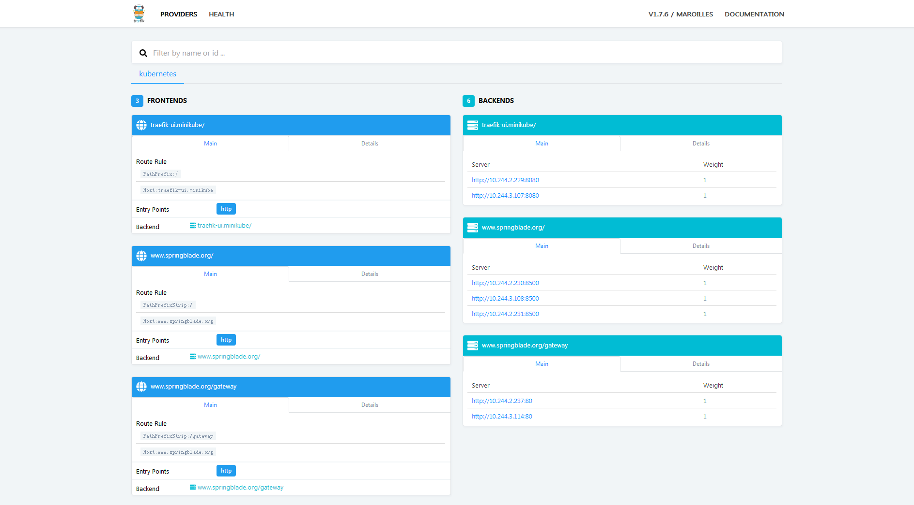
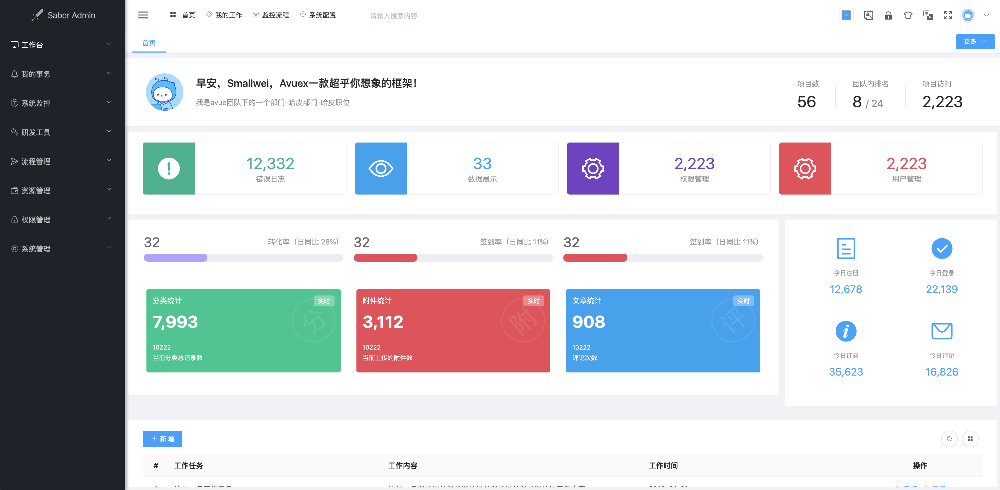
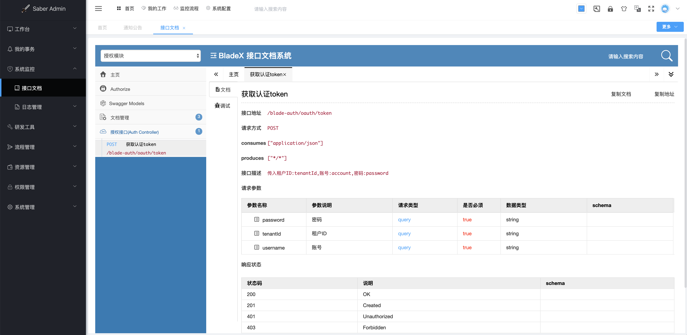
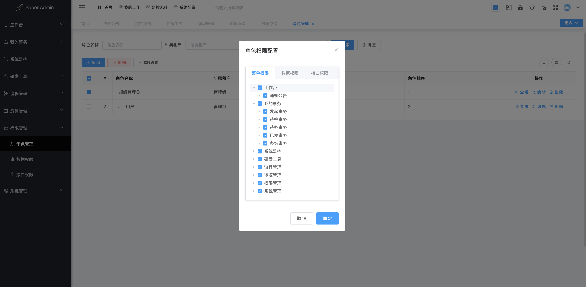

## Saber简介
* Saber是BladeX前端UI框架，主要选型技术为Vue、VueX、AVue、ElementUI。
* 本手册主要讲解如何在Saber平台下开发业务模块，同时也是Vue、ElementUI入门的绝佳选择。

## 官网
* 官网地址：[https://bladex.vip](https://bladex.vip)
* 技术社区：[https://sns.bladex.vip](https://sns.bladex.vip)
* 会员交流群：859411437

## 商业项目
* 后端分布式项目地址：https://git.bladex.vip/blade/BladeX
* 后端单体式项目地址：https://git.bladex.vip/blade/BladeX-Boot

* 前端UI项目地址(基于Vue)：https://git.bladex.vip/blade/Saber
* 前端UI项目地址(基于React)：https://git.bladex.vip/blade/Sword
* 核心框架项目地址：https://git.bladex.vip/blade/BladeX-Tool

## 界面一览

