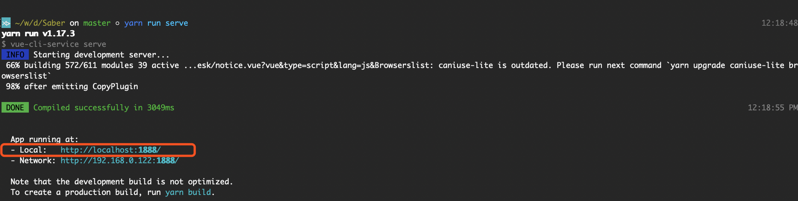
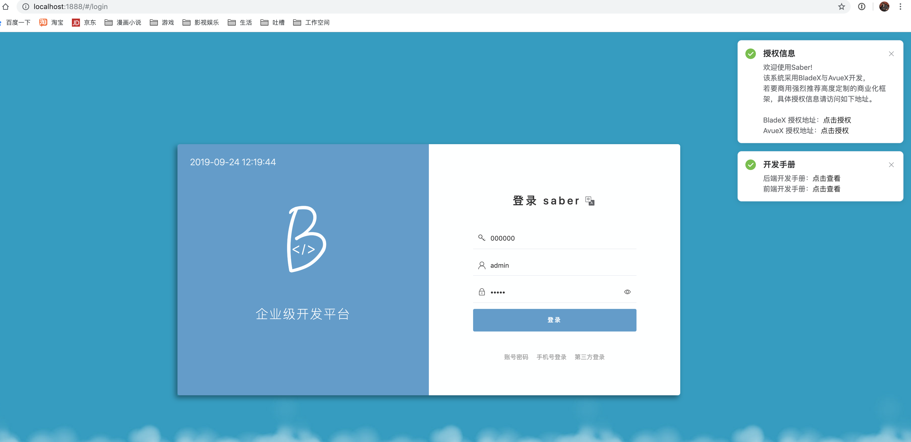
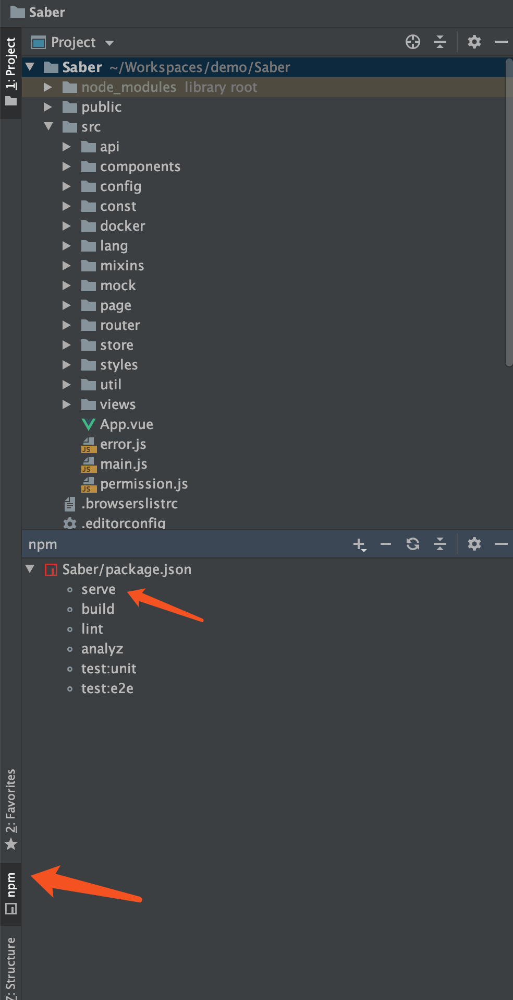
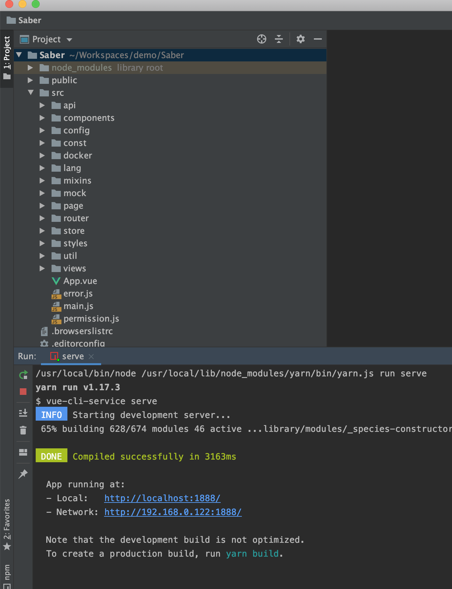

## 命令行运行
1. 运行工程
~~~
> yarn run serve
~~~

2. 查看红框内的地址并打开浏览器访问,出现如下界面则说明安装启动成功

 

## IDE运行
1. 使用webstorm、vscode自带的启动器启动项目

2. 看到如下界面则说明启动成功

3. 查看红框内的地址并打开浏览器访问,出现如下界面则说明安装启动成功

 

# 后端安装
* 后端启动请参考后端开发手册：[https://www.kancloud.cn/smallchill/blade/913213](https://www.kancloud.cn/smallchill/blade/913213)
* 若想不使用cloud，使用简易启动，可以直接下载boot版本启动 （注意需要将前后端的开源、商业版本保持一致）
* 开源版cloud地址：[https://gitee.com/smallc/SpringBlade](https://gitee.com/smallc/SpringBlade)
* 开源版boot地址：[https://gitee.com/smallc/SpringBlade/tree/2.0-boot/](https://gitee.com/smallc/SpringBlade/tree/2.0-boot/)
* 商业版cloud地址：[https://git.bladex.vip/blade/BladeX](https://git.bladex.vip/blade/BladeX)
* 商业版boot地址：[https://git.bladex.vip/blade/BladeX-Boot](https://git.bladex.vip/blade/BladeX-Boot)
* 商业版购买地址：[https://bladex.vip/#/vip](https://bladex.vip/#/vip)
