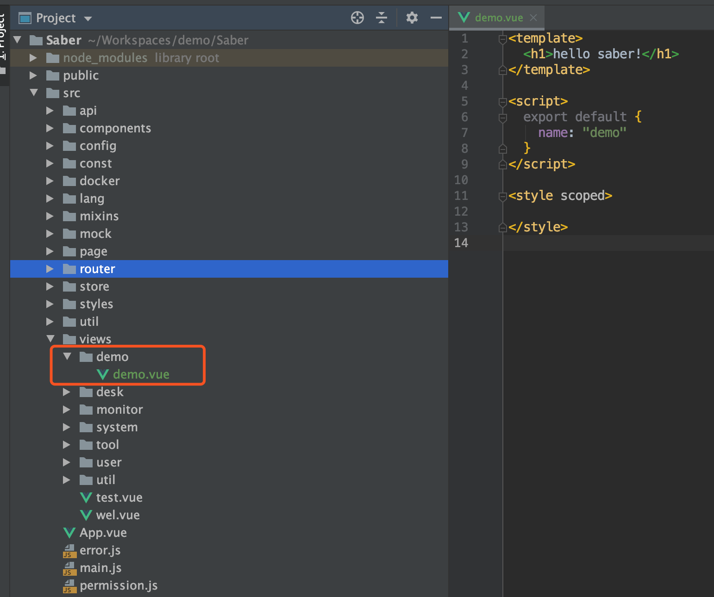
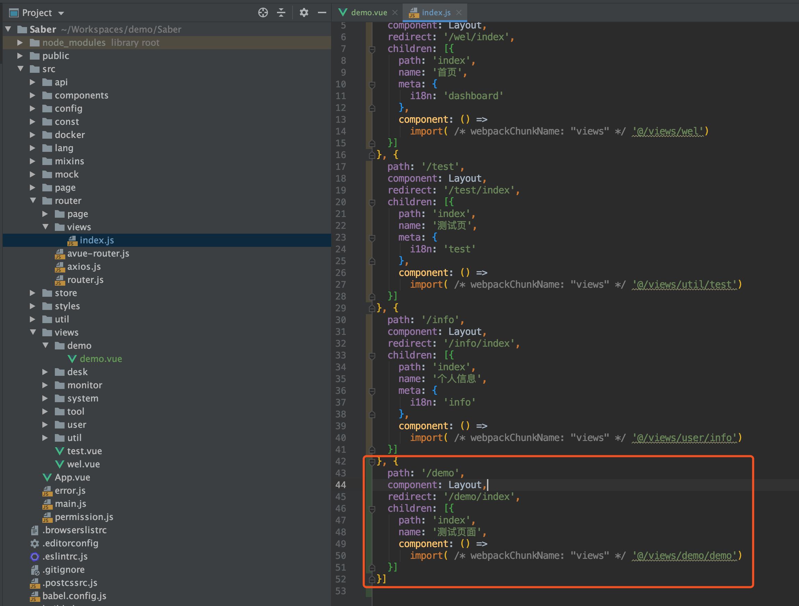
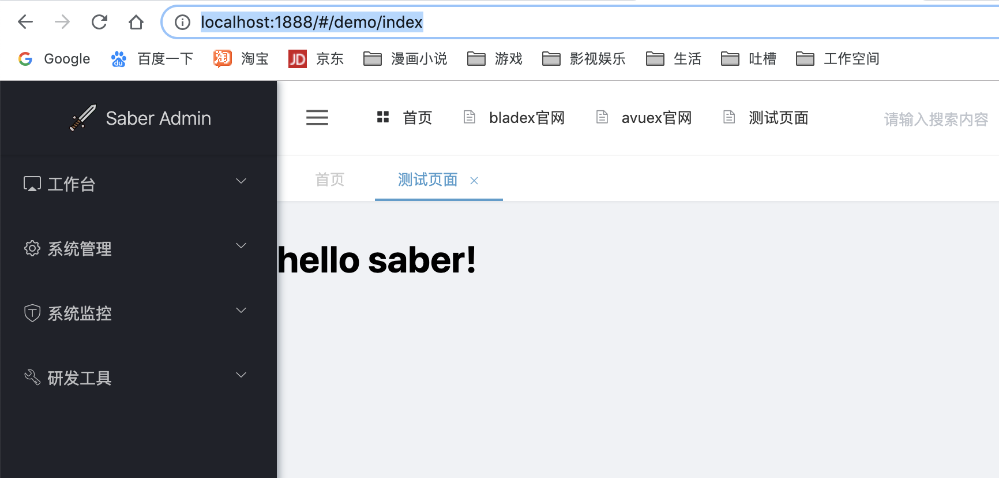
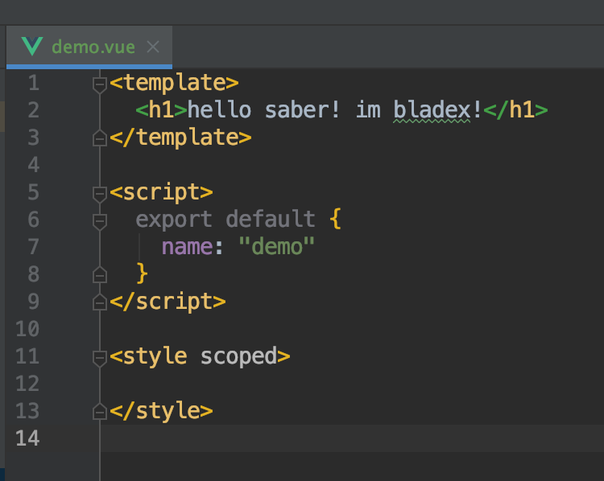
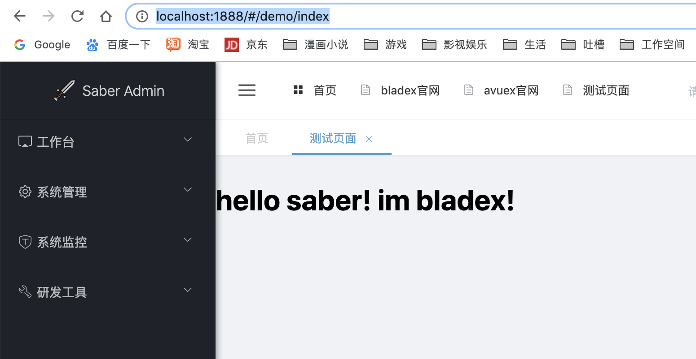

## 新建页面
* 进入`/src/views`目录新建`/demo/demo.vue`文件

## 创建路由
* 前往`/src/router/views/index.js`配置对应路由

## 系统访问
*  启动工程访问：[http://localhost:1888/#/demo/index](http://localhost:1888/#/demo/index) 发现页面渲染成功

* 修改demo.vue文件内容，再次刷新界面，发现重新渲染成功

## 后续
第一个页面我们新增成功了，那么下一章让我们来学习下如何引入ElementUI的组件并简单使用
