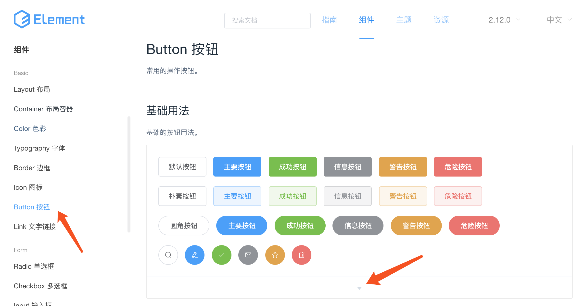
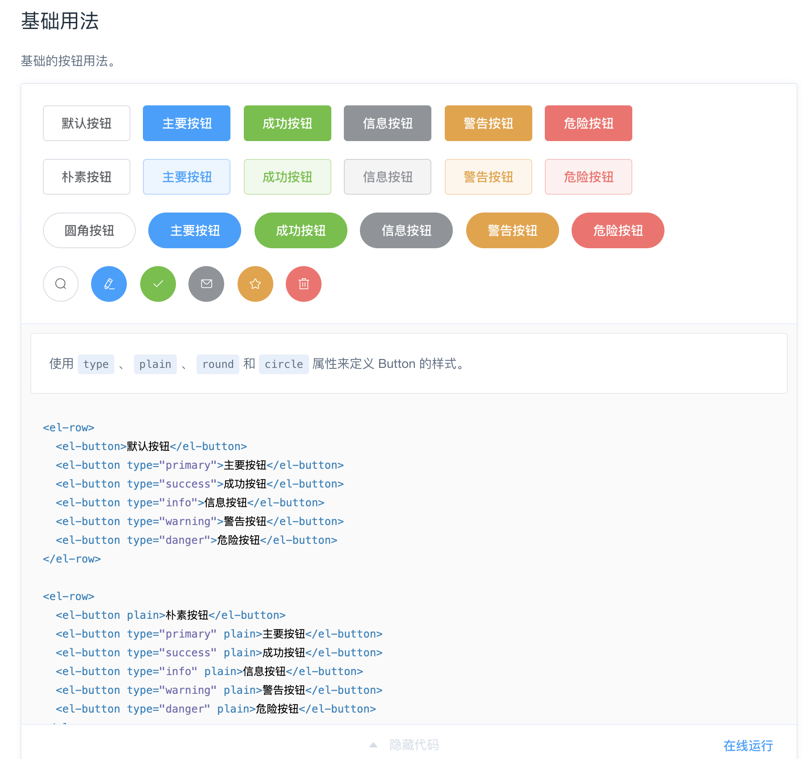
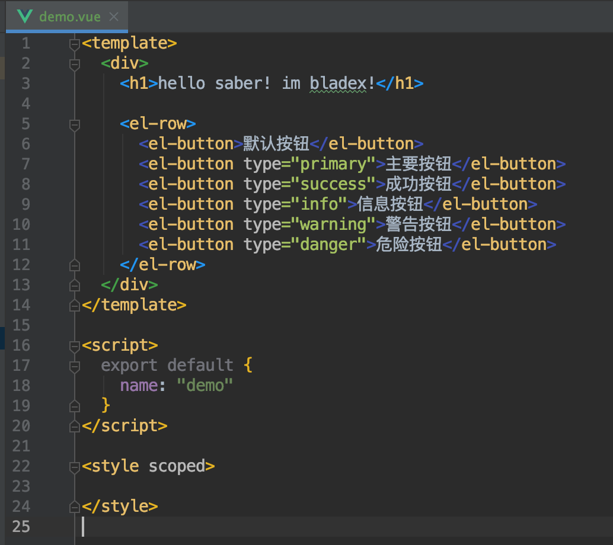
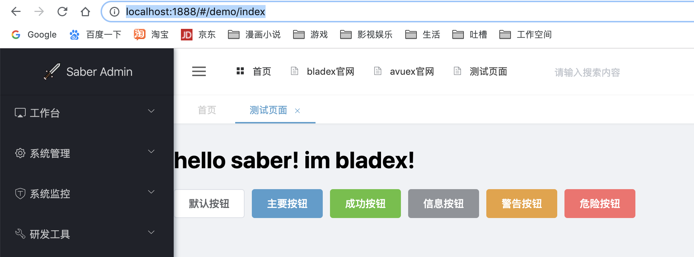
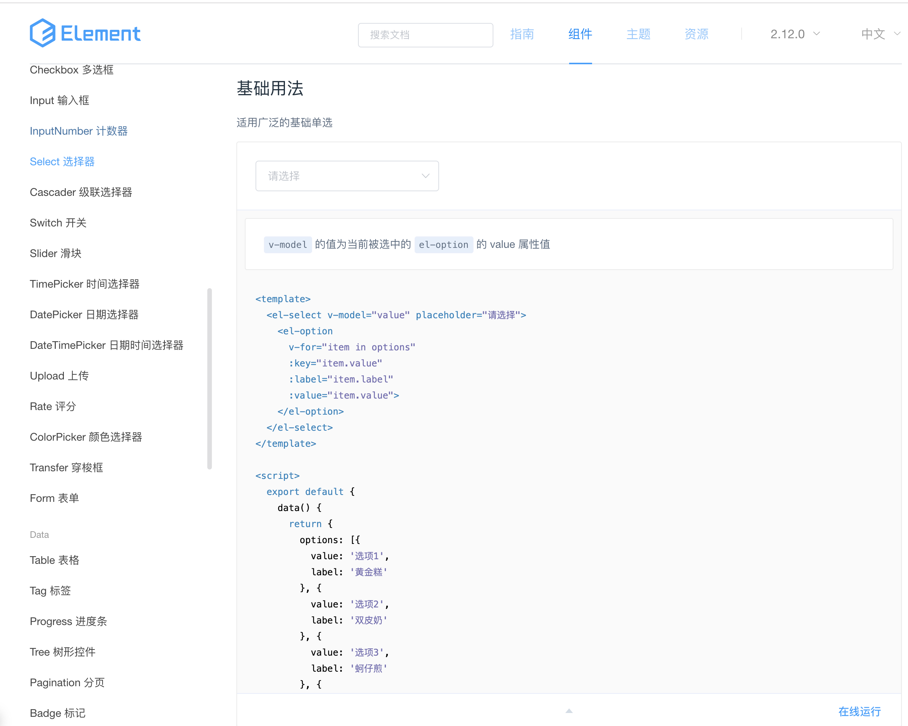
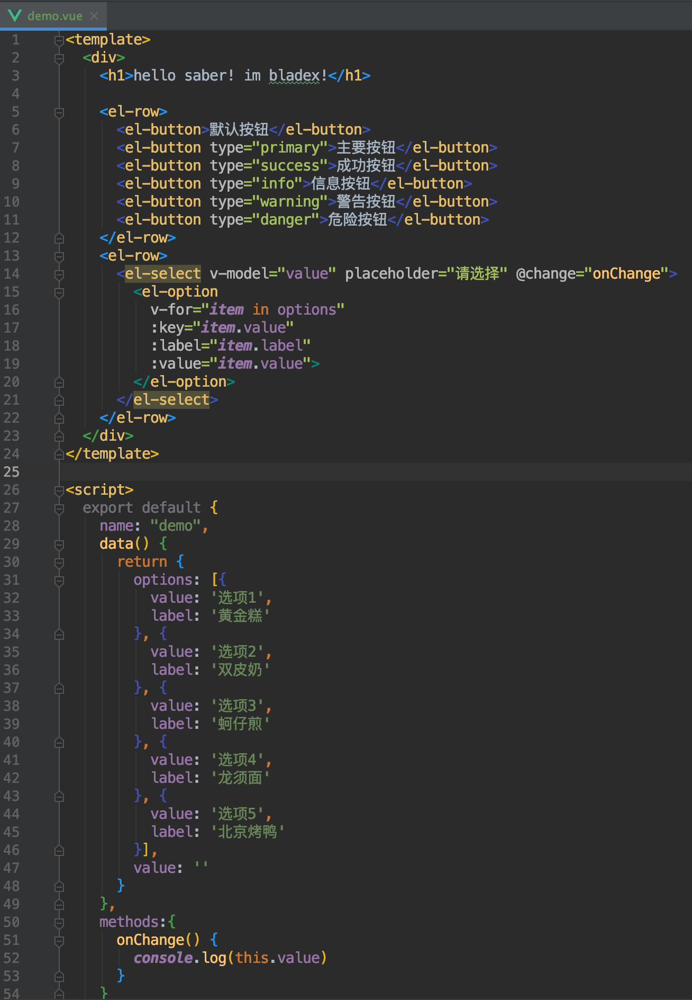
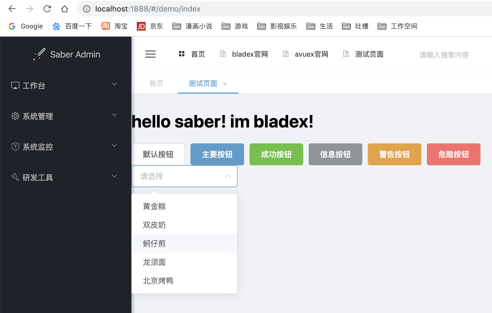
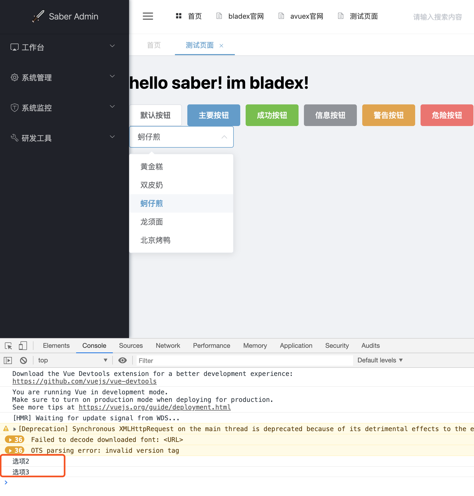

## ElementUI官方文档
文档地址：[https://element.eleme.cn/#/zh-CN/component/quickstart](https://element.eleme.cn/#/zh-CN/component/quickstart)

## 最简单的组件引入
1. 我们找到basic模块下的button，查看对应文档

2. 稍做修改引入我们的Demo页面

3. 打开系统查看效果

## 常见的Select组件引入
1. 我们找到常用的select，查看文档

2. 稍做修改引入我们的Demo页面

3. 打开系统查看效果

4. 点击对应选项后console控制台答应信息成功

## 注意
* select组件的for循环加载`<el-option>`以及`@change`执行`onChange`方法是vue中最基础的知识点，这里不再针对基础源码进行赘述
* 若还不理解请务必先完整看两遍es6的文档以及vue的文档
* es6：[http://es6.ruanyifeng.com/#README](http://es6.ruanyifeng.com/#README)
* vue：[https://cn.vuejs.org/v2/guide/](https://cn.vuejs.org/v2/guide/)

## 后记
* ElementUI的组件质量非常高，数量也多，在这个章节只是简单的教大家如何引入组件
* 若已有基础可直接略过，如果是新手，则强烈推荐将ElementUI的每个组件都像刚刚这样一个一个引入并且测试效果，这样必定会给未来打下扎实的基础，***磨刀不误砍柴工***，请大家谨记！～
