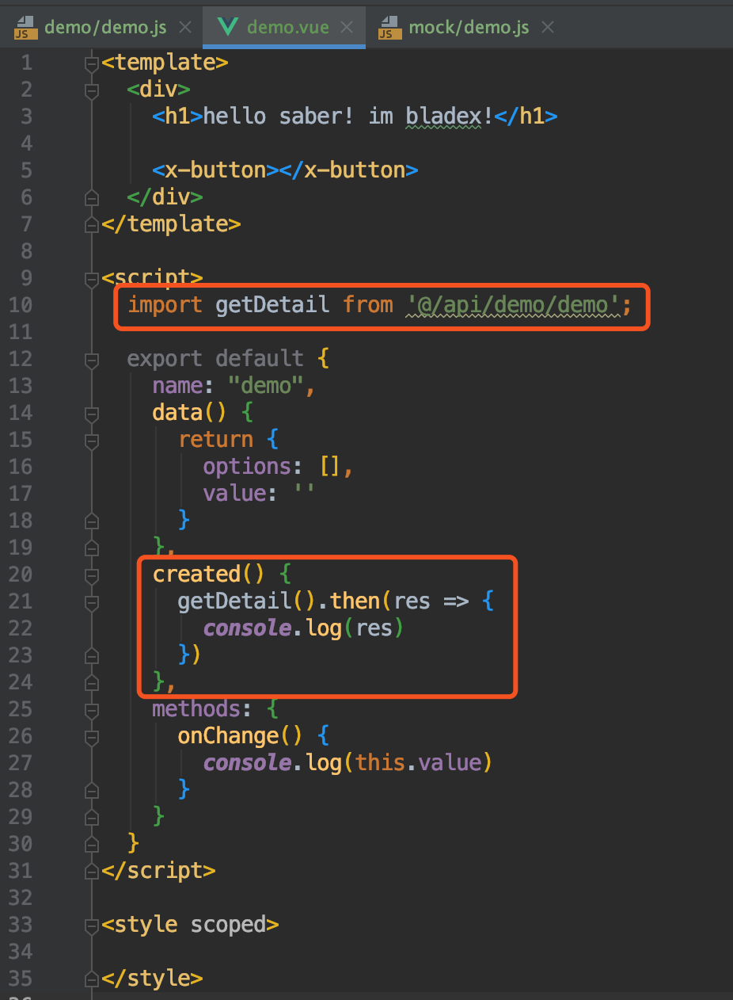

## 前言
* 前端开发中最重要的便是api调用，从服务端拉取数据进行业务操作，完毕之后提交数据至服务端
* 这个流程几乎涵盖了整个系统
* 下面我们来学习下标准的api调用应该如何编写
* 同时看下如何和我们的自定义组件结合起来

## 定义一个api
1. 我们到api文件夹下创建demo.js，内容如下

2. 工程封装了`axios`方法，将常用的方法都封装好，方便大家直接调用

## 调用api
1. 我们准备让这个方法在页面初次加载的时候调用，并把获取到的数据打印出来
2. 进入我们编写的Demo页面，编写一个测试方法

* `import xx from xxx` 将我们刚刚编写的api方法引入
* `created` 属于vue生命周期中`创建执行`
* `getDetail` 在页面加载的时候执行，并且将返回的值打印在控制台
3. 打开系统刷新页面，发现控制台打印与mock设定一致

## 使用同步调用api
很多业务场景，经常会有同时几个接口调用共同依赖的场景，若超过3个的话，都写在.then方法里进行操作，代码会变得非常不优雅，耦合度也高。下面我们来尝试下使用同步操作代码
1. demo增加mock接口test

2. 对应api增加接口定义

3. 更改代码，单独抽离出一个方法init，用于同步代码的操作。同时将init的返回类型打印出来

4. 打开系统查看控制台打印，可以看到两条信息都打印成功，而且是按顺序加载。这样解耦了多个接口下都操作，代码看起来更清爽，可读性更高。

5. 可以看到，返回都是一个Promise对象，具体介绍，请看：https://www.imooc.com/article/20580
6. 还有一点需要注意的是，如果需要用到promise，那么方法前必须带有`async`关键字，否则将失效

 
 
 

## 放上相关代码
* 希望大家都能把代码都手动敲出来，而不是直接复制粘贴
* `/mock/demo.js` ：
~~~
import Mock from 'mockjs'

function getFakeDetail() {
  const json = {code: 200, success: true, msg: '操作成功'};
  json.data = "测试mock返回";
  return json;
}

function getFakeTestDetail() {
  const json = {code: 200, success: true, msg: '操作成功'};
  json.data = "测试mock test返回";
  return json;
}

export default ({mock}) => {
  if (!mock) return;

  Mock.mock(/\/api\/demo\/detail/, 'get', getFakeDetail);
  Mock.mock(/\/api\/demo\/test-detail/, 'get', getFakeTestDetail);

}

~~~

* `/mock/index.js` :
~~~
import user from './user';
import menu from './menu';
import demo from './demo';

/**
 * 模拟数据mock
 *
 * mock是否开启模拟数据拦截
 */

user({mock: true});

menu({mock: true});

demo({mock: true});

~~~

* `/api/demo/demo.js` : 
~~~
import request from '@/router/axios';

export const getDetail = () => {
  return request({
    url: '/api/demo/detail',
    method: 'get',
  })
}

export const getTestDetail = () => {
  return request({
    url: '/api/demo/test-detail',
    method: 'get',
  })
}

~~~

* `/views/demo/demo.vue` : 
~~~
<template>
  

    <h1>hello saber! im bladex!</h1>

    <x-button></x-button>
  

</template>

~~~
