## 前言
* 这一节是重点内容，将向大家介绍如何在saber上使用原生ElementUI进行开发一个CRUD的完整模块
* 下一节则会为大家带来saber基于avue的json数据驱动的CRUD模块
* 开发效率会成倍提升，真正享受极速开发带来的乐趣
* 在开发之前，我们需要配置一下mock数据，根据接口返回所需的数据

## 配置菜单
1. 进入菜单管理模块
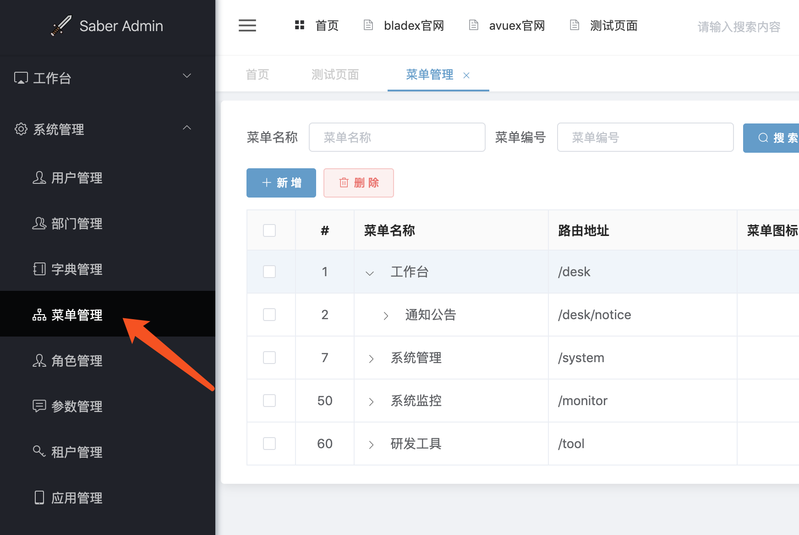
2. 新建测试模块
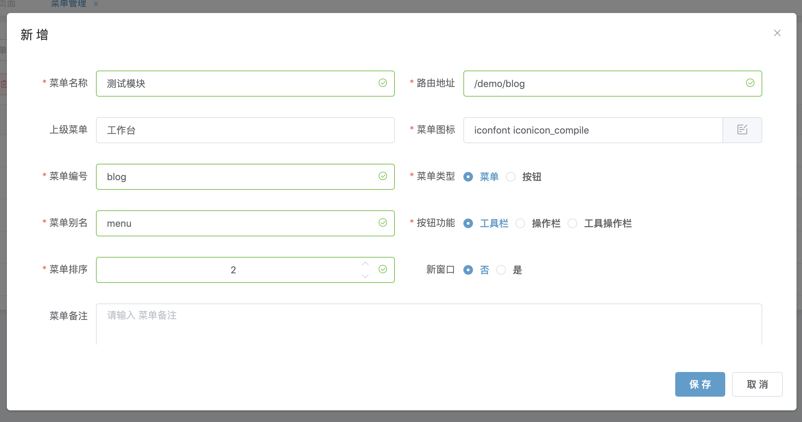
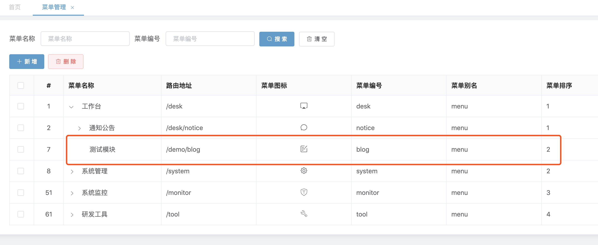
3. 新建测试模块的增、删、改、查按钮
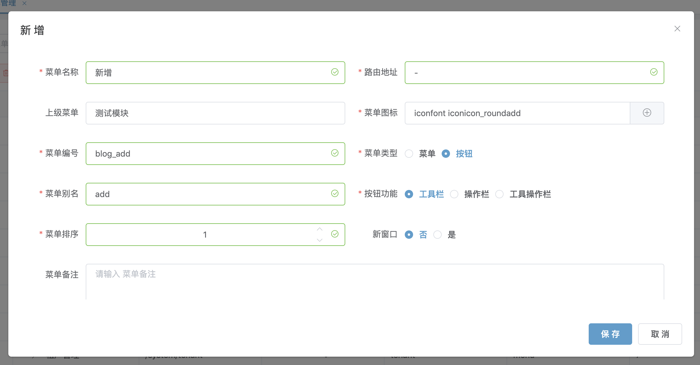
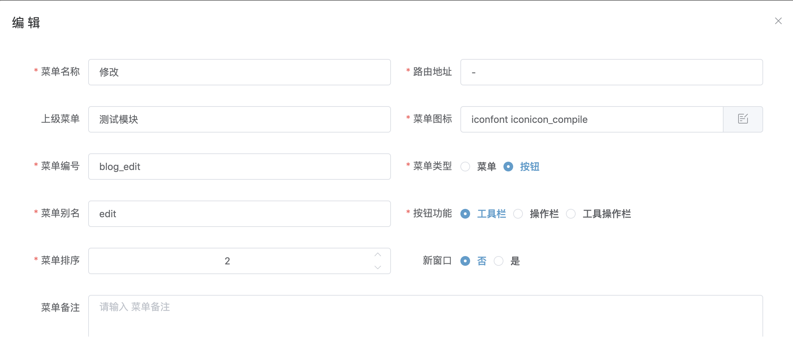
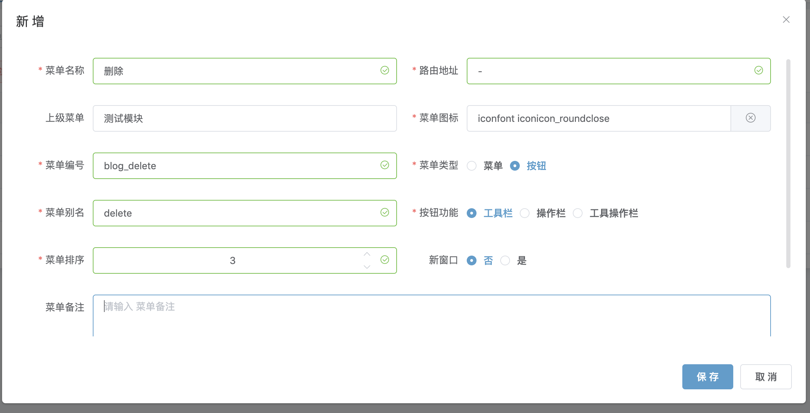
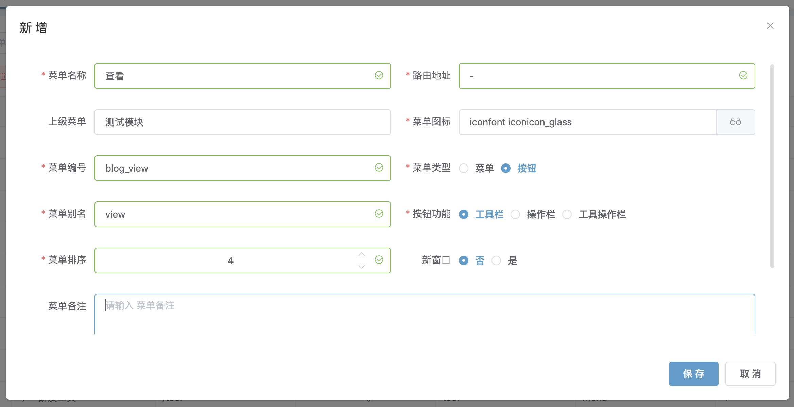
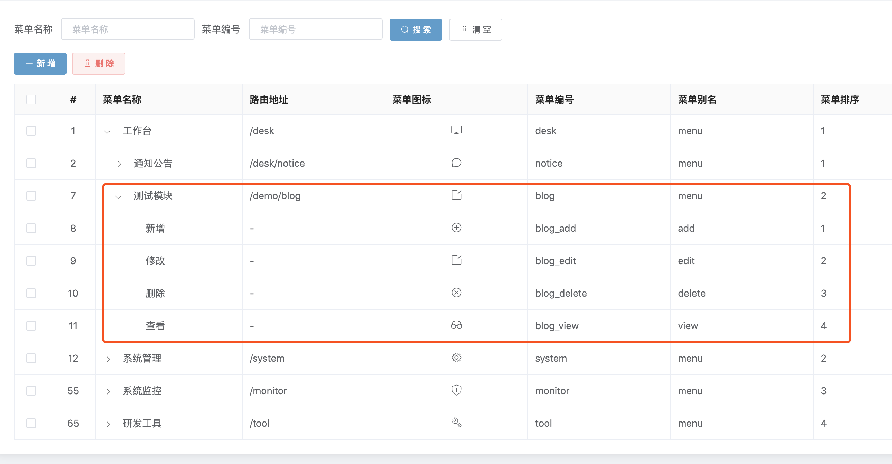
4. 进入角色管理模块，进行权限分配
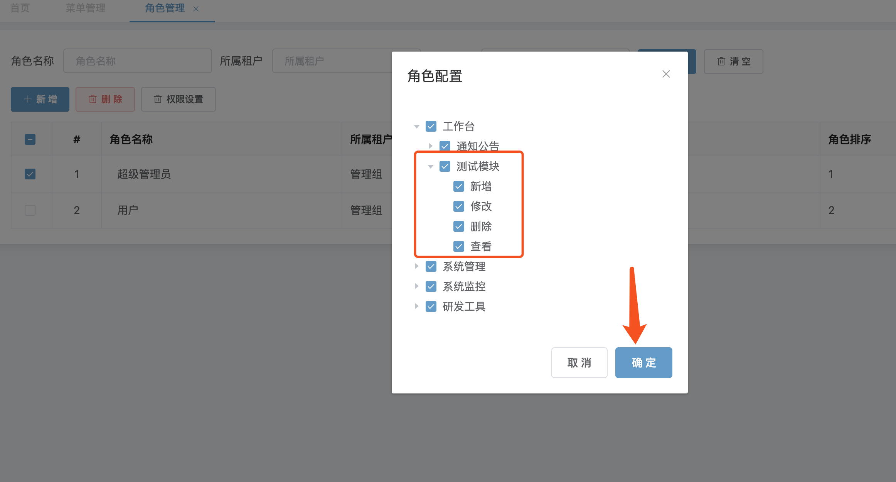
5. 这时刷新菜单我们便可以看到刚刚新增的菜单了
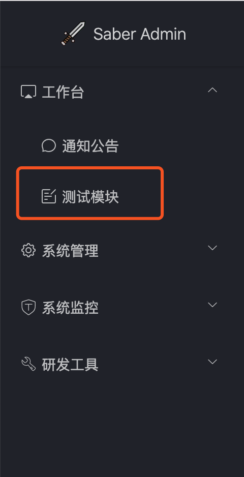

## 配置mock
1. 创建blog.js的mock文件
~~~
import Mock from 'mockjs'

function getFakeList() {
  const json = {code: 200, success: true, msg: '操作成功'};
  const list = [];
  list.push(
    {
      id: '1',
      title: '博客标题1',
      time: '2019.09.26',
      content: '博客内容1',
    },
    {
      id: '2',
      title: '博客标题2',
      time: '2019.09.26',
      content: '博客内容2',
    }
  );
  json.data = {
    total: 10,
    size: 10,
    current: 1,
    searchCount: true,
    pages: 1,
    records: list,
  };
  return json;
}

function getFakeDetail() {
  const json = {code: 200, success: true, msg: '操作成功'};
  json.data = {
    id: '1',
    title: '博客标题1',
    time: '2019.09.26',
    content: '博客内容1',
  };
  return json;
}

function fakeSuccess() {
  return {code: 200, success: true, msg: '操作成功'};
}

export default ({mock}) => {
  if (!mock) return;
  Mock.mock(/\/api\/blade-desk\/blog\/list/, 'get', getFakeList);

  Mock.mock(/\/api\/blade-desk\/blog\/detail/, 'get', getFakeDetail);

  Mock.mock(/\/api\/blade-desk\/blog\/submit/, 'post', fakeSuccess);

  Mock.mock(/\/api\/blade-desk\/blog\/remove/, 'post', fakeSuccess);

}

~~~
2. 前往index.js进行开启
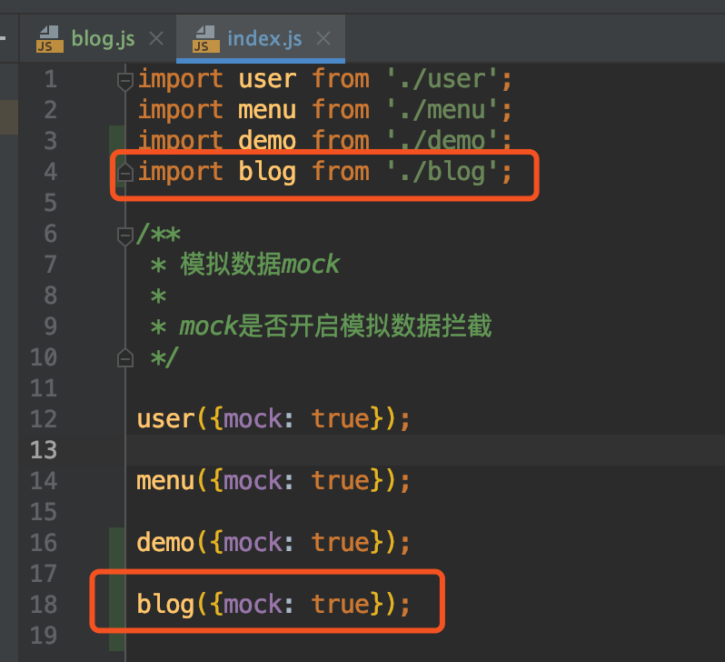
3. 创建blog.js的api文件
~~~
import request from '@/router/axios';

export const getList = (current, size, params) => {
  return request({
    url: '/api/blade-desk/blog/list',
    method: 'get',
    params: {
      ...params,
      current,
      size,
    }
  })
}

export const getDetail = (id) => {
  return request({
    url: '/api/blade-desk/blog/detail',
    method: 'get',
    params: {
      id,
    }
  })
}

export const remove = (ids) => {
  return request({
    url: '/api/blade-desk/blog/remove',
    method: 'post',
    params: {
      ids,
    }
  })
}

export const submit = (row) => {
  return request({
    url: '/api/blade-desk/blog/submit',
    method: 'post',
    data: row
  })
}

~~~
4. 基础工作已经完毕，下面我们就开始编写一个基础的crud模块吧
