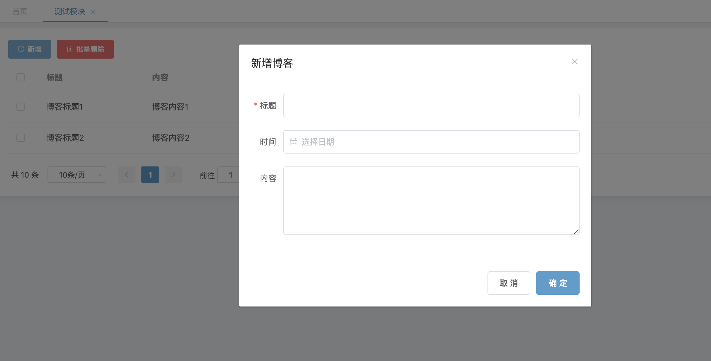
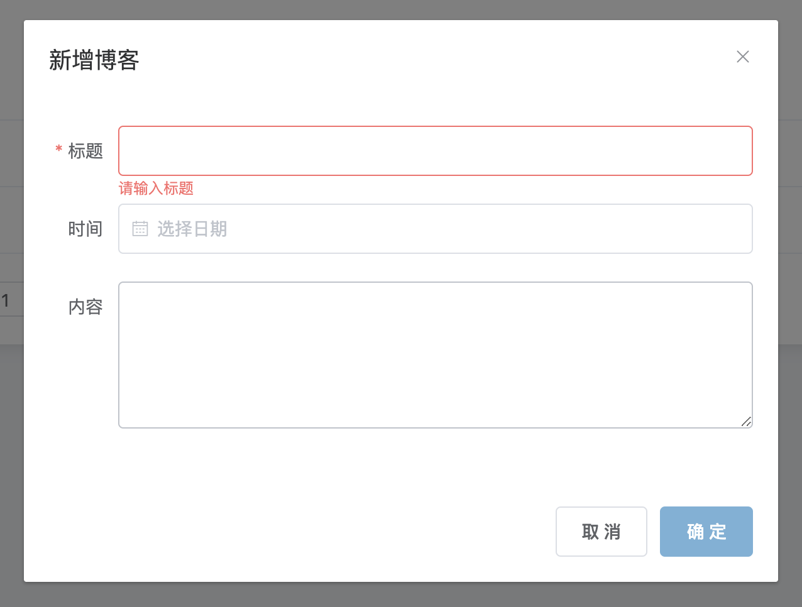
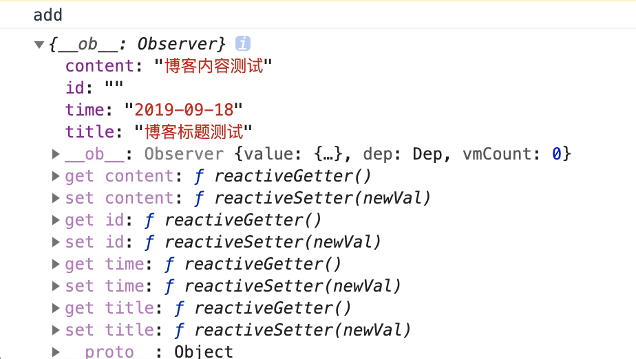

## 新建表单
1. 加入弹窗组件，并填上表单配置，完整代码如下
~~~
<template>
  <basic-container>
    <el-row>
      <el-col :span="24">
        

          <el-button type="primary" icon="el-icon-circle-plus-outline" size="small" @click="handleAdd">新增</el-button>
          <el-button type="danger" icon="el-icon-delete" size="small" @click="handleMultiDelete">批量删除</el-button>
        

      </el-col>
    </el-row>
    <el-row>
      <el-table
        :data="data"
        @selection-change="selectChange"
        style="width: 100%">
        <el-table-column
          prop="id"
          type="selection"
          width="55">
        </el-table-column>
        <el-table-column
          prop="title"
          label="标题"
          width="180">
        </el-table-column>
        <el-table-column
          prop="content"
          label="内容">
        </el-table-column>
        <el-table-column
          prop="time"
          label="日期"
          width="180">
        </el-table-column>
        <el-table-column label="操作" fixed="right" width="250">
          <template slot-scope="scope">
            <el-button
              size="mini"
              type=""
              plain
              @click="handleView(scope.$index, scope.row)">查看
            </el-button>
            <el-button
              size="mini"
              type="primary"
              plain
              @click="handleEdit(scope.$index, scope.row)">编辑
            </el-button>
            <el-button
              size="mini"
              type="danger"
              @click="handleDelete(scope.$index, scope.row)">删除
            </el-button>
          </template>
        </el-table-column>
      </el-table>
    </el-row>
    <el-row>
      <el-pagination
        background
        :page-sizes="[10, 20, 30, 50]"
        :page-size="10"
        layout="total, sizes, prev, pager, next, jumper"
        @size-change="sizeChange"
        @current-change="currentChange"
        :total="page.total">
      </el-pagination>
    </el-row>
    <el-dialog :title="dialogTitle" width="600px" :visible.sync="formVisible" @close="resetForm('blogForm')">
      <el-form :model="blog" :rules="rules" ref="blogForm">
        <el-form-item label="标题" prop="title" label-width="55px">
          <el-input v-model="blog.title" autocomplete="off"></el-input>
        </el-form-item>
        <el-form-item label="时间" label-width="55px">
          <el-date-picker
            v-model="blog.time"
            style="width: 100%;"
            type="date"
            value-format="yyyy-MM-dd"
            placeholder="选择日期"
            autocomplete="off">
          </el-date-picker>
        </el-form-item>
        <el-form-item label="内容" label-width="55px">
          <el-input v-model="blog.content" autocomplete="off" type="textarea" :rows="5"></el-input>
        </el-form-item>
      </el-form>
      

        <el-button @click="formVisible = false">取 消</el-button>
        <el-button type="primary" @click="submitBlog('blogForm')">确 定</el-button>
      

    </el-dialog>
  </basic-container>
</template>

~~~
2. 我们来详细分析每一个代码块的作用及目的
* 如下代码定义了一个dialog组件，并且包裹了表单组件
~~~
<el-dialog :title="dialogTitle" width="600px" :visible.sync="formVisible" @close="resetForm('blogForm')">
  <el-form :model="blog" :rules="rules" ref="blogForm">
    <el-form-item label="标题" prop="title" label-width="55px">
      <el-input v-model="blog.title" autocomplete="off"></el-input>
    </el-form-item>
    <el-form-item label="时间" label-width="55px">
      <el-date-picker
        v-model="blog.time"
        style="width: 100%;"
        type="date"
        value-format="yyyy-MM-dd"
        placeholder="选择日期"
        autocomplete="off">
      </el-date-picker>
    </el-form-item>
    <el-form-item label="内容" label-width="55px">
      <el-input v-model="blog.content" autocomplete="off" type="textarea" :rows="5"></el-input>
    </el-form-item>
  </el-form>
  

    <el-button @click="formVisible = false">取 消</el-button>
    <el-button type="primary" @click="submitBlog('blogForm')">确 定</el-button>
  

</el-dialog>
~~~
* 如下的属性分别代表了：绑定标题、设定宽度、设定弹窗可视、设定关闭事件
~~~
<el-dialog :title="dialogTitle" width="600px" :visible.sync="formVisible" @close="resetForm('blogForm')">
~~~
* 如下的属性分别代表了：绑定form的数据、设定校验规则、定义表单别名
~~~
<el-form :model="blog" :rules="rules" ref="blogForm">
~~~
* 如下的属性设定了表单内的三个字段：标题、事件、内容
~~~
<el-form-item label="标题" prop="title" label-width="55px">
  <el-input v-model="blog.title" autocomplete="off"></el-input>
</el-form-item>
<el-form-item label="时间" label-width="55px">
  <el-date-picker
    v-model="blog.time"
    style="width: 100%;"
    type="date"
    value-format="yyyy-MM-dd"
    placeholder="选择日期"
    autocomplete="off">
  </el-date-picker>
</el-form-item>
<el-form-item label="内容" label-width="55px">
  <el-input v-model="blog.content" autocomplete="off" type="textarea" :rows="5"></el-input>
</el-form-item>
~~~
* 如下的属性设置了弹框底部的按钮以及点击事件
~~~

  <el-button @click="formVisible = false">取 消</el-button>
  <el-button type="primary" @click="submitBlog('blogForm')">确 定</el-button>

~~~
* 如下的属性设置了vue双向绑定所需要的参数
~~~
data() {
  return {
    // 是否显示
    formVisible: false,
    // dialog标题
    dialogTitle: '',
    // 列表数据
    data: [],
    // 选中的数据
    multiSelection: [],
    // 分页数据
    page: {
      pageSize: 10,
      currentPage: 1,
      total: 0
    },
    // 校验规则
    rules: {
      title: [
        {required: true, message: '请输入标题', trigger: 'blur'},
      ]
    },
    // 表单映射模型
    blog: {
      id: '',
      title: '',
      content: '',
      time: '',
    }
  }
},
~~~
* 如下方法定义了表单提交后执行的逻辑
~~~
submitBlog(formName) {
  // 表单验证
  this.$refs[formName].validate((valid) => {
    if (valid) {
      console.log(this.blog);
      submit(this.blog).then(res => {
        if (res.data.success) {
          this.formVisible = false;
          this.$message({
            type: 'success',
            message: '操作成功！'
          })
        } else {
          this.$message({
            type: 'error',
            message: res.data.msg
          })
        }
      })
    }
  })
},
~~~

3. 代码分析完毕，我们打开系统查看效果

4. 直接提交，发现校验成功

5. 填入相关数据，点击确定，查看控制台输出，发现打印信息正确

6. 因为采用了mock数据，所以是模拟数据，列表页无法新增数据。我们将在`开发进阶`章节采用前后端分离的模式进行真实数据交互演示
7. 下一章我们来学习下修改页如何操作

