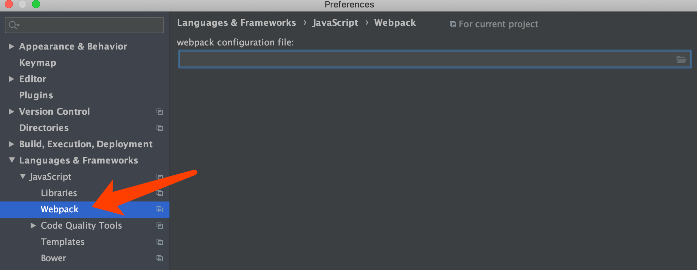
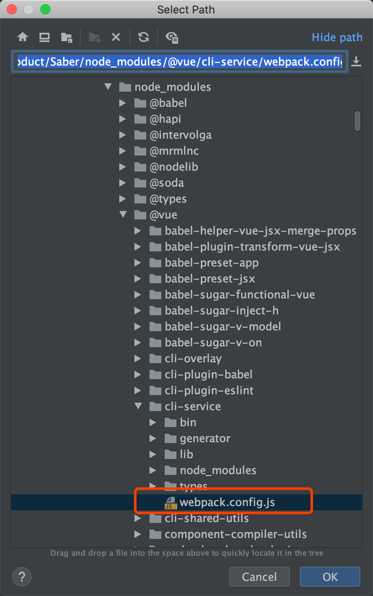
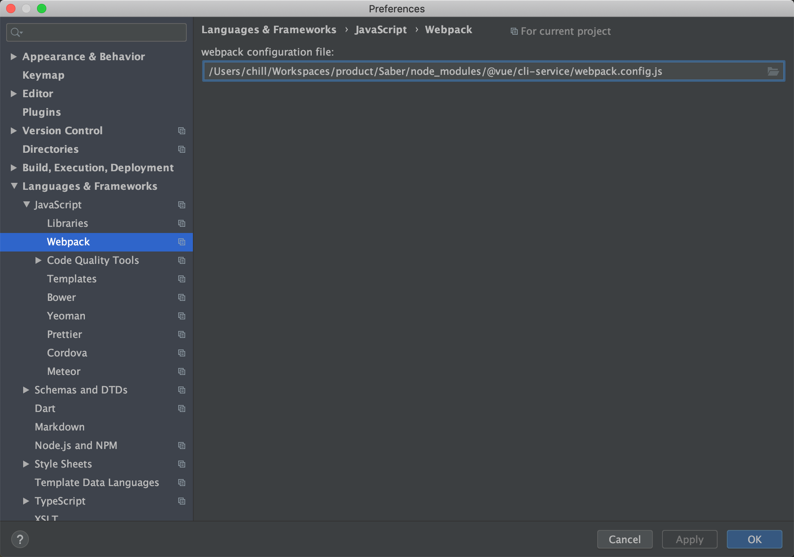

## 开始配置
* 上一章我们可以看到，引入的api使用`@`符号开头，但是工具无法自动找到，还用黄线标注，具体如下：

* 发现我们也无法用快捷键快速导航，这样不方便我们开发
* 所以我们需要进行配置，提高开发效率

## 配置路径
* 以webstorm为例，我们找到webpack配置

* 在右侧找到`node_modules/@vue/cli-service/webpack.config.js`

* 点击应用，再次打开工程其他引入，发现已经正确显示

