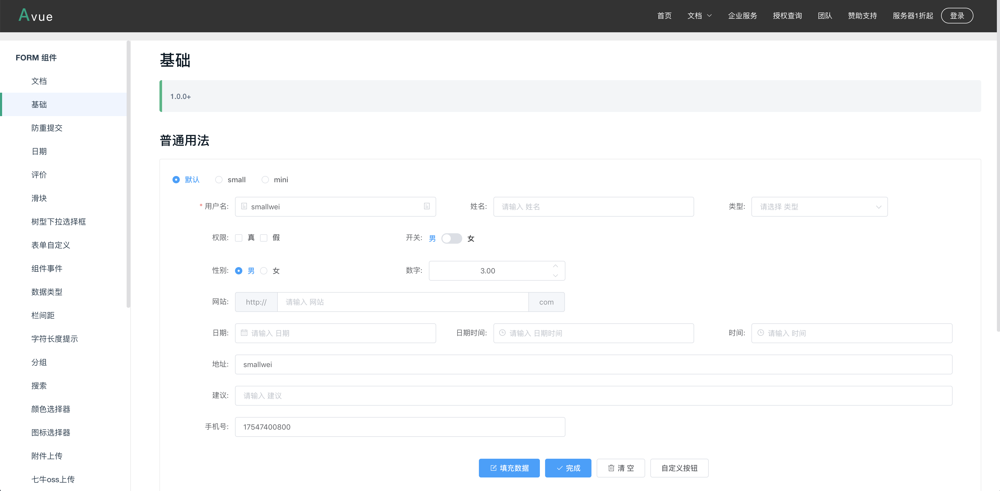
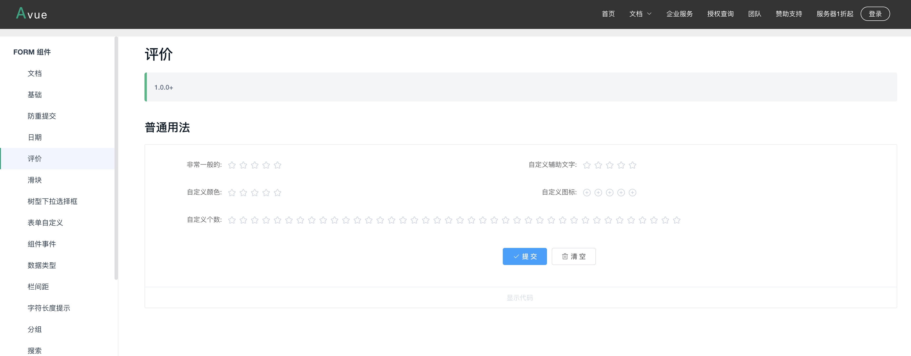
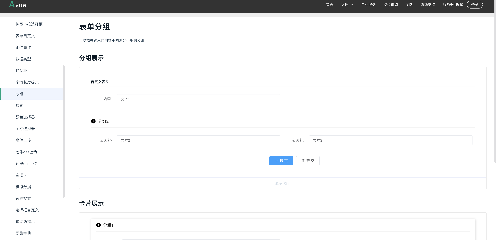
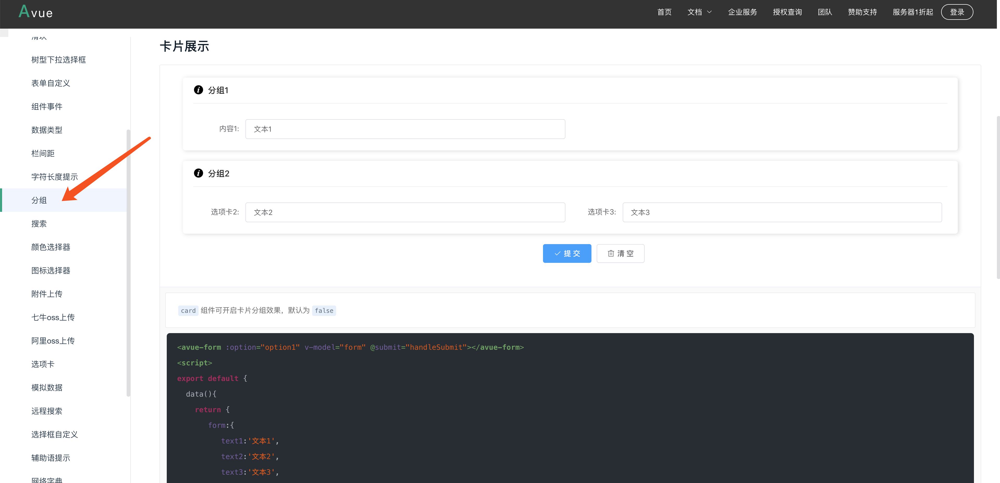
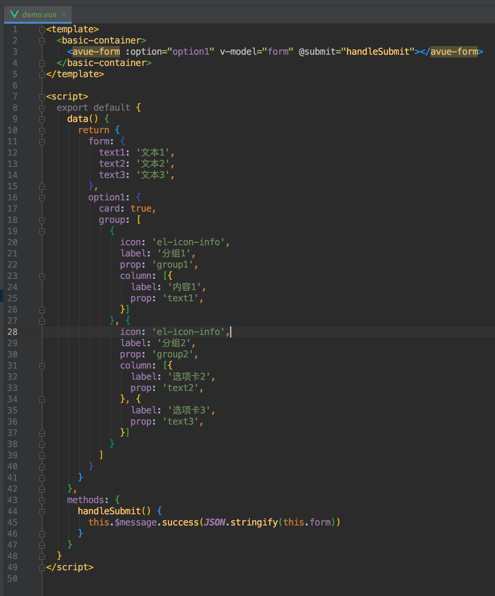
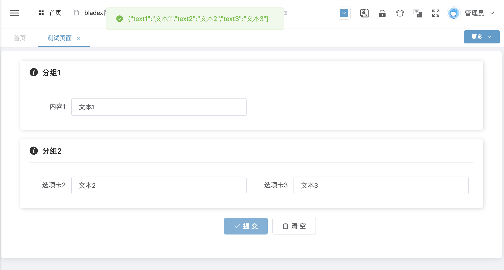
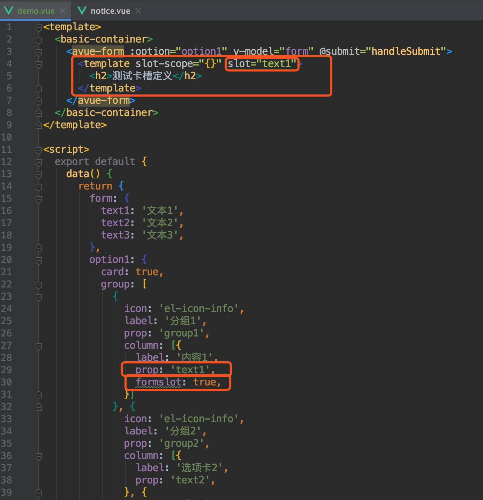
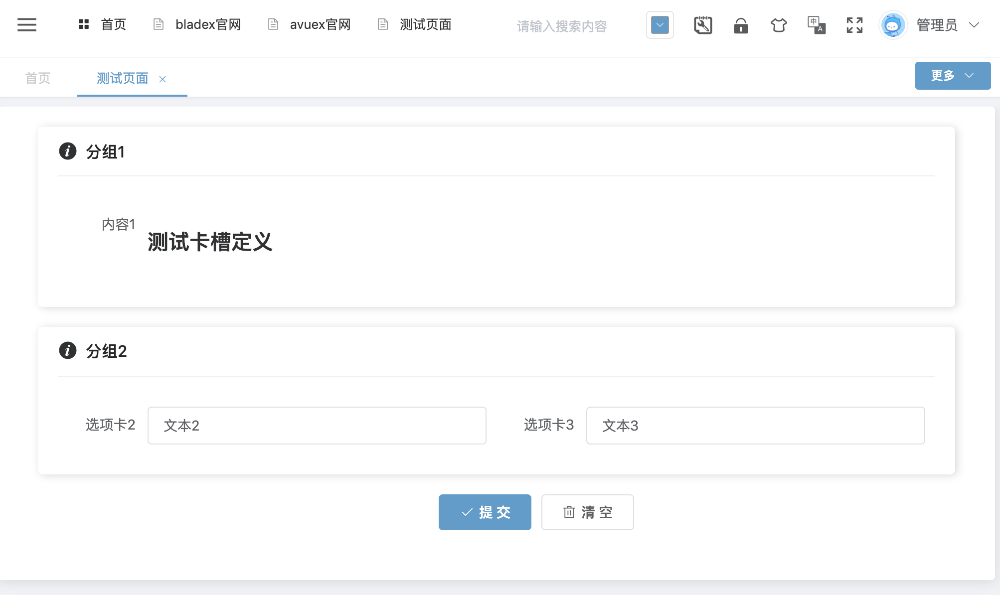

## 表单组件
* 组件文档：[https://avuejs.com/doc/form/form-doc](https://avuejs.com/doc/form/form-doc)
* 查看对应例子

* 找一个基础的demo，进行集成

* 将代码拷贝至最开始的demo.vue文件

* 刷新页面点击提交，发现表单数据获取成功

* 由此可见，avue的表格、表单组件都只需要配置`option`，便可以渲染出各种我们所需要的效果。若某些情况不支持，我们也可以使用slot卡槽进行配置。
* 在column中配置formslot属性，同时在<avue-form>标签内配置template卡槽，`column`的`prop`需要与卡槽的`slot`对应

* 刷新页面发现卡槽定义成功

* 这样一来，大家便可以通过卡槽来配置出各种复杂场景的组件了
