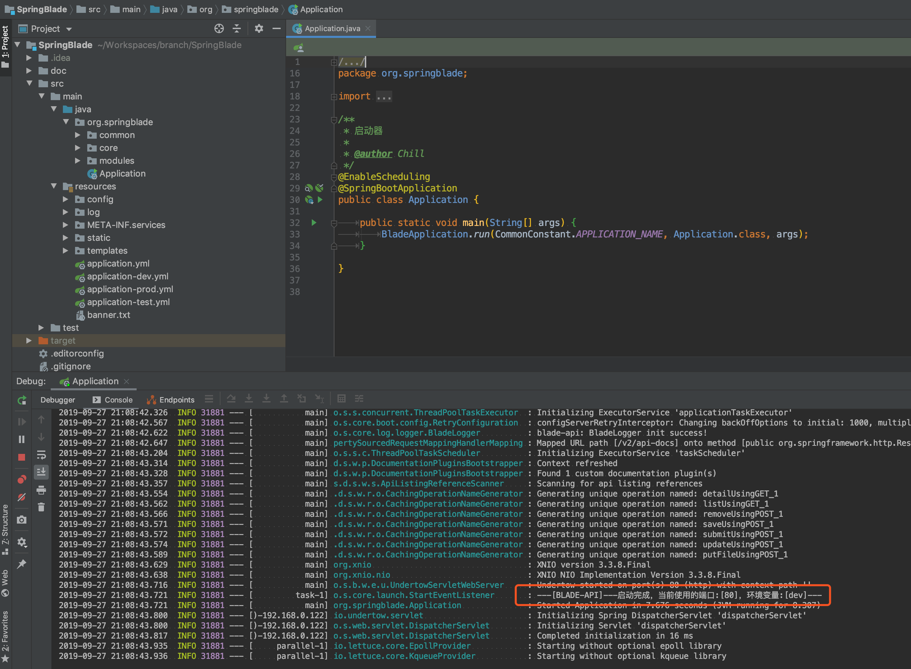
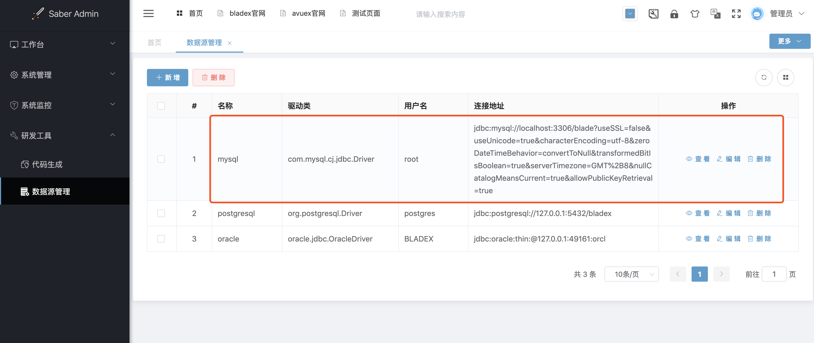
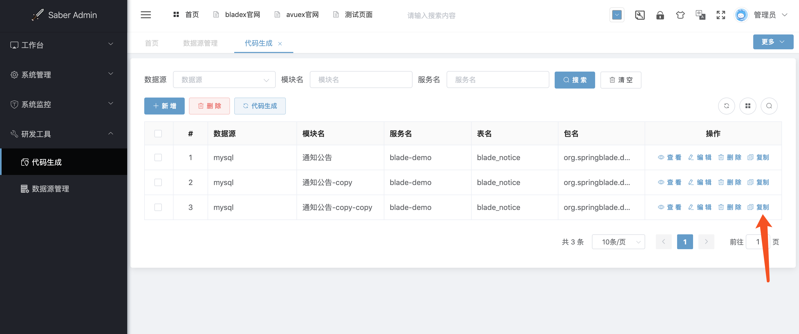
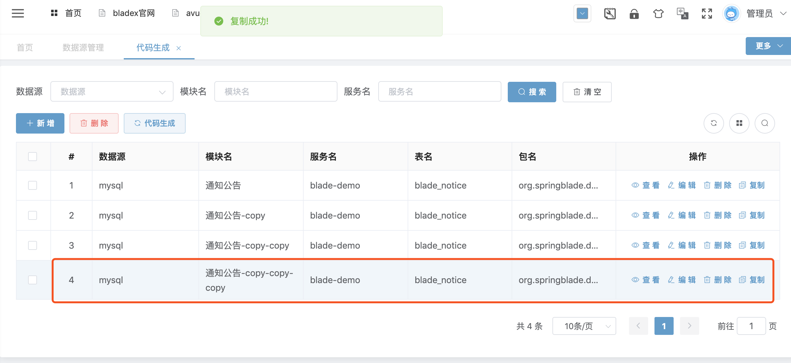
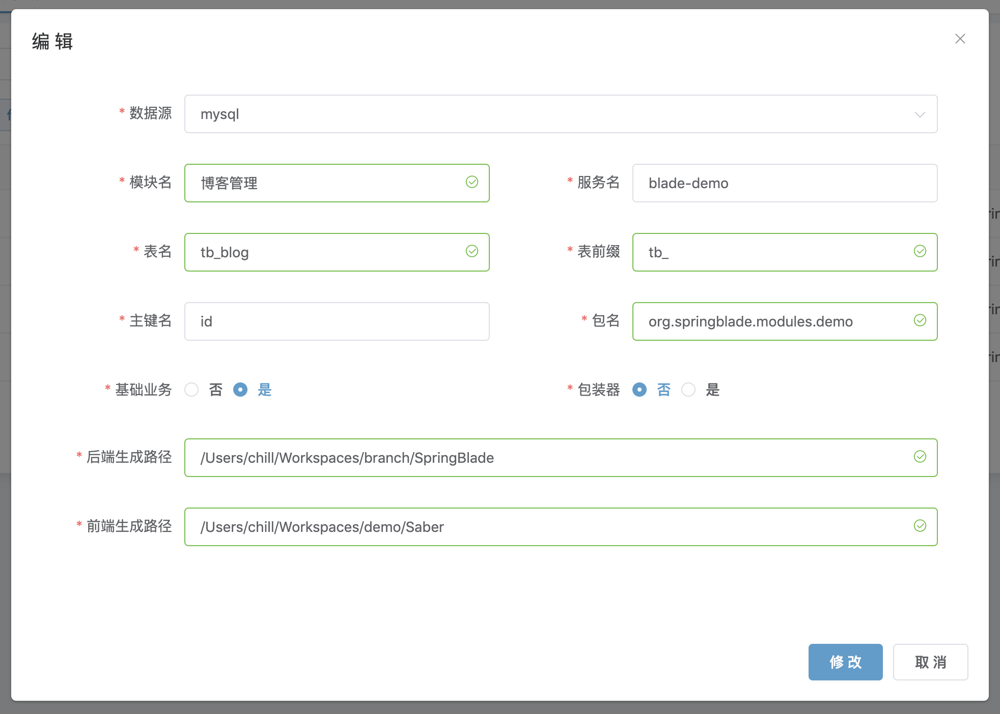
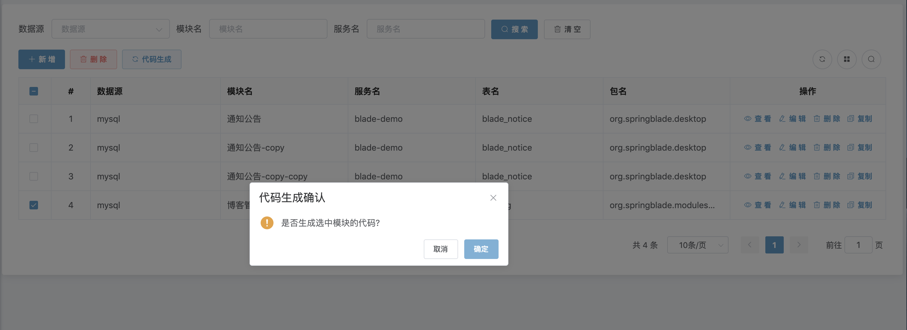
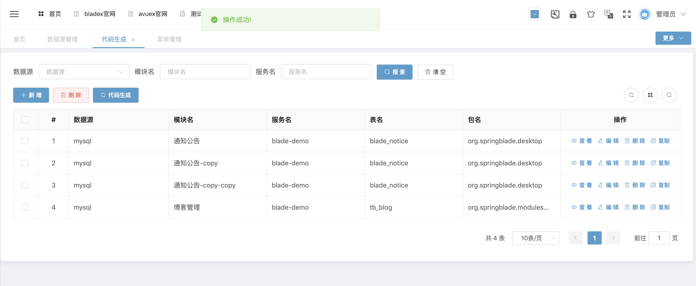
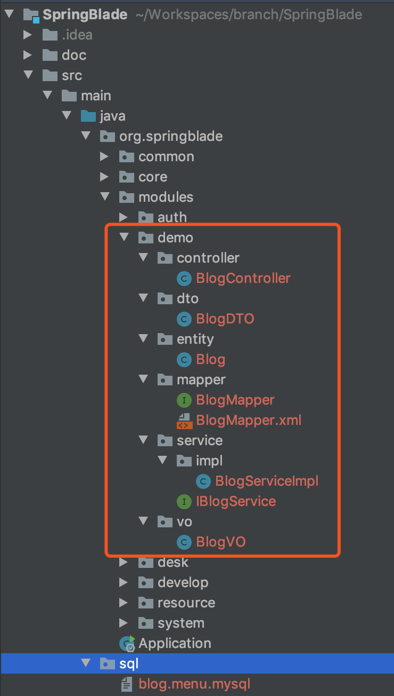

## 代码生成配置
1. 重启后端工程

2. 打开前端`研发工具`->`数据源管理` 配置数据源

3. 打开前端`研发工具`->`代码生成` 配置代码生成方案
4. 为了快速配置，我们可以点击复制按钮

5. 对复制出来的配置进行修改

6. 下面对各个属性进行讲解
* 数据源：在数据源管理中的配置，用于选择从对应的库获取数据
* 模块名：用于指定配置的名称，对代码生成不产生实际效果
* 服务名：生成后，controller对应的前缀，以及分割`-`符号后面的字符串作为前端的分包名
* 表名：用于代码生成所对应的表名称
* 表前缀：生成实体类的时候，忽略掉的前缀，若不配置，则`tb_blog`表生成的实体为`TbBlog`，若配置了`tb_`为前缀，则生成的实体为Blog
* 主键名：表的主键名称
* 包名：生成后端代码所在的包
* 基础业务：如果选择是，则实体会继承`BaseEntity`，带有上一章红框的基础业务字段
* 包装器：在某些复杂的模块，会用到`VO`和`Wrapper`，如果选择是则会自行生成
* 后端生成路径：后端工程的根目录
* 前端生成路径：前端工程的根目录

## 执行代码生成
1. 选择刚刚的配置，点击代码生成

2. 查看后端代码，发现已经按照我们的配置，生成了后端的整套代码

3. 同时生成了一个菜单的sql文件，将增删改查整个模块的sql脚本都生成好了（因为我们之前已经手动建好了对应的菜单，所以这次无需执行脚本，将其删掉即可）

4. 再次重启后端代码

5. 后端已经搞定，我们下一章来看一下前端的配置

